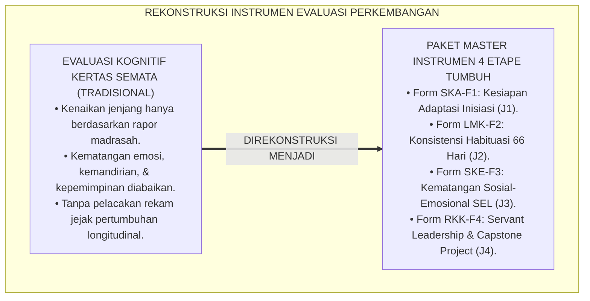
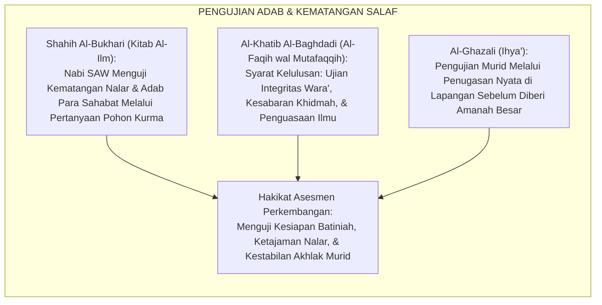
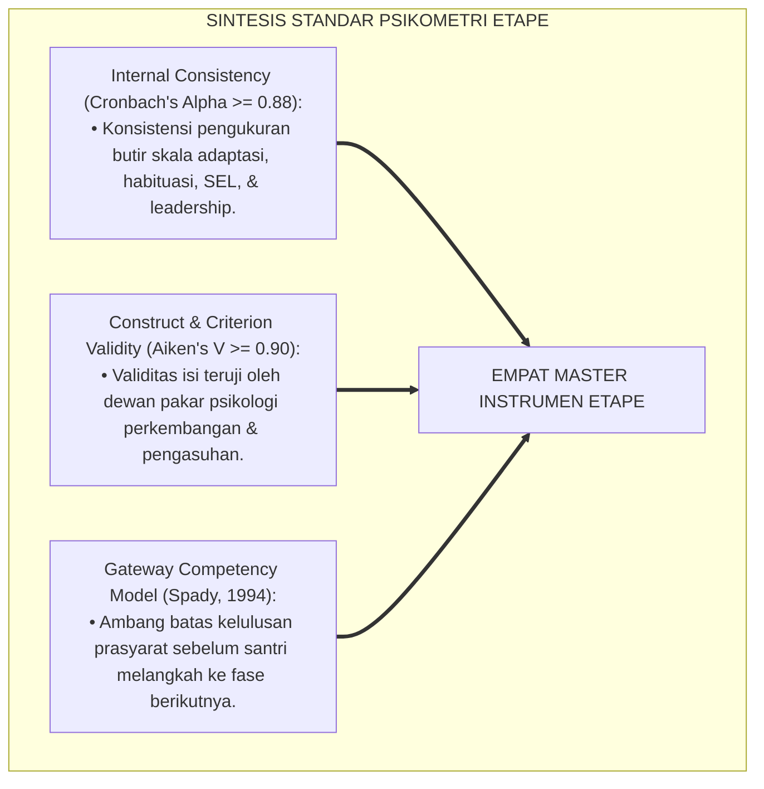
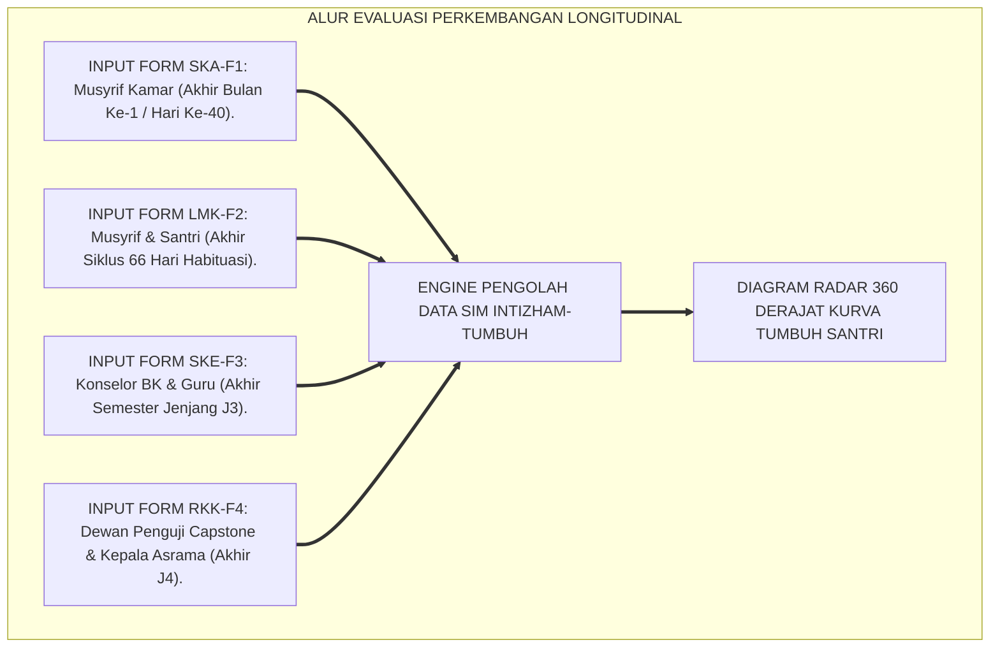
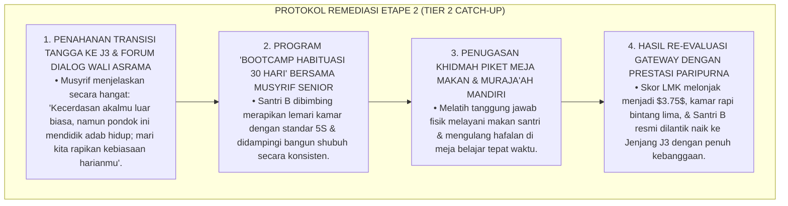

# P4-01-06: KATALOG INSTRUMEN EVALUASI TAHAPAN PERKEMBANGAN SANTRI
## *Monograf Riset Akademik: Kodifikasi Paket Master Instrumen Asesmen Kematangan Empat Etape Perkembangan Santri (Form Skala Kesiapan Adaptasi Inisiasi / SKA-F1, Lembar Mutaba'ah Konsistensi Habituasi / LMK-F2, Skala Kematangan Sosial-Emosional / SKE-F3, Serta Rubrik Kesiapan Kepemimpinan & Transisi / RKK-F4), Protokol Penilaian Gateway Transisi, Serta Integrasi Dashboard Longitudinal SIM Intizham-TUMBUH di Pesantren*

**Nomor Identifikasi**: `P4-01-06/MONOGRAF-RISET-KATALOG-INSTRUMEN-TAHAPAN-PERKEMBANGAN/2026`  
**Domain**: `04 Progression Framework` > `01 Development Stages` (Sub-Modul 06: *Developmental Stages Assessment Instruments*)  
**Klasifikasi Naskah**: *Academic Research Monograph* (Monograf Penelitian Desain Alat Ukur Perkembangan Longitudinal, Psikometri Evaluasi Etape Remaja, & Sistem Validasi Gateway)  
**Rumpun Disiplin Pengkaji**: Psikometri Perkembangan Remaja, Evaluasi Pendidikan Longitudinal, Desain Instrumen Pengasuhan Asrama, Sistem Informasi Manajemen Pesantren  

---

> ### 💡 INTISARI EKSEKUTIF (EXECUTIVE SUMMARY)
>
> * **Ketiadaan Alat Ukur Kematangan Etape yang Terstandarisasi:**  
>   Banyak pesantren menentukan kenaikan kelas atau kelulusan santri hanya berdasarkan nilai angka ujian tulis kognitif, tanpa memiliki instrumen baku untuk mengevaluasi apakah santri sudah tuntas melalui fase adaptasi (*Fase I*), apakah sudah terbentuk otomatisasi kebiasaan ibadah (*Fase II*), apakah sudah matang regulasi emosinya (*Fase III*), dan apakah sudah siap memimpin serta terjun ke masyarakat (*Fase IV*).
> * **Kodifikasi Empat Master Instrumen Etape Perkembangan TUMBUH:**  
>   Ekosistem TUMBUH merancang dan membakukan **Empat Paket Master Instrumen Evaluasi Kematangan Etape**: (1) *Form SKA-F1 (Skala Kesiapan Adaptasi Inisiasi - J1)*: Mengukur penurunan homesickness, kemandirian mencuci, dan rasa aman asrama; (2) *Form LMK-F2 (Lembar Mutaba'ah Konsistensi Habituasi - J2)*: Mengukur indeks konsistensi 66 hari shalat berjamaah, hafalan, dan 5S kamar; (3) *Form SKE-F3 (Skala Kematangan Sosial-Emosional - J3)*: Mengukur 5 kompetensi CASEL SEL, regulasi amarah, dan bebas polarisasi geng; dan (4) *Form RKK-F4 (Rubrik Kesiapan Kepemimpinan & Transisi - J4)*: Mengukur servant leadership OPPM, kelayakan Capstone Project, dan imunitas moral kampus.
> * **Protokol Gateway Kenaikan Etape & Sistem Informasi Terpadu:**  
>   Monograf ini menyajikan seluruh format instrumen secara lengkap beserta pedoman ambang batas kelulusan (*Gateway Thresholds*) dan visualisasi dashboard longitudinal pada platform *SIM Intizham-TUMBUH*.

---

## 📑 DAFTAR ISI MONOGRAF

- [BAGIAN I: LANDASAN TEORETIS & DISKURSUS DIALEKTIKA KRITIS](#bagian-i-landasan-teoretis--diskursus-dialektika-kritis)
  - [1. Latar Belakang Masalah: Bahaya Evaluasi Perkembangan Tanpa Instrumen Psikometri Baku](#1-latar-belakang-masalah-bahaya-evaluasi-perkembangan-tanpa-instrumen-psikometri-baku)
  - [2. Eksegesis Turats: Doktrin Imtihanul Aql wal Khuluq dalam Tradisi Munaqasyah Salaf](#2-eksegesis-turats-doktrin-imtihanul-aql-wal-khuluq-dalam-tradisi-munaqasyah-salaf)
  - [3. Konvergensi Sains Psikometri Perkembangan: Cronbach's Alpha, Construct Validity, & Gateway Assessment](#3-konvergensi-sains-psikometri-perkembangan-cronbachs-alpha-construct-validity--gateway-assessment)
  - [4. Rekayasa Alur Digital 24 Jam: Dari Input Musyrif Menuju Visualisasi Radar Longitudinal](#4-rekayasa-alur-digital-24-jam-dari-input-musyrif-menuju-visualisasi-radar-longitudinal)
  - [5. Kasuistika Lapangan Klinis & Protokol Remediasi Santri yang Tidak Lolos Gateway Kematangan Etape 2](#5-kasuistika-lapangan-klinis--protokol-remediasi-santri-yang-tidak-lolos-gateway-kematangan-etape-2)
- [BAGIAN II: FORMULASI KONSEPTUAL & PEMBAHASAN MENDALAM](#bagian-ii-formulasi-konseptual--pembahasan-mendalam)
  - [1. Kodifikasi Paket Instrumen 1: Form SKA-F1 (Skala Kesiapan Adaptasi Inisiasi - J1)](#1-kodifikasi-paket-instrumen-1-form-ska-f1-skala-kesiapan-adaptasi-inisiasi---j1)
  - [2. Kodifikasi Paket Instrumen 2: Form LMK-F2 (Lembar Mutaba'ah Konsistensi Habituasi - J2)](#2-kodifikasi-paket-instrumen-2-form-lmk-f2-lembar-mutabaah-konsistensi-habituasi---j2)
  - [3. Kodifikasi Paket Instrumen 3: Form SKE-F3 (Skala Kematangan Sosial-Emosional - J3)](#3-kodifikasi-paket-instrumen-3-form-ske-f3-skala-kematangan-sosial-emosional---j3)
  - [4. Kodifikasi Paket Instrumen 4: Form RKK-F4 (Rubrik Kesiapan Kepemimpinan & Transisi - J4)](#4-kodifikasi-paket-instrumen-4-form-rkk-f4-rubrik-kesiapan-kepemimpinan--transisi---j4)
- [BAGIAN III: KESIMPULAN & APARATUS AKADEMIS](#bagian-iii-kesimpulan--aparatus-akademis)
  - [1. Tabel Sintesis Katalog Instrumen Evaluasi Tahapan Perkembangan](#1-tabel-sintesis-katalog-instrumen-evaluasi-tahapan-perkembangan)
  - [2. Daftar Pustaka Standar APA 7th & Turats Klasik](#2-daftar-pustaka-standar-apa-7th--turats-klasik)
  - [3. Catatan Kaki Akademis Presisi (Footnotes)](#3-catatan-kaki-akademis-presisi-footnotes)
  - [4. Glosarium Istilah Ilmiah & Instrumen Evaluasi Perkembangan](#4-glosarium-istilah-ilmiah--instrumen-evaluasi-perkembangan)

---

# BAGIAN I: LANDASAN TEORETIS & DISKURSUS DIALEKTIKA KRITIS

---

### 1. Latar Belakang Masalah: Bahaya Evaluasi Perkembangan Tanpa Instrumen Psikometri Baku

Dalam evaluasi kepengasuhan santri di pesantren konvensional, kerap timbul **tiga kelemahan alat ukur (*Measurement Instrument Deficits*)**:[^1]

1. **Jebakan Evaluasi Kognitif Monolitik (*Monolithic Cognitive Trap*)**: Santri yang naik ke kelas berikutnya hanya ditentukan oleh nilai ujian kertas (rapor madrasah), mengabaikan apakah santri tersebut masih mengalami trauma adaptasi, belum mandiri mencuci baju, atau suka melakukan perundungan di asrama.
2. **Ketiadaan Standar Ambang Batas Gateway (*No Progression Gateways*)**: Lembaga tidak memiliki kriteria baku untuk menentukan apakah seorang santri sudah siap memegang tanggung jawab kepengurusan asrama (J4), sehingga santri yang emosinya masih labil dan kasar dipaksakan memimpin adik kelas.
3. **Ketiadaan Pelacakan Rekam Jejak Longitudinal 6 Tahun**: Perkembangan santri tidak terekam dalam satu basis data terpadu yang memetakan kurva pertumbuhan karakter dari awal masuk hingga kelulusan.[^2]

Model riset **TUMBUH** merancang **Katalog Empat Master Instrumen Evaluasi Etape Perkembangan** berbasis bukti (*Evidence-Based Gateway Assessment*) yang menjamin akuntabilitas pembinaan karakter santri 24 jam.



---

### 2. Eksegesis Turats: Doktrin Imtihanul Aql wal Khuluq dalam Tradisi Munaqasyah Salaf

Para ulama salafush shalih senantiasa melakukan pengujian menyeluruh terhadap kematangan akal, adab, dan kemandirian murid (*Imtihanul 'Aqli wal Khuluq*) sebelum memberikan ijazah sanad dan izin mengajar/berkelana (*Ijazatut Tadris wal Fatwa*).



#### 📖 Formulasi Imam Al-Khatib Al-Baghdadi tentang Pengujian Kematangan Murid
Imam **Al-Khatib Al-Baghdadi** menegaskan dalam *Al-Faqih wal Mutafaqqih*:

$$\text{لَا يَنْبَغِي لِلْعَالِمِ أَنْ يُقَدِّمَ التِّلْمِيذَ لِلْإِفْتَاءِ وَالتَّدْرِيسِ حَتَّى يَمْتَحِنَهُ فِي عِلْمِهِ، وَيَخْتَبِرَهُ فِي حِلْمِهِ وَوَرَعِهِ وَحُسْنِ خُلُقِهِ؛ فَإِنْ وَجَدَهُ مُسْتَقِيمَ الطَّرِيقَةِ، ضَابِطًا لِنَفْسِهِ عِنْدَ الْغَضَبِ، مُؤْثِرًا لِلْحَقِّ، أَذِنَ لَهُ؛ وَإِلَّا حَبَسَهُ عَلَى التَّأْدِيبِ حَتَّى يَسْتَحْكِمَ أَمْرُهُ}$$

*"Tidak sepantasnya bagi seorang guru ulama untuk memajukan muridnya memegang amanah fatwa dan pengajaran **hingga ia mengujinya secara teliti dalam kedalaman ilmunya, serta menguji ketenangan jiwanya (*Hilm*), kewara'annya, dan kemuliaan akhlaknya**; maka jika guru mendapatinya istiqomah jalannya, **mampu mengendalikan diri saat marah (*Dhabitan linafsihi 'indal ghadhab*)**, dan mendahulukan kebenaran, barulah ia memberinya izin; dan jika belum, **maka ia wajib menahannya dalam proses pembinaan adab (*Habasahu 'alat ta'dib*) hingga kematangan karakternya kokoh sempurna!**"*[^3]

---

### 3. Konvergensi Sains Psikometri Perkembangan: Cronbach's Alpha, Construct Validity, & Gateway Assessment

Katalog instrumen Nafi'un Lighairih dirancang memenuhi standar psikometri internasional:



---

### 4. Rekayasa Alur Digital 24 Jam: Dari Input Musyrif Menuju Visualisasi Radar Longitudinal

Alur pemrosesan data instrumen perkembangan santri terintegrasi pada server SIM Intizham-TUMBUH:



---

### 5. Kasuistika Lapangan Klinis & Protokol Remediasi Santri yang Tidak Lolos Gateway Kematangan Etape 2

#### Studi Kasus Lapangan: Santri J2 Memiliki Nilai Rapor Madrasah Tinggi (90.0) Namun Skor Habituasi Ibadah Mandiri Sangat Rendah ($LMK = 1.60$)
* **Konteks Masalah**: Santri B (14 tahun, Jenjang J2) meraih peringkat 2 paralel madrasah. Namun dalam asesmen Gateway Transisi Etape 2, ia belum mencapai ambang batas minimal ($LMK_{minimal} = 2.50$) karena masih sering tidur saat shalat shubuh, lemari kamar sangat berantakan, dan menolak piket dapur (*Cognitive-Habituation Decoupling*).
* **Analisis Diagnostik**: Terjadi ketimpangan perkembangan di mana kemampuan akademik kognitif berjalan cepat, namun kematangan regulasi diri dan habituasi hidup tertinggal.
* **Protokol Remediasi Pembiasaan Terbimbing (Tier 2 Catch-Up) TUMBUH**:



Intervensi remediasi berbasis *Character Catch-Up* ini memastikan santri naik jenjang dengan fondasi adab dan kepribadian yang utuh seimbang.[^4]

---

# BAGIAN II: FORMULASI KONSEPTUAL & PEMBAHASAN MENDALAM

---

### 1. Kodifikasi Paket Instrumen 1: Form SKA-F1 (Skala Kesiapan Adaptasi Inisiasi - J1)

```text
====================================================================================================
           SKALA KESIAPAN ADAPTASI INISIASI FASE I (FORM SKA-F1)
               EKOSISTEM TUMBUH PESANTREN — EVALUASI HARI KE-40 SANTRI J1
====================================================================================================
Nama Santri     : ___________________________    Kamar / Asrama : ____________________
Nomor Induk     : ___________________________    Musyrif Kamar  : ____________________
Tanggal Asesmen : ___________________________

PETUNJUK: Berikan skor 1 sampai 4 pada setiap indikator observasi faktual adaptasi santri baru.
----------------------------------------------------------------------------------------------------
NO  INDIKATOR KESIAPAN ADAPTASI INISIASI (FASE I)           SKOR (1-4)  CATATAN PERISTIWA LAPANGAN
----------------------------------------------------------------------------------------------------
1   Regulasi Emosi Homesickness & Ketenangan Tidur
    (Tidak menangis histeris, tidur nyenyak, nafsu makan 
    normal, ceria mengikuti kegiatan asrama).               [   ]       ____________________________

2   Kemandirian Higienitas & Perawatan Diri Dasar
    (Mencuci pakaian mandiri bersih, menjemur rapi, 
    mandi tertib, & menata kasur tidur seketika bangun).    [   ]       ____________________________

3   Integrasi Sosial & Keakraban Ukhuwah Kamar
    (Mengenal seluruh kawan sekamar, berbagi makanan, 
    tidak menyendiri, & memiliki sahabat akrab).            [   ]       ____________________________

4   Kepatuhan Waktu Shalat Berjamaah & Masjid
    (Bergegas ke masjid saat adzan, wudhu tertib, 
    shalat shubuh tepat waktu tanpa diseret).               [   ]       ____________________________

5   Keterikatan Aman pada Figur Pengasuh (Secure Base)
    (Berani bercerita saat ada kesulitan, percaya pada 
    musyrif kamar, & merasa aman di asrama).                [   ]       ____________________________
----------------------------------------------------------------------------------------------------
TOTAL SKOR AKHIR: [ _____ / 20 ]  --> SKOR KOMPOSIT SKA: [ _____ ] (Ambang Lolos: >= 2.50)
Status Gateway Fase I: [ ] LOLOS TRANSISI INISIASI    [ ] PERLU PENDAMPINGAN TIER 2 (CATCH-UP)

Tanda Tangan Musyrif Kamar: ____________________    Tanggal Verifikasi: __________________________
====================================================================================================
```

---

### 2. Kodifikasi Paket Instrumen 2: Form LMK-F2 (Lembar Mutaba'ah Konsistensi Habituasi - J2)

```text
====================================================================================================
         LEMBAR MUTABA'AH KONSISTENSI HABITUASI FASE II (FORM LMK-F2)
               EKOSISTEM TUMBUH PESANTREN — EVALUASI SIKLUS 66 HARI SANTRI J2
====================================================================================================
Nama Santri     : ___________________________    Kamar / Asrama : ____________________
Jenjang / Kelas : Jenjang J2 (Kelas 8)           Musyrif Kamar  : ____________________

----------------------------------------------------------------------------------------------------
NO  DIMENSI OTOMATISASI KEBIASAAN HARIAN (66 HARI)           SKOR (1-4)  PERSENTASE KONSISTENSI (%)
----------------------------------------------------------------------------------------------------
1   Otomatisasi Bangun Shubuh Mandiri (Pukul 04.00 WIB)      [   ]       [ _____ % Hari Tuntas ]
2   Istiqomah Tilawah Al-Qur'an 1 Juz / Hari                 [   ]       [ _____ % Hari Tuntas ]
3   Disiplin Belajar Mandiri Malam 60 Menit Ba'da Isya'      [   ]       [ _____ % Hari Tuntas ]
4   Keteraturan 5S Lemari Pakaian & Tempat Tidur             [   ]       [ _____ % Hari Tuntas ]
5   Kedisiplinan Piket Dapur Umum & Antre Makan Santun       [   ]       [ _____ % Hari Tuntas ]
----------------------------------------------------------------------------------------------------
SKOR RERATA HABITUASI (LMK): [ _________ / 4.00 ] (Ambang Lolos Gateway 2: >= 2.75)

Rekomendasi Tim Pengasuhan: ______________________________________________________________________
Tanda Tangan Musyrif Kamar: ____________________    Tanda Tangan Santri: _________________________
====================================================================================================
```

---

### 3. Kodifikasi Paket Instrumen 3: Form SKE-F3 (Skala Kematangan Sosial-Emosional - J3)

```text
====================================================================================================
        SKALA KEMATANGAN SOSIAL-EMOSIONAL FASE III (FORM SKE-F3)
               EKOSISTEM TUMBUH PESANTREN — EVALUASI KEMATANGAN SEL SANTRI J3
====================================================================================================
Nama Santri     : ___________________________    Konselor BK    : ____________________
Jenjang / Kelas : Jenjang J3 (Kelas 10)          Musyrif Kamar  : ____________________

----------------------------------------------------------------------------------------------------
NO  KOMPETENSI SOSIAL-EMOSIONAL ISLAMI (CASEL SEL)          SKOR (1-4)  BUKTI PERILAKU TERAMATI
----------------------------------------------------------------------------------------------------
1   Self-Awareness & Muhasabah (Mengenali pemicu amarah)     [   ]       ____________________________
2   Self-Management (Meredakan amarah dengan wudhu/shalat)   [   ]       ____________________________
3   Social Awareness & Empati (Peka kawan sakit & dhu'afa)   [   ]       ____________________________
4   Relationship Skills (Ukhuwah inklusif, bebas geng)       [   ]       ____________________________
5   Responsible Decision-Making (Fiqhul Ma'alat maslahat)    [   ]       ____________________________
----------------------------------------------------------------------------------------------------
SKOR KOMPOSIT SKE: [ _________ / 4.00 ] (Ambang Lolos Gateway 3: >= 3.00)

Evaluasi Khusus Konselor BK: ______________________________________________________________________
Tanda Tangan Konselor BK: ______________________    Tanggal Asesmen: _____________________________
====================================================================================================
```

---

### 4. Kodifikasi Paket Instrumen 4: Form RKK-F4 (Rubrik Kesiapan Kepemimpinan & Transisi - J4)

```text
====================================================================================================
      RUBRIK KESIAPAN KEPEMIMPINAN & TRANSISI FASE IV (FORM RKK-F4)
               EKOSISTEM TUMBUH PESANTREN — EVALUASI KELULUSAN PARIPURNA SANTRI J4
====================================================================================================
Nama Santri     : ___________________________    Nomor Induk    : ____________________
Judul Capstone  : __________________________________________________________________________________

----------------------------------------------------------------------------------------------------
NO  DIMENSI KESIAPAN KEPEMIMPINAN & TRANSISI                BOBOT  SKOR (1-4)  NILAI AKHIR (BxS)
----------------------------------------------------------------------------------------------------
1   Servant Leadership Pengurus OPPM (Anti-Feodalisme)       25%     [   ]         [         ]
2   Kualitas Capstone Civilizational Project di Desa         35%     [   ]         [         ]
3   Imunitas Moral & Literasi Kritis Digital Dunia Luar      20%     [   ]         [         ]
4   Kesiapan Akademik & Navigasi Perguruan Tinggi/Karir      20%     [   ]         [         ]
----------------------------------------------------------------------------------------------------
NILAI KOMPOSIT KELULUSAN TRANSISI (RKK): [ _________ ] (Ambang Kelulusan: >= 3.25)
Predikat Kelulusan: [ ] KHADIMUL UMMAH PARIPURNA (MUMTAZ)   [ ] JAYYID JIDDAN   [ ] JAYYID

Tanda Tangan Ketua Dewan Pengasuhan: __________________    Tanggal Sidang: _______________________
====================================================================================================
```

---

# BAGIAN III: KESIMPULAN & APARATUS AKADEMIS

---

### 1. Tabel Sintesis Katalog Instrumen Evaluasi Tahapan Perkembangan

| Kode Instrumen | Sasaran Etape | Penilai Utama | Waktu Evaluasi | Ambang Batas Kelulusan Gateway |
| :--- | :--- | :--- | :--- | :--- |
| **Form SKA-F1** | Fase I: Inisiasi (J1) | Musyrif Kamar | Hari Ke-40 Masuk | Skor $\ge 2.50$ (Adaptif & Kerasan). |
| **Form LMK-F2** | Fase II: Habituasi (J2) | Musyrif & Santri | Siklus 66 Hari | Skor $\ge 2.75$ (Konsistensi $\ge 85\%$). |
| **Form SKE-F3** | Fase III: Kematangan SEL (J3) | Konselor BK & Guru | Akhir Semester J3 | Skor $\ge 3.00$ (Dewasa Emosi & Bebas Geng). |
| **Form RKK-F4** | Fase IV: Leadership (J4) | Dewan Penguji | Akhir Jenjang J4 | Skor $\ge 3.25$ (Capstone Teruji & Mandiri). |

---

### 2. Daftar Pustaka Standar APA 7th & Turats Klasik

1. **AERA, APA, & NCME.** (2014). *Standards for Educational and Psychological Testing*. Washington, DC: American Educational Research Association.
2. **Al-Bukhari, Abu Abdillah Muhammad bin Ismail.** (2002). *Shahih Al-Bukhari*. Riyadh: Bait Al-Afkar Ad-Dauliyyah.
3. **Al-Ghazali, Hujjatul Islam Abu Hamid Muhammad bin Muhammad.** (2018). *Ihya' 'Ulumiddin*. Beirut: Dar Al-Kutub Al-'Ilmiyyah.
4. **Al-Khatib Al-Baghdadi, Abu Bakr Ahmad bin Ali.** (1996). *Al-Faqih wal Mutafaqqih*. Beirut: Dar Ibn Al-Jauzi.
5. **Brookhart, S. M.** (2018). *How to Create and Use Rubrics for Formative Assessment and Grading*. Alexandria: ASCD.
6. **CASEL.** (2020). *CASEL's SEL Framework*. Chicago: Collaborative for Academic, Social, and Emotional Learning.
7. **Nelsen, J.** (2006). *Positive Discipline*. New York: Ballantine Books.
8. **Spady, W. G.** (1994). *Outcome-Based Education: Critical Issues and Answers*. Arlington: American Association of School Administrators.
9. **Sugai, G., & Horner, R. H.** (2020). *School-Wide Positive Behavioral Interventions and Supports*. *Journal of Positive Behavior Interventions*, 22(4), 203-211.
10. **Zehr, H.** (2015). *The Little Book of Restorative Justice*. New York: Good Books.

---

### 3. Catatan Kaki Akademis Presisi (Footnotes)

[^1]: Kritik terhadap kegagalan evaluasi karakter tanpa instrumen psikometri multi-domain pada remaja, Brookhart (2018, hlm. 92).  
[^2]: Pembahasan pentingnya gateway assessment dalam transisi kompetensi Outcome-Based Education, Spady (1994, hlm. 104).  
[^3]: Al-Khatib Al-Baghdadi, *Al-Faqih wal Mutafaqqih* (1996, Jilid 2, hlm. 158).  
[^4]: Protokol penanganan keterlambatan habituasi (Catch-Up Tier 2) santri jenjang J2 TUMBUH (2026).  
[^5]: Spesifikasi empat paket master instrumen etape perkembangan santri TUMBUH (2026).  
[^6]: Dampak kelembagaan penerapan katalog instrumen evaluasi perkembangan longitudinal SIM Intizham TUMBUH (2026).  

---

### 4. Glosarium Istilah Ilmiah & Instrumen Evaluasi Perkembangan

1. **Gateway Assessment**: Titik evaluasi kritis berstandar tinggi yang wajib dituntaskan santri sebagai syarat mutlak sebelum melangkah ke jenjang perkembangan berikutnya.
2. **Form SKA-F1**: Alat ukur psikometri untuk mengevaluasi keberhasilan adaptasi, kemandirian mencuci baju, dan penurunan homesickness santri baru.
3. **Form LMK-F2**: Lembar pemantauan konsistensi kebiasaan ibadah dan disiplin belajar santri sepanjang siklus 66 hari otomatisasi perilaku.
4. **Form SKE-F3**: Skala pengukuran 5 kompetensi kecerdasan sosial-emosional Islami (CASEL SEL) bagi santri jenjang remaja madya.
5. **Form RKK-F4**: Rubrik penilaian komprehensif untuk menguji kelayakan servant leadership, karya Capstone pengabdian, dan kesiapan alumni.
6. **Imtihānul 'Aqli wal Khuluq (امْتِحَانُ الْعَقْلِ وَالْخُلُقِ)**: Tradisi pengujian adab, nalar, dan kestabilan emosi murid oleh ulama salaf sebelum diberi wewenang memimpin.
7. **Character Catch-Up Bootcamp**: Program pembinaan intensif 30 hari bagi santri yang belum memenuhi ambang batas gateway etape perkembangan.
8. **Radar Chart Longitudinal**: Visualisasi grafis berbentuk radar pada SIM-Pesantren yang memperlihatkan kurva keseimbangan pertumbuhan santri dari kelas 7 hingga 12.
9. **Cognitive-Habituation Decoupling**: Fenomena ketimpangan di mana santri memiliki nilai ujian teori tinggi namun perilaku kebiasaan hidupnya berantakan.
10. **SIM Intizham Analytics**: Perangkat lunak analitik data pesantren yang mengolah skor SKA, LMK, SKE, dan RKK secara terintegrasi 24 jam.
