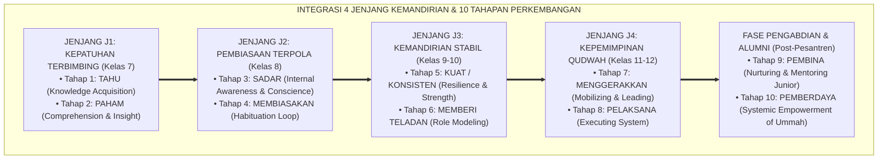

# P4-01: TAHAPAN PERKEMBANGAN MAKRO SANTRI DAN KONTINUUM 10 TAHAP TUMBUH
## *Monograf Riset: Diferensiasi Konseptual Antara 4 Jenjang Kemandirian (J1–J4) dan 10 Tahapan Pembentukan Karakter (Tahu, Paham, Sadar, Membiasakan, Kuat/Konsisten, Memberi Teladan, Menggerakkan, Pelaksana, Pembina, Pemberdaya)*

**Nomor Identifikasi**: `P4-01/MONOGRAF-INDUK-TAHAPAN-MAKRO/2026`  
**Domain**: `04 Progression Framework` > `01 Development Stages`  
**Klasifikasi Naskah**: *Academic Research Monograph* (Monograf Kerangka Progresi Makro)  
**Rumpun Disiplin Pengkaji**: Psikologi Perkembangan Remaja, Neurosains Kognitif, Teori Kontinuum Pembinaan Adab Turats  

---

> ### 💡 INTISARI EKSEKUTIF (EXECUTIVE SUMMARY)
>
> * **Diferensiasi Nomenklatur: 4 Jenjang Kemandirian (J1–J4) vs 10 Tahapan Pembentukan Karakter:**  
>   Untuk menghindari kerancuan istilah, ekosistem TUMBUH membedakan secara tegas antara:
>   1. **Jenjang Kemandirian Santri (J1–J4):** Skala 4 level operasional kemandirian adab santri di asrama (J1 Terbimbing, J2 Pembiasaan, J3 Mandiri, J4 Qudwah).
>   2. **10 Tahapan Pembentukan Karakter (Tahap 1–10):** Lintasan metamorfosis psikososial dan kapasitas kepemimpinan: **1. Tahu $\rightarrow$ 2. Paham $\rightarrow$ 3. Sadar $\rightarrow$ 4. Membiasakan $\rightarrow$ 5. Kuat/Konsisten $\rightarrow$ 6. Memberi Teladan $\rightarrow$ 7. Menggerakkan $\rightarrow$ 8. Pelaksana $\rightarrow$ 9. Pembina $\rightarrow$ 10. Pemberdaya**.

---

## 🏛️ 1. MATRIKS KORELASI 4 JENJANG (J1–J4) DAN 10 TAHAPAN PERKEMBANGAN

---

## 📑 2. TABEL DEFINISI OPERASIONAL 10 TAHAPAN PERKEMBANGAN KARAKTER

| No | Tahapan Karakter | Definisi Operasional & Indikator Psikologis | Padanan Jenjang Kemandirian | Peran Musyrif / Ekosistem |
| :---: | :--- | :--- | :---: | :--- |
| **1** | **TAHU** | Mengetahui aturan dasar, teks dalil syar'i, dan SOP asrama secara kognitif. | **Jenjang J1 (Kepatuhan Terbimbing)** | *Instruktur Langsung* (Aba-aba jelas & demonstrasi). |
| **2** | **PAHAM** | Memahami alasan logis, hikmah syariat, dan konsekuensi logis di balik setiap adab. | **Jenjang J1 (Kepatuhan Terbimbing)** | *Eksplikator Dialogis* (Tadabbur makna & diskusi). |
| **3** | **SADAR** | Tumbuh kesadaran nurani batin (*Muraqabah*) bahwa adab adalah kebutuhan diri, bukan beban luar. | **Jenjang J2 (Pembiasaan Terpola)** | *Penguat Niat* (Refleksi muhasabah malam). |
| **4** | **MEMBIASAKAN** | Mempraktikkan adab dalam rutinitas 24 jam secara teratur hingga menjadi kebiasaan otomatis (*Habit Loop*). | **Jenjang J2 (Pembiasaan Terpola)** | *Pemantau Rutinitas & Apresiasi 4:1*. |
| **5** | **KUAT / KONSISTEN**| Istiqamah, berdaya tahan tinggi (*Resilience*), dan kokoh menjaga adab meski diuji godaan lingkungan. | **Jenjang J3 (Kemandirian Stabil)** | *Coach Reflektif* (Mendorong konsistensi batin). |
| **6** | **MEMBERI TELADAN**| Perilaku adab memancar spontan (*Second Nature*) sehingga menginspirasi rekan sekamar secara positif. | **Jenjang J3 (Kemandirian Stabil)** | *Fasilitator Mentorship* (Apresiasi kepemimpinan adab). |
| **7** | **MENGGERAKKAN** | Memimpin inisiatif kebaikan, aktif mengajak teman, dan menjadi problem solver dalam dinamika asrama. | **Jenjang J4 (Kepemimpinan Qudwah)** | *Mitra Strategis* (Memberi ruang kreasi inisiatif). |
| **8** | **PELAKSANA** | Mengemban amanah eksekusi organisasi santri (OSIS/Asrama) secara profesional (*Itqan*) dan akuntabel. | **Jenjang J4 (Kepemimpinan Qudwah)** | *Penasihat Kolaboratif* (Supervisi manajemen santri). |
| **9** | **PEMBINA** | Mentransformasikan diri menjadi pengasuh/pembimbing yang melatih, mendampingi, dan mengayomi adik kelas. | **Tahun Pengabdian / Musyrif Muda** | *Master Coach* (Pengembangan kompetensi pedagogi). |
| **10**| **PEMBERDAYA** | Menciptakan sistem baru, memajukan lembaga, mendirikan unit usaha dakwah, dan memberdayakan umat luas. | **Fase Alumni Pemimpin Peradaban** | *Jejaring Kolaborasi Sinergis Global*. |

---

## 🏛️ 3. TIGA PILAR PROGRESI PERKEMBANGAN BIOSOSIAL-SPIRITUAL

1. **Pilar Biososial (Neurosains PFC)**: Dari dominasi impuls emosi limbik di Fase Awal (J1 / Tahap 1-2) menuju maturasi Prefrontal Cortex optimal di Fase Akhir (J4 / Tahap 7-8).
2. **Pilar Spiritual (Tazkiyatun Nafs)**: Dari *Nafs Ammarah* (J1) $\rightarrow$ *Nafs Lawwamah* (J2-J3) $\rightarrow$ *Nafs Mutma'innah* (J4 / Tahap 6-10).
3. **Pilar Kepemimpinan (Servant Leadership)**: Dari penerima bimbingan pasif menuju *Khidmah* melayani dan memberdayakan peradaban.
