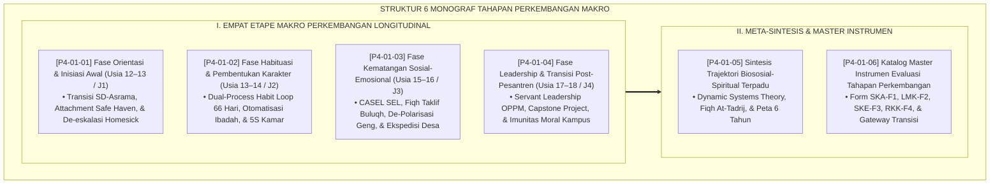

# P4-01: DOKUMEN INDUK TAHAPAN PERKEMBANGAN MAKRO SANTRI
## *Peta Jalan Longitudinal Evolusi Biososial-Spiritual Santri Usia 12–18 Tahun (Fase I Inisiasi Awal, Fase II Habituasi Karakter, Fase III Kematangan Sosial-Emosional, Serta Fase IV Servant Leadership & Transisi Peradaban) di Ekosistem TUMBUH Pesantren*

**Nomor Identifikasi**: `P4-01/DOKUMEN-INDUK-TAHAPAN-PERKEMBANGAN-MAKRO/2026`  
**Domain**: `04 Progression Framework` > `01 Development Stages` (Gugus Sub-Domain 01: *Macro Developmental Stages*)  
**Klasifikasi Naskah**: *Master Navigation & Architecture Document* (Dokumen Induk Peta Jalan Riset & Navigasi 6 Monograf Ilmiah Etape Perkembangan)  
**Rumpun Disiplin Pengkaji**: Epistemologi Perkembangan Fitrah Islam, Neurosains Kognitif Terpadu, Fiqh Marahil at-Ta'dib wa at-Taklif, Dynamic Systems Theory  

---

> ### 💡 INTISARI EKSEKUTIF (EXECUTIVE SUMMARY)
>
> * **Kedudukan Strategis Gugus Tahapan Perkembangan Makro:**  
>   *Development Stages (Tahapan Perkembangan Makro)* merupakan kompas navigasi evolusi pertumbuhan santri sepanjang 6 tahun masa penempaan di pesantren (usia 12 hingga 18 tahun). Doktrin Islam memandang bahwa mendidik anak manusia tidak boleh dilakukan secara seragam dan instan, melainkan wajib mengikuti hukum penahapan fitrah (*Sunnatut Tadrīj fil Khalq*), dari masa transisi pelepasan keluarga (*Inisiasi*), pembiasaan otomatisasi ibadah (*Habituasi*), pematangan kecerdasan rasa dan empati (*Kematangan SEL*), hingga kristalisasi kepemimpinan pelayan peradaban (*Servant Leadership*).
> * **Integrasi Multidisipliner Turats & Neurosains Perkembangan:**  
>   Gugus riset ini memadukan konsep *Marahil at-Ta'dib wa at-Taklif* dalam Turats (*Tuhfatul Maudud* Ibnu Qayyim, *Ihya' 'Ulumiddin* Al-Ghazali, dan *Adab ash-Shibyan* Ibnu Sahnun) dengan sains perkembangan mutakhir (*Attachment Theory Bowlby, Dual-Process Habit Loop Wood & Neal, CASEL SEL Framework, Emerging Adulthood Arnett, dan Dynamic Systems Theory Thelen & Smith*).
> * **Struktur Lengkap 6 Berkas Monograf Riset Ilmiah:**  
>   Dokumen induk ini memetakan dan menghubungkan 6 berkas monograf penelitian akademik komprehensif (~160 KB total riset) yang dirancang untuk menjadi pedoman induk kurikulum kepengasuhan, bimbingan konseling, dan penjaminan mutu kenaikan etape santri 24 jam.

---

## 📑 PETA NAVIGASI ENAM MONOGRAF RISET TAHAPAN PERKEMBANGAN

Berikut adalah daftar lengkap 6 monograf riset akademik dalam gugus **`01 Development Stages`**:

---

## 📚 DESKRIPSI RINGKAS 6 BERKAS MONOGRAF

1. **[P4-01-01: Fase Orientasi dan Inisiasi Awal](file:///c:/xampp/htdocs/tumbuh/04%20Progression%20Framework/01%20Development%20Stages/P4-01-01-Fase-Orientasi-dan-Inisiasi-Awal.md)**  
   *Membahas trajektori adaptasi psikososial transisi SD ke asrama, Attachment Theory John Bowlby, In Loco Parentis, eliminasi perpeloncoan/ospek militeristik, dan protokol First 40 Days.*
2. **[P4-01-02: Fase Habituasi dan Pembentukan Karakter](file:///c:/xampp/htdocs/tumbuh/04%20Progression%20Framework/01%20Development%20Stages/P4-01-02-Fase-Habituasi-dan-Pembentukan-Karakter.md)**  
   *Membahas pembiasaan ibadah dan regulasi diri usia 13–14 tahun, Dual-Process Habit Loop Wendy Wood, neurobiologi basal ganglia, siklus konsistensi 66 hari, dan mitigasi post-holiday relapse.*
3. **[P4-01-03: Fase Kematangan Sosial-Emosional](file:///c:/xampp/htdocs/tumbuh/04%20Progression%20Framework/01%20Development%20Stages/P4-01-03-Fase-Kematangan-Sosial-Emosional.md)**  
   *Membahas identitas moral dan regulasi emosi pubertas usia 15–16 tahun, Fiqh Marahil at-Taklif, 5 Kompetensi CASEL SEL, de-polarisasi rivalitas geng asrama, dan peran Restorative Buddy J1.*
4. **[P4-01-04: Fase Leadership dan Transisi Post-Pesantren](file:///c:/xampp/htdocs/tumbuh/04%20Progression%20Framework/01%20Development%20Stages/P4-01-04-Fase-Leadership-dan-Transisi-Post-Pesantren.md)**  
   *Membahas Servant Leadership usia 17–18 tahun, doktrin Imarah fil Ardh, Emerging Adulthood Jeffrey Arnett, Capstone Civilizational Project di desa binaan, dan navigasi transisi kampus bebas.*
5. **[P4-01-05: Sintesis Trajektori Biososial-Spiritual](file:///c:/xampp/htdocs/tumbuh/04%20Progression%20Framework/01%20Development%20Stages/P4-01-05-Sintesis-Trajektori-Biososial-Spiritual.md)**  
   *Membahas meta-teori integrasi jasad-akal-ruh, Fiqh At-Tadrij ma'al Fitrah Ibnu Qayyim, Dynamic Systems Theory, diagnosis holistik (anemia/stres), dan peta jalan longitudinal 6 tahun.*
6. **[P4-01-06: Katalog Instrumen Evaluasi Tahapan Perkembangan](file:///c:/xampp/htdocs/tumbuh/04%20Progression%20Framework/01%20Development%20Stages/P4-01-06-Katalog-Instrumen-Evaluasi-Tahapan-Perkembangan.md)**  
   *Membahas kodifikasi empat paket instrumen siap pakai (Form SKA-F1, LMK-F2, SKE-F3, RKK-F4), standar gateway kelulusan etape, dan visualisasi dashboard radar SIM Intizham.*

---

## 🎯 STANDAR PENJAMINAN MUTU PERKEMBANGAN SANTRI

Penerapan gugus **Tahapan Perkembangan Makro (Development Stages)** menjamin bahwa:
1. **Pendidikan Berjalan Sesuai Fitrah (*Fitrah-Aligned Progression*)**: Santri dididik dengan penuh kasih sayang dan penahapan ilmiah tanpa pemaksaan beban prematur atau kekerasan fisik.
2. **Keseimbangan Holistik Tiga Dimensi (*Bio-Psycho-Spiritual Integration*)**: Memastikan santri tumbuh dengan fisik yang sehat bugar, kestabilan emosi dan empati sosial, serta kematangan tauhid dan ibadah.
3. **Kesiapan Menjadi Pemimpin Peradaban (*Future Civilizational Leader*)**: Memastikan setiap alumni lulus dengan kepribadian ksatria, mandiri secara moral di kampus/masyarakat, dan berdedikasi melayani kemaslahatan umat (*Khadimul Ummah*).
