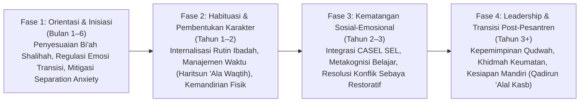
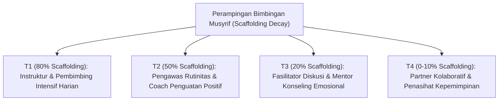

# P4-01: Tahapan Perkembangan Makro Santri (Longitudinal Growth Journey)

## Status Dokumen
* **Status**: 🌟 **A+ (Tervalidasi & Siap Diimplementasikan)**
* **Sub-Domain**: `04 Progression Framework / 01 Development Stages`
* **Penanggung Jawab Keilmuan**: Dewan Keilmuan TUMBUH (*Pakar Neurosains Perkembangan & Pakar Pengasuhan Asrama*)

---

## 1. Tahapan Perkembangan Makro (Fase 1 hingga Fase 4)

---

## 2. Karakteristik Biososial-Spiritual Remaja Pesantren

| Dimensi | Fase 1 (Awal Masuk / T1) | Fase 2 (Habituasi / T2) | Fase 3 (Internalisasi / T3) | Fase 4 (Kemandirian / T4) |
| :--- | :--- | :--- | :--- | :--- |
| **Neurosains (PFC)** | Maturasi PFC awal; dorongan impulsif tinggi; butuh struktur luar ketat. | Maturasi PFC menengah; mulai memahami konsekuensi logis. | Kontrol inhibisi emosi makin stabil; berpikir prospektif. | Integrasi sistem limbik dan PFC optimal; regulasi mandiri penuh. |
| **Spiritual (Nafs)** | *Nafs Ammarah*: Dorongan ego tinggi, butuh bimbingan adab luar (*Takhalli*). | Transisi menuju *Nafs Lawwamah*: Kesadaran bersalah jika melanggar. | *Nafs Lawwamah* matang: Motivasi ibadah lahir dari dorongan *Mahabbah*. | Menuju *Nafs Mutma'innah*: Konsistensi (*Istiqamah*) dalam kebaikan (*Tajalli*). |
| **Sosial (Peer)** | *Ego-centric*: Fokus pada rasa aman diri & kepemilikan. | *Group-oriented*: Mencari penerimaan teman sebaya. | *Empathy-driven*: Mampu memahami perspektif orang lain (CASEL). | *Qudwah-oriented*: Menjadi pelindung & teladan bagi junior. |

---

## 3. Strategi Perampingan Bimbingan Pengasuh (*Scaffolding Decay Matrix*)

---

## 4. Mitigasi Tantangan Transisi Makro

1. **Homesickness & Anxiety pada Fase 1**: Penanganan berbasis empati (*Validation & Co-Regulation*), bukan celaan atau stigma "santri manja".
2. **Krisis Identitas Remaja pada Fase 2–3**: Pendampingan bimbingan konseling Islam (*CBT & Restorative Narrative*) untuk membentuk *Self-Identity* Islami yang kokoh.
3. **Burnout Musyrif**: Penerapan sistem logbook digital PBIS dan jadwal piket berkeadilan agar musyrif dapat memberikan bimbingan dengan energi emosional yang sehat (*Qudwah Hasanah*).
