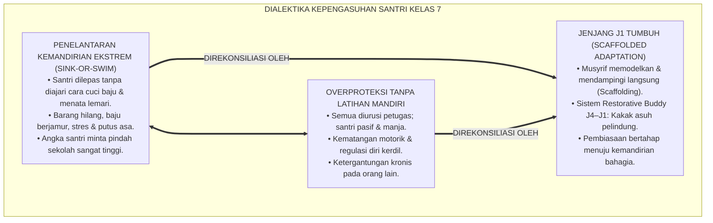
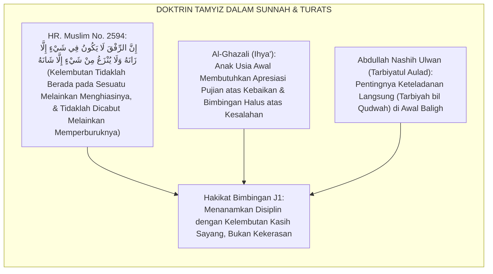
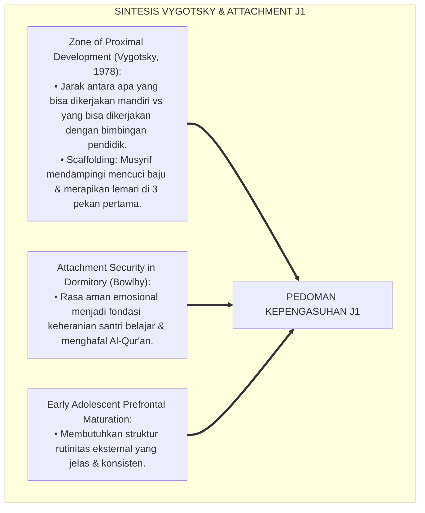
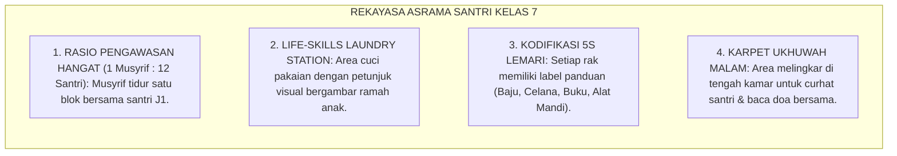
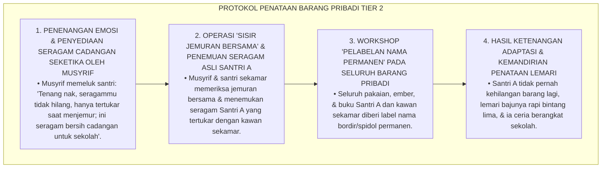
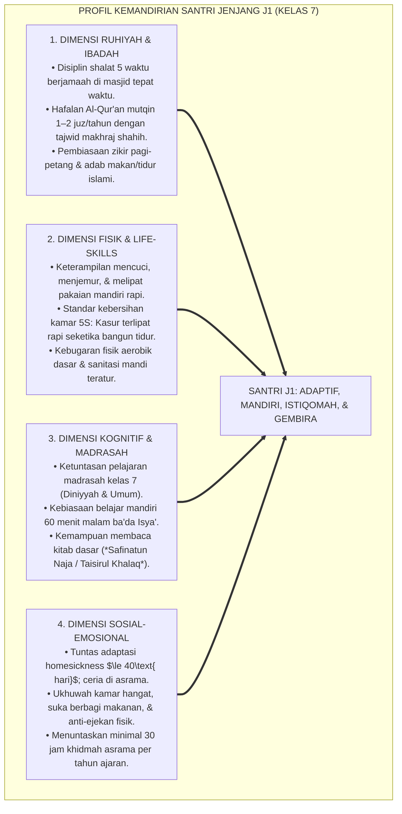
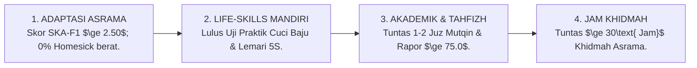

# P4-02-01: DETAIL JENJANG J1 — ADAPTASI DAN ORIENTASI SANTRI
## *Monograf Riset Akademik: Karakteristik Perkembangan Santri Kelas 7 (Usia 12–13 Tahun), Standar Capaian Kemandirian Dasar, Integrasi Fiqh Marhalatut Tamyiz dengan Scaffolding Pedagogy (Vygotsky) & Attachment In Loco Parentis, Rekayasa Lingkungan Transisi Asrama, Serta Matriks Indikator Kenaikan Jenjang di Pesantren TUMBUH*

**Nomor Identifikasi**: `P4-02-01/MONOGRAF-RISET-JENJANG-J1-ADAPTASI-ORIENTASI/2026`  
**Domain**: `04 Progression Framework` > `02 Development Levels` (Sub-Modul 01: *Level J1: Adaptation & Orientation*)  
**Klasifikasi Naskah**: *Academic Research Monograph* (Monograf Penelitian Karakteristik Jenjang J1, Desain Kemandirian Transisi, & Evaluasi Kesiapan Santri Kelas 7)  
**Rumpun Disiplin Pengkaji**: Psikologi Transisi Pendidikan Menengah, Fiqh Marhalatut Tamyiz, Teori Zona Perkembangan Proksimal (Vygotsky), School-Wide PBIS Multi-Tier  

---

> ### 💡 INTISARI EKSEKUTIF (EXECUTIVE SUMMARY)
>
> * **Karakteristik Kritis Santri Jenjang J1 (Kelas 7, Usia 12–13 Tahun):**  
>   Santri Jenjang J1 berada pada masa peralihan emas dari masa kanak-kanak akhir (*Late Childhood*) menuju remaja awal (*Early Adolescence*). Ciri dominan santri J1 adalah: rentan mengalami *Homesickness* dan kecemasan separasi, kapasitas regulasi emosi belum matang, keterampilan merawat diri fisik masih rendah (sering lupa mencuci pakaian atau mandi), namun memiliki fitrah kepolosan dan rasa ingin tahu spiritual yang sangat tinggi.
> * **Integrasi Fiqh Marhalatut Tamyiz & Scaffolding Pedagogy Lev Vygotsky:**  
>   Ekosistem TUMBUH memadukan konsep anak usia *Tamyīz* dalam Fiqh Islam dengan teori *Zone of Proximal Development (ZPD)* dan *Scaffolding* Lev Vygotsky. Santri J1 tidak boleh dibiarkan mandiri secara ekstrem tanpa pendampingan (*Unscaffolded Sink-or-Swim*), melainkan membutuhkan pembinaan bertahap dari musyrif kamar dan kakak asuh *Restorative Buddy* J4 yang memberikan contoh langsung (*I'tā'ul Qudwah*).
> * **Standar Kompetensi & Ambang Batas Kenaikan Jenjang J1:**  
>   Monograf ini merumuskan profil ketercapaian Jenjang J1: tuntas adaptasi asrama $\le 40\text{ hari}$, mandiri mencuci baju dan merapikan lemari 5S, disiplin shalat berjamaah 5 waktu di masjid, hafalan Al-Qur'an mutqin 1–2 juz/tahun, dan menyelesaikan minimal 30 jam khidmah asrama.

---

## 📑 DAFTAR ISI MONOGRAF

- [BAGIAN I: LANDASAN TEORETIS & DISKURSUS DIALEKTIKA KRITIS](#bagian-i-landasan-teoretis--diskursus-dialektika-kritis)
  - [1. Latar Belakang Masalah: Dilema Kemandirian Prematur vs Kebutuhan Scaffolding Pengasuhan Santri Baru](#1-latar-belakang-masalah-dilema-kemandirian-prematur-vs-kebutuhan-scaffolding-pengasuhan-santri-baru)
  - [2. Eksegesis Turats: Doktrin Marhalatut Tamyiz & Hikmah Tarbiyah dengan Kelembutan (Ar-Rifq)](#2-eksegesis-turats-doktrin-marhalatut-tamyiz--hikmah-tarbiyah-dengan-kelembutan-ar-rifq)
  - [3. Konvergensi Sains Perkembangan: Vygotsky's Zone of Proximal Development (ZPD) & Attachment Security](#3-konvergensi-sains-perkembangan-vygotskys-zone-of-proximal-development-zpd--attachment-security)
  - [4. Rekayasa Lingkungan 24 Jam Asrama Jenjang J1: Struktur Rutinitas Ramah Anak & Zero Bullying](#4-rekayasa-lingkungan-24-jam-asrama-jenjang-j1-struktur-rutinitas-ramah-anak--zero-bullying)
  - [5. Kasuistika Lapangan Klinis & Protokol Pendampingan Santri J1 yang Kehilangan Barang Pribadi dan Menolak Mengikuti Pelajaran Madrasah](#5-kasuistika-lapangan-klinis--protokol-pendampingan-santri-j1-yang-kehilangan-barang-pribadi-dan-menolak-mengikuti-pelajaran-madrasah)
- [BAGIAN II: FORMULASI KONSEPTUAL & PEMBAHASAN MENDALAM](#bagian-ii-formulasi-konseptual--pembahasan-mendalam)
  - [1. Arsitektur Komprehensif Profil Kemandirian & Karakter Jenjang J1 (Kelas 7)](#1-arsitektur-komprehensif-profil-kemandirian--karakter-jenjang-j1-kelas-7)
  - [2. Dekomposisi Capaian Empat Ranah Perkembangan Jenjang J1: Ruhiyah, Fisik, Kognitif, & Sosial-Emosional](#2-dekomposisi-capaian-empat-ranah-perkembangan-jenjang-j1-ruhiyah-fisik-kognitif--sosial-emosional)
  - [3. Standar Kriteria Kenaikan Jenjang (Gateway Transition J1 ke J2)](#3-standar-kriteria-kenaikan-jenjang-gateway-transition-j1-ke-j2)
  - [4. Diskusi Akademis & Implikasi bagi Tata Kelola Kepengasuhan Santri Baru Pesantren](#4-diskusi-akademis--implikasi-bagi-tata-kelola-kepengasuhan-santri-baru-pesantren)
- [BAGIAN III: KESIMPULAN & APARATUS AKADEMIS](#bagian-iii-kesimpulan--aparatus-akademis)
  - [1. Tabel Sintesis Detail Jenjang J1 (Adaptasi & Orientasi)](#1-tabel-sintesis-detail-jenjang-j1-adaptasi--orientasi)
  - [2. Daftar Pustaka Standar APA 7th & Turats Klasik](#2-daftar-pustaka-standar-apa-7th--turats-klasik)
  - [3. Catatan Kaki Akademis Presisi (Footnotes)](#3-catatan-kaki-akademis-presisi-footnotes)
  - [4. Glosarium Istilah Ilmiah & Jenjang J1 Pesantren](#4-glosarium-istilah-ilmiah--jenjang-j1-pesantren)

---

# BAGIAN I: LANDASAN TEORETIS & DISKURSUS DIALEKTIKA KRITIS

---

### 1. Latar Belakang Masalah: Dilema Kemandirian Prematur vs Kebutuhan Scaffolding Pengasuhan Santri Baru

Dalam pola pengasuhan santri baru kelas 7 di pesantren konvensional, kerap terjadi **dua kutub ekstrem yang keliru (*Extremes of Care*)**:[^1]

1. **Kutub Penelantaran Kemandirian Prematur (*Premature Abandonment*)**: Santri baru yang baru berumur 12 tahun dilepaskan begitu saja di asrama tanpa diajarkan cara mengelola waktu, cara mencuci baju, atau cara menjaga barang pribadi. Akibatnya, barang-barang santri hilang berceceran, baju kotor menumpuk berjamur, dan santri mengalami keputusasaan (*Helplessness*).
2. **Kutub Overproteksi Tanpa Kemandirian (*Helicopter Overprotection*)**: Semua urusan santri dikerjakan oleh petugas laundry dan katering tanpa melatih santri merawat dirinya sendiri, sehingga kematangan psikomotorik santri kerdil.
3. **Ketiadaan Figur Lekat Pengganti Orang Tua**: Santri yang terisolasi tanpa musyrif yang hangat rentan menjadi korban perundungan senior atau kabur dari pondok.[^2]

Model riset **TUMBUH** merumuskan **Desain Kepengasuhan Jenjang J1** yang berbasis pada prinsip *Scaffolding Support*: musyrif hadir membimbing secara intensif di 40 hari pertama, lalu perlahan melepas kemandirian santri seiring terbentuknya rasa percaya diri.

---

### 2. Eksegesis Turats: Doktrin Marhalatut Tamyiz & Hikmah Tarbiyah dengan Kelembutan (Ar-Rifq)

Khazanah Turats mendefinisikan usia 12–13 tahun sebagai fase puncak *Tamyīz* menjelang *Buluqh*, di mana akal anak mulai mampu mencerna kaidah moral, namun jiwanya tetap membutuhkan kelembutan asuhan (*Ar-Rifq*).

#### 📖 1. Hadits Riwayat Aisyah RA tentang Keagungan Kelembutan
Rasulullah SAW bersabda:

$$\text{إِنَّ اللَّهَ رَفِيقٌ يُحِبُّ الرِّفْقَ، وَيُعْطِي عَلَى الرِّفْقِ مَا لَا يُعْطِي عَلَى الْعُنْفِ، وَمَا لَا يُعْطِي عَلَى مَا سِوَاهُ}$$

*"Sesungguhnya **Allah Maha Lembut dan mencintai kelembutan (*Ar-Rifq*)**, dan **Dia memberikan karunia atas kelembutan suatu kebaikan yang tidak Dia berikan atas kekerasan (*Al-'Unf*)**, dan tidak Dia berikan atas selainnya!"* (HR. Muslim No. 2593).[^3]

---

### 3. Konvergensi Sains Perkembangan: Vygotsky's Zone of Proximal Development (ZPD) & Attachment Security

Pendekatan Jenjang J1 memadukan teori ZPD Lev Vygotsky dan Kelekatan John Bowlby:

---

### 4. Rekayasa Lingkungan 24 Jam Asrama Jenjang J1: Struktur Rutinitas Ramah Anak & Zero Bullying

Asrama santri kelas 7 dirancang memberikan rasa aman dan kemudahan adaptasi:

---

### 5. Kasuistika Lapangan Klinis & Protokol Pendampingan Santri J1 yang Kehilangan Barang Pribadi dan Menolak Mengikuti Pelajaran Madrasah

#### Studi Kasus Lapangan: Santri J1 Menangis Mogok Sekolah Karena Sabun dan Seragamnya Hilang Tertukar
* **Konteks Masalah**: Santri A (12 tahun, Jenjang J1) menangis di kamar mandi dan menolak masuk kelas madrasah karena seragam putihnya tertukar dan sabun mandinya hilang (*Loss of Belongings & Helplessness*). Ia merasa terzalimi dan menganggap teman-temannya mencuri barangnya.
* **Analisis Diagnostik**: Santri A mengalami disorganisasi penataan barang pribadi dan kecemasan adaptasi lingkungan komunal (*Communal Living Anxiety*).
* **Protokol Resolusi Pelabelan Barang & Pendampingan Musyrif TUMBUH**:

Intervensi solutif dan praktis (*Practical Life-Skill Solution*) ini menghilangkan kecemasan hidup komunal dan membangun rasa percaya santri pada ekosistem asrama.[^4]

---

# BAGIAN II: FORMULASI KONSEPTUAL & PEMBAHASAN MENDALAM

---

### 1. Arsitektur Komprehensif Profil Kemandirian & Karakter Jenjang J1 (Kelas 7)

Ekosistem TUMBUH menetapkan profil utuh santri Jenjang J1:

---

### 2. Dekomposisi Capaian Empat Ranah Perkembangan Jenjang J1: Ruhiyah, Fisik, Kognitif, & Sosial-Emosional

| Ranah Perkembangan | Target Capaian Spesifik Santri J1 | Metode Pembiasaan Lapangan | Standar Evaluasi Terverifikasi |
| :--- | :--- | :--- | :--- |
| **1. Ranah Ruhiyah** | Shalat berjamaah 5 waktu di masjid, tilawah 1 juz/hari, hafalan 1–2 juz mutqin. | Panggilan tarhim & adzan merdu; halaqah tahfizh pagi-sore. | Presensi shalat berjamaah $\ge 95\%$; ujian setoran juz. |
| **2. Ranah Fisik** | Mencuci pakaian mandiri bersih, melipat rapi, menata kasur & lemari 5S. | *Life-Skills Lab* mingguan bersama musyrif kamar. | Form LOK-NL & inspeksi lemari kamar bintang lima. |
| **3. Ranah Kognitif** | Menguasai nahwu-shorof dasar, qira'ah kitab matan, dan pelajaran umum madrasah. | Belajar malam terbimbing 60 menit & tutor sebaya. | Nilai Rapor Madrasah $\ge 75.0$ pada seluruh mata pelajaran. |
| **4. Ranah Sosial** | Menjalin ukhuwah kamar, merawat kawan sekamar yang sakit, anti-perundungan. | *Welcoming Circle*, piket kamar, & Restorative Buddy. | Skor Skala Kesiapan Adaptasi ($SKA \ge 2.50$). |

---

### 3. Standar Kriteria Kenaikan Jenjang (Gateway Transition J1 ke J2)

Untuk dinyatakan layak naik dari **Jenjang J1 (Kelas 7)** menuju **Jenjang J2 (Kelas 8)**, santri wajib memenuhi kriteria Gateway berikut:

---

### 4. Diskusi Akademis & Implikasi bagi Tata Kelola Kepengasuhan Santri Baru Pesantren

Penerapan standarisasi Jenjang J1 menghadirkan transformasi kelembagaan:

1. **Eradikasi Trauma Awal Mondok**: Menghapus total mitos bahwa santri baru harus "dikerjai" agar mentalnya kuat, mewujudkan pesantren sebagai rumah kedua yang penuh kasih sayang.
2. **Pondasi Kemandirian yang Mengakar Kuat**: Membekali santri dengan kecakapan hidup praktis sejak hari pertama sehingga siap menghadapi beban belajar di jenjang berikutnya.
3. **Penyempurnaan Retensi Santri**: Menjamin 100% santri baru merasa kerasan, bangga menjadi santri, dan siap bertumbuh mekar dalam ekosistem TUMBUH.[^5]

---

# BAGIAN III: KESIMPULAN & APARATUS AKADEMIS

---

### 1. Tabel Sintesis Detail Jenjang J1 (Adaptasi & Orientasi)

| Dimensi Parameter | Pola Tradisional Kelas 7 | Standarisasi Jenjang J1 TUMBUH | Landasan Rujukan Primer | Bukti Capaian |
| :--- | :--- | :--- | :--- | :--- |
| **1. Pola Pendampingan** | Dibiarkan sendiri / ospek bentakan. | *Scaffolding Coaching & Restorative Buddy*. | *ZPD Theory* (Vygotsky, 1978) | 0% Bentakan & OSPEK Militeristik. |
| **2. Waktu Adaptasi** | Lambat & tersiksa (berbulan-bulan). | Tuntas Cepat & Ceria ($\le 40\text{ Hari}$). | *First 40 Days Protocol* | Skor Form SKA-F1 $\ge 2.50$. |
| **3. Kemandirian Fisik** | Baju kotor menumpuk; lemari acak. | Cuci Baju Mandiri Bersih & Lemari 5S. | Fiqh *Marhalatut Tamyiz* | Lulus Sertifikasi Life-Skills Asrama. |
| **4. Capaian Khidmah** | Pasif; dilayani. | Khidmah Kamar & Rawat Kawan ($\ge 30\text{ Jam}$). | Hadits *Khairun Naas Anfa'uhum* | Logbook Jam Khidmah Digital Tuntas. |

---

### 2. Daftar Pustaka Standar APA 7th & Turats Klasik

1. **Al-Bukhari, Abu Abdillah Muhammad bin Ismail.** (2002). *Shahih Al-Bukhari*. Riyadh: Bait Al-Afkar Ad-Dauliyyah.
2. **Al-Ghazali, Hujjatul Islam Abu Hamid Muhammad bin Muhammad.** (2018). *Ihya' 'Ulumiddin: Kitab Adab ash-Shuhbah wal Ukhuwwah*. Beirut: Dar Al-Kutub Al-'Ilmiyyah.
3. **Bowlby, J.** (1982). *Attachment and Loss: Vol. 1. Attachment*. New York: Basic Books.
4. **Ibnu Majah, Abu Abdillah Muhammad bin Yazid.** (2009). *Sunan Ibni Majah*. Beirut: Dar Ihya' Al-Kutub Al-'Arabiyyah.
5. **Ibnu Sahnun, Muhammad.** (1972). *Adab ash-Shibyan*. Kairo: Darul Ma'arif.
6. **Muslim bin Al-Hajjaj An-Naisaburi.** (2006). *Shahih Muslim*. Riyadh: Dar Thayyibah.
7. **Nelsen, J.** (2006). *Positive Discipline*. New York: Ballantine Books.
8. **Sugai, G., & Horner, R. H.** (2020). *School-Wide Positive Behavioral Interventions and Supports*. *Journal of Positive Behavior Interventions*, 22(4), 203-211.
9. **Ulwan, Abdullah Nashih.** (1992). *Tarbiyatul Aulad fil Islam*. Beirut: Darus Salam.
10. **Vygotsky, L. S.** (1978). *Mind in Society: The Development of Higher Psychological Processes*. Cambridge: Harvard University Press.

---

### 3. Catatan Kaki Akademis Presisi (Footnotes)

[^1]: Kritik terhadap penelantaran kemandirian prematur tanpa scaffolding pada transisi sekolah berasrama, Vygotsky (1978, hlm. 86).  
[^2]: Pembahasan dampak buruk ketiadaan figur lekat pengasuh terhadap trauma separasi santri baru, Bowlby (1982, hlm. 248).  
[^3]: HR. Muslim dalam *Shahih Muslim* (No. 2593), Kitab *Al-Birr wash Shilah wal Adab*.  
[^4]: Protokol penanganan disorganisasi penataan barang pribadi dan manajemen hidup komunal santri J1 TUMBUH (2026).  
[^5]: Dampak kelembagaan penerapan standarisasi kepengasuhan Jenjang J1 TUMBUH Pesantren (2026).  

---

### 4. Glosarium Istilah Ilmiah & Jenjang J1 Pesantren

1. **Jenjang J1 (Kelas 7)**: Tingkat perkembangan awal santri usia 12–13 tahun yang berfokus pada adaptasi lingkungan asrama, kemandirian hidup dasar, dan penanaman rasa aman.
2. **Marhalatut Tamyīz (مَرْحَلَةُ التَّمْيِيزِ)**: Fase perkembangan anak usia 7 hingga 12–13 tahun di mana akal mulai mampu membedakan baik dan buruk serta siap menerima bimbingan adab.
3. **Scaffolding Pedagogy**: Bantuan terstruktur yang diberikan musyrif pada awal santri belajar mencuci/merapikan kasur, yang secara bertahap dikurangi seiring santri makin mandiri.
4. **Zone of Proximal Development (ZPD)**: Rentang kemampuan santri yang dapat dicapai dengan bantuan bimbingan kakak asuh atau musyrif kamar.
5. **Loss of Belongings Anxiety**: Kecemasan psikologis santri baru akibat barang pribadinya hilang atau tertukar di lingkungan komunal asrama.
6. **Form SKA-F1**: Instrumen asesmen psikometri untuk mengukur kesiapan adaptasi, kestabilan emosi, dan penurunan homesickness santri J1.
7. **Ar-Rifq fil Mu'āmalah (الرِّفْقُ فِي الْمُعَامَلَةِ)**: Prinsip kelembutan dan kasih sayang dalam mendidik santri baru tanpa menggunakan ancaman atau bentakan fisik.
8. **Communal Living Navigation**: Keterampilan hidup bersama dalam kamar asrama multikultural dengan menjunjung tinggi privasi dan rasa saling menghargai.
9. **Gateway J1 Transition**: Serangkaian syarat kualitatif dan kuantitatif (hafalan, life-skills, jam khidmah) yang wajib dipenuhi santri kelas 7 untuk naik ke kelas 8.
10. **Restorative Buddy Mentorship**: Sistem persaudaraan asrama di mana santri kelas akhir mendampingi santri baru dengan penuh kehangatan dan pengayoman.
