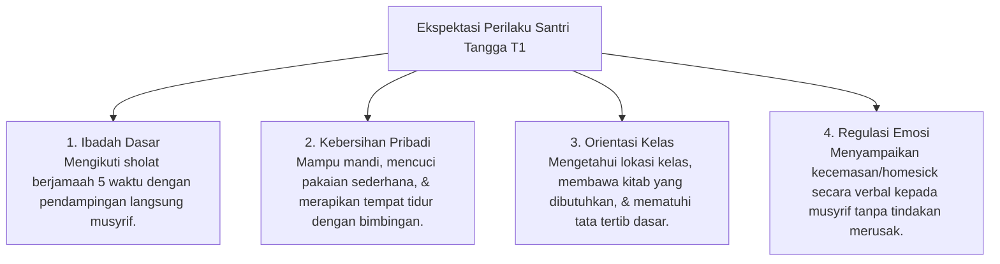

# P4-02-01: Modul Operasional Tangga T1 (Adaptasi & Orientasi)

## Status Dokumen
* **Status**: 🌟 **A+ (Tervalidasi & Siap Diimplementasikan)**
* **Sub-Domain**: `04 Progression Framework / 02 Development Levels`
* **Penanggung Jawab Keilmuan**: Dewan Keilmuan TUMBUH (*Pakar Pengasuhan Asrama & Pakar Bimbingan Konseling*)

---

## 1. Spesifikasi Operasional Tangga T1

* **Fokus Utama**: Penyesuaian Diri, Rasa Aman (*Psychological Safety*), Regulasi Emosi Transisi, & Kebiasaan Dasar.
* **Tingkat Scaffolding Decay**: **80% Scaffolding** (Bimbingan Langsung Musyrif 24 Jam).
* **Target Durasi Normal**: Bulan 1 hingga Bulan 6 (Semester 1).

---

## 2. Ekspektasi Perilaku & Indikator Capaian Tangga T1

---

## 3. SOP Bimbingan Musyrif (80% Scaffolding)

1. **Morning Routine Guidance**: Musyrif hadir di kamar 15 menit sebelum waktu Subuh, mengumandangkan sholawat/dzikir dengan suara lembut untuk membangunkan santri secara damai (*Fiqhu al-Inhadh*).
2. **Personal Organization Check**: Membimbing santri meletakkan handuk, sepatu, dan pakaian kotor pada tempatnya setiap selesai aktivitas.
3. **Daily Empathy Circle**: Mengadakan lingkaran cerita 10 menit sebelum tidur di mana santri diajak mengutarakan hal positif dan tantangan hari ini.

---

## 4. Pelanggaran Yang Diwajarkan pada T1 & Respon Restoratif

| Pelanggaran Umum T1 | Penjelasan Fungsional | Respon Pembinaan Restoratif (Dilarang Hukuman Fisik) |
| :--- | :--- | :--- |
| **Keterlambatan Sholat Subuh** | Penyesuaian ritme biologis tidur yang belum stabil. | Musyrif mendampingi santri sholat dan mengevaluasi jam tidur malam santri. |
| **Pakaian/Peralatan Berserakan** | Belum memiliki habit kebersihan kamar yang terlatih. | Musyrif memberikan demonstrasi cara melipat pakaian & meletakkan sepatu. |
| **Menangis / Ingin Pulang** | Respon regulasi emosi alami terhadap perubahan bi'ah. | Sesi konseling empati, penenangan emosi (*Co-Regulation*), dan pengalihan positif. |
