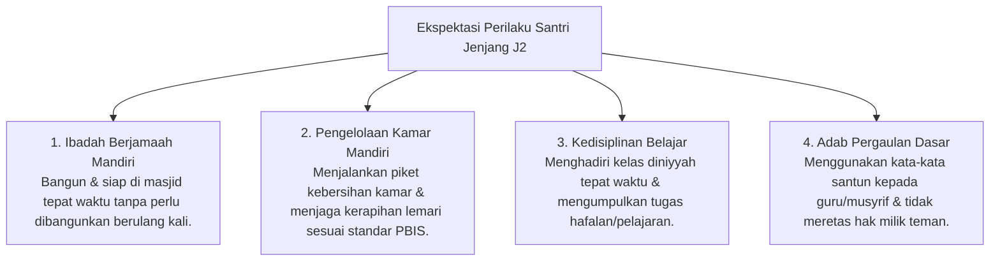

# P4-02-02: Modul Operasional Jenjang J2 (Habituasi Dasar)

## Status Dokumen
* **Status**: 🌟 **A+ (Tervalidasi & Siap Diimplementasikan)**
* **Sub-Domain**: `04 Progression Framework / 02 Development Levels`
* **Penanggung Jawab Keilmuan**: Dewan Keilmuan TUMBUH (*Pakar Pedagogi Master Guru & Pakar Arsitektur PBIS Restoratif*)

---

## 1. Spesifikasi Operasional Jenjang J2

* **Fokus Utama**: Pembentukan Rutinitas Mandiri, Ketertiban Kamar & Kelas, serta Adab Harian.
* **Tingkat Scaffolding Decay**: **50% Scaffolding** (Monitoring Musyrif & Penguatan Positif PBIS).
* **Target Durasi Normal**: Bulan 7 hingga Akhir Tahun ke-2.

---

## 2. Ekspektasi Perilaku & Indikator Capaian Jenjang J2

---

## 3. SOP Penguatan Positif PBIS (50% Scaffolding)

1. **Sistem Portofolio Adab Harian**: Musyrif memberikan pencatatan apresiasi kualitatif pada logbook PBIS digital ketika santri menunjukkan konsistensi adab (*4:1 Magic Ratio*).
2. **Visual Cueing & Prompts**: Menggunakan papan pengingat visual (*Checklist Kamar Mandiri*) di sudut kamar sebagai panduan santri.
3. **Weekly Milestone Award**: Pemberian penghargaan kelompok bagi kamar terbaik dalam kebersihan dan kedisiplinan sholat berjamaah.

---

## 4. Evaluasi Mandiri Santri & Transisi Bergradasi

Pada Jenjang J2, santri mulai dilatih melakukan **Self-Monitoring**:
- Setiap malam, santri mengisi lembar mutabaah reflektif pribadi (*Jurnal Adab T2*).
- Musyrif mencocokkan hasil self-monitoring santri dengan catatan observasi musyrif secara mingguan sebagai bahan evaluasi formatif.
