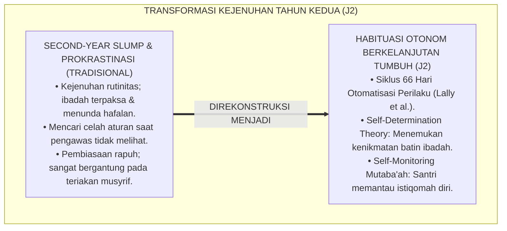
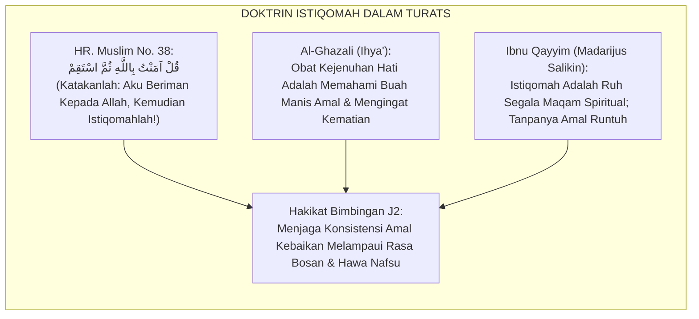
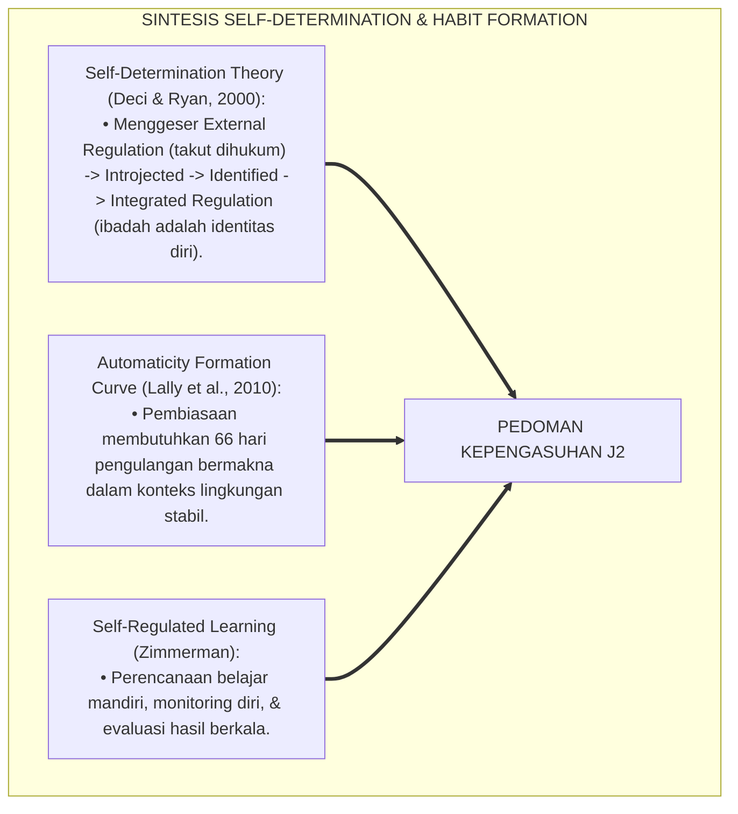
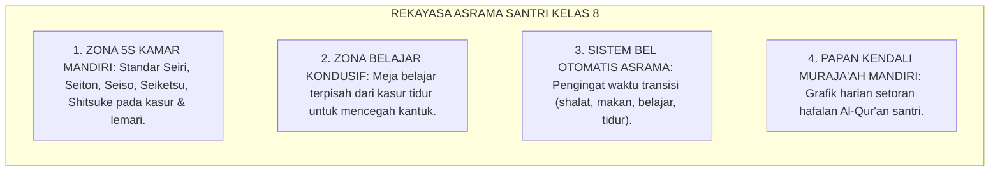
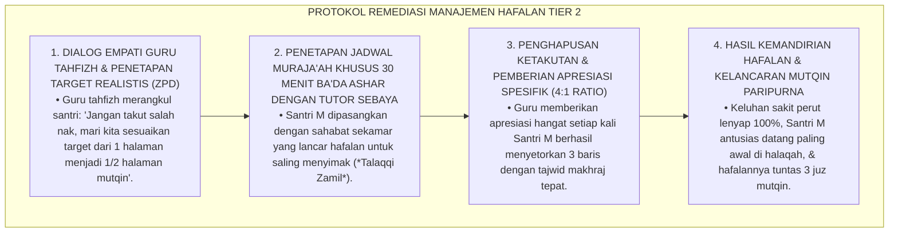
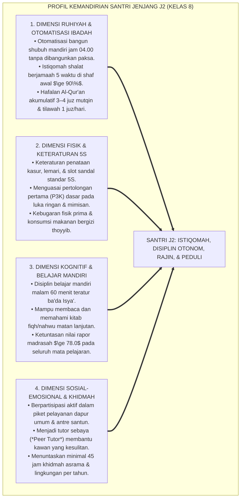
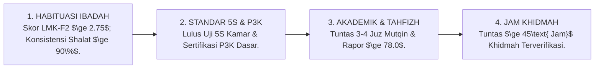

# P4-02-02: DETAIL JENJANG J2 — HABITUASI DASAR DAN REGULASI DIRI
## *Monograf Riset Akademik: Karakteristik Perkembangan Santri Kelas 8 (Usia 13–14 Tahun), Standar Capaian Otomatisasi Ibadah & Disiplin Belajar Mandiri, Integrasi Fiqh Dawamul Amal dengan Self-Determination Theory (Deci & Ryan) & Habit Loop Automation (Lally et al.), Penataan Kamar Standar 5S, Serta Matriks Indikator Kenaikan Jenjang di Pesantren TUMBUH*

**Nomor Identifikasi**: `P4-02-02/MONOGRAF-RISET-JENJANG-J2-HABITUASI-DASAR/2026`  
**Domain**: `04 Progression Framework` > `02 Development Levels` (Sub-Modul 02: *Level J2: Basic Habituation*)  
**Klasifikasi Naskah**: *Academic Research Monograph* (Monograf Penelitian Karakteristik Jenjang J2, Otomatisasi Ibadah, & Evaluasi Konsistensi 66 Hari)  
**Rumpun Disiplin Pengkaji**: Psikologi Perkembangan Remaja Awal, Teori Penentuan Nasib Sendiri (*Self-Determination Theory*), Fiqh Riyadhah an-Nafs, School-Wide PBIS Multi-Tier  

---

> ### 💡 INTISARI EKSEKUTIF (EXECUTIVE SUMMARY)
>
> * **Karakteristik Kritis Santri Jenjang J2 (Kelas 8, Usia 13–14 Tahun):**  
>   Santri Jenjang J2 telah melewati fase adaptasi awal asrama dan memasuki fase konsolidasi rutinitas. Pada usia ini, tantangan bergeser dari rasa rindu rumah (*Homesickness*) menuju **kejenuhan rutinitas (*Routine Monotony*)**, kemalasan bangun shubuh mandiri, dan godaan menunda-nunda belajar (*Procrastination*). Santri J2 membutuhkan pembiasaan yang menginternalisasi motivasi otonom (*Autonomous Regulation*) agar ibadah dan disiplin belajar menjadi kebutuhan jiwa yang mengalir alami.
> * **Integrasi Fiqh Dawamul Amal & Habit Loop 66 Hari (Lally et al.):**  
>   Ekosistem TUMBUH memadukan doktrin istiqomah dan kesinambungan amal (*Dawāmul 'Amal*) dalam Sunnah Nabawiyyah dengan riset neuroplastisitas pembentukan kebiasaan Philippa Lally. Santri J2 dibina melalui siklus 66 hari otomatisasi perilaku tanpa ancaman rotan, mengalihkan kendali eksternal menuju pemantauan mandiri (*Self-Monitoring Mutaba'ah*).
> * **Standar Kompetensi & Ambang Batas Kenaikan Jenjang J2:**  
>   Monograf ini merumuskan profil ketercapaian Jenjang J2: otomatisasi shalat berjamaah di shaf awal $\ge 90\%$, hafalan Al-Qur'an akumulatif 3–4 juz mutqin, belajar mandiri malam 60 menit teratur, penguasaan P3K dasar luka ringan, dan menuntaskan minimal 45 jam khidmah asrama per tahun.

---

## 📑 DAFTAR ISI MONOGRAF

- [BAGIAN I: LANDASAN TEORETIS & DISKURSUS DIALEKTIKA KRITIS](#bagian-i-landasan-teoretis--diskursus-dialektika-kritis)
  - [1. Latar Belakang Masalah: Bahaya Jebakan Kejenuhan Asrama (Second-Year Slump) & Disiplin Semu](#1-latar-belakang-masalah-bahaya-jebakan-kejenuhan-asrama-second-year-slump--disiplin-semu)
  - [2. Eksegesis Turats: Doktrin Al-Mujahadah wal Istiqamah dalam Menjaga Kontinuitas Amal](#2-eksegesis-turats-doktrin-al-mujahadah-wal-istiqamah-dalam-menjaga-kontinuitas-amal)
  - [3. Konvergensi Sains Pembiasaan: Self-Determination Theory (Deci & Ryan) & Automaticity Formation (Lally)](#3-konvergensi-sains-pembiasaan-self-determination-theory-deci--ryan--automaticity-formation-lally)
  - [4. Rekayasa Lingkungan 24 Jam Asrama Jenjang J2: Penataan Kamar 5S & Manajemen Waktu Belajar Mandiri](#4-rekayasa-lingkungan-24-jam-asrama-jenjang-j2-penataan-kamar-5s--manajemen-waktu-belajar-mandiri)
  - [5. Kasuistika Lapangan Klinis & Protokol Pendampingan Santri J2 yang Mulai Terbiasa Menunda Setoran Hafalan Al-Qur'an](#5-kasuistika-lapangan-klinis--protokol-pendampingan-santri-j2-yang-mulai-terbiasa-menunda-setoran-hafalan-al-quran)
- [BAGIAN II: FORMULASI KONSEPTUAL & PEMBAHASAN MENDALAM](#bagian-ii-formulasi-konseptual--pembahasan-mendalam)
  - [1. Arsitektur Komprehensif Profil Kemandirian & Karakter Jenjang J2 (Kelas 8)](#1-arsitektur-komprehensif-profil-kemandirian--karakter-jenjang-j2-kelas-8)
  - [2. Dekomposisi Capaian Empat Ranah Perkembangan Jenjang J2: Ruhiyah, Fisik, Kognitif, & Sosial-Emosional](#2-dekomposisi-capaian-empat-ranah-perkembangan-jenjang-j2-ruhiyah-fisik-kognitif--sosial-emosional)
  - [3. Standar Kriteria Kenaikan Jenjang (Gateway Transition J2 ke J3)](#3-standar-kriteria-kenaikan-jenjang-gateway-transition-j2-ke-j3)
  - [4. Diskusi Akademis & Implikasi bagi Penjaminan Mutu Konsistensi Ibadah Santri Pesantren](#4-diskusi-akademis--implikasi-bagi-penjaminan-mutu-konsistensi-ibadah-santri-pesantren)
- [BAGIAN III: KESIMPULAN & APARATUS AKADEMIS](#bagian-iii-kesimpulan--aparatus-akademis)
  - [1. Tabel Sintesis Detail Jenjang J2 (Habituasi Dasar & Regulasi Diri)](#1-tabel-sintesis-detail-jenjang-j2-habituasi-dasar--regulasi-diri)
  - [2. Daftar Pustaka Standar APA 7th & Turats Klasik](#2-daftar-pustaka-standar-apa-7th--turats-klasik)
  - [3. Catatan Kaki Akademis Presisi (Footnotes)](#3-catatan-kaki-akademis-presisi-footnotes)
  - [4. Glosarium Istilah Ilmiah & Jenjang J2 Pesantren](#4-glosarium-istilah-ilmiah--jenjang-j2-pesantren)

---

# BAGIAN I: LANDASAN TEORETIS & DISKURSUS DIALEKTIKA KRITIS

---

### 1. Latar Belakang Masalah: Bahaya Jebakan Kejenuhan Asrama (Second-Year Slump) & Disiplin Semu

Dalam psikologi pendidikan sekolah berasrama, santri tahun kedua (kelas 8) kerap mengalami sindrom kemunduran tahun kedua (*Second-Year Slump*):[^1]

1. **Jebakan Kejenuhan Rutinitas (*The Routine Burnout Trap*)**: Rasa takjub awal masuk pondok telah memudar, sementara tuntutan pelajaran mulai meningkat. Santri mulai merasa bosan dengan rutinitas harian yang sama setiap hari.
2. **Kecenderungan Prokrastinasi & Menghindar (*Academic Avoidance*)**: Santri mulai mahir mencari celah aturan pengasuhan: berlama-lama di kamar mandi saat jam belajar malam atau menunda menyetorkan hafalan Al-Qur'an (*Procrastination*).
3. **Disiplin yang Rapuh Tanpa Internalisasi Otonom**: Ibadah shalat berjamaah masih digerakkan oleh teriakan musyrif, sehingga jika musyrif terlambat membangunkan, seluruh kamar akan ikut terlambat bangun shubuh.[^2]

Model riset **TUMBUH** merancang **Desain Kepengasuhan Jenjang J2** yang berfokus pada pembentukan otomatisasi kebiasaan sadar (*Dual-Process Habit Loop*) dan penguatan motivasi otonom berbasis *Self-Determination Theory*.

---

### 2. Eksegesis Turats: Doktrin Al-Mujahadah wal Istiqamah dalam Menjaga Kontinuitas Amal

Khazanah Turats meletakkan istiqomah dan kesungguhan mengendalikan diri (*Al-Mujāhadah*) sebagai mahkota amal yang menjaga seorang hamba dari penyakit futur (kejenuhan ibadah).

#### 📖 1. Hadits Agung Riwayat Sufyan bin Abdillah Ats-Tsaqafi RA
Diriwayatkan dalam *Shahih Muslim*:

$$\text{قُلْتُ: يَا رَسُولَ اللَّهِ، قُلْ لِي فِي الْإِسْلَامِ قَوْلًا لَا أَسْأَلُ عَنْهُ أَحَدًا بَعْدَكَ! قَالَ: قُلْ آمَنْتُ بِاللَّهِ ثُمَّ اسْتَقِمْ}$$

*"Aku berkata: 'Wahai Rasulullah, ajarkanlah kepadaku di dalam Islam suatu ucapan yang tidak akan aku tanyakan lagi kepada seorang pun setelah engkau!' Maka Rasulullah SAW bersabda: **'Katakanlah: Aku beriman kepada Allah, kemudian istiqomahlah (teguhlah dalam konsistensi amal kebaikan)!'**"* (HR. Muslim No. 38).[^3]

---

### 3. Konvergensi Sains Pembiasaan: Self-Determination Theory (Deci & Ryan) & Automaticity Formation (Lally)

Pendekatan Jenjang J2 memadukan teori penentuan nasib sendiri Edward Deci & Richard Ryan dan otomatisasi kebiasaan Philippa Lally:

---

### 4. Rekayasa Lingkungan 24 Jam Asrama Jenjang J2: Penataan Kamar 5S & Manajemen Waktu Belajar Mandiri

Asrama santri kelas 8 dirancang menopang konsistensi dan tanggung jawab hidup mandiri:

---

### 5. Kasuistika Lapangan Klinis & Protokol Pendampingan Santri J2 yang Mulai Terbiasa Menunda Setoran Hafalan Al-Qur'an

#### Studi Kasus Lapangan: Santri J2 Selalu Berpura-pura Sakit Perut Saat Jam Halaqah Tahfizh Pagi
* **Konteks Masalah**: Santri M (13 tahun, Jenjang J2) sudah 5 kali berturut-turut izin ke Poskestren mengeluh sakit perut setiap jam 05.30 pagi (jam setoran tahfizh). Setelah diperiksa dokter Poskestren, fisiknya sehat sempurna (*Avoidance Somatization & Procrastination*). Ternyata Santri M belum menghafal ayat target dan takut dimarahi guru tahfizh.
* **Analisis Diagnostik**: Santri M mengalami *Performance Anxiety & Habit Disorganization* (kecemasan menghadapi setoran akibat manajemen waktu mengulang hafalan malam yang berantakan).
* **Protokol Restrukturisasi Belajar & Pendampingan Tahfizh TUMBUH**:

Intervensi penyesuaian beban belajar dan bimbingan tutor sebaya (*Peer Tutoring Support*) ini berhasil memulihkan motivasi belajar dan membentuk kebiasaan hafalan yang kokoh.[^4]

---

# BAGIAN II: FORMULASI KONSEPTUAL & PEMBAHASAN MENDALAM

---

### 1. Arsitektur Komprehensif Profil Kemandirian & Karakter Jenjang J2 (Kelas 8)

Ekosistem TUMBUH menetapkan profil utuh santri Jenjang J2:

---

### 2. Dekomposisi Capaian Empat Ranah Perkembangan Jenjang J2: Ruhiyah, Fisik, Kognitif, & Sosial-Emosional

| Ranah Perkembangan | Target Capaian Spesifik Santri J2 | Metode Pembiasaan Lapangan | Standar Evaluasi Terverifikasi |
| :--- | :--- | :--- | :--- |
| **1. Ranah Ruhiyah** | Bangun shubuh mandiri, shalat berjamaah shaf awal $\ge 90\%$, hafalan akumulatif 3–4 juz mutqin. | Ritme sirkadian sehat & halaqah tahfizh harian. | Lembar Mutaba'ah Konsistensi Habituasi ($LMK \ge 2.75$). |
| **2. Ranah Fisik** | Keteraturan kamar 5S, sertifikasi P3K dasar luka ringan, kebugaran jasmani. | Inspeksi 5S kamar harian & workshop P3K Poskestren. | Lulus Uji Praktik P3K & Bintang Kamar 5S. |
| **3. Ranah Kognitif** | Belajar mandiri malam 60 menit, penguasaan nahwu-shorof lanjutan, hafalan matan. | Jam belajar tenang malam asrama & kuis formatif. | Nilai Rapor Madrasah $\ge 78.0$ seluruh mapel. |
| **4. Ranah Sosial** | Piket dapur umum sukarela, tutor sebaya hafalan kawan, anti-bullying. | Jadwal piket regu dapur & program Peer Tutoring. | Jam Khidmah $\ge 45\text{ Jam/Tahun}$ terverifikasi. |

---

### 3. Standar Kriteria Kenaikan Jenjang (Gateway Transition J2 ke J3)

Untuk dinyatakan layak naik dari **Jenjang J2 (Kelas 8)** menuju **Jenjang J3 (Kelas 9–10)**, santri wajib memenuhi kriteria Gateway berikut:

---

### 4. Diskusi Akademis & Implikasi bagi Penjaminan Mutu Konsistensi Ibadah Santri Pesantren

Penerapan standarisasi Jenjang J2 menghadirkan lompatan peradaban:

1. **Eradikasi Disiplin Rotan Menuju Disiplin Nurani**: Mengubah kultur kepatuhan semu menjadi kesadaran istiqomah yang lahir dari keimanan mendalam.
2. **Kesiapan Mental Menghadapi Ledakan Pubertas**: Membekali santri dengan jangkar kebiasaan harian yang teratur sebelum memasuki fase turbulensi emosi remaja madya (Jenjang J3).
3. **Penyempurnaan Ekosistem Belajar Mandiri**: Membiasakan santri mengatur waktu belajarnya sendiri tanpa perlu diawasi terus-menerus.[^5]

---

# BAGIAN III: KESIMPULAN & APARATUS AKADEMIS

---

### 1. Tabel Sintesis Detail Jenjang J2 (Habituasi Dasar & Regulasi Diri)

| Dimensi Parameter | Pola Konvensional Kelas 8 | Standarisasi Jenjang J2 TUMBUH | Landasan Rujukan Primer | Bukti Capaian |
| :--- | :--- | :--- | :--- | :--- |
| **1. Penggerak Disiplin** | Teriakan musyrif & ancaman rotan. | *Dual-Process Habit Loop & Self-Determination*. | *SDT Model* (Deci & Ryan, 2000) | 0% Penggunaan Hukuman Fisik / Rotan. |
| **2. Bangun Shubuh** | Sulit dibangunkan / diseret. | Otomatis Mandiri Pukul 04.00 WIB ($\ge 90\%$). | *Habit Formation* (Lally et al., 2010) | Presensi Shalat Shubuh di Masjid Tepat Waktu. |
| **3. Standar Kamar** | Lemari berantakan & baju tercecer. | Kamar Standar 5S Bintang Lima. | Kaidah *An-Nazhafatu Minal Iman* | Form Inspeksi Kebersihan Kamar Terstandar. |
| **4. Capaian Khidmah** | Pasif; hanya memikirkan diri. | Piket Dapur & P3K Dasar ($\ge 45\text{ Jam}$). | Hadits *Dawāmul 'Amal wa In Qalla* | Logbook Jam Khidmah Digital Tuntas. |

---

### 2. Daftar Pustaka Standar APA 7th & Turats Klasik

1. **Al-Bukhari, Abu Abdillah Muhammad bin Ismail.** (2002). *Shahih Al-Bukhari*. Riyadh: Bait Al-Afkar Ad-Dauliyyah.
2. **Al-Ghazali, Hujjatul Islam Abu Hamid Muhammad bin Muhammad.** (2018). *Ihya' 'Ulumiddin: Kitab Riyadhah an-Nafs*. Beirut: Dar Al-Kutub Al-'Ilmiyyah.
3. **Deci, E. L., & Ryan, R. M.** (2000). *The "what" and "why" of goal pursuits: Human needs and the self-determination of behavior*. *Psychological Inquiry*, 11(4), 227-268.
4. **Ibnu Qayyim Al-Jauziyyah, Syamsuddin Muhammad.** (2004). *Madarijus Salikin baina Manazil Iyyaka Na'budu wa Iyyaka Nasta'in*. Kairo: Darul Hadits.
5. **Lally, P., van Jaarsveld, C. H., Potts, H. W., & Wardle, J.** (2010). *How are habits formed: Modelling habit formation in the real world*. *European Journal of Social Psychology*, 40(6), 998-1009.
6. **Muslim bin Al-Hajjaj An-Naisaburi.** (2006). *Shahih Muslim*. Riyadh: Dar Thayyibah.
7. **Nelsen, J.** (2006). *Positive Discipline*. New York: Ballantine Books.
8. **Sugai, G., & Horner, R. H.** (2020). *School-Wide Positive Behavioral Interventions and Supports*. *Journal of Positive Behavior Interventions*, 22(4), 203-211.
9. **Wood, W., & Neal, D. T.** (2009). *The habitual consumer*. *Journal of Consumer Psychology*, 19(4), 579-592.
10. **Zimmerman, B. J.** (2002). *Becoming a self-regulated learner: An overview*. *Theory into Practice*, 41(2), 64-70.

---

### 3. Catatan Kaki Akademis Presisi (Footnotes)

[^1]: Fenomena Second-Year Slump dan kejenuhan rutinitas pada siswa sekolah berasrama tahun kedua, Zimmerman (2002, hlm. 66).  
[^2]: Pembahasan pentingnya pergeseran motivasi ekstrinsik menjadi regulasi terintegrasi, Deci & Ryan (2000, hlm. 242).  
[^3]: HR. Muslim dalam *Shahih Muslim* (No. 38), Kitab *Al-Iman*.  
[^4]: Protokol penanganan somatisasi kecemasan tahfizh dan bimbingan tutor sebaya santri J2 TUMBUH (2026).  
[^5]: Dampak kelembagaan penerapan standarisasi kepengasuhan Jenjang J2 TUMBUH Pesantren (2026).  

---

### 4. Glosarium Istilah Ilmiah & Jenjang J2 Pesantren

1. **Jenjang J2 (Kelas 8)**: Tingkat perkembangan konsolidasi kebiasaan santri usia 13–14 tahun yang berfokus pada otomatisasi ibadah, kemandirian belajar, dan penataan hidup 5S.
2. **Dawāmul 'Amal (دَوَامُ الْعَمَلِ)**: Prinsip kontinuitas amal kebaikan yang dilakukan secara konsisten sepanjang hayat demi meraih kecintaan Allah SWT.
3. **Second-Year Slump**: Sindrom penurunan motivasi dan kejenuhan belajar yang kerap dialami santri pada tahun kedua mondok di asrama.
4. **Form LMK-F2**: Lembar kendali mutaba'ah untuk mengukur konsistensi harian bangun shubuh, shalat berjamaah, tilawah, dan kebersihan kamar sepanjang siklus 66 hari.
5. **Integrated Regulation**: Tingkat internalisasi motivasi tertinggi menurut SDT di mana perilaku ibadah dan belajar telah menyatu menjadi bagian utuh dari identitas diri santri.
6. **Talaqqi Zamil (تَلَقِّي الزَّمِيلِ)**: Tradisi belajar sebaya di mana dua santri duduk berpasangan untuk saling menyimak hafalan Al-Qur'an secara bergantian.
7. **Standar 5S Asrama**: Sistem penataan lingkungan fisik kamar (Ringkas, Rapi, Resik, Rawat, Rajin) untuk menumbuhkan keteraturan mental santri.
8. **Gateway J2 Transition**: Standar ambang batas kelulusan (hafalan 3–4 juz, LMK $\ge 2.75$, 45 jam khidmah) untuk naik ke jenjang remaja madya (J3).
9. **Academic Procrastination**: Kebiasaan menunda-nunda tugas belajar atau hafalan yang dipicu oleh rasa takut gagal atau manajemen waktu yang buruk.
10. **Habitual Autonomy**: Kemampuan santri untuk menjalankan rutinitas kebaikan secara mandiri dan disiplin tanpa perlu disuruh atau diawasi pengasuh.
