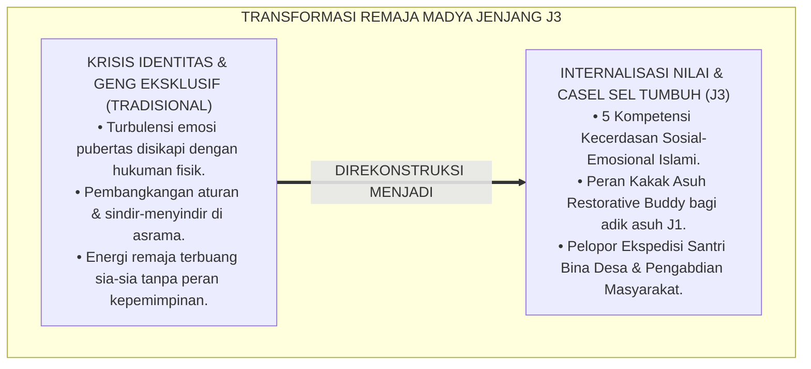
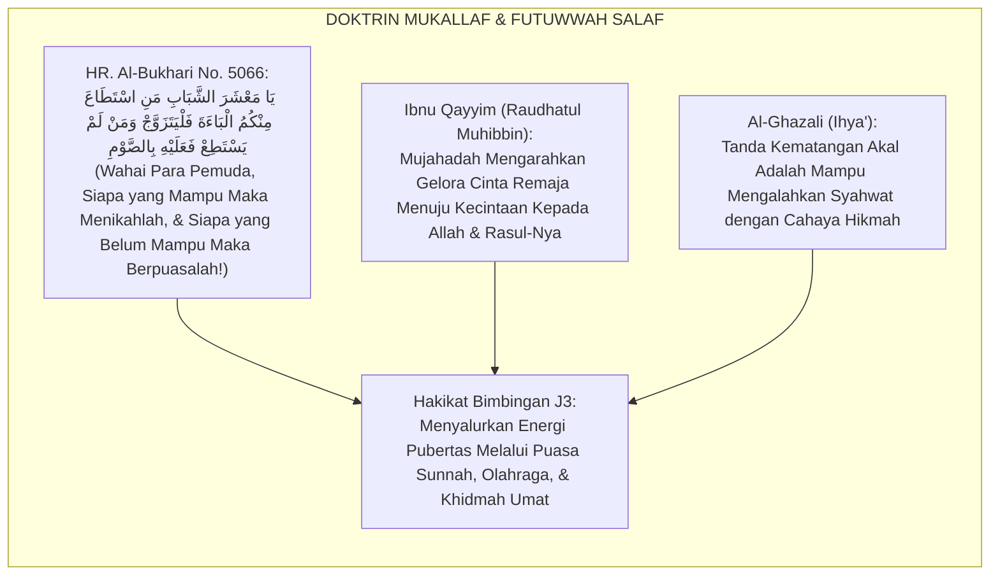
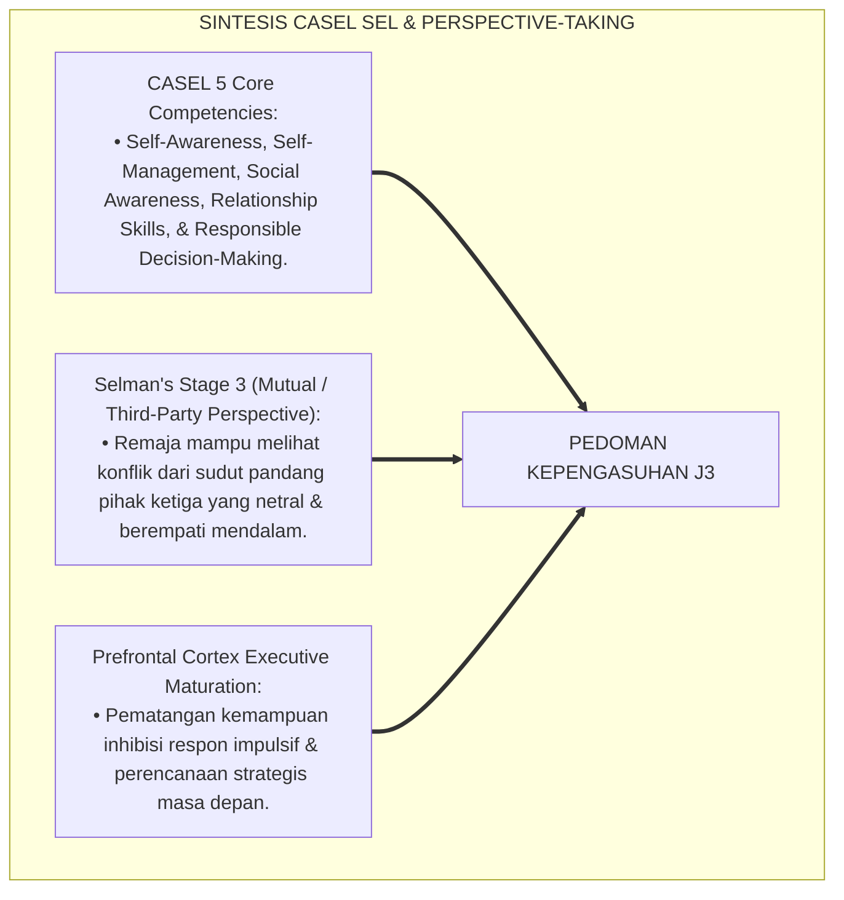
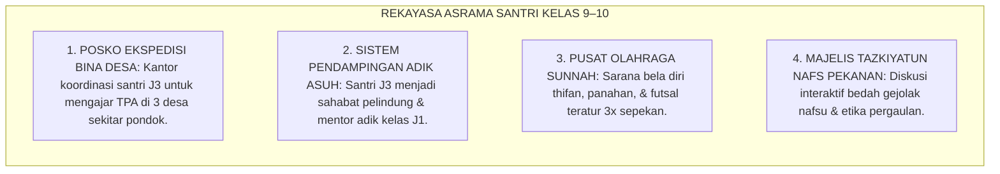
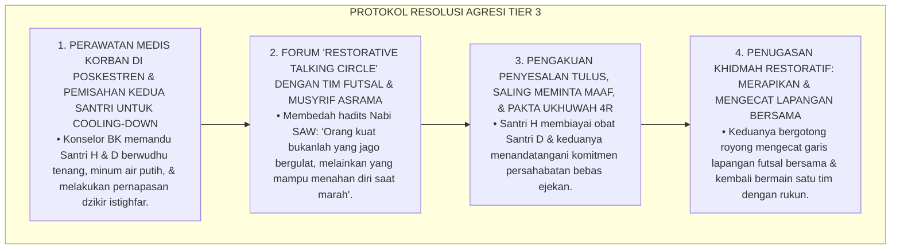
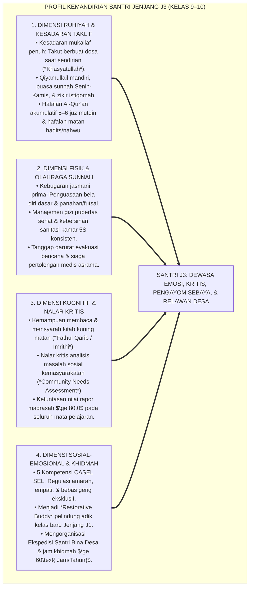
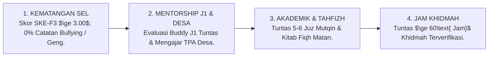
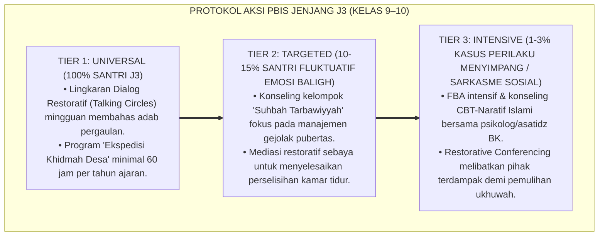

# P4-02-03: DETAIL JENJANG J3 — INTERNALISASI NILAI DAN SOCIAL-EMOTIONAL LEARNING (SEL)
## *Monograf Riset Akademik: Karakteristik Perkembangan Santri Kelas 9–10 (Usia 15–16 Tahun), Standar Capaian Kematangan Nalar Kritis & Regulasi Emosi Pubertas, Integrasi Fiqh Marahil at-Taklif dengan CASEL 5 Core Competencies & Social Perspective-Taking (Selman), Ekspedisi Bina Desa Binaan, Serta Matriks Indikator Kenaikan Jenjang di Ekosistem Pesantren Berbasis TUMBUH*

**Nomor Identifikasi**: `P4-02-03/MONOGRAF-RISET-JENJANG-J3-INTERNALISASI-SEL/2026`  
**Domain**: `04 Progression Framework` > `02 Development Levels` (Sub-Modul 03: *Level J3: Value Internalization & SEL*)  
**Klasifikasi Naskah**: *Academic Research Monograph* (Monograf Penelitian Karakteristik Jenjang J3, Social-Emotional Learning Islam, & Evaluasi Kematangan Remaja Madya)  
**Rumpun Disiplin Pengkaji**: Psikologi Perkembangan Remaja Madya, CASEL Social-Emotional Learning, Fiqh Buluqh wa Mukallaf, Evaluasi Pengabdian Masyarakat  

---

> ### 💡 INTISARI EKSEKUTIF (EXECUTIVE SUMMARY)
>
> * **Karakteristik Kritis Santri Jenjang J3 (Kelas 9–10, Usia 15–16 Tahun):**  
>   Santri Jenjang J3 memasuki fase remaja madya (*Middle Adolescence*) yang ditandai dengan tercapainya kematangan biologis baligh (*Buluqh*) dan permulaan tanggung jawab hukum syariat (*Taklīf*). Ciri dominan santri J3 adalah: dorongan pencarian identitas diri yang kuat, kepekaan terhadap status sosial dan penerimaan kawan sebaya (*Peer Group Belonging*), nalar kritis yang mulai mempertanyakan alasan di balik aturan, serta energi emosional dan fisik yang sangat melimpah.
> * **Integrasi Fiqh Marahil at-Taklif & CASEL Social-Emotional Learning:**  
>   Ekosistem TUMBUH memadukan doktrin akuntabilitas moral syar'i (*Mas'ūliyyatut Taklīf*) dengan 5 Kompetensi Inti CASEL SEL. Santri J3 dibina agar tidak terjebak dalam pembentukan geng eksklusif (*Cliques*) atau perundungan terselubung, melainkan diarahkan menyalurkan energinya menjadi **kakak asuh pelindung (*Restorative Buddy*) bagi adik kelas J1** dan **penggerak program pengabdian (*Ekspedisi Santri Bina Desa*)**.
> * **Standar Kompetensi & Ambang Batas Kenaikan Jenjang J3:**  
>   Monograf ini merumuskan profil ketercapaian Jenjang J3: kedewasaan regulasi emosi (*Skor SKE-F3 $\ge 3.00$*), hafalan Al-Qur'an akumulatif 5–6 juz mutqin, penguasaan nahwu-shorof aplikatif qira'ah kitab kuning, dan menuntaskan minimal 60 jam khidmah kemasyarakatan per tahun.

---

## 📑 DAFTAR ISI MONOGRAF

- [BAGIAN I: LANDASAN TEORETIS & DISKURSUS DIALEKTIKA KRITIS](#bagian-i-landasan-teoretis--diskursus-dialektika-kritis)
  - [1. Latar Belakang Masalah: Bahaya Krisis Identitas Remaja Madya & Jebakan Fanatisme Geng Asrama](#1-latar-belakang-masalah-bahaya-krisis-identitas-remaja-madya--jebakan-fanatisme-geng-asrama)
  - [2. Eksegesis Turats: Doktrin Kesadaran Mukallaf, Hifzhul Farj, & Adab Mujahadatun Nafs Remaja](#2-eksegesis-turats-doktrin-kesadaran-mukallaf-hifzhul-farj--adab-mujahadatun-nafs-remaja)
  - [3. Konvergensi Sains Perkembangan: CASEL Social-Emotional Learning Framework & Selman's Perspective-Taking](#3-konvergensi-sains-perkembangan-casel-social-emotional-learning-framework--selmans-perspective-taking)
  - [4. Rekayasa Lingkungan 24 Jam Asrama Jenjang J3: Menyalurkan Energi Remaja Menuju Pengabdian Masyarakat](#4-rekayasa-lingkungan-24-jam-asrama-jenjang-j3-menyalurkan-energi-remaja-menuju-pengabdian-masyarakat)
  - [5. Kasuistika Lapangan Klinis & Protokol Pendampingan Santri J3 yang Terlibat Perselisihan Adu Fisik Akibat Saling Ejek di Lapangan Futsal](#5-kasuistika-lapangan-klinis--protokol-pendampingan-santri-j3-yang-terlibat-perselisihan-adu-fisik-akibat-saling-ejek-di-lapangan-futsal)
- [BAGIAN II: FORMULASI KONSEPTUAL & PEMBAHASAN MENDALAM](#bagian-ii-formulasi-konseptual--pembahasan-mendalam)
  - [1. Arsitektur Komprehensif Profil Kemandirian & Karakter Jenjang J3 (Kelas 9–10)](#1-arsitektur-komprehensif-profil-kemandirian--karakter-jenjang-j3-kelas-910)
  - [2. Dekomposisi Capaian Empat Ranah Perkembangan Jenjang J3: Ruhiyah, Fisik, Kognitif, & Sosial-Emosional](#2-dekomposisi-capaian-empat-ranah-perkembangan-jenjang-j3-ruhiyah-fisik-kognitif--sosial-emosional)
  - [3. Standar Kriteria Kenaikan Jenjang (Gateway Transition J3 ke J4)](#3-standar-kriteria-kenaikan-jenjang-gateway-transition-j3-ke-j4)
  - [4. Diskusi Akademis & Implikasi bagi Tata Kelola Pembinaan Remaja Sebaya di Pesantren](#4-diskusi-akademis--implikasi-bagi-tata-kelola-pembinaan-remaja-sebaya-di-pesantren)
- [BAGIAN III: KESIMPULAN & APARATUS AKADEMIS](#bagian-iii-kesimpulan--aparatus-akademis)
  - [1. Tabel Sintesis Detail Jenjang J3 (Internalisasi Nilai & SEL)](#1-tabel-sintesis-detail-jenjang-j3-internalisasi-nilai--sel)
  - [2. Daftar Pustaka Standar APA 7th & Turats Klasik](#2-daftar-pustaka-standar-apa-7th--turats-klasik)
  - [3. Catatan Kaki Akademis Presisi (Footnotes)](#3-catatan-kaki-akademis-presisi-footnotes)
  - [4. Glosarium Istilah Ilmiah & Jenjang J3 Pesantren](#4-glosarium-istilah-ilmiah--jenjang-j3-pesantren)

---

# BAGIAN I: LANDASAN TEORETIS & DISKURSUS DIALEKTIKA KRITIS

---

### 1. Latar Belakang Masalah: Bahaya Krisis Identitas Remaja Madya & Jebakan Fanatisme Geng Asrama

Dalam dinamika psikososial santri kelas 9–10 (usia 15–16 tahun), kerap timbul **tiga kerentanan kepengasuhan (*Adolescent Care Vulnerabilities*)**:[^1]

1. **Jebakan Krisis Identitas & Pembangkangan Otoritas (*Identity Crisis & Defiance*)**: Santri mulai mempertanyakan aturan pondok yang dianggap mengekang kebebasannya, memicu sikap sinis terhadap guru dan musyrif jika tidak dibimbing dengan dialog logis yang empatik.
2. **Pembentukan Geng Eksklusif & Perundungan Halus (*Covert Bullying & Relational Aggression*)**: Santri membentuk klik-klik sosial berdasarkan daerah atau minat, lalu mengucilkan atau menyindir santri lain yang dianggap berbeda (*Ostracism*).
3. **Ketiadaan Saluran Kematangan Sosial yang Menantang**: Santri masih diperlakukan seperti anak kecil yang hanya disuruh menghafal tanpa diberi kepercayaan memimpin adik kelas atau mengabdi ke masyarakat.[^2]

Model riset **TUMBUH** merancang **Desain Kepengasuhan Jenjang J3** yang berfokus pada internalisasi nilai-nilai akhlak batiniah (*Value Internalization*), penguasaan 5 Kompetensi CASEL SEL, dan pemberian peran kepemimpinan sosial nyata.

---

### 2. Eksegesis Turats: Doktrin Kesadaran Mukallaf, Hifzhul Farj, & Adab Mujahadatun Nafs Remaja

Khazanah Turats Islam meletakkan usia baligh sebagai permulaan penempaan jiwa ksatria (*Al-Futuwwah*) yang mampu menundukkan pandangan (*Ghadhdhul Bashar*), menjaga kesucian diri (*Hifzhul Farj*), dan mengendalikan amarah (*Idaratul Ghadhab*).

#### 📖 1. Hadits Riwayat Abdullah bin Mas'ud RA tentang Bimbingan Remaja
Rasulullah SAW bersabda memberikan arahan preventif bagi para pemuda:

$$\text{يَا مَعْشَرَ الشَّبَابِ، مَنِ اسْتَطَاعَ مِنْكُمُ الْبَاءَةَ فَلْيَتَزَوَّجْ؛ فَإِنَّهُ أَغَضُّ لِلْبَصَرِ وَأَحْصَنُ لِلْفَرْجِ، وَمَنْ لَمْ يَسْتَطِعْ فَعَلَيْهِ بِالصَّوْمِ فَإِنَّهُ لَهُ وِجَاءٌ}$$

*"**Wahai sekalian para pemuda! Barangsiapa di antara kalian yang telah memiliki kemampuan, maka hendaklah ia menikah**, karena sesungguhnya menikah itu lebih menundukkan pandangan dan lebih menjaga kemaluan; **dan barangsiapa yang belum mampu, maka hendaklah ia berpuasa (sunnah), karena sesungguhnya puasa itu menjadi benteng perisai (*Wijā'*) baginya dari gejolak syahwat!**"* (HR. Al-Bukhari No. 5066 & Muslim No. 1400).[^3]

---

### 3. Konvergensi Sains Perkembangan: CASEL Social-Emotional Learning Framework & Selman's Perspective-Taking

Pendekatan Jenjang J3 memadukan kerangka CASEL SEL dan teori pengambilan perspektif sosial Robert Selman:

---

### 4. Rekayasa Lingkungan 24 Jam Asrama Jenjang J3: Menyalurkan Energi Remaja Menuju Pengabdian Masyarakat

Asrama santri kelas 9–10 dirancang menopang kedewasaan sosial dan tanggung jawab moral:

---

### 5. Kasuistika Lapangan Klinis & Protokol Pendampingan Santri J3 yang Terlibat Perselisihan Adu Fisik Akibat Saling Ejek di Lapangan Futsal

#### Studi Kasus Lapangan: Santri J3 Terlibat Baku Hantam di Lapangan Futsal Karena Tersinggung Ejekan Nama Orang Tua
* **Konteks Masalah**: Saat pertandingan futsal sore, Santri H (15 tahun) dan Santri D (15 tahun) saling mengejek dengan mencatut nama orang tua (*Parental Mockery*). Karena tersulut amarah yang tak terkendali, Santri H memukul wajah Santri D hingga mimisan dan suasana lapangan menjadi ricuh (*Physical Aggression & Emotional Hijacking*).
* **Analisis Diagnostik**: Santri mengalami pembajakan amigdala (*Amygdala Hijacking*) dan defisit keterampilan *Self-Management* dalam mengendalikan kemarahan spontan.
* **Protokol Resolusi Restoratif & Mediasi Ishlahul Bain TUMBUH**:

Intervensi de-eskalasi amarah dan keadilan restoratif (*Restorative Justice Conference*) ini berhasil menyembuhkan luka sosial dan menanamkan keterampilan manajemen emosi yang matang.[^4]

---

# BAGIAN II: FORMULASI KONSEPTUAL & PEMBAHASAN MENDALAM

---

### 1. Arsitektur Komprehensif Profil Kemandirian & Karakter Jenjang J3 (Kelas 9–10)

Ekosistem TUMBUH menetapkan profil utuh santri Jenjang J3:

---

### 2. Dekomposisi Capaian Empat Ranah Perkembangan Jenjang J3: Ruhiyah, Fisik, Kognitif, & Sosial-Emosional

| Ranah Perkembangan | Target Capaian Spesifik Santri J3 | Metode Pembiasaan Lapangan | Standar Evaluasi Terverifikasi |
| :--- | :--- | :--- | :--- |
| **1. Ranah Ruhiyah** | Kesadaran taklif, qiyamullail mandiri, puasa sunnah, hafalan 5–6 juz mutqin. | Halaqah tazkiyah malam & majelis tahfizh mutqin harian. | Ujian Munaqasyah Tahfizh Juz & Skor Ibadah Mandiri. |
| **2. Ranah Fisik** | Kebugaran bela diri/olahraga sunnah, sanitasi kamar 5S, tanggap darurat P3K. | Latihan bela diri mingguan & simulasi evakuasi medis Poskestren. | Lulus Uji Kebugaran Fisik Jasmani Pesantren. |
| **3. Ranah Kognitif** | Qira'ah kitab kuning matan fiqh/nahwu, nalar kritis studi kasus sosial. | Diskusi Bahtsul Masail santri & investigasi problem desa. | Nilai Rapor Madrasah $\ge 80.0$ seluruh mapel. |
| **4. Ranah Sosial** | 5 Kompetensi CASEL SEL, Restorative Buddy J1, Ekspedisi Santri Bina Desa. | Program mentoring adik asuh J1 & pengajaran TPA desa binaan. | Skor Form SKE-F3 $\ge 3.00$ & Jam Khidmah $\ge 60\text{ Jam}$. |

---

### 3. Standar Kriteria Kenaikan Jenjang (Gateway Transition J3 ke J4)

Untuk dinyatakan layak naik dari **Jenjang J3 (Kelas 9–10)** menuju **Jenjang J4 (Kelas 11–12 / Leadership)**, santri wajib memenuhi kriteria Gateway berikut:

---

### 4. Diskusi Akademis & Implikasi bagi Tata Kelola Pembinaan Remaja Sebaya di Pesantren

Penerapan standarisasi Jenjang J3 menghasilkan lompatan peradaban:

1. **Transformasi Energi Remaja Menjadi Kekuatan Pengabdian**: Mencegah kenakalan remaja dengan cara menyalurkan energi fisik dan emosinya ke dalam karya pengabdian masyarakat nyata.
2. **Terputusnya Rantai Bullying Antar-Angkatan**: Santri J3 yang dibina sebagai kakak asuh pelindung (*Restorative Buddy*) menjadi benteng pengaman bagi adik kelas J1 dari kekerasan.
3. **Pematangan Nalar Kritis yang Berakhlak**: Melahirkan santri yang cerdas berfikir, matang secara emosi, dan siap memegang tampuk kepemimpinan organisasi santri (J4).[^5]

---

---

### 3. Pembedahan Deskriptif Komprehensif Karakteristik Jenjang J3 (Internalisasi Nilai & SEL)

Jenjang J3 (Kelas 9–10 / Usia 15–16 Tahun) berfokus pada kematangan sosio-emosional dan peran sosial:

#### A. Dimensi Kesadaran Mukallaf: Integrasi Syariat dan Identitas Diri
Santri J3 memahami konsekuensi taklif syariat secara utuh pasca-baligh. Ibadah dijalankan sebagai ekspresi penghambaan tulus, zikir menjadi benteng dari gejolak syahwat, dan akhlak ditegakkan di ruang ramai maupun sunyi.

#### B. Dimensi Kecerdasan Sosio-Emosional (CASEL SEL): Empati & Manajemen Amarah
Santri J3 dilatih mengendalikan impulsivitas amarah (*Anger Sublimation*), berkomunikasi asertif saat terjadi silang pendapat antarteman, dan memiliki kepekaan sosial mendalam terhadap penderitaan sesama.

#### C. Dimensi Pengabdian: Kakak Asuh (Restorative Buddy) & Dakwah Desa
Santri J3 mempraktikkan ilmu secara nyata dengan menjadi pendamping santri baru J1 dan mengajar Al-Qur'an bagi anak-anak di TPA desa binaan sekitar pesantren.

---

### 4. Protokol Aksi Operasional PBIS Multi-Tier Jenjang J3

---

# BAGIAN III: KESIMPULAN & APARATUS AKADEMIS

---

### 1. Tabel Sintesis Detail Jenjang J3 (Internalisasi Nilai & SEL)

| Dimensi Parameter | Pola Konvensional Remaja Madya | Standarisasi Jenjang J3 TUMBUH | Landasan Rujukan Primer | Bukti Capaian |
| :--- | :--- | :--- | :--- | :--- |
| **1. Pengelolaan Emosi** | Ditekan / meledak dalam perkelahian. | *Idaratul Ghadhab & 5 Kompetensi CASEL SEL*. | *CASEL SEL Framework* (2020) | Skor Form SKE-F3 $\ge 3.00$. |
| **2. Dinamika Kelompok** | Membentuk geng daerah eksklusif. | Brigade Khidmah & Ukhuwah Lintas Suku. | *Selman's Perspective-Taking* | 0% Kasus Rivalitas Geng Asrama. |
| **3. Peran Pengasuhan** | Senior yang ditakuti junior. | *Restorative Buddy* Pelindung Adik Asuh J1. | Hadits *Unshur Akhaka Mazhluman* | Laporan Evaluasi Pendampingan J1 Tuntas. |
| **4. Capaian Khidmah** | Pasif di dalam pondok. | Ekspedisi Mengajar TPA Desa Binaan ($\ge 60\text{ Jam}$). | Fiqh *Mas'uliyyatut Taklif* | Logbook Jam Khidmah Desa Terverifikasi. |

---

### 2. Daftar Pustaka Standar APA 7th & Turats Klasik

1. **Al-Bukhari, Abu Abdillah Muhammad bin Ismail.** (2002). *Shahih Al-Bukhari*. Riyadh: Bait Al-Afkar Ad-Dauliyyah.
2. **Al-Ghazali, Hujjatul Islam Abu Hamid Muhammad bin Muhammad.** (2018). *Ihya' 'Ulumiddin: Kitab Riyadhah an-Nafs*. Beirut: Dar Al-Kutub Al-'Ilmiyyah.
3. **CASEL.** (2020). *CASEL's SEL Framework: What Are the Core Competence Areas and Where Are They Promoted?* Chicago: Collaborative for Academic, Social, and Emotional Learning.
4. **Ibnu Qayyim Al-Jauziyyah, Syamsuddin Muhammad.** (2003). *Raudhatul Muhibbin wa Nuzhatul Musytaqin*. Beirut: Darul Kutub Al-'Ilmiyyah.
5. **Muslim bin Al-Hajjaj An-Naisaburi.** (2006). *Shahih Muslim*. Riyadh: Dar Thayyibah.
6. **Nelsen, J.** (2006). *Positive Discipline*. New York: Ballantine Books.
7. **Selman, R. L.** (1980). *The Growth of Interpersonal Understanding: Developmental and Clinical Analyses*. New York: Academic Press.
8. **Steinberg, L.** (2008). *A social neuroscience perspective on adolescent risk-taking*. *Developmental Review*, 28(1), 78-106.
9. **Sugai, G., & Horner, R. H.** (2020). *School-Wide Positive Behavioral Interventions and Supports*. *Journal of Positive Behavior Interventions*, 22(4), 203-211.
10. **Zehr, H.** (2015). *The Little Book of Restorative Justice*. New York: Good Books.

---

### 3. Catatan Kaki Akademis Presisi (Footnotes)

[^1]: Kerentanan psikososial remaja madya dan pembentukan klik kelompok di lingkungan sekolah berasrama, Steinberg (2008, hlm. 84).  
[^2]: Pembahasan pentingnya Social-Emotional Learning dalam mengalihkan agresi remaja menjadi kepemimpinan prososial, CASEL (2020, hlm. 6).  
[^3]: HR. Al-Bukhari dalam *Shahih Al-Bukhari* (No. 5066), Kitab *An-Nikah*.  
[^4]: Protokol penanganan de-eskalasi amarah dan keadilan restoratif kasus agresi fisik lapangan futsal TUMBUH (2026).  
[^5]: Dampak kelembagaan penerapan standarisasi kepengasuhan Jenjang J3 TUMBUH Pesantren (2026).  

---

### 4. Glosarium Istilah Ilmiah & Jenjang J3 Pesantren

1. **Jenjang J3 (Kelas 9–10)**: Tingkat perkembangan remaja madya santri usia 15–16 tahun yang berfokus pada internalisasi nilai, kematangan sosial-emosional, dan kepemimpinan desa binaan.
2. **Mas'ūliyyatut Taklīf (مَسْؤُولِيَّةُ التَّكْلِيفِ)**: Tanggung jawab moral dan hukum syariat penuh yang dibebankan kepada seorang muslim setelah memasuki usia baligh dan berakal sehat.
3. **Form SKE-F3**: Instrumen asesmen psikometri untuk mengukur 5 dimensi kecerdasan sosial-emosional Islami (CASEL SEL) santri jenjang J3.
4. **Amygdala Hijacking**: Kondisi psikologis di mana pusat emosi otak (amigdala) merespon secara impulsif dan agresif sebelum korteks prefrontal sempat berpikir rasional.
5. **Ghadhdhul Bashar (غَضُّ الْبَصَرِ)**: Ajaran Islam mengenai menundukkan pandangan dari hal-hal yang diharamkan demi menjaga kesucian hati dan kejernihan pikiran.
6. **Ekspedisi Santri Bina Desa**: Program pengabdian masyarakat berkala di mana santri J3 terjun langsung mengajar TPA gratis dan kerja bakti membersihkan sarana desa.
7. **Mutual Perspective-Taking**: Kemampuan kognisi sosial tingkat lanjut di mana remaja mampu memahami perselisihan dari sudut pandang dirinya, orang lain, dan pengamat netral.
8. **Gateway J3 Transition**: Standar ambang batas kelulusan (hafalan 5–6 juz mutqin, SKE $\ge 3.00$, 60 jam khidmah) untuk naik ke jenjang kepemimpinan organisasi santri (J4).
9. **Khasyatullah fil Ghaib (خَشْيَةُ اللَّهِ فِي الْغَيْبِ)**: Rasa takut dan cinta kepada Allah yang tertanam dalam jiwa sehingga tetap taat beribadah sekalipun sedang sendirian tanpa pengawas.
10. **Restorative Buddy Guardian**: Peran kehormatan santri J3 sebagai kakak asuh pelindung adik kelas J1 demi menjamin pesantren steril 100% dari perundungan.
