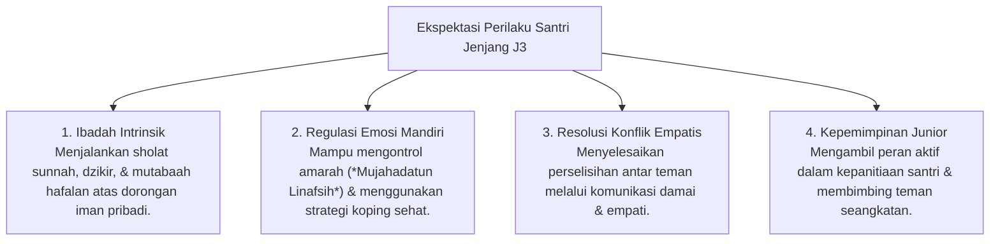

# P4-02-03: Modul Operasional Jenjang J3 (Internalisasi Nilai & SEL)

## Status Dokumen
* **Status**: 🌟 **A+ (Tervalidasi & Siap Diimplementasikan)**
* **Sub-Domain**: `04 Progression Framework / 02 Development Levels`
* **Penanggung Jawab Keilmuan**: Dewan Keilmuan TUMBUH (*Pakar Bimbingan Konseling & Pakar Psikologi Sosial Santri*)

---

## 1. Spesifikasi Operasional Jenjang J3

* **Fokus Utama**: Internalisasi Nilai Moral, Regulasi Emosi Mandiri, CASEL SEL, & Ukhuwah Islamiyah.
* **Tingkat Scaffolding Decay**: **20% Scaffolding** (Coaching Emosional & Fasilitasi Diskusi Musyrif).
* **Target Durasi Normal**: Tahun ke-2 hingga Akhir Tahun ke-3.

---

## 2. Ekspektasi Perilaku & Indikator Capaian Jenjang J3

---

## 3. SOP Emotional Coaching Musyrif (20% Scaffolding)

1. **Reflective Dialogues**: Musyrif mengadakan sesi dialog reflektif dua mingguan untuk mendiskusikan perkembangan spiritual, target hafalan, dan tantangan pribadi santri.
2. **Conflict Mediation Facilitation**: Musyrif bertindak sebagai fasilitator netral saat santri mengalami perselisihan, mendorong kedua pihak merumuskan solusi restoratif (*Repair Agreement*).
3. **Inisiatif Kepemimpinan Kelompok**: Memberikan kepercayaan penuh kepada santri T3 untuk merancang kegiatan ekstrakurikuler atau halaqah belajar mandiri.

---

## 4. Indikator Internalisasi Nilai (Internalization Criteria)

Santri T3 dinyatakan berhasil menginternalisasi nilai apabila:
- Perilaku adab dan ibadah tetap konsisten dilakukan meskipun musyrif sedang tidak berada di tempat (*Authentic Characterization*).
- Menunjukkan kepedulian aktif (*Empathetic Action*) terhadap kawan yang sedang sakit, sedih, atau mengalami hambatan akademik.
