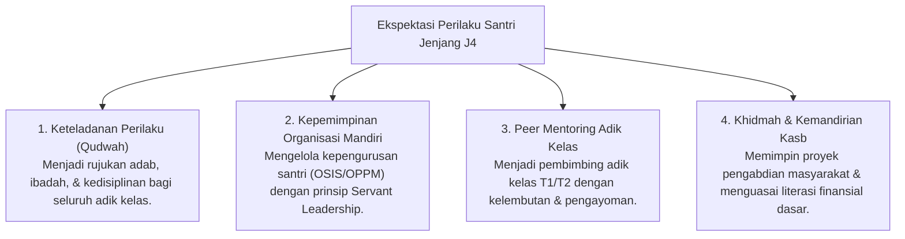

# P4-02-04: Modul Operasional Jenjang J4 (Kemandirian & Kepemimpinan Qudwah)

## Status Dokumen
* **Status**: 🌟 **A+ (Tervalidasi & Siap Diimplementasikan)**
* **Sub-Domain**: `04 Progression Framework / 02 Development Levels`
* **Penanggung Jawab Keilmuan**: Dewan Keilmuan TUMBUH (*Pakar Tata Kelola Qudwah & Pakar Desain Kurikulum Adab*)

---

## 1. Spesifikasi Operasional Jenjang J4

* **Fokus Utama**: Keteladanan Utuh (*Qudwah Hasanah*), Servant Leadership, Khidmah Keumatan, & Kemandirian Post-Pesantren (*Qadirun 'Alal Kasb*).
* **Tingkat Scaffolding Decay**: **Bimbingan Kolaboratif (0–10%)** (Kemitraan, Penasihat Strategis, & Mentoring).
* **Target Durasi Normal**: Tahun ke-3 hingga Kelulusan.

---

## 2. Ekspektasi Perilaku & Indikator Capaian Jenjang J4

---

## 3. SOP Pendampingan Kolaboratif Musyrif (0–10% Scaffolding)

1. **Strategic Advisory Meetings**: Musyrif mengadakan rapat konsultasi berkala dengan pengurus santri T4 untuk mengevaluasi program kerja organisasi santri.
2. **One-on-One Mentoring & Life Planning**: Diskusi mendalam mengenai pemilihan perguruan tinggi, masa depan karir, dan persiapan mental transisi pasca-pesantren.
3. **Pemberdayaan Badal Ustadz/Musyrif**: Santri T4 diberikan kepercayaan menjadi *Badal* (asisten) mengajar Al-Qur'an/Bahasa Arab bagi kelas junior di bawah supervisi ustadz.

---

## 4. Evaluasi Keteladanan Qudwah & Penghargaan Paripurna

- **Asesmen 360-Derajat**: Penilaian keteladanan T4 melibatkan masukan objektif dari musyrif, ustadz, serta umpan balik anonim dari santri adik kelas.
- **Pemberian Pin Qudwah Santri**: Santri T4 yang secara konsisten menjadi contoh kebaikan dianugerahi *Pin Keteladanan Qudwah TUMBUH* dalam majlis kelulusan.
