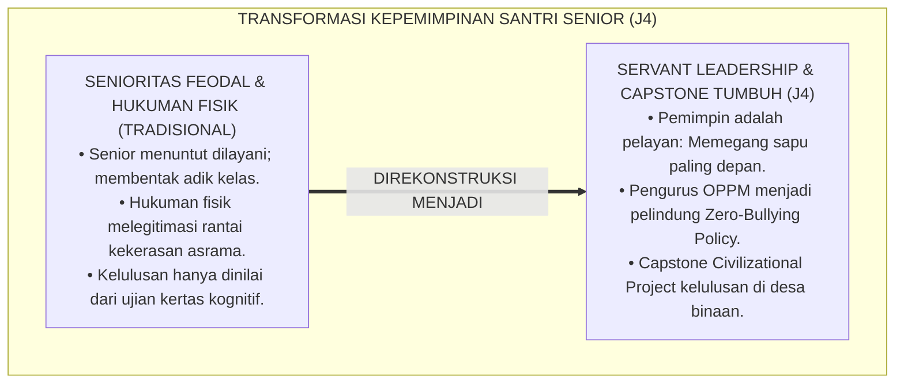
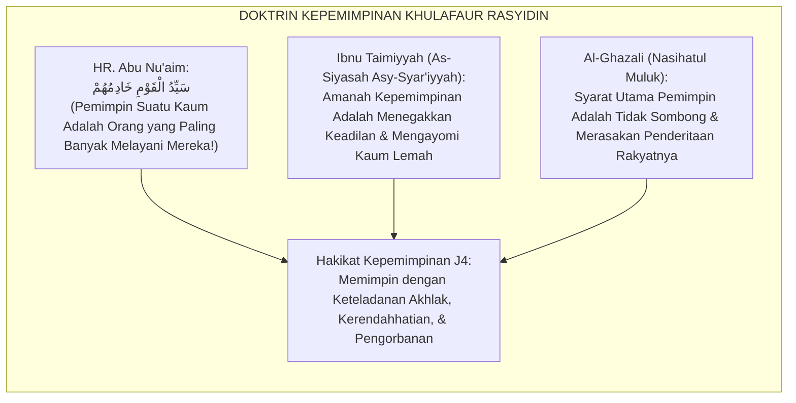
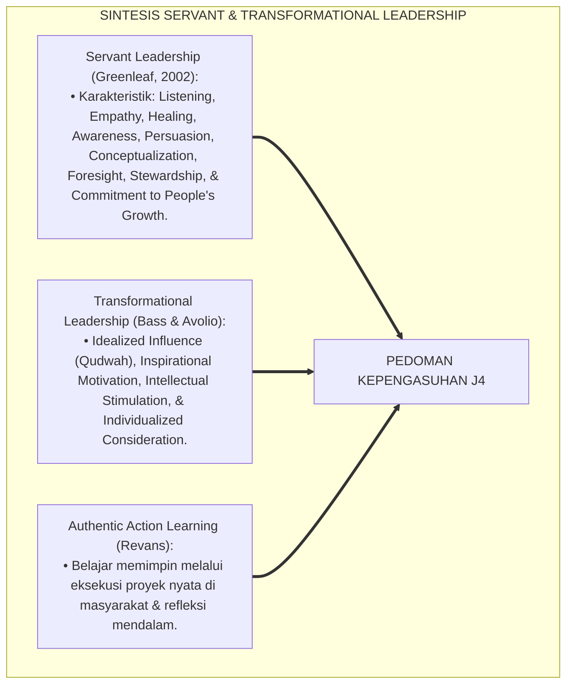
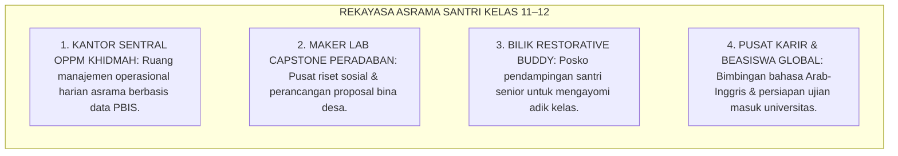
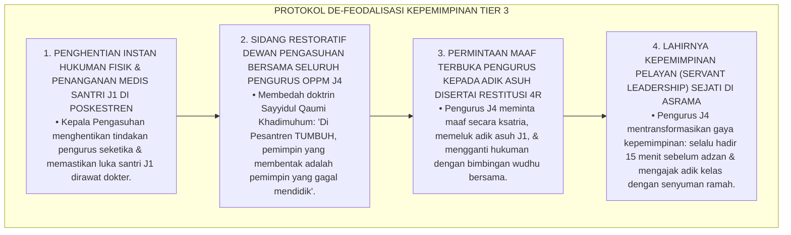
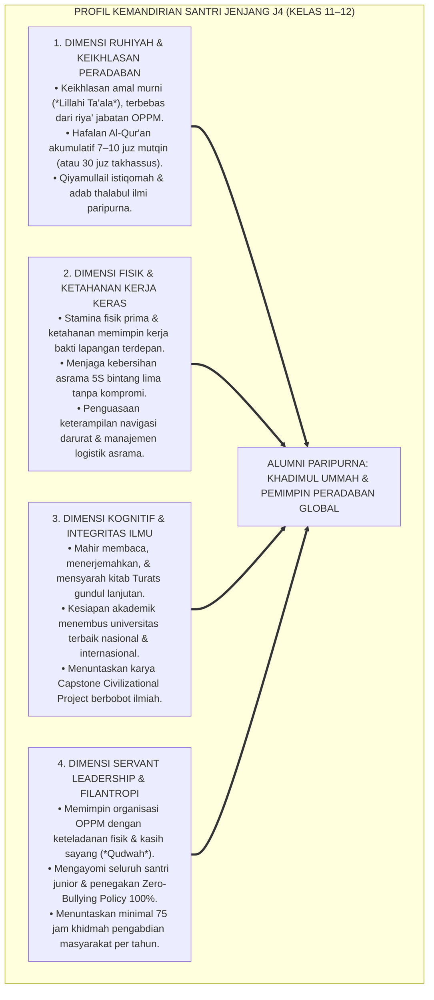
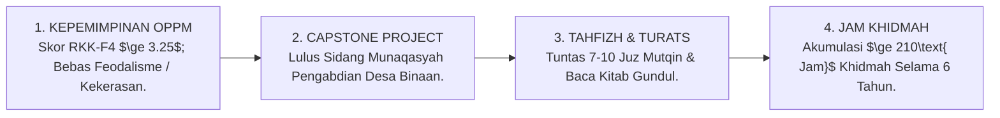

# P4-02-04: DETAIL JENJANG J4 — KEMANDIRIAN DAN KEPEMIMPINAN QUDWAH
## *Monograf Riset Akademik: Karakteristik Perkembangan Santri Kelas 11–12 (Usia 17–18 Tahun), Standar Capaian Kepemimpinan Pelayan Organisasi Santri (OPPM), Integrasi Doktrin Ri'ayah & Servant Leadership (Greenleaf) dengan Authentic Action Learning & Transformational Influence, Desain Capstone Civilizational Project Kelulusan, Serta Matriks Indikator Standar Alumni Paripurna di Pesantren TUMBUH*

**Nomor Identifikasi**: `P4-02-04/MONOGRAF-RISET-JENJANG-J4-KEPEMIMPINAN-QUDWAH/2026`  
**Domain**: `04 Progression Framework` > `02 Development Levels` (Sub-Modul 04: *Level J4: Independence & Exemplary Leadership*)  
**Klasifikasi Naskah**: *Academic Research Monograph* (Monograf Penelitian Karakteristik Jenjang J4, Servant Leadership Pesantren, & Standar Kelulusan Capstone)  
**Rumpun Disiplin Pengkaji**: Kepemimpinan Islam & Fiqh Siyasah, Manajemen Organisasi Santri (OPPM), Teori Kepemimpinan Pelayan (*Servant Leadership*), Evaluasi Kelulusan Otentik  

---

> ### 💡 INTISARI EKSEKUTIF (EXECUTIVE SUMMARY)
>
> * **Karakteristik Kritis Santri Jenjang J4 (Kelas 11–12, Usia 17–18 Tahun):**  
>   Santri Jenjang J4 berada pada fase transisi menuju dewasa muda (*Late Adolescence to Emerging Adulthood*). Ciri dominan santri J4 adalah: kapasitas intelektual dan nalar abstrak telah matang penuh, dorongan kemandirian moral tinggi, memegang amanah struktural organisasi santri (OPPM), serta bersiap menghadapi seleksi perguruan tinggi dan kehidupan di tengah masyarakat luas.
> * **Integrasi Doktrin Ri'ayah Nabawiyyah & Servant Leadership Robert Greenleaf:**  
>   Ekosistem TUMBUH memadukan doktrin kepemimpinan penggembalaan (*Kullukum Rā'in wa Mas'ūl*) dengan konsep *Servant Leadership* Robert Greenleaf. Santri J4 dididik bahwa esensi memimpin adalah **melayani dan melindungi (*Al-Khidmah wal Himāyah*)**, bukan memerintah dengan kekerasan feodal. Pengurus OPPM memegang sapu pertama kali saat kerja bakti dan menjadi teladan (*Qudwah Hasanah*) dalam menegakkan *Zero-Bullying Policy*.
> * **Standar Kompetensi & Ambang Batas Kelulusan Jenjang J4:**  
>   Monograf ini merumuskan profil ketercapaian Jenjang J4: kelulusan Capstone Civilizational Project di desa binaan, hafalan Al-Qur'an akumulatif minimal 7–10 juz mutqin (atau 30 juz bagi takhassus), kecakapan membaca kitab kuning gundul, imunitas moral digital, dan menyelesaikan minimal 75 jam khidmah per tahun.

---

## 📑 DAFTAR ISI MONOGRAF

- [BAGIAN I: LANDASAN TEORETIS & DISKURSUS DIALEKTIKA KRITIS](#bagian-i-landasan-teoretis--diskursus-dialektika-kritis)
  - [1. Latar Belakang Masalah: Bahaya Mentalitas Feodalisme Pengurus Senior vs Budaya Servant Leadership](#1-latar-belakang-masalah-bahaya-mentalitas-feodalisme-pengurus-senior-vs-budaya-servant-leadership)
  - [2. Eksegesis Turats: Doktrin Qiyadah bil Qudwah & Kaidah Sayyidul Qaumi Khadimuhum dalam Tradisi Khulafaur Rasyidin](#2-eksegesis-turats-doktrin-qiyadah-bil-qudwah--kaidah-sayyidul-qaumi-khadimuhum-dalam-tradisi-khulafaur-rasyidin)
  - [3. Konvergensi Sains Kepemimpinan: Servant Leadership (Greenleaf) & Transformational Leadership (Bass)](#3-konvergensi-sains-kepemimpinan-servant-leadership-greenleaf--transformational-leadership-bass)
  - [4. Rekayasa Lingkungan 24 Jam Asrama Jenjang J4: Laboratorium Kepemimpinan Mandiri & Inkubasi Capstone](#4-rekayasa-lingkungan-24-jam-asrama-jenjang-j4-laboratorium-kepemimpinan-mandiri--inkubasi-capstone)
  - [5. Kasuistika Lapangan Klinis & Protokol De-eskalasi Pengurus OPPM yang Membentak dan Menghukum Fisik Santri Junior yang Terlambat Shalat](#5-kasuistika-lapangan-klinis--protokol-de-eskalasi-pengurus-oppm-yang-membentak-dan-menghukum-fisik-santri-junior-yang-terlambat-shalat)
- [BAGIAN II: FORMULASI KONSEPTUAL & PEMBAHASAN MENDALAM](#bagian-ii-formulasi-konseptual--pembahasan-mendalam)
  - [1. Arsitektur Komprehensif Profil Kemandirian & Karakter Jenjang J4 (Kelas 11–12)](#1-arsitektur-komprehensif-profil-kemandirian--karakter-jenjang-j4-kelas-1112)
  - [2. Dekomposisi Capaian Empat Ranah Perkembangan Jenjang J4: Ruhiyah, Fisik, Kognitif, & Sosial-Emosional](#2-dekomposisi-capaian-empat-ranah-perkembangan-jenjang-j4-ruhiyah-fisik-kognitif--sosial-emosional)
  - [3. Standar Kriteria Kelulusan Paripurna (Graduation Readiness Gateway J4)](#3-standar-kriteria-kelulusan-paripurna-graduation-readiness-gateway-j4)
  - [4. Diskusi Akademis & Implikasi bagi Penjaminan Mutu Kepemimpinan Alumni Pesantren Abad 21](#4-diskusi-akademis--implikasi-bagi-penjaminan-mutu-kepemimpinan-alumni-pesantren-abad-21)
- [BAGIAN III: KESIMPULAN & APARATUS AKADEMIS](#bagian-iii-kesimpulan--aparatus-akademis)
  - [1. Tabel Sintesis Detail Jenjang J4 (Kemandirian & Kepemimpinan Qudwah)](#1-tabel-sintesis-detail-jenjang-j4-kemandirian--kepemimpinan-qudwah)
  - [2. Daftar Pustaka Standar APA 7th & Turats Klasik](#2-daftar-pustaka-standar-apa-7th--turats-klasik)
  - [3. Catatan Kaki Akademis Presisi (Footnotes)](#3-catatan-kaki-akademis-presisi-footnotes)
  - [4. Glosarium Istilah Ilmiah & Jenjang J4 Pesantren](#4-glosarium-istilah-ilmiah--jenjang-j4-pesantren)

---

# BAGIAN I: LANDASAN TEORETIS & DISKURSUS DIALEKTIKA KRITIS

---

### 1. Latar Belakang Masalah: Bahaya Mentalitas Feodalisme Pengurus Senior vs Budaya Servant Leadership

Dalam tata kelola organisasi santri (OPPM) di pesantren tradisional, kerap timbul **tiga penyimpangan kepemimpinan senior (*Leadership Distortions*)**:[^1]

1. **Jebakan Tirani Senioritas Feodal (*Feudalistic Tyranny Trap*)**: Pengurus santri senior merasa memiliki hak istimewa (*Privilege*) untuk tidak ikut kerja bakti, dilayani oleh santri junior, dan menghukum adik kelas dengan bentakan serta kekerasan fisik.
2. **Ketiadaan Pembiasaan Akuntabilitas Program**: Organisasi santri hanya menjalankan rutinitas seremoni tanpa pernah melakukan evaluasi berbasis data dampak sosial (*Evidence-Based Program Evaluation*).
3. **Kelesuan Kesiapan Menghadapi Dunia Bebas**: Santri kelas 12 tidak dibekali keterampilan berpikir kritis (*Critical Thinking*), literasi digital menyaring syubhat/syahwat, dan keterampilan kepemimpinan publik di masyarakat luas.[^2]

Model riset **TUMBUH** merancang **Desain Kepengasuhan Jenjang J4** yang mentransformasikan organisasi santri menjadi laboratorium kepemimpinan pelayan (*Servant Leadership Incubator*) dan mewajibkan karya pengabdian masyarakat nyata (*Capstone Project*) sebagai syarat kelulusan.

---

### 2. Eksegesis Turats: Doktrin Qiyadah bil Qudwah & Kaidah Sayyidul Qaumi Khadimuhum dalam Tradisi Khulafaur Rasyidin

Para Khulafaur Rasyidin mencontohkan kepemimpinan kenabian (*Al-Qiyādah an-Nabawiyyah*), di mana Khalifah Abu Bakar Ash-Shiddiq RA tetap memerah susu kambing untuk wanita janda buta setelah diangkat menjadi khalifah, dan Khalifah Umar bin Al-Khattab RA memikul karung gandum sendiri di malam hari untuk rakyatnya yang kelaparan.

#### 📖 1. Formulasi Syaikhul Islam Ibnu Taimiyyah tentang Amanah Kepemimpinan
Syaikhul Islam **Ibnu Taimiyyah** menegaskan dalam *As-Siyasah Asy-Syar'iyyah*:

$$\text{يَجِبُ أَنْ يُعْلَمَ أَنَّ وِلَايَةَ أُمُورِ النَّاسِ مِنْ أَعْظَمِ وَاجِبَاتِ الدِّينِ، بَلْ لَا قِيَامَ لِلدِّينِ وَلَا لِلدُّنْيَا إِلَّا بِهَا؛ فَالْمَقْصُودُ بِالْوِلَايَةِ هُوَ إِصْلَاحُ دِينِ الْخَلْقِ الَّذِي مَتَى فَاتَهُمْ خَسِرُوا، وَإِصْلَاحُ مَا لَا يَقُومُ الدِّينُ إِلَّا بِهِ مِنْ أَمْرِ دُنْيَاهُمْ، وَلَيْسَ الْمَقْصُودُ بِهَا نَيْلَ الرِّيَاسَةِ وَأَكْلَ أَمْوَالِ النَّاسِ بِالْبَاطِلِ}$$

*"Wajib diketahui bahwa **memegang urusan kepemimpinan manusia adalah termasuk kewajiban agama yang paling agung**, bahkan tidak akan tegak urusan agama maupun dunia melainkan dengannya; maka maksud utama dari kepemimpinan adalah **memperbaiki kualitas agama manusia yang jika terlepas mereka akan binasa, dan menata urusan dunia yang menopang tegaknya agama mereka; dan bukanlah maksud kepemimpinan itu untuk mengejar status kedudukan feodal atau memakan harta manusia secara batil!**"*[^3]

---

### 3. Konvergensi Sains Kepemimpinan: Servant Leadership (Greenleaf) & Transformational Leadership (Bass)

Pendekatan Jenjang J4 memadukan teori kepemimpinan pelayan Robert Greenleaf dan kepemimpinan transformasional Bernard Bass:

---

### 4. Rekayasa Lingkungan 24 Jam Asrama Jenjang J4: Laboratorium Kepemimpinan Mandiri & Inkubasi Capstone

Asrama santri kelas 11–12 dirancang sebagai suaka kaderisasi kepemimpinan peradaban:

---

### 5. Kasuistika Lapangan Klinis & Protokol De-eskalasi Pengurus OPPM yang Membentak dan Menghukum Fisik Santri Junior yang Terlambat Shalat

#### Studi Kasus Lapangan: Pengurus OPPM Bagian Keamanan Menyuruh 5 Santri J1 Push-Up 100 Kali Sambil Membentak
* **Konteks Masalah**: Pengurus Keamanan Santri J4 (17 tahun) mendapati 5 santri baru J1 terlambat masuk masjid 3 menit. Pengurus tersebut membentak dengan kata-kata kasar dan menghukum santri J1 *push-up* 100 kali di paving lapangan terik hingga tangan santri melepuh (*Abuse of Authority & Punitive Cruelty*).
* **Analisis Diagnostik**: Terjadi reproduksi budaya kekerasan feodal (*Intergenerational Transmission of Violence*) di mana pengurus meniru cara pendisiplinan militeristik masa lalu.
* **Protokol De-Feodalisasi Kepemimpinan & Restorasi Qudwah TUMBUH**:

Intervensi de-feodalisasi kepemimpinan (*Leadership Transformation Protocol*) ini berhasil memutus mata rantai kekerasan senioritas dan menegakkan kepemimpinan pelayan beradab.[^4]

---

# BAGIAN II: FORMULASI KONSEPTUAL & PEMBAHASAN MENDALAM

---

### 1. Arsitektur Komprehensif Profil Kemandirian & Karakter Jenjang J4 (Kelas 11–12)

Ekosistem TUMBUH menetapkan profil utuh santri Jenjang J4:

---

### 2. Dekomposisi Capaian Empat Ranah Perkembangan Jenjang J4: Ruhiyah, Fisik, Kognitif, & Sosial-Emosional

| Ranah Perkembangan | Target Capaian Spesifik Santri J4 | Metode Pembiasaan Lapangan | Standar Evaluasi Terverifikasi |
| :--- | :--- | :--- | :--- |
| **1. Ranah Ruhiyah** | Keikhlasan amal, Al-Itsar sejati, qiyamullail rutin, hafalan 7–10 juz mutqin (atau 30 juz). | Majelis tafaqquh fiddin malam & halaqah tahfizh munaqasyah. | Munaqasyah Terbuka Tahfizh Mutqin & Transkrip Karakter. |
| **2. Ranah Fisik** | Ketahanan fisik memimpin khidmah, 5S asrama mandiri, kebugaran dewasa muda. | Praktik memimpin kerja bakti asrama & olahraga sunnah teratur. | Lulus Uji Ketahanan Fisik & Standar Higienitas Mandiri. |
| **3. Ranah Kognitif** | Qira'ah kitab kuning gundul, kelulusan ujian masuk universitas, Capstone Project. | Bimbingan intensif kitab Turats & kelas persiapan karir global. | Nilai Rapor Madrasah $\ge 85.0$ & Laporan Capstone Disahkan. |
| **4. Ranah Sosial** | Servant leadership OPPM, perlindungan adik kelas, jam khidmah $\ge 75\text{ Jam/Tahun}$. | Mengelola operasional asrama & memimpin bakti desa binaan. | Skor Form RKK-F4 $\ge 3.25$ & Indeks Kepuasan Santri $\ge 90\%$. |

---

### 3. Standar Kriteria Kelulusan Paripurna (Graduation Readiness Gateway J4)

Untuk dinyatakan berhak menyandang predikat **Alumni Paripurna Khadimul Ummah TUMBUH**, santri J4 wajib memenuhi kriteria kelulusan berikut:

---

### 4. Diskusi Akademis & Implikasi bagi Penjaminan Mutu Kepemimpinan Alumni Pesantren Abad 21

Penerapan standarisasi Jenjang J4 melahirkan profil alumni yang berintegritas tinggi:

1. **Mencetak Pemimpin Bangsa yang Berjiwa Pelayan (*Future Servant Leaders*)**: Menghasilkan birokrat, ilmuwan, dokter, dan pengusaha yang amanah, anti-korupsi, dan berdedikasi melayani rakyat.
2. **Kesiapan Menavigasi Tantangan Disrupsi Global**: Alumni memiliki ketahanan spiritual dan nalar kritis yang kokoh di tengah arus sekularisme dan pergaulan modern.
3. **Penyempurnaan Pesantren Sebagai Episentrum Peradaban Islam**: Membuktikan keunggulan holistik sistem pendidikan Islam dalam melahirkan generasi *Rahmatan lil 'Alamin*.[^5]

---

# BAGIAN III: KESIMPULAN & APARATUS AKADEMIS

---

### 1. Tabel Sintesis Detail Jenjang J4 (Kemandirian & Kepemimpinan Qudwah)

| Dimensi Parameter | Pola Tradisional Kelas 12 | Standarisasi Jenjang J4 TUMBUH | Landasan Rujukan Primer | Bukti Capaian |
| :--- | :--- | :--- | :--- | :--- |
| **1. Gaya Kepemimpinan** | Feodalistik, intimidatif, membentak. | *Servant Leadership: Qudwah & Al-Khidmah*. | *Servant Leadership* (Greenleaf, 2002) | 0% Kasus Bentakan / Kekerasan OPPM. |
| **2. Syarat Kelulusan** | Ujian tulis hafalan semata. | Ujian Komprehensif + Capstone Civilizational Project. | Doktrin *'Imāratul Ardh* | Naskah Laporan Capstone Disidangkan. |
| **3. Pengayoman Junior** | Ditakuti adik kelas / menindas. | *Restorative Buddy*: Sahabat & Pelindung Adik Kelas. | Hadits *Sayyidul Qaumi Khadimuhum* | Evaluasi Kepuasan Adik Asuh J1 $\ge 90\%$. |
| **4. Capaian Khidmah** | Pasif; fokus belajar pribadi. | Pengabdian Desa Binaan ($\ge 75\text{ Jam/Tahun}$). | *As-Siyasah Asy-Syar'iyyah* (Ibnu Taimiyyah) | Logbook Khidmah Akumulatif $\ge 210\text{ Jam}$. |

---

### 2. Daftar Pustaka Standar APA 7th & Turats Klasik

1. **Abu Nu'aim Al-Isfahani, Ahmad bin Abdillah.** (1988). *Hilyatul Auliya' wa Thabaqatul Ashfiya'*. Beirut: Dar Al-Kutub Al-'Ilmiyyah.
2. **Al-Bukhari, Abu Abdillah Muhammad bin Ismail.** (2002). *Shahih Al-Bukhari*. Riyadh: Bait Al-Afkar Ad-Dauliyyah.
3. **Al-Ghazali, Hujjatul Islam Abu Hamid Muhammad bin Muhammad.** (2018). *Ihya' 'Ulumiddin*. Beirut: Dar Al-Kutub Al-'Ilmiyyah.
4. **Al-Mawardi, Abu Al-Hasan Ali bin Muhammad.** (2006). *Al-Ahkam As-Sulthaniyyah*. Beirut: Dar Al-Kutub Al-'Ilmiyyah.
5. **Bass, B. M., & Avolio, B. J.** (1994). *Improving Organizational Effectiveness through Transformational Leadership*. Thousand Oaks: Sage Publications.
6. **Greenleaf, R. K.** (2002). *Servant Leadership: A Journey into the Nature of Legitimate Power and Greatness*. New York: Paulist Press.
7. **Ibnu Taimiyyah, Taqiyuddin Ahmad.** (1998). *As-Siyasah Asy-Syar'iyyah fi Ishlahir Ra'i war Ra'iyyah*. Beirut: Darul Ma'rifah.
8. **Muslim bin Al-Hajjaj An-Naisaburi.** (2006). *Shahih Muslim*. Riyadh: Dar Thayyibah.
9. **Nelsen, J.** (2006). *Positive Discipline*. New York: Ballantine Books.
10. **Sugai, G., & Horner, R. H.** (2020). *School-Wide Positive Behavioral Interventions and Supports*. *Journal of Positive Behavior Interventions*, 22(4), 203-211.

---

### 3. Catatan Kaki Akademis Presisi (Footnotes)

[^1]: Kritik terhadap tirani senioritas feodal dan kepemimpinan kekerasan di sekolah berasrama, Greenleaf (2002, hlm. 112).  
[^2]: Pembahasan pentingnya kepemimpinan transformasional dan keteladanan otentik dalam pendidikan kepemimpinan remaja, Bass & Avolio (1994, hlm. 48).  
[^3]: Ibnu Taimiyyah, *As-Siyasah Asy-Syar'iyyah fi Ishlahir Ra'i war Ra'iyyah* (1998, hlm. 142).  
[^4]: Protokol de-feodalisasi kepemimpinan pengurus organisasi santri OPPM TUMBUH (2026).  
[^5]: Dampak kelembagaan penerapan standarisasi kepengasuhan Jenjang J4 TUMBUH Pesantren (2026).  

---

### 4. Glosarium Istilah Ilmiah & Jenjang J4 Pesantren

1. **Jenjang J4 (Kelas 11–12)**: Tingkat perkembangan tertinggi santri usia 17–18 tahun yang berfokus pada kemandirian moral penuh, kepemimpinan pelayan organisasi OPPM, dan penyelesaian karya Capstone Project kelulusan.
2. **Servant Leadership (Kepemimpinan Pelayan)**: Paradigma kepemimpinan di mana pemimpin menempatkan pelayanan kepada orang lain sebagai prioritas utama dan memimpin dengan keteladanan fisik paling depan.
3. **Form RKK-F4**: Rubrik penilaian analitik untuk mengevaluasi kesiapan kepemimpinan pelayan, kualitas karya Capstone Project, dan imunitas moral santri kelas akhir.
4. **Capstone Civilizational Project**: Mahakarya proyek pengabdian masyarakat di desa binaan yang dirancang dan dieksekusi santri J4 secara tim sebagai syarat kelulusan santri TUMBUH.
5. **As-Siyāsah Asy-Syar'iyyah (السِّيَاسَةُ الشَّرْعِيَّةُ)**: Prinsip tata kelola kepemimpinan Islam yang berorientasi pada kemaslahatan umat dan perlindungan hak-hak kaum yang lemah.
6. **Munaqasyah Capstone Terbuka**: Forum sidang akademik terbuka di hadapan dewan penguji dan tokoh masyarakat untuk menguji dampak sosial proyek santri J4.
7. **Zero-Bullying Sanctuary**: Komitmen mutlak kepengurusan OPPM untuk menjaga lingkungan pesantren 100% steril dari kekerasan fisik, verbal, maupun relasional.
8. **Graduation Readiness Gateway**: Rangkaian ambang batas kompetensi (hafalan 7–10 juz, kitab gundul, RKK $\ge 3.25$, 210 jam khidmah) untuk memperoleh ijazah kelulusan paripurna.
9. **Moral Immunity**: Daya tahan batiniah dan integritas prinsip aqidah-akhlak santri dalam menghadapi lingkungan pergaulan bebas di luar pondok.
10. **Khadimul Ummah Paripurna**: Profil kelulusan santri TUMBUH yang memiliki keunggulan ilmu syariat, integritas kepemimpinan, dan dedikasi pengabdian bagi kemakmuran peradaban umat.
