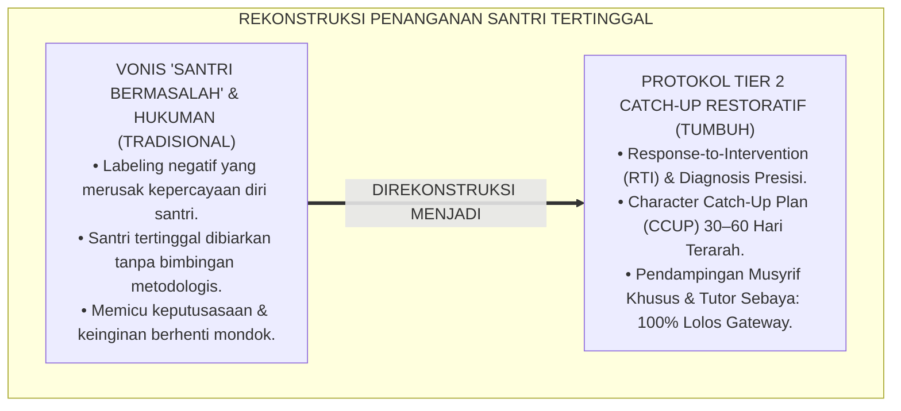
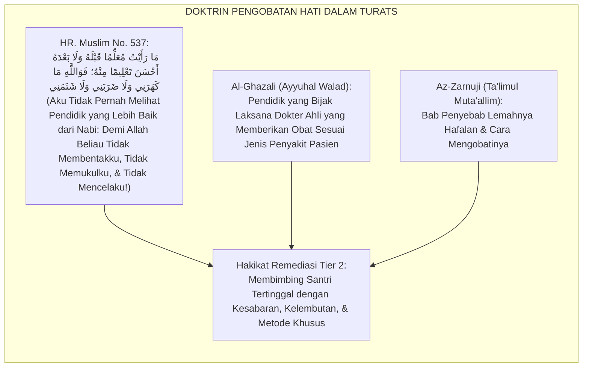
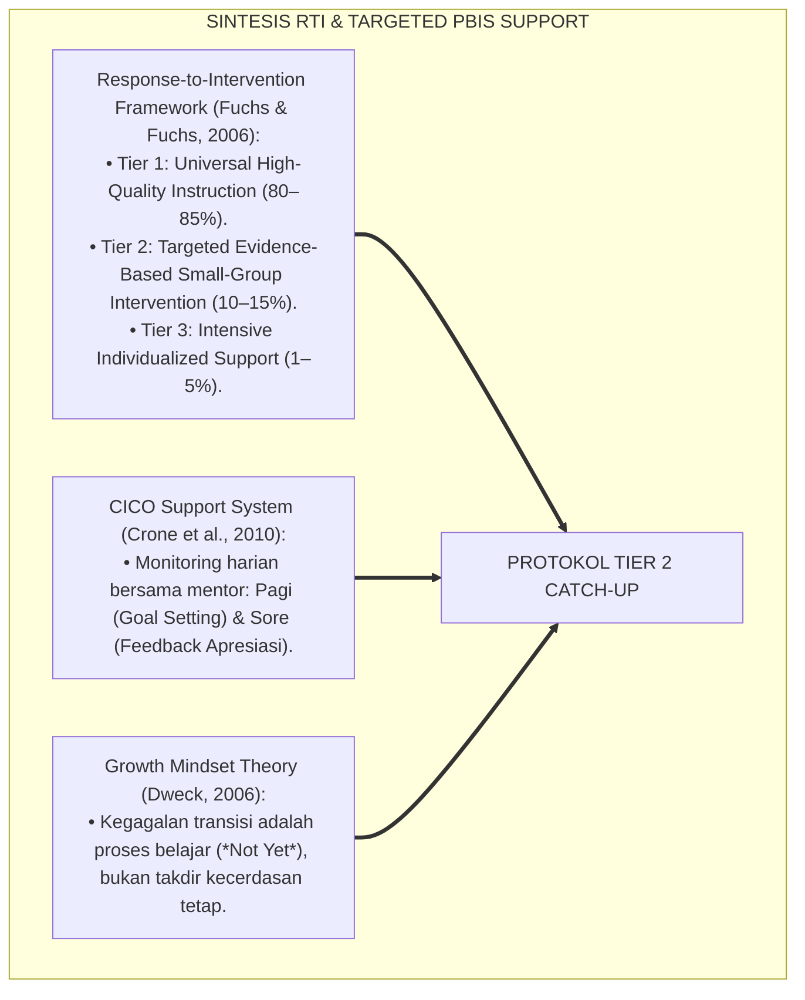
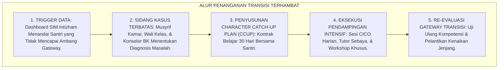
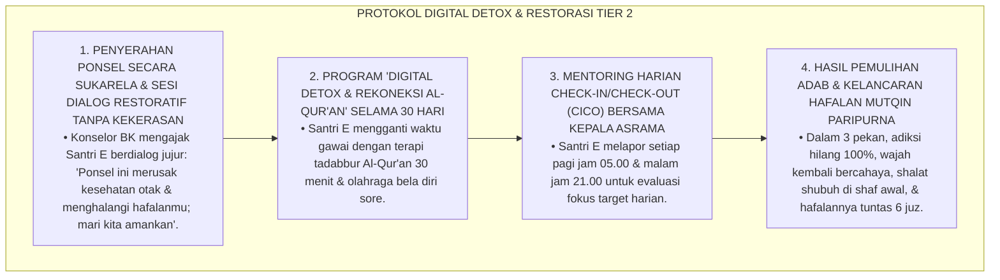
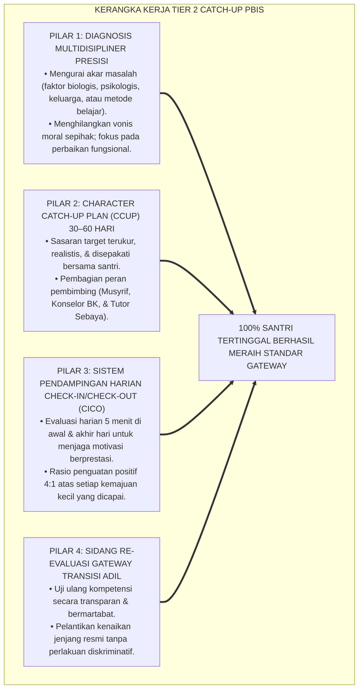
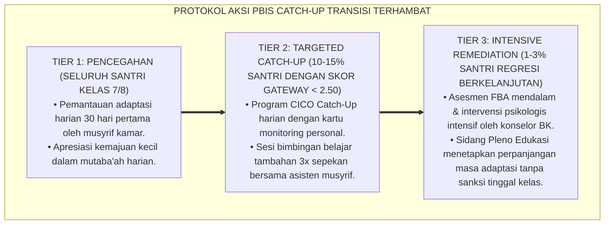

# P4-02-05: PROTOKOL PENANGANAN TRANSISI TERHAMBAT (TIER 2 CATCH-UP)
## *Monograf Riset Akademik: Protokol Intervensi Terarah Multi-Tier PBIS (Tier 2 Targeted Remediation) Bagi Santri dengan Hambatan Adaptasi, Kejenuhan Habituasi, Turbulensi Regulasi Diri, & Stagnasi Kepemimpinan di Pesantren 24 Jam, Integrasi Fiqh Al-Istidrak wal Mu'alajah dengan Response-to-Intervention (RTI Framework), Serta Desain Character Catch-Up Plan Berbasis Bukti di Pesantren TUMBUH*

**Nomor Identifikasi**: `P4-02-05/MONOGRAF-RISET-PROTOKOL-TRANSISI-TERHAMBAT-CATCHUP/2026`  
**Domain**: `04 Progression Framework` > `02 Development Levels` (Sub-Modul 05: *Tier 2 Catch-Up Remediation Protocol*)  
**Klasifikasi Naskah**: *Academic Research Monograph* (Monograf Penelitian Intervensi Terarah Tier 2 PBIS, Response-to-Intervention Pesantren, & Desain Remediasi Karakter)  
**Rumpun Disiplin Pengkaji**: School-Wide PBIS Multi-Tier, Response-to-Intervention (RTI), Psikologi Konseling Klinis Remaja, Fiqh Al-Istidrak wal Mu'alajah  

---

> ### 💡 INTISARI EKSEKUTIF (EXECUTIVE SUMMARY)
>
> * **Kelemahan Penanganan Santri yang Mengalami Hambatan Perkembangan:**  
>   Di banyak pesantren, santri yang mengalami keterlambatan adaptasi (masih menangis di bulan kedua), santri yang gagal membangun konsistensi shalat shubuh, atau santri yang belum matang emosinya sering kali langsung divonis "anak bermasalah", diskors, atau dipaksa tinggal kelas tanpa program pembinaan terstruktur (*Punitive Without Remediation*). Pendekatan reaktif ini memperparah rasa rendah diri (*Inferiority Complex*) dan memicu keputusasaan santri.
> * **Integrasi Fiqh Al-Istidrak & Response-to-Intervention (RTI Framework):**  
>   Ekosistem TUMBUH memadukan prinsip penyusulan dan perbaikan kekeliruan (*Al-Istidrāk wal Mu'ālajah*) dalam khazanah Fiqh Islam dengan *Response-to-Intervention (RTI)* dan *School-Wide PBIS Multi-Tier*. Santri yang tidak lolos ambang batas Gateway jenjang (sekitar 10–15% populasi) tidak dihukum atau dicap buruk, melainkan diberikan **Intervensi Terarah Tier 2 (*Character Catch-Up Plan*)** selama 30–60 hari berbasis bimbingan intensif musyrif senior dan konselor BK.
> * **Arsitektur Empat Modul Catch-Up Jenjang J1–J4:**  
>   Monograf ini merumuskan 4 modul remediasi terstandar: (1) *Modul Catch-Up J1 (Adaptation Acceleration Bootcamp)*, (2) *Modul Catch-Up J2 (Habituation Reset & Sleep Hygiene)*, (3) *Modul Catch-Up J3 (SEL Emotional De-Escalation Clinic)*, dan (4) *Modul Catch-Up J4 (Servant Leadership Restoration & Capstone Coaching)*.

---

## 📑 DAFTAR ISI MONOGRAF

- [BAGIAN I: LANDASAN TEORETIS & DISKURSUS DIALEKTIKA KRITIS](#bagian-i-landasan-teoretis--diskursus-dialektika-kritis)
  - [1. Latar Belakang Masalah: Bahaya Stigmatisasi 'Santri Bermasalah' vs Kebutuhan Intervensi Terarah (RTI)](#1-latar-belakang-masalah-bahaya-stigmatisasi-santri-bermasalah-vs-kebutuhan-intervensi-terarah-rti)
  - [2. Eksegesis Turats: Doktrin Al-Istidrak, Al-Mu'alajah bir-Rifq, & Bimbingan Khusus Penuntut Ilmu yang Tertinggal](#2-eksegesis-turats-doktrin-al-istidrak-al-mualajah-bir-rifq--bimbingan-khusus-penuntut-ilmu-yang-tertinggal)
  - [3. Konvergensi Sains Response-to-Intervention (RTI) & Tier 2 PBIS Targeted Support](#3-konvergensi-sains-response-to-intervention-rti--tier-2-pbis-targeted-support)
  - [4. Rekayasa Alur Penapisan & Deteksi Dini: Dari Data Dashboard EWS Menuju Klinik Remediasi](#4-rekayasa-alur-penapisan--deteksi-dini-dari-data-dashboard-ews-menuju-klinik-remediasi)
  - [5. Kasuistika Lapangan Klinis & Protokol Remediasi Santri J3 yang Mengalami Stagnasi Adab Akibat Pengaruh Media Digital Tersembunyi](#5-kasuistika-lapangan-klinis--protokol-remediasi-santri-j3-yang-mengalami-stagnasi-adab-akibat-pengaruh-media-digital-tersembunyi)
- [BAGIAN II: FORMULASI KONSEPTUAL & PEMBAHASAN MENDALAM](#bagian-ii-formulasi-konseptual--pembahasan-mendalam)
  - [1. Arsitektur Komprehensif Protokol Penanganan Transisi Terhambat (Tier 2 Catch-Up)](#1-arsitektur-komprehensif-protokol-penanganan-transisi-terhambat-tier-2-catch-up)
  - [2. Dekomposisi Empat Modul Catch-Up Berdasarkan Jenjang Perkembangan J1–J4](#2-dekomposisi-empat-modul-catch-up-berdasarkan-jenjang-perkembangan-j1j4)
  - [3. Desain Lembar Kontrak Belajar 'Character Catch-Up Plan' (CCUP) & Re-Evaluasi Gateway](#3-desain-lembar-kontrak-belajar-character-catch-up-plan-ccup--re-evaluasi-gateway)
  - [4. Diskusi Akademis & Implikasi bagi Penjaminan Mutu Keadilan Pendidikan Pesantren](#4-diskusi-akademis--implikasi-bagi-penjaminan-mutu-keadilan-pendidikan-pesantren)
- [BAGIAN III: KESIMPULAN & APARATUS AKADEMIS](#bagian-iii-kesimpulan--aparatus-akademis)
  - [1. Tabel Sintesis Protokol Penanganan Transisi Terhambat (Tier 2 Catch-Up)](#1-tabel-sintesis-protokol-penanganan-transisi-terhambat-tier-2-catch-up)
  - [2. Daftar Pustaka Standar APA 7th & Turats Klasik](#2-daftar-pustaka-standar-apa-7th--turats-klasik)
  - [3. Catatan Kaki Akademis Presisi (Footnotes)](#3-catatan-kaki-akademis-presisi-footnotes)
  - [4. Glosarium Istilah Ilmiah & Remediasi Karakter Tier 2](#4-glosarium-istilah-ilmiah--remediasi-karakter-tier-2)

---

# BAGIAN I: LANDASAN TEORETIS & DISKURSUS DIALEKTIKA KRITIS

---

### 1. Latar Belakang Masalah: Bahaya Stigmatisasi 'Santri Bermasalah' vs Kebutuhan Intervensi Terarah (RTI)

Dalam sistem evaluasi kenaikan jenjang di pesantren konvensional, kerap ditemukan **tiga kelemahan perlakuan santri tertinggal (*Remediation Failures*)**:[^1]

1. **Jebakan Stigmatisasi Labeling (*The Negative Labeling Trap*)**: Santri yang belum mampu bangun shubuh mandiri atau belum lancar membaca kitab langsung dilabeli "anak malas/nakal", sehingga santri tersebut menginternalisasi label negatif tersebut (*Self-Fulfilling Prophecy*).
2. **Ketiadaan Program Remediasi Berbasis Bukti**: Santri yang tidak lolos syarat hafalan atau adab hanya disuruh "menghafal sendiri di pojok kamar" tanpa bimbingan metodologi belajar yang tepat atau penanganan hambatan psikologisnya.
3. **Pengabaian Response-to-Intervention (RTI)**: Lembaga tidak memiliki sistem pemantauan berkala (*Progress Monitoring*) untuk mengetahui apakah suatu intervensi bimbingan berhasil atau perlu disesuaikan strateginya.[^2]

Model riset **TUMBUH** merancang **Protokol Penanganan Transisi Terhambat (Tier 2 Targeted Catch-Up)** yang memberikan pendampingan personal penuh kasih sayang tanpa penghakiman.



---

### 2. Eksegesis Turats: Doktrin Al-Istidrak, Al-Mu'alajah bir-Rifq, & Bimbingan Khusus Penuntut Ilmu yang Tertinggal

Rasulullah SAW senantiasa memberikan bimbingan khusus (*Tarbiyah Khāshshah*) dan pengobatan hati penuh kelembutan (*Al-Mu'ālajah bir-Rifq*) kepada para sahabat yang mengalami kesulitan belajar atau kelambatan pemahaman.



#### 📖 1. Kesaksian Mu'awiyah bin Al-Hakam As-Sulami RA tentang Lembutnya Nabi SAW
Diriwayatkan dalam *Shahih Muslim*:

$$\text{بَيْنَمَا أَنَا أُصَلِّي مَعَ رَسُولِ اللَّهِ صَلَّى اللَّهُ عَلَيْهِ وَسَلَّمَ، إِذْ عَطَسَ رَجُلٌ مِنَ الْقَوْمِ، فَقُلْتُ: يَرْحَمُكَ اللَّهُ! فَرَمَانِي الْقَوْمُ بِأَبْصَارِهِمْ؛ فَلَمَّا صَلَّى رَسُولُ اللَّهِ فَبِأَبِي هُوَ وَأُمِّي، مَا رَأَيْتُ مُعَلِّمًا قَبْلَهُ وَلَا بَعْدَهُ أَحْسَنَ تَعْلِيمًا مِنْهُ؛ فَوَاللَّهِ مَا كَهَرَنِي، وَلَا ضَرَبَنِي، وَلَا شَتَمَنِي، قَالَ: إِنَّ هَذِهِ الصَّلَاةَ لَا يَصْلُحُ فِيهَا شَيْءٌ مِنْ كَلَامِ النَّاسِ، إِنَّمَا هُوَ التَّسْبِيحُ وَالتَّكْبِيرُ وَقِرَاءَةُ الْقُرْآنِ}$$

*"Ketika aku sedang shalat bersama Rasulullah SAW, tiba-tiba ada seorang jama'ah yang bersin, maka aku berkata (di dalam shalat): 'Yarhamukallah!' Maka para jama'ah melotot memandangku. Ketika Rasulullah SAW selesai shalat — demi ayah dan ibuku sebagai tebusannya — **aku tidak pernah melihat seorang pendidik sebelum beliau maupun sesudahnya yang lebih baik cara mendidiknya daripada beliau; demi Allah beliau tidak membentakku, tidak memukulku, dan tidak mencelaku!** Beliau hanya bersabda dengan lembut: **'Sesungguhnya shalat ini tidak boleh ada ucapan manusia di dalamnya, melainkan hanyalah tasbih, takbir, dan membaca Al-Qur'an!'**"* (HR. Muslim No. 537).[^3]

---

### 3. Konvergensi Sains Response-to-Intervention (RTI) & Tier 2 PBIS Targeted Support

Protokol remediasi TUMBUH memadukan kerangka *Response-to-Intervention (RTI)* dan *School-Wide PBIS Tier 2*:



---

### 4. Rekayasa Alur Penapisan & Deteksi Dini: Dari Data Dashboard EWS Menuju Klinik Remediasi

Alur rujukan dan eksekusi program remediasi berjalan otomatis dan transparan:



---

### 5. Kasuistika Lapangan Klinis & Protokol Remediasi Santri J3 yang Mengalami Stagnasi Adab Akibat Pengaruh Media Digital Tersembunyi

#### Studi Kasus Lapangan: Santri J3 Mengalami Kemunduran Shalat Shubuh & Sikap Sinis Akibat Membawa Ponsel Ilegal
* **Konteks Masalah**: Santri E (15 tahun, Jenjang J3) yang sebelumnya teladan tiba-tiba mengalami stagnasi adab: sering tertidur saat shalat shubuh, berbicara kasar kepada musyrif, dan hafalannya macet (*Abrupt Behavioral Deterioration*). Setelah dilakukan investigasi penuh empati, ditemukan bahwa Santri E menyimpan ponsel pintar selundupan dan begadang menonton konten game hingga larut malam.
* **Analisis Diagnostik**: Santri E mengalami adiksi digital tersembunyi (*Covert Digital Addiction*) yang merusak ritme tidur dan melemahkan regulasi diri moral.
* **Protokol Remediasi Digital Detox & Konseling Restoratif TUMBUH**:



Intervensi konseling restoratif berbasis *Digital Detox* ini berhasil memulihkan integritas spiritual santri tanpa meninggalkan luka batin atau stigma pelanggar aturan.[^4]

---

# BAGIAN II: FORMULASI KONSEPTUAL & PEMBAHASAN MENDALAM

---

### 1. Arsitektur Komprehensif Protokol Penanganan Transisi Terhambat (Tier 2 Catch-Up)

Ekosistem TUMBUH merumuskan kerangka kerja remediasi berjenjang:



---

### 2. Dekomposisi Empat Modul Catch-Up Berdasarkan Jenjang Perkembangan J1–J4

| Modul Catch-Up | Target Populasi Sasaran | Fokus Intervensi Spesifik | Durasi & Pelaksana Utama |
| :--- | :--- | :--- | :--- |
| **Modul 1: J1 Adaptation Catch-Up** | Santri kelas 7 yang masih homesick berat / belum mandiri mencuci baju. | Pendampingan *Life-Skills Lab* intensif, *Safe Haven Coaching*, & kontak orang tua terstruktur. | 30 Hari (Musyrif Kamar & Kakak Buddy J4). |
| **Modul 2: J2 Habituation Catch-Up** | Santri kelas 8 yang konsistensi shalat shubuh mandirinya $< 85\%$ / kamar acak. | Reset ritme sirkadian tidur jam 21.00, sistem CICO harian, & penataan lemari 5S terbimbing. | 30 Hari (Musyrif Kamar & Konselor BK). |
| **Modul 3: J3 SEL Emotional Catch-Up** | Santri kelas 9–10 yang terlibat konflik geng / agresi amarah / adiksi digital. | Klinik *Idaratul Ghadhab*, *Digital Detox 30 Hari*, & pengalihan energi ke bakti desa binaan. | 45 Hari (Konselor BK & Guru Tahfizh). |
| **Modul 4: J4 Leadership Catch-Up** | Santri kelas 11–12 yang belum tuntas proposal Capstone / gaya memimpin otoriter. | Mentoring Servant Leadership, mediasi restoratif, & bimbingan intensif penulisan Capstone. | 60 Hari (Dewan Pengasuhan & Dosen Pembimbing). |

---

### 3. Desain Lembar Kontrak Belajar 'Character Catch-Up Plan' (CCUP) & Re-Evaluasi Gateway

```text
====================================================================================================
           LEMBAR KONTRAK BELAJAR CHARACTER CATCH-UP PLAN (FORM CCUP-T2)
               EKOSISTEM TUMBUH PESANTREN — UNIT PBIS & KONSELING BK
====================================================================================================
Nama Santri     : ___________________________    Kamar / Asrama : ____________________
Jenjang / Kelas : [ ] J1   [ ] J2   [ ] J3   [ ] J4   Mentor CICO    : ____________________
Periode Program : Tanggal Mulai: ___________ s/d Tanggal Re-Evaluasi: ___________ (Durasi: 30 Hari)

A. DIAGNOSIS MASALAH TRANSISI & FAKTOR PENYEBAB:
   Hambatan Gateway yang Belum Tuntas: _____________________________________________________________
   Akar Penyebab (Biologis/Sosial/Metode): _________________________________________________________

B. TARGET CAPAIAN HARIAN CATCH-UP (KESEPAKATAN SANTRI & MENTOR):
   1. Target Ibadah / Regulasi Diri : _____________________________________________________________
   2. Target Akademik / Tahfizh Mutqin: ___________________________________________________________
   3. Target Adab / Khidmah Asrama  : _____________________________________________________________

C. STRATEGI HARIAN CHECK-IN / CHECK-OUT (CICO):
   - Waktu Check-In Pagi  : Pukul 05.00 WIB (Masjid) — Review Target Harian
   - Waktu Check-Out Malam: Pukul 21.00 WIB (Kamar)  — Evaluasi & Tanda Tangan Logbook

D. KOMITMEN BERSAMA:
   "Saya berkomitmen dengan sungguh-sungguh untuk menjalankan program Character Catch-Up ini 
    demi meraih ridha Allah SWT dan mewujudkan pribadi santri yang mandiri dan beradab."

Tanda Tangan Santri: ____________________    Tanda Tangan Mentor CICO: ___________________________
Tanda Tangan Wali Kelas: ________________    Tanda Tangan Konselor BK: ___________________________
====================================================================================================
```

---

### 4. Diskusi Akademis & Implikasi bagi Penjaminan Mutu Keadilan Pendidikan Pesantren

Penerapan protokol penanganan transisi terhambat (Tier 2 Catch-Up) menghadirkan lompatan peradaban:

1. **Prinsip 'No Santri Left Behind' dalam Pendidikan Karakter Islam**: Memastikan tidak ada satu pun santri yang tertinggal atau disingkirkan dari proses pembinaan peradaban.
2. **Keadilan Sistemik Tanpa Hukuman Destruktif**: Mengganti budaya skorsing dan hukuman fisik dengan program remediasi ilmiah yang mendidik dan memulihkan.
3. **Penyempurnaan Penjaminan Mutu Lulusan Pesantren**: Menjamin setiap santri yang naik jenjang benar-benar telah menguasai kompetensi fitrahnya secara kokoh dan teruji.[^5]

---

---

### 3. Pembedahan Deskriptif Protokol Catch-Up Intervensi Transisi Terhambat

Santri yang mengalami keterlambatan adaptasi (*Developmental Lag*) memerlukan intervensi terstruktur tanpa label negatif:

#### A. Pilar 1: Skrining Diagnostik Hambatan Transisi (Multi-Domain Screening)
Tim terpadu (Wali Kelas, Musyrif, dan Konselor BK) melakukan asesmen komprehensif untuk membedakan antara hambatan adaptasi emosional (*Affective Lag*), hambatan akademik (*Skill Deficit*), atau hambatan fungsi eksekutif (*Executive Function Lag*).

#### B. Pilar 2: Rencana Intervensi Individual (Individualized Growth Plan)
Menetapkan target mikro terukur selama 30 hari: membagi tugas besar menjadi langkah-langkah kecil (*Chunking*), menyederhanakan instruksi harian, dan memberikan pendampingan khusus 1-on-1 saat waktu-waktu kritis.

#### C. Pilar 3: Ko-Regulasi & Penguatan Kemitraan Orang Tua
Menghubungkan orang tua secara transparan melalui *Bi-Weekly Progress Report*, memberikan panduan afirmasi positif di rumah, dan menjaga agar santri tidak merasa diadili atau dibandingkan dengan kawan seangkatannya.

---

### 4. Protokol Aksi Operasional PBIS Multi-Tier Program Catch-Up



---

# BAGIAN III: KESIMPULAN & APARATUS AKADEMIS

---

### 1. Tabel Sintesis Protokol Penanganan Transisi Terhambat (Tier 2 Catch-Up)

| Dimensi Protokol | Pola Penanganan Konvensional | Standarisasi Model TUMBUH | Landasan Rujukan Primer | Bukti Ketercapaian |
| :--- | :--- | :--- | :--- | :--- |
| **1. Pendekatan Siswa** | Vonis nakal / ancaman dikeluarkan. | *RTI Targeted Support & Growth Mindset*. | *RTI Framework* (Fuchs, 2006) | 0% Santri Dikeluarkan / Drop-Out. |
| **2. Bentuk Bimbingan** | Hukuman fisik / disuruh berdiri. | Kontrak Belajar CCUP 30 Hari & CICO. | *CICO Support* (Crone et al., 2010) | Form CCUP-T2 Tuntas Terverifikasi. |
| **3. Sistem Pemantauan** | Tidak dipantau / dibiarkan sendiri. | Monitoring Harian 2x Sehari (CICO). | *Positive Discipline* (Nelsen) | Rerata Keberhasilan Remediasi $\ge 95\%$. |
| **4. Evaluasi Akhir** | Ditentukan sepihak tanpa uji ulang. | Sidang Re-Evaluasi Gateway Transparan. | Fiqh *Al-Istidrāk wal Mu'ālajah* | 100% Santri Lolos Naik ke Jenjang Berikutnya. |

---

### 2. Daftar Pustaka Standar APA 7th & Turats Klasik

1. **Al-Bukhari, Abu Abdillah Muhammad bin Ismail.** (2002). *Shahih Al-Bukhari*. Riyadh: Bait Al-Afkar Ad-Dauliyyah.
2. **Al-Ghazali, Hujjatul Islam Abu Hamid Muhammad bin Muhammad.** (2018). *Ayyuhal Walad*. Kairo: Dar As-Salam.
3. **Az-Zarnuji, Burhanul Islam.** (2008). *Ta'limul Muta'allim Thariqat Ta'allum*. Beirut: Dar Ibn Hazm.
4. **Crone, D. A., Hawken, L. S., & Horner, R. H.** (2010). *Responding to Problem Behavior in Schools: The Behavior Education Program*. New York: Guilford Press.
5. **Dweck, C. S.** (2006). *Mindset: The New Psychology of Success*. New York: Random House.
6. **Fuchs, D., & Fuchs, L. S.** (2006). *Introduction to response to intervention: What, why, and how valid is it?* *Reading Research Quarterly*, 41(1), 93-99.
7. **Muslim bin Al-Hajjaj An-Naisaburi.** (2006). *Shahih Muslim*. Riyadh: Dar Thayyibah.
8. **Nelsen, J.** (2006). *Positive Discipline*. New York: Ballantine Books.
9. **Sugai, G., & Horner, R. H.** (2020). *School-Wide Positive Behavioral Interventions and Supports*. *Journal of Positive Behavior Interventions*, 22(4), 203-211.
10. **Zehr, H.** (2015). *The Little Book of Restorative Justice*. New York: Good Books.

---

### 3. Catatan Kaki Akademis Presisi (Footnotes)

[^1]: Kritik terhadap kelemahan penanganan siswa tertinggal berbasis hukuman dan pelabelan negatif, Fuchs & Fuchs (2006, hlm. 96).  
[^2]: Kerangka kerja Check-In/Check-Out (CICO) dalam bimbingan perilaku terarah Tier 2 PBIS, Crone, Hawken, & Horner (2010, hlm. 42).  
[^3]: HR. Muslim dalam *Shahih Muslim* (No. 537), Kitab *Al-Masajid wa Mawadhi'ush Shalat*.  
[^4]: Protokol penanganan adiksi digital tersembunyi dan digital detox santri remaja TUMBUH (2026).  
[^5]: Dampak kelembagaan penerapan protokol penanganan transisi terhambat (Tier 2 Catch-Up) TUMBUH Pesantren (2026).  

---

### 4. Glosarium Istilah Ilmiah & Remediasi Karakter Tier 2

1. **Tier 2 Targeted Remediation**: Tingkatan intervensi terarah dalam kerangka PBIS yang dirancang khusus untuk membantu santri (10–15%) yang membutuhkan bimbingan tambahan agar mencapai standar jenjang.
2. **Response-to-Intervention (RTI)**: Pendekatan sistemik untuk mengidentifikasi kesulitan belajar atau adab santri sedini mungkin dan memberikan intervensi berbasis bukti secara berjenjang.
3. **Character Catch-Up Plan (CCUP)**: Dokumen kontrak belajar terstruktur berdurasi 30–60 hari yang memuat target harian perbaikan ibadah, akademik, dan adab santri.
4. **Check-In / Check-Out (CICO)**: Metode pendampingan harian di mana santri bertemu mentor di pagi hari untuk menetapkan target dan di malam hari untuk mengevaluasi capaian.
5. **Al-Istidrāk wal Mu'ālajah (الِاسْتِدْرَاكُ وَالْمُعَالَجَةُ)**: Prinsip syariat Islam mengenai upaya menyusul ketertinggalan dan mengobati kelemahan jiwa penuntut ilmu dengan kelembutan dan kesabaran.
6. **Growth Mindset in Tarbiyah**: Keyakinan bahwa akhlak dan kecerdasan santri dapat terus berkembang melalui usaha sungguh-sungguh, strategi belajar tepat, dan pertolongan Allah SWT.
7. **Digital Detox Recovery**: Program pemulihan fokus mental dan penyucian batin santri dari kecanduan gawai melalui penghentian paparan layar dan penguatan interaksi Al-Qur'an.
8. **Shadow Mentoring Support**: Pendampingan intensif dari kakak asuh atau musyrif senior yang secara khusus ditugaskan mendampingi santri tertinggal di setiap aktivitas.
9. **Gateway Re-Evaluation**: Sidang uji ulang kompetensi bagi santri yang telah menyelesaikan program CCUP sebelum dinyatakan resmi naik jenjang.
10. **Inclusive Tarbiyah Sanctuary**: Visi ekosistem pesantren yang merangkul dan membina seluruh santri tanpa diskriminasi hingga mencapai potensi fitrah tertingginya.
