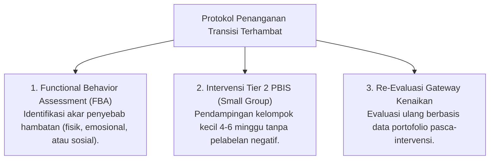

# P4-02-05: Protokol Penanganan Transisi Terhambat (Tier 2 PBIS Catch-Up Protocol)

## Status Dokumen
* **Status**: 🌟 **A+ (Tervalidasi & Siap Diimplementasikan)**
* **Sub-Domain**: `04 Progression Framework / 02 Development Levels`
* **Penanggung Jawab Keilmuan**: Dewan Keilmuan TUMBUH (*Pakar Arsitektur PBIS Restoratif & Pakar Bimbingan Konseling*)

---

## 1. Konseptualisasi Transisi Terhambat

Transisi Terhambat terjadi apabila seorang santri belum memenuhi kriteria *Evidence-Based Gateway* untuk naik dari satu tangga perkembangan ke tangga berikutnya (misal: belum siap naik dari T1 ke T2, atau dari T2 ke T3).

---

## 2. Dilarang Stigmatisasi & Hukum Fisik

Sesuai Aturan Induk `AGENTS.md`:
- Dilarang keras menyebut santri sebagai "santri retas", "anak nakal", atau "santri tidak berguna".
- Hambatan perkembangan dipandang sebagai **Kebutuhan Dukungan Tambahan (*Scaffolding Gap*)**, bukan kegagalan moral santri.

---

## 3. Matriks Intervensi Kelompok Kecil (Tier 2 PBIS Catch-Up)

| Jenis Hambatan | Akar Masalah Utama (FBA) | Program Intervensi Tier 2 PBIS | Durasi & Evaluasi |
| :--- | :--- | :--- | :--- |
| **Homesick Kronis (T1)** | Kecemasan perpisahan & kewalahan emosional. | *Klinik Co-Regulation & Peer Buddy System* (Didampingi santri T3/T4). | 4 Minggu (Evaluasi mingguan BK). |
| **Kedisiplinan Sholat/Kamar (T2)** | Keterampilan manajemen waktu & motivasi eksternal belum terbentuk. | *Small Group Behavioral Check-In/Check-Out (CICO)* bersama Musyrif Senior. | 6 Minggu (Evaluasi Logbook PBIS). |
| **Regulasi Emosi / Konflik (T3)** | Kontrol inhibisi amarah belum matang & *coping mechanism* maladaptif. | *Klinik Restoratif & Social-Emotional Skill Building*. | 6 Minggu (Evaluasi Jurnal Refleksi). |

---

## 4. SOP Re-Evaluasi Gateway Pasca-Intervensi

Setelah menjalani program *Catch-Up* Tier 2 selama 4–6 minggu:
1. Tim BK, Musyrif, dan Guru mengadakan rapat tinjauan ulang data portofolio santri.
2. Apabila santri telah menunjukkan peningkatan konsisten, santri secara resmi dinyatakan **Lulus Transisi Tangga**.
3. Apabila hambatan masih berlanjut, dilakukan rujukan intervensi khusus (*Tier 3 PBIS Individualized Support Plan*) dengan melibatkan konsultasi orang tua.
