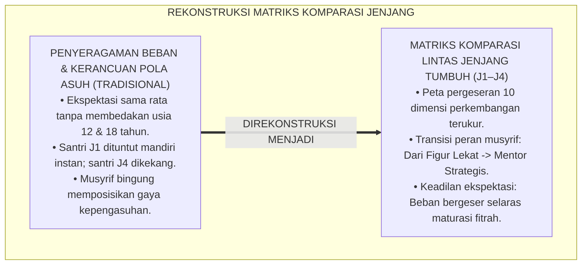
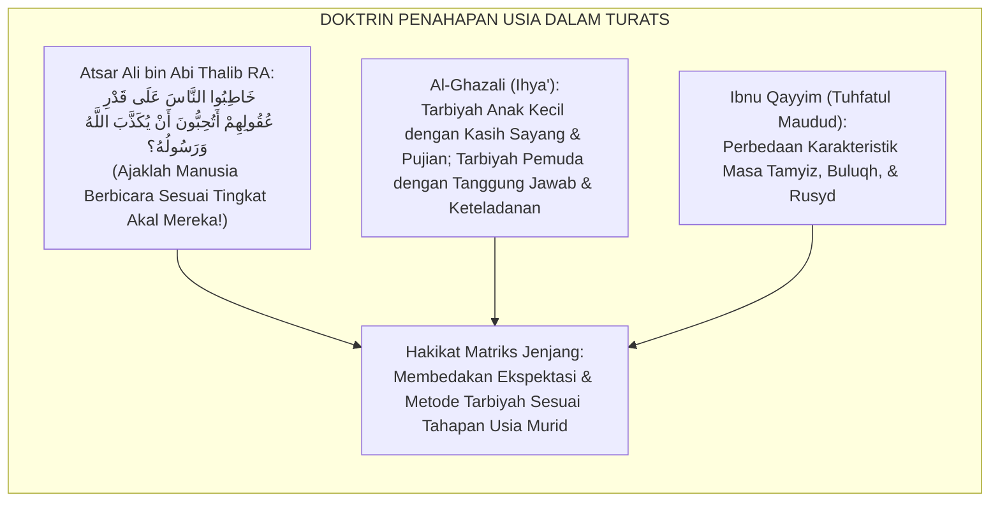
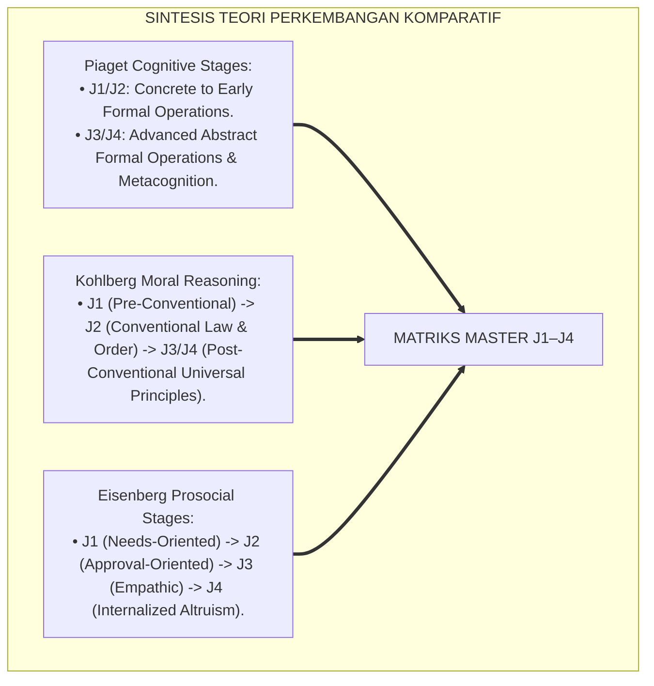
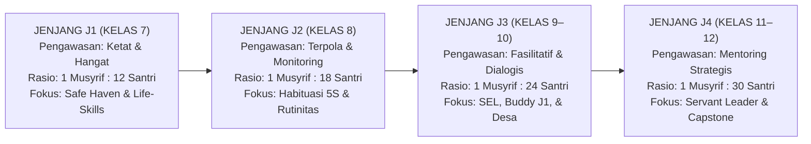
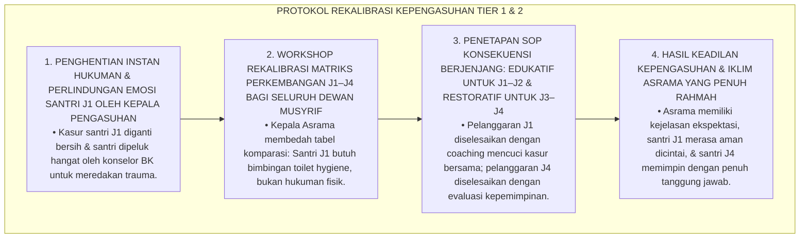
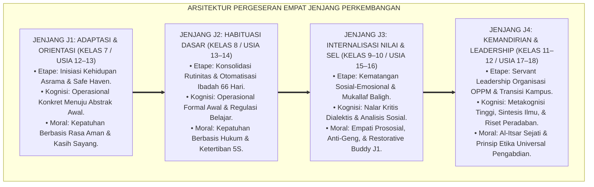
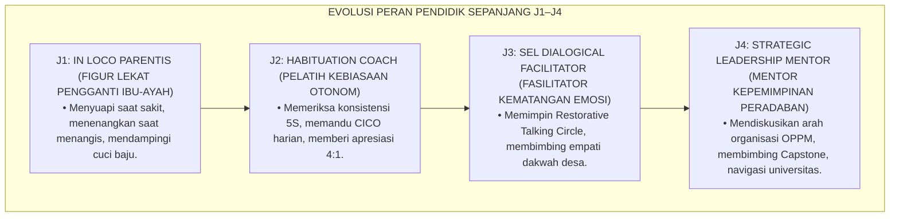

# P4-02-06: MATRIKS KOMPARASI LINTAS JENJANG J1–J4 PERKEMBANGAN SANTRI
## *Monograf Riset Akademik: Analisis Komparasi Menyeluruh Empat Jenjang Kemandirian (J1 Adaptasi, J2 Habituasi, J3 Internalisasi SEL, & J4 Servant Leadership), Integrasi Fiqh Marahil at-Tadrij dengan Teori Perkembangan Kognitif Piaget & Moral Kohlberg-Eisenberg, Pergeseran Indikator Kinerja 24 Jam, Serta Matriks Transisi Progresif di Pesantren TUMBUH*

**Nomor Identifikasi**: `P4-02-06/MONOGRAF-RISET-MATRIKS-KOMPARASI-LINTAS-JENJANG-J1-J4/2026`  
**Domain**: `04 Progression Framework` > `02 Development Levels` (Sub-Modul 06: *Cross-Level Comparative Matrix J1–J4*)  
**Klasifikasi Naskah**: *Academic Research Monograph* (Monograf Penelitian Analisis Komparasi Lintas Jenjang, Matriks Penahapan Kompetensi, & Metodologi Transisi Progresif)  
**Rumpun Disiplin Pengkaji**: Desain Kurikulum Pendidikan Berjenjang, Psikologi Perkembangan Komparatif, Fiqh Marahil at-Tadrij, Evaluasi Sistemik PBIS  

---

> ### 💡 INTISARI EKSEKUTIF (EXECUTIVE SUMMARY)
>
> * **Urgensi Matriks Komparasi Lintas Jenjang J1–J4:**  
>   Banyak pengasuh dan pendidik pesantren mengalami kesulitan membedakan ekspektasi perilaku antara santri kelas 7 (J1) dengan santri kelas 12 (J4). Ketiadaan matriks komparasi yang komprehensif kerap memicu dua kekeliruan: menuntut kemandirian penuh pada santri baru yang baru adaptasi, atau sebaliknya memperlakukan santri senior seperti anak kecil tanpa memberi ruang kepemimpinan mandiri.
> * **Integrasi Fiqh Marahil at-Tadrij & Teori Perkembangan Kontemporer:**  
>   Ekosistem TUMBUH memadukan prinsip penahapan syariat (*Sunnatut Tadrīj*) dalam Fiqh Islam dengan tahapan perkembangan kognitif Jean Piaget (Operasional Konkret $\rightarrow$ Operasional Formal), penalaran moral Lawrence Kohlberg-Nancy Eisenberg, dan tahapan psikososial Erik Erikson. Setiap jenjang memiliki karakteristik psikososial, beban ibadah, metode didaktik, dan peran khidmah yang bergeser secara mulus dan terukur.
> * **Matriks Komparasi Lintas Ranah 24 Jam:**  
>   Monograf ini menyajikan perbandingan komprehensif 4 jenjang pada 10 dimensi utama: (1) Ruhiyah & Ibadah, (2) Fisik & Higienitas 5S, (3) Kognitif & Turats, (4) Emosi & SEL, (5) Dinamika Sebaya & Ukhuwah, (6) Khidmah & Pengabdian Masyarakat, (7) Peran Kepemimpinan, (8) Pola Pengasuhan Musyrif, (9) Jam Khidmah Tahunan, dan (10) Standar Gateway Transisi.

---

## 📑 DAFTAR ISI MONOGRAF

- [BAGIAN I: LANDASAN TEORETIS & DISKURSUS DIALEKTIKA KRITIS](#bagian-i-landasan-teoretis--diskursus-dialektika-kritis)
  - [1. Latar Belakang Masalah: Bahaya Standar Ganda & Kerancuan Ekspektasi Perilaku Antar-Jenjang](#1-latar-belakang-masalah-bahaya-standar-ganda--kerancuan-ekspektasi-perilaku-antar-jenjang)
  - [2. Eksegesis Turats: Doktrin Al-Farqu baina Maratibil Aulad dalam Khazanah Pendidikan Islam](#2-eksegesis-turats-doktrin-al-farqu-baina-maratibil-aulad-dalam-khazanah-pendidikan-islam)
  - [3. Konvergensi Sains Perkembangan Komparatif: Piaget, Kohlberg, Eisenberg, & Erikson](#3-konvergensi-sains-perkembangan-komparatif-piaget-kohlberg-eisenberg--erikson)
  - [4. Rekayasa Alur Pergeseran Otoritas 24 Jam: Dari Direct Scaffolding Menuju Autonomous Stewardship](#4-rekayasa-alur-pergeseran-otoritas-24-jam-dari-direct-scaffolding-menuju-autonomous-stewardship)
  - [5. Kasuistika Lapangan Klinis & Protokol Rekalibrasi Ekspektasi Musyrif yang Menyamakan Hukuman Santri J1 dan Santri J4](#5-kasuistika-lapangan-klinis--protokol-rekalibrasi-ekspektasi-musyrif-yang-menyamakan-hukuman-santri-j1-dan-santri-j4)
- [BAGIAN II: FORMULASI KONSEPTUAL & PEMBAHASAN MENDALAM](#bagian-ii-formulasi-konseptual--pembahasan-mendalam)
  - [1. Arsitektur Matriks Komparasi Lintas Jenjang J1, J2, J3, dan J4](#1-arsitektur-matriks-komparasi-lintas-jenjang-j1-j2-j3-dan-j4)
  - [2. Tabel Master Komparasi 10 Dimensi Perkembangan Santri (J1–J4)](#2-tabel-master-komparasi-10-dimensi-perkembangan-santri-j1j4)
  - [3. Trajektori Pergeseran Peran Pendidik: Dari Figur Lekat (In Loco Parentis) Menuju Mentor Strategis](#3-trajektori-pergeseran-peran-pendidik-dari-figur-lekat-in-loco-parentis-menuju-mentor-strategis)
  - [4. Diskusi Akademis & Implikasi bagi Kebijakan Kepengasuhan Multi-Jenjang di Pesantren](#4-diskusi-akademis--implikasi-bagi-kebijakan-kepengasuhan-multi-jenjang-di-pesantren)
- [BAGIAN III: KESIMPULAN & APARATUS AKADEMIS](#bagian-iii-kesimpulan--aparatus-akademis)
  - [1. Tabel Sintesis Matriks Komparasi Lintas Jenjang J1–J4](#1-tabel-sintesis-matriks-komparasi-lintas-jenjang-j1j4)
  - [2. Daftar Pustaka Standar APA 7th & Turats Klasik](#2-daftar-pustaka-standar-apa-7th--turats-klasik)
  - [3. Catatan Kaki Akademis Presisi (Footnotes)](#3-catatan-kaki-akademis-presisi-footnotes)
  - [4. Glosarium Istilah Ilmiah & Komparasi Lintas Jenjang](#4-glosarium-istilah-ilmiah--komparasi-lintas-jenjang)

---

# BAGIAN I: LANDASAN TEORETIS & DISKURSUS DIALEKTIKA KRITIS

---

### 1. Latar Belakang Masalah: Bahaya Standar Ganda & Kerancuan Ekspektasi Perilaku Antar-Jenjang

Dalam tata kelola disiplin asrama pesantren multi-usia, kerap timbul **tiga kerancuan ekspektasi (*Expectation Ambiguities*)**:[^1]

1. **Jebakan Penyeragaman Beban Moral (*Homogenization Fallacy*)**: Musyrif menuntut santri baru kelas 7 (J1) memiliki kedisiplinan dan ketenangan shalat yang sama dengan santri kelas 12 (J4), sehingga santri J1 yang masih gelisah langsung dihukum berat.
2. **Jebakan Ketiadaan Peningkatan Wewenang (*Stagnant Authority Trap*)**: Santri kelas 12 (J4) yang sudah dewasa masih diperlakukan seperti anak kecil yang diawasi gerak-geriknya secara berlebihan tanpa diberi wewenang memimpin, memicu kelesuan inisiatif (*Learned Helplessness*).
3. **Ketiadaan Peta Pergeseran Pola Asuh Musyrif**: Pendidik tidak memahami kapan harus bersikap sebagai pengasuh yang merangkul (*In Loco Parentis* pada J1), pelatih kebiasaan (*Habituation Coach* pada J2), konselor empati (*SEL Facilitator* pada J3), dan mentor strategis (*Leadership Mentor* pada J4).[^2]

Model riset **TUMBUH** merancang **Matriks Komparasi Lintas Jenjang J1–J4** yang memetakan evolusi kompetensi, tanggung jawab, dan metode pengasuhan secara presisi.

---

### 2. Eksegesis Turats: Doktrin Al-Farqu baina Maratibil Aulad dalam Khazanah Pendidikan Islam

Khazanah Turats Islam meletakkan kaidah agung bahwa mendidik anak harus disesuaikan dengan tingkatan akalnya (*Khatibun Naasa 'ala Qadri 'Uqulihim*).

#### 📖 1. Atsar Agung Ali bin Abi Thalib RA tentang Penyesuaian Tingkat Akal
Diriwayatkan dalam *Shahih Al-Bukhari*:

$$\text{حَدِّثُوا النَّاسَ بِمَا يَعْرِفُونَ، أَتُحِبُّونَ أَنْ يُكَذَّبَ اللَّهُ وَرَسُولُهُ؟}$$

*"**Ajaklah manusia berbicara dan berinteraksi sesuai dengan apa yang mampu mereka pahami (kadar kematangan akal mereka)**; apakah kalian ingin Allah dan Rasul-Nya didustakan (karena kalian membebani manusia di luar kapasitas pemahaman mereka)?!"* (HR. Al-Bukhari No. 127).[^3]

---

### 3. Konvergensi Sains Perkembangan Komparatif: Piaget, Kohlberg, Eisenberg, & Erikson

Matriks komparasi J1–J4 memadukan sintesis empat teori perkembangan kognitif, moral, dan psikososial:

---

### 4. Rekayasa Alur Pergeseran Otoritas 24 Jam: Dari Direct Scaffolding Menuju Autonomous Stewardship

Pergeseran wewenang dan pengawasan asrama berjalan secara gradual sepanjang 4 jenjang:

---

### 5. Kasuistika Lapangan Klinis & Protokol Rekalibrasi Ekspektasi Musyrif yang Menyamakan Hukuman Santri J1 dan Santri J4

#### Studi Kasus Lapangan: Musyrif Menghukum Santri J1 yang Mengompol Sama Kerasnya dengan Santri J4 yang Terlambat Rapat
* **Konteks Masalah**: Musyrif Asrama Ustadz B menerapkan aturan seragam: siapapun yang mengotori kamar mandi atau telat shalat dihukum membersihkan 10 kamar mandi asrama. Seorang santri baru J1 yang mengompol karena trauma rindu rumah dihukum mencuci seluruh lantai asrama hingga kelelahan dan menangis histeris (*Developmental Inequity & Misapplied Discipline*).
* **Analisis Diagnostik**: Musyrif mengalami *Developmental Blindness* (kebutaan perkembangan yang tidak mampu membedakan antara respon fisiologis wajar anak transisi dengan kelalaian tanggung jawab santri dewasa).
* **Protokol Rekalibrasi Kepengasuhan & Pembagian Disiplin Berjenjang TUMBUH**:

Intervensi rekalibrasi kompetensi kepengasuhan ini menegakkan keadilan proporsional (*Al-'Adl wal Ihsan*) dalam mendidik santri lintas usia.[^4]

---

# BAGIAN II: FORMULASI KONSEPTUAL & PEMBAHASAN MENDALAM

---

### 1. Arsitektur Matriks Komparasi Lintas Jenjang J1, J2, J3, dan J4

---

### 2. Tabel Master Komparasi 10 Dimensi Perkembangan Santri (J1–J4)

| Dimensi Parameter | Jenjang J1 (Kelas 7) | Jenjang J2 (Kelas 8) | Jenjang J3 (Kelas 9–10) | Jenjang J4 (Kelas 11–12) |
| :--- | :--- | :--- | :--- | :--- |
| **1. Ruhiyah & Ibadah** | Shalat 5 waktu tertib, tilawah 1 juz/hari, hafalan 1–2 juz mutqin. | Bangun shubuh mandiri jam 04.00, hafalan 3–4 juz, zikir pagi-petang. | Kesadaran mukallaf, qiyamullail mandiri, puasa sunnah, hafalan 5–6 juz. | Keikhlasan sejati (*Lillahi Ta'ala*), hafalan 7–10 juz (atau 30 juz), Al-Itsar. |
| **2. Fisik & Higienitas 5S** | Cuci pakaian mandiri, merapikan kasur seketika bangun, kebersihan diri. | Standar 5S kamar tidur konsisten, sertifikasi P3K dasar luka ringan. | Kebugaran bela diri/panahan, sanitasi kamar 5S, evakuasi tanggap darurat. | Ketahanan fisik memimpin khidmah, 5S mandiri tanpa inspeksi, stamina prima. |
| **3. Kognitif & Turats** | Nahwu-shorof dasar, membaca kitab matan berharakat, rapor $\ge 75.0$. | Belajar mandiri 60 menit, membaca kitab lanjutan, rapor $\ge 78.0$. | Nalar kritis problem sosial, qira'ah kitab kuning matan, rapor $\ge 80.0$. | Qira'ah kitab gundul lancar, Capstone Civilizational Project, rapor $\ge 85.0$. |
| **4. Emosi & SEL** | Mengatasi homesickness $\le 40\text{ hari}$, rasa aman asrama (*Safe Haven*). | Regulasi diri mandiri (*Self-Monitoring*), konsistensi 66 hari. | 5 Kompetensi CASEL SEL, kontrol amarah (*Idaratul Ghadhab*). | Kematangan kepemimpinan bijaksana, ketahanan stres kampus (*Resilience*). |
| **5. Dinamika Sebaya** | Adaptasi kawan sekamar, berbagi makanan, anti-ejekan fisik/verbal. | Tutor sebaya belajar kawan, piket dapur umum, persahabatan kamar. | Anti-geng kedaerahan, *Restorative Buddy* pelindung adik kelas J1. | Mengayomi seluruh santri junior, penegakan Zero-Bullying Policy 100%. |
| **6. Khidmah & Pengabdian** | Khidmah kamar & rawat kawan sakit ($\ge 30\text{ Jam/Tahun}$). | Piket dapur umum & kebersihan fasilitas ($\ge 45\text{ Jam/Tahun}$). | Ekspedisi Santri Mengajar TPA Desa ($\ge 60\text{ Jam/Tahun}$). | Eksekusi Capstone Project & Pengabdian Desa ($\ge 75\text{ Jam/Tahun}$). |
| **7. Peran Kepemimpinan** | Anggota kamar yang kooperatif (*Follower*). | Penanggung jawab regu piket kamar/dapur. | Koordinator Ekspedisi Desa & Kakak Asuh J1. | Pengurus Sentral Organisasi OPPM (*Servant Leader*). |
| **8. Pola Asuh Musyrif** | *In Loco Parentis*: Pengasuh penuh kasih & pendamping langsung. | *Habituation Coach*: Pelatih kebiasaan & pengingat konsistensi. | *SEL Facilitator*: Konselor dialogis & pembimbing empati. | *Strategic Mentor*: Mentor kepemimpinan & pengarah visi karir. |
| **9. Rasio Pengawasan** | $1\text{ Musyrif} : 12\text{ Santri}$ (Tidur 1 blok). | $1\text{ Musyrif} : 18\text{ Santri}$ (Monitoring kamar). | $1\text{ Musyrif} : 24\text{ Santri}$ (Fasilitasi program). | $1\text{ Musyrif} : 30\text{ Santri}$ (Mentoring otonom). |
| **10. Ambang Gateway** | Skor SKA $\ge 2.50$; Life-skills tuntas. | Skor LMK $\ge 2.75$; 5S & P3K tuntas. | Skor SKE $\ge 3.00$; Buddy & TPA tuntas. | Skor RKK $\ge 3.25$; Capstone & Khidmah $\ge 210\text{ Jam}$. |

---

### 3. Trajektori Pergeseran Peran Pendidik: Dari Figur Lekat (In Loco Parentis) Menuju Mentor Strategis

---

### 4. Diskusi Akademis & Implikasi bagi Kebijakan Kepengasuhan Multi-Jenjang di Pesantren

Penerapan matriks komparasi lintas jenjang ini menghadirkan keunggulan tata kelola:

1. **Kejelasan Standar Operasional Pengasuhan (SOP) Berbasis Usia**: Meniadakan kerancuan perlakuan musyrif dan menjamin perlakuan yang adil sesuai martabat perkembangan santri.
2. **Harmonisasi Hubungan Antar-Angkatan Santri (*Inter-Cohort Synergy*)**: Menghapus total jurang permusuhan senioritas dan menggantinya dengan ekosistem saling asah, asih, dan asuh.
3. **Penyempurnaan Sistem Penjaminan Mutu Lulusan Berkelanjutan**: Memastikan setiap tahapan perkembangan dilalui secara tuntas tanpa ada kompetensi fitrah yang terlewatkan.[^5]

---

# BAGIAN III: KESIMPULAN & APARATUS AKADEMIS

---

### 1. Tabel Sintesis Matriks Komparasi Lintas Jenjang J1–J4

| Jenjang Pendidikan | Tahap Moral (Eisenberg) | Fokus Utama Pembinaan | Peran Pendidik Utama | Tolok Ukur Gateway |
| :--- | :--- | :--- | :--- | :--- |
| **Jenjang J1 (Kelas 7)** | *Needs-Oriented* | Adaptasi Asrama & Life-Skills Mandiri. | *In Loco Parentis* | Skor Form SKA-F1 $\ge 2.50$. |
| **Jenjang J2 (Kelas 8)** | *Approval-Oriented* | Otomatisasi Ibadah 66 Hari & 5S Kamar. | *Habituation Coach* | Skor Form LMK-F2 $\ge 2.75$. |
| **Jenjang J3 (Kelas 9–10)** | *Empathic Orientation* | Internalisasi Nilai SEL & Ekspedisi Desa. | *SEL Facilitator* | Skor Form SKE-F3 $\ge 3.00$. |
| **Jenjang J4 (Kelas 11–12)** | *Internalized Altruism* | Servant Leadership OPPM & Capstone Project. | *Strategic Mentor* | Skor Form RKK-F4 $\ge 3.25$. |

---

### 2. Daftar Pustaka Standar APA 7th & Turats Klasik

1. **Al-Bukhari, Abu Abdillah Muhammad bin Ismail.** (2002). *Shahih Al-Bukhari*. Riyadh: Bait Al-Afkar Ad-Dauliyyah.
2. **Al-Ghazali, Hujjatul Islam Abu Hamid Muhammad bin Muhammad.** (2018). *Ihya' 'Ulumiddin*. Beirut: Dar Al-Kutub Al-'Ilmiyyah.
3. **Eisenberg, N., Fabes, R. A., & Spinrad, T. L.** (2006). *Prosocial Development*. In *Handbook of Child Psychology* (Vol. 3). Hoboken: Wiley.
4. **Erikson, E. H.** (1968). *Identity: Youth and Crisis*. New York: W. W. Norton & Company.
5. **Ibnu Qayyim Al-Jauziyyah, Syamsuddin Muhammad.** (1997). *Tuhfatul Maudud bi Ahkamil Maulud*. Beirut: Dar Ibn Hazm.
6. **Kohlberg, L.** (1984). *The Psychology of Moral Development: The Nature and Validity of Moral Stages*. San Francisco: Harper & Row.
7. **Nelsen, J.** (2006). *Positive Discipline*. New York: Ballantine Books.
8. **Piaget, J.** (1952). *The Origins of Intelligence in Children*. New York: International Universities Press.
9. **Sugai, G., & Horner, R. H.** (2020). *School-Wide Positive Behavioral Interventions and Supports*. *Journal of Positive Behavior Interventions*, 22(4), 203-211.
10. **Zehr, H.** (2015). *The Little Book of Restorative Justice*. New York: Good Books.

---

### 3. Catatan Kaki Akademis Presisi (Footnotes)

[^1]: Kerancuan ekspektasi perkembangan dan standarisasi perilaku pada sekolah berasrama multi-usia, Kohlberg (1984, hlm. 142).  
[^2]: Pembahasan evolusi penalaran moral dan prososial dari remaja awal menuju dewasa awal, Eisenberg, Fabes, & Spinrad (2006, hlm. 674).  
[^3]: HR. Al-Bukhari dalam *Shahih Al-Bukhari* (No. 127), Kitab *Al-'Ilm*.  
[^4]: Protokol rekalibrasi kompetensi kepengasuhan dan penyesuaian disiplin berbasis usia santri TUMBUH (2026).  
[^5]: Dampak kelembagaan penerapan matriks komparasi lintas jenjang J1–J4 TUMBUH Pesantren (2026).  

---

### 4. Glosarium Istilah Ilmiah & Komparasi Lintas Jenjang

1. **Matriks Komparasi Lintas Jenjang**: Tabel referensi komprehensif yang memetakan perbedaan ekspektasi perkembangan, beban ibadah, dan pola asuh dari jenjang J1 hingga J4.
2. **Khatibun Nās 'ala Qadri 'Uqūlihim (خَاطِبُوا النَّاسَ عَلَى قَدْرِ عُقُولِهِمْ)**: Kaidah kenabian mengenai kewajiban menyesuaikan materi, metode, dan ekspektasi pendidikan dengan tingkat kematangan akal murid.
3. **Strategic Mentor**: Peran pendidik pada jenjang J4 yang memberikan bimbingan visi strategis, kemandirian berpikir, dan navigasi masa depan santri tanpa intervensi mikro.
4. **Developmental Blindness**: Kesalahan kepengasuhan di mana pengasuh menyamaratakan hukuman dan tuntutan perilaku tanpa mempertimbangkan perbedaan usia psikologis santri.
5. **Autonomic Stewardship**: Tingkat kemandirian moral tertinggi di mana santri mampu mengelola kehidupan pribadi dan organisasi asrama secara amanah tanpa pengawasan ketat.
6. **Habituation Horizon**: Fase waktu kritis pada jenjang J2 di mana rutinitas ibadah dan disiplin belajar bertransformasi menjadi kebiasaan otomatis yang mengakar.
7. **Social Perspective-Taking Transition**: Evolusi kemampuan nalar empati santri dari egosentrisme kamar tidur (J1) menuju kesadaran pengabdian peradaban universal (J4).
8. **Multi-Tier Age-Appropriate Discipline**: Sistem penegakan disiplin positif yang membedakan pendekatan konsekuensi edukatif untuk santri junior dan konsekuensi restoratif untuk santri senior.
9. **Zero-Bullying Sanctuary Covenant**: Pakta komitmen bersama seluruh jenjang santri untuk menjaga pesantren steril 100% dari kekerasan senioritas.
10. **Khadimul Ummah Continuum**: Rangkaian tangga kematangan pelayanan santri, dari merawat kawan sekamar (J1) hingga memimpin proyek transformasi peradaban (J4).
