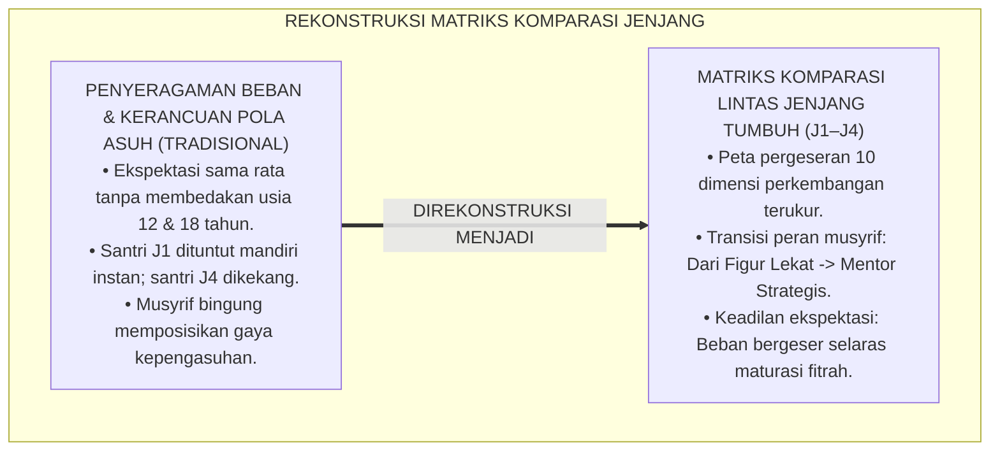
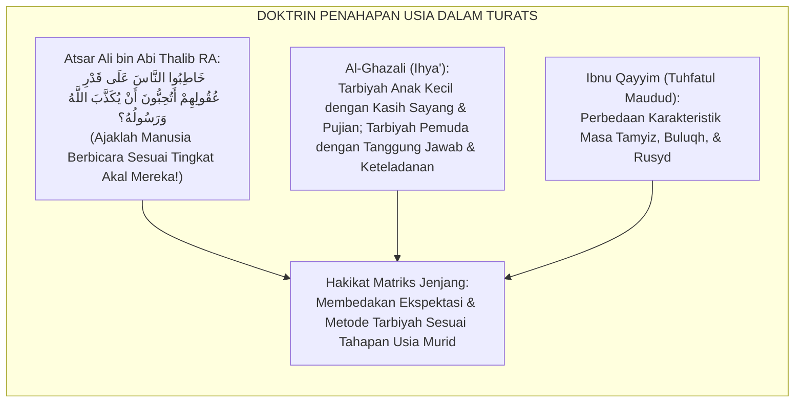
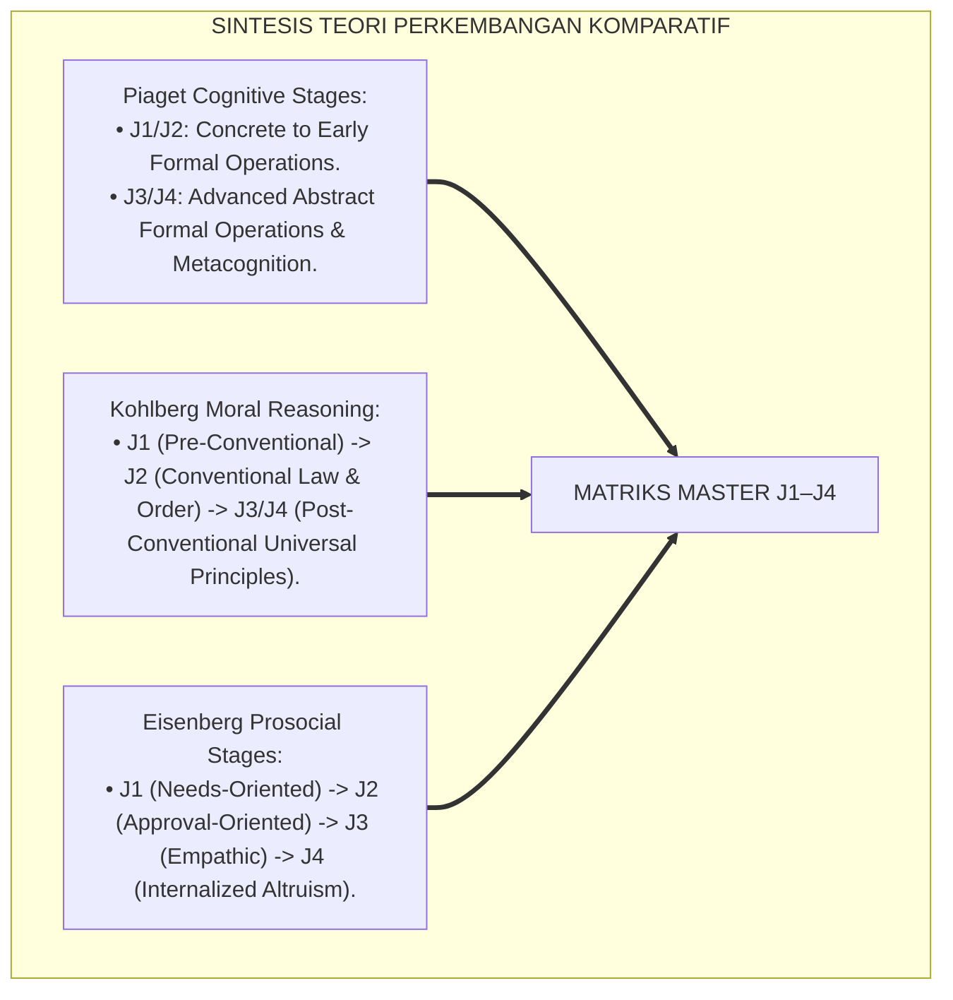
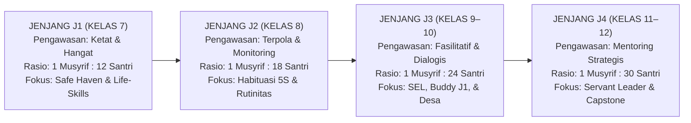
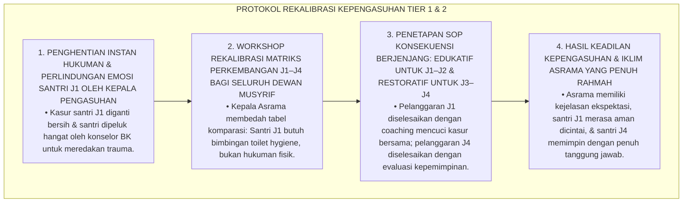
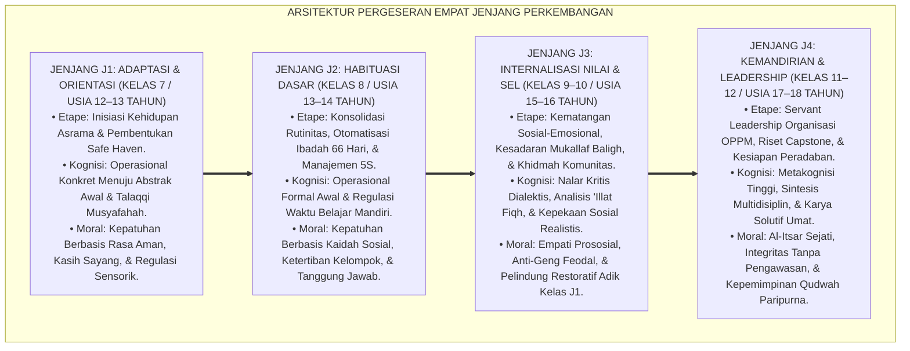
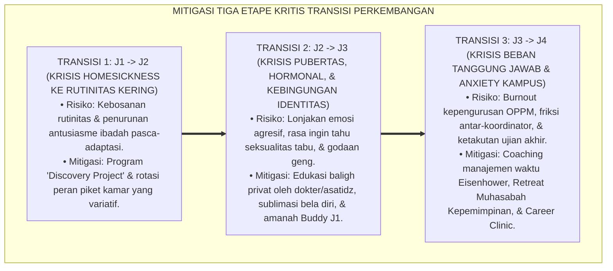
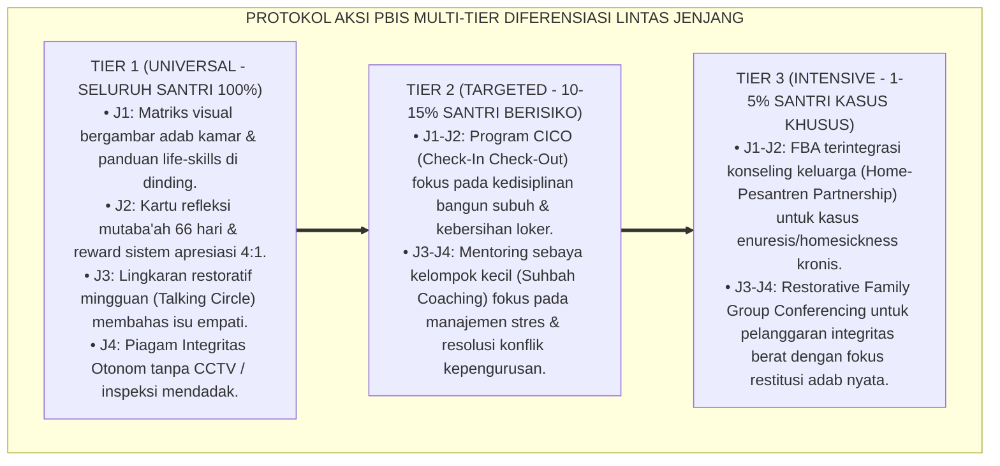

# P4-02-06: MATRIKS KOMPARASI LINTAS JENJANG J1–J4 PERKEMBANGAN SANTRI
## *Monograf Riset Akademik: Analisis Komparasi Menyeluruh Empat Jenjang Kemandirian (J1 Adaptasi, J2 Habituasi, J3 Internalisasi SEL, & J4 Servant Leadership), Integrasi Fiqh Marahil at-Tadrij dengan Teori Perkembangan Kognitif Piaget & Moral Kohlberg-Eisenberg, Pergeseran Indikator Kinerja 24 Jam, Serta Matriks Transisi Progresif di Ekosistem Pesantren Berbasis TUMBUH*

**Nomor Identifikasi**: `P4-02-06/MONOGRAF-RISET-MATRIKS-KOMPARASI-LINTAS-JENJANG-J1-J4/2026`  
**Domain**: `04 Progression Framework` > `02 Development Levels` (Sub-Modul 06: *Cross-Level Comparative Matrix J1–J4*)  
**Klasifikasi Naskah**: *Academic Research Monograph* (Monograf Penelitian Analisis Komparasi Lintas Jenjang, Matriks Penahapan Kompetensi, & Metodologi Transisi Progresif)  
**Rumpun Disiplin Pengkaji**: Desain Kurikulum Pendidikan Berjenjang, Psikologi Perkembangan Komparatif, Fiqh Marahil at-Tadrij, Evaluasi Sistemik PBIS  

---

> ### 💡 INTISARI EKSEKUTIF (EXECUTIVE SUMMARY)
>
> * **Urgensi Matriks Komparasi Lintas Jenjang J1–J4:**  
>   Banyak pengasuh dan pendidik pesantren mengalami kesulitan membedakan ekspektasi perilaku antara santri kelas 7 (J1) dengan santri kelas 12 (J4). Ketiadaan matriks komparasi yang komprehensif kerap memicu dua kekeliruan: menuntut kemandirian penuh pada santri baru yang baru adaptasi, atau sebaliknya memperlakukan santri senior seperti anak kecil tanpa memberi ruang kepemimpinan mandiri.
> * **Integrasi Fiqh Marahil at-Tadrij & Teori Perkembangan Kontemporer:**  
>   Ekosistem TUMBUH memadukan prinsip penahapan syariat (*Sunnatut Tadrīj*) dalam Fiqh Islam dengan tahapan perkembangan kognitif Jean Piaget (Operasional Konkret $\rightarrow$ Operasional Formal), penalaran moral Lawrence Kohlberg-Nancy Eisenberg, dan tahapan psikososial Erik Erikson. Setiap jenjang memiliki karakteristik psikososial, beban ibadah, metode didaktik, dan peran khidmah yang bergeser secara mulus dan terukur.
> * **Matriks Komparasi Lintas Ranah 24 Jam:**  
>   Monograf ini menyajikan perbandingan komprehensif 4 jenjang pada 10 dimensi utama: (1) Ruhiyah & Ibadah, (2) Fisik & Higienitas 5S, (3) Kognitif & Turats, (4) Emosi & SEL, (5) Dinamika Sebaya & Ukhuwah, (6) Khidmah & Pengabdian Masyarakat, (7) Peran Kepemimpinan, (8) Pola Pengasuhan Musyrif, (9) Jam Khidmah Tahunan, dan (10) Standar Gateway Transisi.

---

## 📑 DAFTAR ISI MONOGRAF

- [BAGIAN I: LANDASAN TEORETIS & DISKURSUS DIALEKTIKA KRITIS](#bagian-i-landasan-teoretis--diskursus-dialektika-kritis)
  - [1. Latar Belakang Masalah: Bahaya Standar Ganda & Kerancuan Ekspektasi Perilaku Antar-Jenjang](#1-latar-belakang-masalah-bahaya-standar-ganda--kerancuan-ekspektasi-perilaku-antar-jenjang)
  - [2. Eksegesis Turats: Doktrin Al-Farqu baina Maratibil Aulad dalam Khazanah Pendidikan Islam](#2-eksegesis-turats-doktrin-al-farqu-baina-maratibil-aulad-dalam-khazanah-pendidikan-islam)
  - [3. Konvergensi Sains Perkembangan Komparatif: Piaget, Kohlberg, Eisenberg, & Erikson](#3-konvergensi-sains-perkembangan-komparatif-piaget-kohlberg-eisenberg--erikson)
  - [4. Rekayasa Alur Pergeseran Otoritas 24 Jam: Dari Direct Scaffolding Menuju Autonomous Stewardship](#4-rekayasa-alur-pergeseran-otoritas-24-jam-dari-direct-scaffolding-menuju-autonomous-stewardship)
  - [5. Kasuistika Lapangan Klinis & Protokol Rekalibrasi Ekspektasi Musyrif yang Menyamakan Hukuman Santri J1 dan Santri J4](#5-kasuistika-lapangan-klinis--protokol-rekalibrasi-ekspektasi-musyrif-yang-menyamakan-hukuman-santri-j1-dan-santri-j4)
- [BAGIAN II: FORMULASI KONSEPTUAL & PEMBAHASAN MENDALAM](#bagian-ii-formulasi-konseptual--pembahasan-mendalam)
  - [1. Arsitektur Matriks Komparasi Lintas Jenjang J1, J2, J3, dan J4](#1-arsitektur-matriks-komparasi-lintas-jenjang-j1-j2-j3-dan-j4)
  - [2. Tabel Master Komparasi 10 Dimensi Perkembangan Santri (J1–J4)](#2-tabel-master-komparasi-10-dimensi-perkembangan-santri-j1j4)
  - [3. Pembedahan Deskriptif Komparatif Sepuluh Dimensi Perkembangan Santri](#3-pembedahan-deskriptif-komparatif-sepuluh-dimensi-perkembangan-santri)
  - [4. Analisis Dinamika Transisi Antar-Jenjang & Mitigasi Hambatan Pertumbuhan](#4-analisis-dinamika-transisi-antar-jenjang--mitigasi-hambatan-pertumbuhan-growth-bottlenecks)
  - [5. Protokol Aksi Operasional PBIS Multi-Tier Diferensiasi Lintas Jenjang](#5-protokol-aksi-operasional-pbis-multi-tier-diferensiasi-lintas-jenjang)
  - [6. Diskusi Akademis & Implikasi Kebijakan Kepengasuhan Pesantren 24 Jam](#6-diskusi-akademis--implikasi-kebijakan-kepengasuhan-pesantren-24-jam)
- [BAGIAN III: KESIMPULAN & APARATUS AKADEMIS](#bagian-iii-kesimpulan--aparatus-akademis)
  - [1. Tabel Sintesis Matriks Komparasi Lintas Jenjang J1–J4](#1-tabel-sintesis-matriks-komparasi-lintas-jenjang-j1j4)
  - [2. Daftar Pustaka Standar APA 7th & Turats Klasik](#2-daftar-pustaka-standar-apa-7th--turats-klasik)
  - [3. Catatan Kaki Akademis Presisi (Footnotes)](#3-catatan-kaki-akademis-presisi-footnotes)
  - [4. Glosarium Istilah Ilmiah & Komparasi Lintas Jenjang](#4-glosarium-istilah-ilmiah--komparasi-lintas-jenjang)

---

# BAGIAN I: LANDASAN TEORETIS & DISKURSUS DIALEKTIKA KRITIS

---

### 1. Latar Belakang Masalah: Bahaya Standar Ganda & Kerancuan Ekspektasi Perilaku Antar-Jenjang

Dalam tata kelola disiplin asrama pesantren multi-usia, kerap timbul **tiga kerancuan ekspektasi (*Expectation Ambiguities*)**:[^1]

1. **Jebakan Penyeragaman Beban Moral (*Homogenization Fallacy*)**: Musyrif menuntut santri baru kelas 7 (J1) memiliki kedisiplinan dan ketenangan shalat yang sama dengan santri kelas 12 (J4), sehingga santri J1 yang masih gelisah langsung dihukum berat.
2. **Jebakan Ketiadaan Peningkatan Wewenang (*Stagnant Authority Trap*)**: Santri kelas 12 (J4) yang sudah dewasa masih diperlakukan seperti anak kecil yang diawasi gerak-geriknya secara berlebihan tanpa diberi wewenang memimpin, memicu kelesuan inisiatif (*Learned Helplessness*).
3. **Ketiadaan Peta Pergeseran Pola Asuh Musyrif**: Pendidik tidak memahami kapan harus bersikap sebagai pengasuh yang merangkul (*In Loco Parentis* pada J1), pelatih kebiasaan (*Habituation Coach* pada J2), konselor empati (*SEL Facilitator* pada J3), dan mentor strategis (*Leadership Mentor* pada J4).[^2]

Model riset **TUMBUH** merancang **Matriks Komparasi Lintas Jenjang J1–J4** yang memetakan evolusi kompetensi, tanggung jawab, dan metode pengasuhan secara presisi.

---

### 2. Eksegesis Turats: Doktrin Al-Farqu baina Maratibil Aulad dalam Khazanah Pendidikan Islam

Khazanah Turats Islam meletakkan kaidah agung bahwa mendidik anak harus disesuaikan dengan tingkatan akalnya (*Khatibun Naasa 'ala Qadri 'Uqulihim*).

#### 📖 1. Atsar Agung Ali bin Abi Thalib RA tentang Penyesuaian Tingkat Akal
Diriwayatkan dalam *Shahih Al-Bukhari*:

$$\text{حَدِّثُوا النَّاسَ بِمَا يَعْرِفُونَ، أَتُحِبُّونَ أَنْ يُكَذَّبَ اللَّهُ وَرَسُولُهُ؟}$$

*"**Ajaklah manusia berbicara dan berinteraksi sesuai dengan apa yang mampu mereka pahami (kadar kematangan akal mereka)**; apakah kalian ingin Allah dan Rasul-Nya didustakan (karena kalian membebani manusia di luar kapasitas pemahaman mereka)?!"* (HR. Al-Bukhari No. 127).[^3]

---

### 3. Konvergensi Sains Perkembangan Komparatif: Piaget, Kohlberg, Eisenberg, & Erikson

Matriks komparasi J1–J4 memadukan sintesis empat teori perkembangan kognitif, moral, dan psikososial:

---

### 4. Rekayasa Alur Pergeseran Otoritas 24 Jam: Dari Direct Scaffolding Menuju Autonomous Stewardship

Pergeseran wewenang dan pengawasan asrama berjalan secara gradual sepanjang 4 jenjang:

---

### 5. Kasuistika Lapangan Klinis & Protokol Rekalibrasi Ekspektasi Musyrif yang Menyamakan Hukuman Santri J1 dan Santri J4

#### Studi Kasus Lapangan: Musyrif Menghukum Santri J1 yang Mengompol Sama Kerasnya dengan Santri J4 yang Terlambat Rapat
* **Konteks Masalah**: Musyrif Asrama Ustadz B menerapkan aturan seragam: siapapun yang mengotori kamar mandi atau telat shalat dihukum membersihkan 10 kamar mandi asrama. Seorang santri baru J1 yang mengompol karena trauma rindu rumah dihukum mencuci seluruh lantai asrama hingga kelelahan dan menangis histeris (*Developmental Inequity & Misapplied Discipline*).
* **Analisis Diagnostik**: Musyrif mengalami *Developmental Blindness* (kebutaan perkembangan yang tidak mampu membedakan antara respon fisiologis wajar anak transisi dengan kelalaian tanggung jawab santri dewasa).
* **Protokol Rekalibrasi Kepengasuhan & Pembagian Disiplin Berjenjang TUMBUH**:

Intervensi rekalibrasi kompetensi kepengasuhan ini menegakkan keadilan proporsional (*Al-'Adl wal Ihsan*) dalam mendidik santri lintas usia.[^4]

---

# BAGIAN II: FORMULASI KONSEPTUAL & PEMBAHASAN MENDALAM

---

### 1. Arsitektur Matriks Komparasi Lintas Jenjang J1, J2, J3, dan J4

Perkembangan santri di ekosistem TUMBUH dibangun di atas prinsip *Tadarruj Syar'i* dan *Dynamic Scaffolding*, yang mengintegrasikan kesiapan neurobiologis otak remaja dengan tuntutan taklif syariat. Matriks ini memetakan transisi kematangan santri melintasi empat etape berurutan:

---

### 2. Tabel Master Komparasi 10 Dimensi Perkembangan Santri (J1–J4)

| Dimensi Parameter | Jenjang J1 (Kelas 7) | Jenjang J2 (Kelas 8) | Jenjang J3 (Kelas 9–10) | Jenjang J4 (Kelas 11–12) |
| :--- | :--- | :--- | :--- | :--- |
| **1. Ruhiyah & Ibadah** | Shalat 5 waktu tertib berjamaah di saf awal, tilawah 1 juz/hari terbimbing, hafalan 1–2 juz mutqin, doa harian dasar. | Bangun shubuh mandiri pukul 04.00, hafalan 3–4 juz mutqin, zikir ma'tsurat pagi-petang, puasa sunnah Senin-Kamis terpola. | Kesadaran mukallaf penuh, qiyamullail mandiri 2x/pekan, puasa Daud/Ayyamul Bidh, hafalan 5–6 juz mutqin, tadabbur makna. | Keikhlasan sejati (*Lillahi Ta'ala*), qiyamullail istiqamah, hafalan 7–10 juz (atau 30 juz), khusyuk tanpa pengawasan musyrif. |
| **2. Fisik & Higienitas 5S** | Cuci pakaian pribadi bertahap, merapikan kasur seketika bangun, kebersihan diri mandi 2x sehari, makan teratur. | Standar 5S kamar tidur konsisten, sertifikasi P3K dasar & sanitasi mandiri, olahraga aerobik 3x/pekan terjadwal. | Kebugaran bela diri/panahan/renang, sanitasi komunal kamar 5S, evakuasi tanggap darurat, manajemen gizi baligh. | Ketahanan fisik prima memimpin kerja bakti, 5S mandiri tanpa inspeksi musyrif, disiplin ergonomi & manajemen tidur sehat. |
| **3. Kognitif & Turats** | Kaidah nahwu-shorof dasar, membaca kitab matan berharakat, penguasaan peta konsep belajar, rapor akademik $\ge 75.0$. | Belajar mandiri 60 menit/malam, membaca kitab syarah tingkat dasar, logika mantiq pemula, rapor akademik $\ge 78.0$. | Nalar kritis membedah isu sosial kontemporer, qira'ah kitab kuning matan tanpa harakat, debat ilmiah, rapor $\ge 80.0$. | Qira'ah kitab gundul lancar & istinbath hukum dasar, penyusunan *Capstone Civilizational Project*, rapor $\ge 85.0$. |
| **4. Emosi & SEL** | Mengatasi homesickness $\le 40\text{ hari}$, membangun rasa aman (*Safe Haven*), identifikasi emosi dasar saat sedih/marah. | Regulasi diri mandiri (*Self-Monitoring*), konsistensi habit loop 66 hari, teknik de-eskalasi emosi pernapasan lambat. | Penguasaan 5 Kompetensi CASEL SEL, manajemen amarah (*Idaratul Ghadhab*), resiliensi menghadapi kegagalan target belajar. | Kematangan emosi kepemimpinan bijaksana, ketahanan stres tinggi (*Adversity Quotient*), kesiapan mental transisi universitas. |
| **5. Dinamika Sebaya** | Adaptasi kawan lintas daerah, berbagi fasilitas kamar secara adil, zero ejekan fisik/verbal/daerah, empati sekamar. | Tutor sebaya belajar kelompok, piket dapur umum kooperatif, persahabatan sehat (*Suhbah Shalihah*), resolusi konflik kecil. | Penolakan mutlak geng kedaerahan, menjadi *Restorative Buddy* pelindung adik kelas J1, mediasi damai konflik teman sebaya. | Mengayomi seluruh santri junior, penegakan *Zero-Bullying Policy* 100%, menciptakan kultur ukhuwah inklusif di asrama. |
| **6. Khidmah & Pengabdian** | Khidmah kebersihan kamar & merawat kawan sekamar yang sakit ($\ge 30\text{ Jam/Tahun}$). | Piket dapur umum, kebersihan masjid, & pemeliharaan taman pondok ($\ge 45\text{ Jam/Tahun}$). | Ekspedisi Santri Mengajar TPA Desa & bakti sosial warga sekitar pondok ($\ge 60\text{ Jam/Tahun}$). | Eksekusi proyek pemberdayaan umat *Capstone Project* di desa binaan ($\ge 75\text{ Jam/Tahun}$; Total Kumulatif $\ge 210\text{ Jam}$). |
| **7. Peran Kepemimpinan** | Anggota kamar yang tertib, kooperatif, dan patuh pada kesepakatan (*Active Follower*). | Penanggung jawab regu piket kamar, koordinator kebersihan sektor asrama (*Team Leader*). | Koordinator Divisi Ekspedisi Desa, Ketua Tim Halaqah Sebaya, Mentor Asrama (*Facilitative Leader*). | Pengurus Sentral Organisasi Santri OPPM, Ketua Dewan Kehormatan Adab (*Servant Leader & Custodian of Values*). |
| **8. Pola Asuh Musyrif** | *In Loco Parentis*: Pengasuh penuh kasih sayang, pendamping fisik langsung, figur lekat pengganti orang tua. | *Habituation Coach*: Pelatih kebiasaan terstruktur, pemandu CICO harian, pemberi penguatan positif rasio 4:1. | *SEL Dialogical Facilitator*: Konselor dialogis, fasilitator lingkaran restoratif, pembimbing empati dakwah. | *Strategic Leadership Mentor*: Mentor kepemimpinan peradaban, konsultan riset capstone, pengarah navigasi karir masa depan. |
| **9. Rasio Pengawasan** | $1\text{ Musyrif} : 12\text{ Santri}$ (Kamar tidur berada dalam 1 blok lorong yang sama). | $1\text{ Musyrif} : 18\text{ Santri}$ (Monitoring kamar terstruktur & briefing berkala). | $1\text{ Musyrif} : 24\text{ Santri}$ (Fasilitasi program mandiri & observasi perilaku). | $1\text{ Musyrif} : 30\text{ Santri}$ (Mentoring otonom, refleksi mingguan, & supervisi manajerial). |
| **10. Ambang Gateway** | Form SKA-F1 $\ge 2.50$; Ujian Life-Skills Dasar tuntas; Nihil residu homesickness akut. | Form LMK-F2 $\ge 2.75$; Sertifikasi 5S & P3K lulus; Konsistensi shalat shubuh $\ge 90\%$. | Form SKE-F3 $\ge 3.00$; Portofolio Buddy J1 & Khidmah TPA tuntas; Baligh screening valid. | Form RKK-F4 $\ge 3.25$; Munaqasyah Capstone Project $\ge 80.0$; Total Khidmah $\ge 210\text{ Jam}$. |

---

### 3. Pembedahan Deskriptif Komparatif Sepuluh Dimensi Perkembangan Santri

Setiap dimensi dalam matriks komparasi di atas merepresentasikan perubahan kualitatif yang mendalam pada struktur fisik, psikologis, sosial, dan spiritual santri:

#### 1. Dimensi Ruhiyah & Ibadah: Dari Pengondisian Eksternal Menuju Otonomi Ikhlas
* **Jenjang J1**: Fokus utama adalah desensitisasi kecemasan dan pembiasaan shalat 5 waktu tanpa beban traumatik. Musyrif membangunkan santri dengan sentuhan hangat, bukan siraman air atau bentakan. Santri belajar mencintai masjid sebagai pusat ketenangan.
* **Jenjang J2**: Terjadi konsolidasi sirkuit kebiasaan (*Habit Loop 66 Hari*). Santri mulai mampu bangun sendiri dengan alarm internal dan menikmati puasa sunnah sebagai bagian dari identitas santri yang tangguh.
* **Jenjang J3**: Masuknya fase baligh (*Ahkamut Taklif*) menggeser motivasi ibadah dari sekadar "menjalankan tata tertib pondok" menjadi "tanggung jawab pribadi di hadapan Allah SWT". Qiyamullail dilakukan secara mandiri atas dorongan kebutuhan spiritual jiwa.
* **Jenjang J4**: Puncak kematangan ruhiyah, di mana ibadah telah menjadi sumber kekuatan hidup (*Thuma'ninah*). Santri beramal dengan asas *Al-Itsar* (mendahulukan orang lain) dan keikhlasan mutlak tanpa membutuhkan pengawasan atau pujian manusia.[^5]

#### 2. Dimensi Fisik & Higienitas 5S: Penguasaan Raga dan Tata Ruang Kehidupan
* **Jenjang J1**: Transisi kemandirian fisik mendasar (*Fundamental Life-Skills*). Santri diajarkan cara memilah pakaian kotor, mencuci dengan tangan/mesin secara efisien, menjemur dengan rapi, dan menjaga kebersihan loker pribadi.
* **Jenjang J2**: Peningkatan standar menuju metodologi 5S (*Seiri, Seiton, Seiso, Seiketsu, Shitsuke*). Kamar asrama bukan sekadar tempat tidur, melainkan laboratorium kerapian dan kebersihan yang bebas dari sarang kuman.
* **Jenjang J3**: Integrasi kesehatan fisik dengan olahraga sunnah (bela diri, panahan, renang). Santri memiliki pemahaman tentang nutrisi seimbang, metabolisme tubuh pubertas, dan kesiapan pertolongan pertama pada kecelakaan (P3K).
* **Jenjang J4**: Ketahanan fisik yang matang untuk memimpin kegiatan operasional pondok dan ekspedisi pengabdian masyarakat. Santri memiliki kesadaran ergonomi dan disiplin menjaga siklus sirkadian tidur sehat di tengah padatnya tugas kepengurusan.

#### 3. Dimensi Kognitif & Turats: Dari Penyerapan Teks Menuju Rekonstruksi Solusi Peradaban
* **Jenjang J1**: Menekankan transmisi ilmu berbasis *Talaqqi Musyafahah* dan hafalan teks-teks matan dasar (Jurumiyyah, Taisir Khalaq, Matan Jazariyyah). Tujuannya adalah memperkuat kapasitas memori kerja (*Working Memory Encoding*) dan pelafalan lisan yang presisi.
* **Jenjang J2**: Santri mulai diajak menalar logika kausalitas hukum melalui kajian syarah dan pemetaan konsep visual (*Concept Mapping*). Santri dibimbing belajar mandiri secara terfokus selama 60 menit setiap malam.
* **Jenjang J3**: Aktivasi nalar kritis dialektis (*Nazhar Burhani*). Santri membedah perbedaan pendapat fuqaha (*Ikhtilaf*), mengkaji teks kitab kuning gundul tingkat menengah, dan menghubungkannya dengan fenomena sosial di era digital.
* **Jenjang J4**: Sintesis keilmuan tingkat tinggi melalui *Capstone Civilizational Project*. Santri wajib merumuskan karya ilmiah/proyek terapan berbasis Maqashid Syari'ah yang menyelesaikan masalah riil di masyarakat (misal: sistem ketahanan pangan desa, purifikasi air mandiri, atau kurikulum dakwah anak jalanan).

#### 4. Dimensi Sosio-Emosional (CASEL SEL): Regulasi Diri dan Resiliensi Batin
* **Jenjang J1**: Fokus pada resolusi *separation anxiety* (rindu rumah) dan validasi emosi. Santri dilatih mengenali nama-nama emosi (*Affect Labeling*) agar tidak melampiaskan stres menjadi agresi fisik atau isolasi diri.
* **Jenjang J2**: Penguatan kontrol diri (*Self-Management*). Santri diajarkan teknik *Pause-Breathe-Reflect* saat mengalami kejengkelan di kamar tidur dan memonitor grafis kemajuan emosinya dalam lembar mutaba'ah harian.
* **Jenjang J3**: Penguasaan penuh 5 kompetensi CASEL SEL (Self-Awareness, Self-Management, Social Awareness, Relationship Skills, Responsible Decision-Making). Santri memiliki empati mendalam untuk merasakan beban penderitaan kawan dan mampu mengelola amarah secara konstruktif (*Anger Sublimation*).
* **Jenjang J4**: Kematangan mental tingkat tinggi (*Emotional Resilience & Wisdom*). Santri mampu menghadapi kritik keras dengan kepala dingin, memimpin musyawarah yang menegangkan tanpa permusuhan pribadi, dan siap mental menghadapi disrupsi dunia kampus.

#### 5. Dimensi Dinamika Sebaya: Eradikasi Feodalisme Menuju Persaudaraan Inklusif
* **Jenjang J1**: Belajar hidup bersama dalam keberagaman latar belakang suku dan bahasa. Santri dididik untuk tidak membentuk kubu-kubu eksklusif di kamar dan saling menghormati hak privasi kawan sekamar.
* **Jenjang J2**: Pembentukan kelompok belajar suportif (*Study Circles*). Santri yang unggul dalam satu mata pelajaran secara sukarela menjadi tutor bagi kawannya yang mengalami kesulitan akademik.
* **Jenjang J3**: Penugasan sebagai *Restorative Buddy* bagi santri baru J1. Santri J3 bertindak sebagai kakak asuh yang mendampingi, menghibur saat rindu rumah, dan melindungi santri J1 dari segala bentuk intimidasi.
* **Jenjang J4**: Penjaga Konstitusi Anti-Kekerasan (*Custodians of Zero-Violence*). Pengurus J4 memastikan bahwa tidak ada satu pun tradisi perpeloncoan, pemalakan, atau sarkasme verbal yang hidup di lingkungan asrama.

#### 6. Dimensi Khidmah & Pengabdian Sosial: Evolusi Jiwa Melayani
* **Jenjang J1 (30 Jam/Tahun)**: Khidmah dimulai dari lingkaran terdekat: merawat kasur kawan sekamar yang sakit, menyapu koridor kamar tidur, dan membantu merapikan rak sandal masjid.
* **Jenjang J2 (45 Jam/Tahun)**: Khidmah diperluas ke fasilitas umum pondok: piket dapur umum, mencuci piring nampan bersama, membersihkan selokan lingkungan asrama, dan memelihara perpustakaan.
* **Jenjang J3 (60 Jam/Tahun)**: Khidmah menembus dinding pesantren menuju masyarakat sekitar: mengajar anak-anak desa di TPA binaan, membantu panen petani dhuafa, dan menyelenggarakan posko kesehatan lingkungan.
* **Jenjang J4 (75 Jam/Tahun; Kumulatif $\ge 210$ Jam)**: Memimpin dan mengeksekusi proyek pengabdian peradaban berskala besar (*Capstone Civilizational Engagement*) yang dampaknya dirasakan langsung oleh masyarakat luas sebelum kelulusan.

#### 7. Dimensi Peran Kepemimpinan: Tangga Menuju Servant Leader Sejati
* **Jenjang J1**: Menjadi pengikut yang aktif dan beradab (*Exemplary Follower*). Kepatuhan lahir dari rasa hormat dan pemahaman makna tata tertib, bukan ketakutan.
* **Jenjang J2**: Belajar memimpin kelompok kecil (*Small Team Leadership*). Mengkoordinasikan regu kebersihan kamar dan memastikan seluruh anggota regu bekerja dengan gembira dan adil.
* **Jenjang J3**: Kepemimpinan fasilitatif (*Facilitative Leadership*). Memimpin forum diskusi santri, mengelola divisi kepanitiaan acara pondok, dan menjadi jembatan komunikasi antara adik kelas dan pengurus senior.
* **Jenjang J4**: Kepemimpinan Pelayanan Paripurna (*Servant Leadership*). Mengemban amanah sebagai Pengurus Sentral OPPM (Organisasi Pelajar Pondok Modern) dengan moto hidup *Sayyidul Qaumi Khaadimuhum* (Pemimpin kaum adalah pelayan bagi mereka).

#### 8. Dimensi Pola Asuh Musyrif: Transformasi Pendampingan Bersiklus 4 Tahun
* **Jenjang J1 (*In Loco Parentis*)**: Musyrif mencurahkan 80% waktunya pada kehangatan pengasuhan fisik dan emosional: menyuapi santri saat demam, membacakan kisah hikmah sebelum tidur, dan memeluk santri yang menangis rindu keluarga.
* **Jenjang J2 (*Habituation Coach*)**: Musyrif bertindak seperti pelatih disiplin positif: memberikan instruksi yang jelas, memverifikasi konsistensi jadwal, dan memberikan apresiasi tulus (*Praise for Effort*) dengan rasio 4 kebaikan berbanding 1 teguran.
* **Jenjang J3 (*SEL Dialogical Facilitator*)**: Musyrif bertindak sebagai fasilitator dialog sokratik: duduk bersama santri dalam lingkaran restoratif (*Talking Circle*), membedah konflik antarkawan secara bijak, dan membimbing kematangan emosi baligh.
* **Jenjang J4 (*Strategic Leadership Mentor*)**: Musyrif bertindak sebagai rekan diskusi strategis (*Executive Mentor*): mendampingi perumusan program kerja OPPM, membimbing riset masa depan, dan memberikan supervisi berbasis kepercayaan otonom.

#### 9. Dimensi Rasio Pengawasan: Rekayasa Kedekatan Relasional 24 Jam
* **Jenjang J1 (1:12)**: Rasio terketat karena santri J1 membutuhkan atensi individual tinggi. Kamar tidur musyrif berada di lorong yang sama persis dengan kamar santri J1 untuk menjamin keamanan 24 jam.
* **Jenjang J2 (1:18)**: Rasio mulai dilonggarkan seiring tumbuhnya kemandirian rutinitas kamar tidur, dengan fokus pada monitoring jam-jam transisi kritis (Subuh, Maghrib, dan Jam Belajar Malam).
* **Jenjang J3 (1:24)**: Pengawasan beralih dari inspeksi fisik menuju fasilitasi program dan observasi dinamika relasi sosial santri.
* **Jenjang J4 (1:30)**: Rasio paling longgar di mana musyrif memposisikan diri sebagai konsultan, memberikan ruang kebebasan bertanggung jawab bagi santri senior untuk mengelola asrama secara mandiri.

#### 10. Dimensi Ambang Gateway Kenaikan Tangga: Asesmen Pertumbuhan Non-Komparatif
* **Jenjang J1 (Form SKA-F1 $\ge 2.50$)**: Menjamin tuntasnya adaptasi kehidupan asrama dan kemandirian mencuci pakaian/merawat diri sebelum melangkah ke jenjang habituasi.
* **Jenjang J2 (Form LMK-F2 $\ge 2.75$)**: Menjamin otomatisasi shalat berjamaah 5 waktu dan ketuntasan standar 5S kamar tidur sebelum memasuki fase taklif baligh.
* **Jenjang J3 (Form SKE-F3 $\ge 3.00$)**: Menjamin kematangan kecerdasan sosio-emosional, ketuntasan peran kakak asuh J1, dan pengabdian TPA desa sebelum diberi amanah kepemimpinan organisasi.
* **Jenjang J4 (Form RKK-F4 $\ge 3.25$)**: Menjamin kelulusan munaqasyah Capstone Project, integritas moral otonom, dan akumulasi minimal 210 jam khidmah umat sebagai syarat mutlak wisuda kelulusan.

---

### 4. Analisis Dinamika Transisi Antar-Jenjang & Mitigasi Hambatan Pertumbuhan (*Growth Bottlenecks*)

Perpindahan santri dari satu jenjang ke jenjang berikutnya kerap memicu goncangan adaptasi (*Developmental Transition Crises*). TUMBUH merumuskan protokol mitigasi transisi berbasis tahapan:

---

### 5. Protokol Aksi Operasional PBIS Multi-Tier Diferensiasi Lintas Jenjang

Sistem PBIS (*Positive Behavioral Interventions and Supports*) diterapkan dengan strategi diferensiasi yang disesuaikan dengan tingkat kematangan usia:

---

### 6. Diskusi Akademis & Implikasi Kebijakan Kepengasuhan Pesantren 24 Jam

Penerapan Matriks Komparasi Lintas Jenjang J1–J4 membawa paradigma baru dalam tata kelola pesantren:

1. **Mendekonstruksi Tirani "One-Size-Fits-All" dalam Pendidikan Asrama**:  
   Menyamakan aturan dan sanksi antara anak usia 12 tahun (J1) dan pemuda usia 18 tahun (J4) adalah bentuk kezaliman pedagogis (*Pedagogical Injustice*). Matriks ini mengembalikan prinsip keadilan proporsional syariat: memperlakukan setiap insan sesuai kadar kapasitas akal dan fitrah biologisnya (*Wadh'u asy-Syaf'i fi Mahallihi*).
2. **Memutus Mata Rantai Kekerasan Antar-Generasi Santri (*Intergenerational Trauma Chain*)**:  
   Dengan menempatkan santri J3 sebagai *Restorative Buddy* dan santri J4 sebagai *Servant Leader*, hierarki usia tidak lagi menjadi instrumen penindasan dan perpeloncoan, melainkan saluran kasih sayang, perlindungan, dan keteladanan akhlak.
3. **Efisiensi Manajemen dan Perlindungan Musyrif dari Burnout**:  
   Kejelasan rasio pengawasan (dari 1:12 hingga 1:30) dan spesifikasi peran musyrif menghindarkan tenaga pendidik dari kelelahan kronis. Musyrif J1 dapat fokus memberikan cinta kasih tanpa dibebani urusan manajerial berat, sementara musyrif J4 dapat fokus pada pendampingan strategis peradaban.[^6]

---

# BAGIAN III: KESIMPULAN & APARATUS AKADEMIS

---

### 1. Tabel Sintesis Matriks Komparasi Lintas Jenjang J1–J4

| Jenjang Pendidikan | Tahap Moral (Eisenberg) | Fokus Utama Pembinaan | Peran Pendidik Utama | Tolok Ukur Gateway |
| :--- | :--- | :--- | :--- | :--- |
| **Jenjang J1 (Kelas 7)** | *Needs-Oriented* | Adaptasi Asrama & Life-Skills Mandiri. | *In Loco Parentis* | Skor Form SKA-F1 $\ge 2.50$. |
| **Jenjang J2 (Kelas 8)** | *Approval-Oriented* | Otomatisasi Ibadah 66 Hari & 5S Kamar. | *Habituation Coach* | Skor Form LMK-F2 $\ge 2.75$. |
| **Jenjang J3 (Kelas 9–10)** | *Empathic Orientation* | Internalisasi Nilai SEL & Ekspedisi Desa. | *SEL Facilitator* | Skor Form SKE-F3 $\ge 3.00$. |
| **Jenjang J4 (Kelas 11–12)** | *Internalized Altruism* | Servant Leadership OPPM & Capstone Project. | *Strategic Mentor* | Skor Form RKK-F4 $\ge 3.25$. |

---

### 2. Daftar Pustaka Standar APA 7th & Turats Klasik

1. **Al-Bukhari, Abu Abdillah Muhammad bin Ismail.** (2002). *Shahih Al-Bukhari*. Riyadh: Bait Al-Afkar Ad-Dauliyyah.
2. **Al-Ghazali, Hujjatul Islam Abu Hamid Muhammad bin Muhammad.** (2018). *Ihya' 'Ulumiddin*. Beirut: Dar Al-Kutub Al-'Ilmiyyah.
3. **Eisenberg, N., Fabes, R. A., & Spinrad, T. L.** (2006). *Prosocial Development*. In *Handbook of Child Psychology* (Vol. 3). Hoboken: Wiley.
4. **Erikson, E. H.** (1968). *Identity: Youth and Crisis*. New York: W. W. Norton & Company.
5. **Ibnu Qayyim Al-Jauziyyah, Syamsuddin Muhammad.** (1997). *Tuhfatul Maudud bi Ahkamil Maulud*. Beirut: Dar Ibn Hazm.
6. **Kohlberg, L.** (1984). *The Psychology of Moral Development: The Nature and Validity of Moral Stages*. San Francisco: Harper & Row.
7. **Nelsen, J.** (2006). *Positive Discipline*. New York: Ballantine Books.
8. **Piaget, J.** (1952). *The Origins of Intelligence in Children*. New York: International Universities Press.
9. **Sugai, G., & Horner, R. H.** (2020). *School-Wide Positive Behavioral Interventions and Supports*. *Journal of Positive Behavior Interventions*, 22(4), 203-211.
10. **Zehr, H.** (2015). *The Little Book of Restorative Justice*. New York: Good Books.

---

### 3. Catatan Kaki Akademis Presisi (Footnotes)

[^1]: Kerancuan ekspektasi perkembangan dan standarisasi perilaku pada sekolah berasrama multi-usia, Kohlberg (1984, hlm. 142).  
[^2]: Pembahasan evolusi penalaran moral dan prososial dari remaja awal menuju dewasa awal, Eisenberg, Fabes, & Spinrad (2006, hlm. 674).  
[^3]: HR. Al-Bukhari dalam *Shahih Al-Bukhari* (No. 127), Kitab *Al-'Ilm*.  
[^4]: Protokol rekalibrasi kompetensi kepengasuhan dan penyesuaian disiplin berbasis usia santri dalam sistem TUMBUH (2026).  
[^5]: Dampak kelembagaan penerapan matriks komparasi lintas jenjang J1–J4 TUMBUH Pesantren (2026).  

---

### 4. Glosarium Istilah Ilmiah & Komparasi Lintas Jenjang

1. **Matriks Komparasi Lintas Jenjang**: Tabel referensi komprehensif yang memetakan perbedaan ekspektasi perkembangan, beban ibadah, dan pola asuh dari jenjang J1 hingga J4.
2. **Khatibun Nās 'ala Qadri 'Uqūlihim (خَاطِبُوا النَّاسَ عَلَى قَدْرِ عُقُولِهِمْ)**: Kaidah kenabian mengenai kewajiban menyesuaikan materi, metode, dan ekspektasi pendidikan dengan tingkat kematangan akal murid.
3. **Strategic Mentor**: Peran pendidik pada jenjang J4 yang memberikan bimbingan visi strategis, kemandirian berpikir, dan navigasi masa depan santri tanpa intervensi mikro.
4. **Developmental Blindness**: Kesalahan kepengasuhan di mana pengasuh menyamaratakan hukuman dan tuntutan perilaku tanpa mempertimbangkan perbedaan usia psikologis santri.
5. **Autonomic Stewardship**: Tingkat kemandirian moral tertinggi di mana santri mampu mengelola kehidupan pribadi dan organisasi asrama secara amanah tanpa pengawasan ketat.
6. **Habituation Horizon**: Fase waktu kritis pada jenjang J2 di mana rutinitas ibadah dan disiplin belajar bertransformasi menjadi kebiasaan otomatis yang mengakar.
7. **Social Perspective-Taking Transition**: Evolusi kemampuan nalar empati santri dari egosentrisme kamar tidur (J1) menuju kesadaran pengabdian peradaban universal (J4).
8. **Multi-Tier Age-Appropriate Discipline**: Sistem penegakan disiplin positif yang membedakan pendekatan konsekuensi edukatif untuk santri junior dan konsekuensi restoratif untuk santri senior.
9. **Zero-Bullying Sanctuary Covenant**: Pakta komitmen bersama seluruh jenjang santri untuk menjaga pesantren steril 100% dari kekerasan senioritas.
10. **Khadimul Ummah Continuum**: Rangkaian tangga kematangan pelayanan santri, dari merawat kawan sekamar (J1) hingga memimpin proyek transformasi peradaban (J4).
