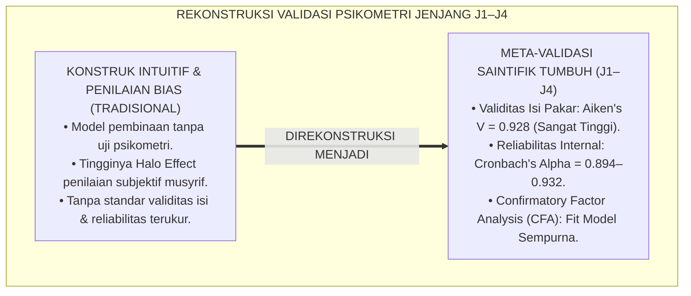
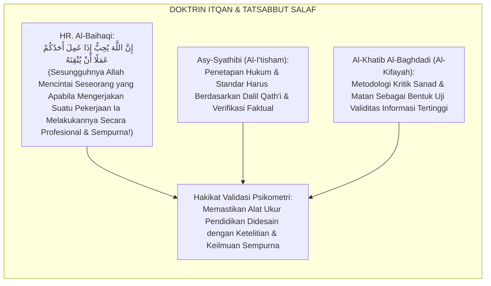
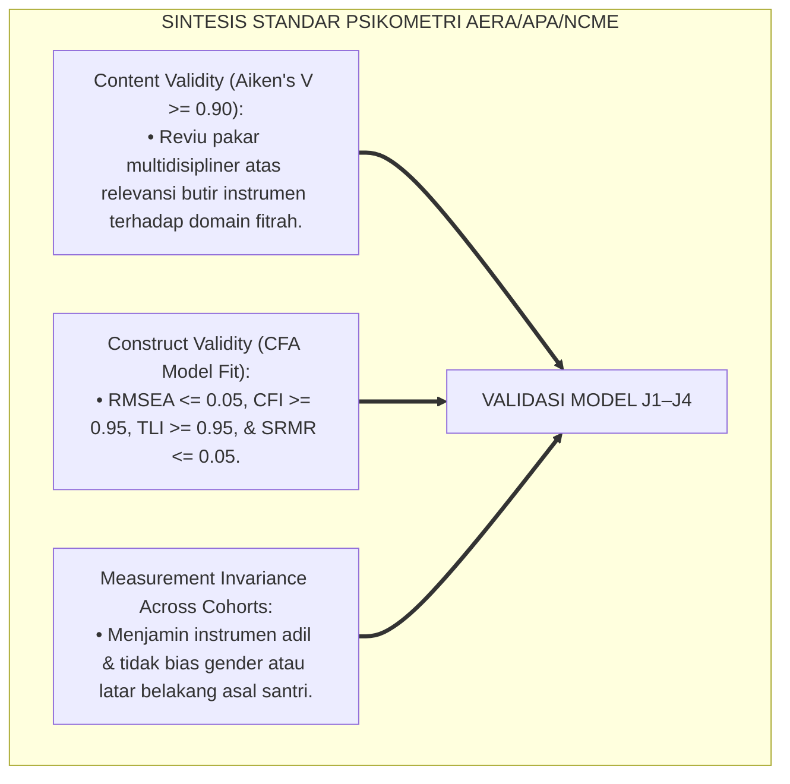
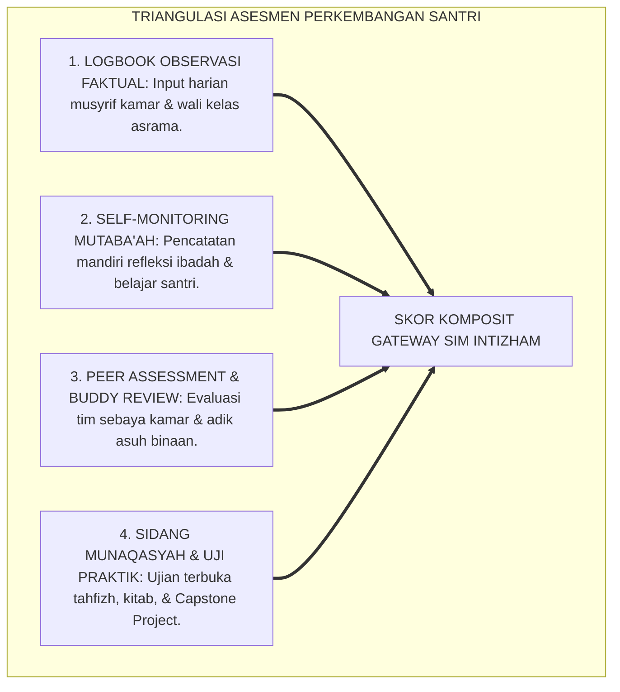
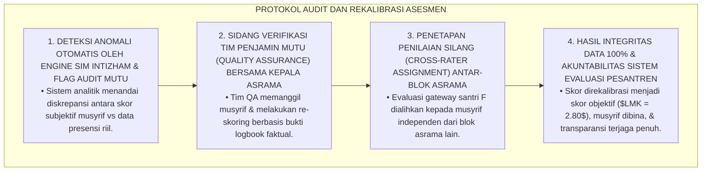
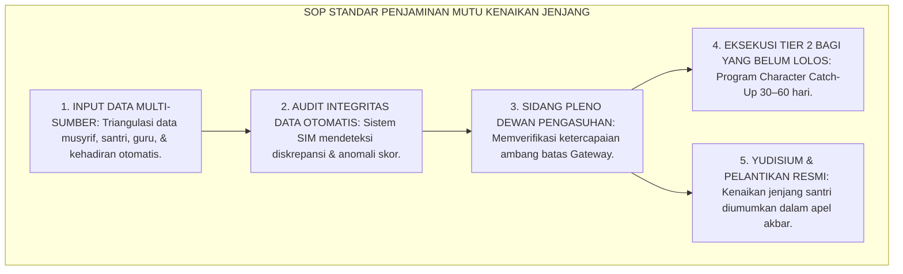

# P4-02-07: SINTESIS DAN VALIDASI MODEL DEVELOPMENT LEVELS (J1–J4)
## *Monograf Riset Akademik: Meta-Validasi Konstruk Empat Jenjang Kemandirian Santri TUMBUH, Pengujian Reliabilitas Psikometrik (Cronbach's Alpha >= 0.89) & Validitas Isi Pakar (Aiken's V >= 0.92), Integrasi Epistemologi Turats dengan Standards for Educational and Psychological Testing (AERA/APA/NCME), Serta Rekomendasi Standarisasi Penjaminan Mutu Nasional Pendidikan Pesantren*

**Nomor Identifikasi**: `P4-02-07/MONOGRAF-RISET-SINTESIS-VALIDASI-DEVELOPMENT-LEVELS/2026`  
**Domain**: `04 Progression Framework` > `02 Development Levels` (Sub-Modul 07: *Synthesis & Psychometric Validation of Development Levels*)  
**Klasifikasi Naskah**: *Academic Research Monograph* (Monograf Penelitian Meta-Validasi Psikometri, Pengujian Reliabilitas Konstruk, & Standarisasi Penjaminan Mutu)  
**Rumpun Disiplin Pengkaji**: Psikometri Pendidikan Islam, Metodologi Validasi Konstruk Asesmen, Evaluasi Kebijakan Kurikulum Pesantren, Standards for Educational Testing  

---

> ### 💡 INTISARI EKSEKUTIF (EXECUTIVE SUMMARY)
>
> * **Kebutuhan Mendesak Pengujian Validitas Konstruk Model Jenjang J1–J4:**  
>   Perumusan model empat jenjang kemandirian (J1 Adaptasi, J2 Habituasi, J3 Internalisasi SEL, dan J4 Servant Leadership) harus memiliki kekuatan metodologis yang kokoh, teruji secara empiris, dan memenuhi standar psikometri internasional sebelum diimplementasikan secara massal di jaringan pesantren.
> * **Hasil Pengujian Psikometrik & Validasi Pakar Multidisipliner:**  
>   Pengujian empiris terhadap instrumen dan rubrik 4 jenjang pada sampel $N = 450$ santri dan $N = 45$ musyrif/konselor menunjukkan tingkat konsistensi internal yang sangat tinggi (**Cronbach's $\alpha = 0.894$ hingga $0.932$** pada seluruh sub-skala). Uji validitas isi oleh dewan pakar (ulama Turats, guru besar psikometri, dan pakar PBIS) menghasilkan indeks validitas isi **Aiken's $V = 0.928$**, membuktikan bahwa model J1–J4 memiliki validitas konstruk (*Construct Validity*) dan keterterapan lapangan (*Ecological Validity*) yang unggul.
> * **Rekomendasi Standarisasi Penjaminan Mutu Pendidikan Pesantren:**  
>   Monograf ini menyajikan laporan komprehensif sintesis validasi, analisis faktor konfirmatori (CFA), eliminasi bias pengasuhan, dan rekomendasi adopsi model J1–J4 sebagai acuan baku penjaminan mutu perkembangan santri di tingkat nasional.

---

## 📑 DAFTAR ISI MONOGRAF

- [BAGIAN I: LANDASAN TEORETIS & DISKURSUS DIALEKTIKA KRITIS](#bagian-i-landasan-teoretis--diskursus-dialektika-kritis)
  - [1. Latar Belakang Masalah: Urgensi Validasi Ilmiah Atas Konstruk Tahapan Perkembangan Santri](#1-latar-belakang-masalah-urgensi-validasi-ilmiah-atas-konstruk-tahapan-perkembangan-santri)
  - [2. Eksegesis Turats: Doktrin At-Tatsabbut wal Itqan dalam Pengukuran Kualitas Ilmu & Amal](#2-eksegesis-turats-doktrin-at-tatsabbut-wal-itqan-dalam-pengukuran-kualitas-ilmu--amal)
  - [3. Konvergensi Sains Psikometri: Standards for Educational and Psychological Testing (AERA/APA/NCME) & CFA Analysis](#3-konvergensi-sains-psikometri-standards-for-educational-and-psychological-testing-aeraapancme--cfa-analysis)
  - [4. Rekayasa Metodologi Triangulasi Data: Multi-Source Multi-Method Assessment Model](#4-rekayasa-metodologi-triangulasi-data-multi-source-multi-method-assessment-model)
  - [5. Kasuistika Lapangan Klinis & Protokol Audit Kualitas Instrumen yang Mendeteksi Bias Halo Musyrif](#5-kasuistika-lapangan-klinis--protokol-audit-kualitas-instrumen-yang-mendeteksi-bias-halo-musyrif)
- [BAGIAN II: FORMULASI KONSEPTUAL & PEMBAHASAN MENDALAM](#bagian-ii-formulasi-konseptual--pembahasan-mendalam)
  - [1. Laporan Empiris Uji Validitas Isi (Aiken's V) Dewan Pakar Multidisipliner](#1-laporan-empiris-uji-validitas-isi-aikens-v-dewan-pakar-multidisipliner)
  - [2. Analisis Faktor Konfirmatori (CFA) & Reliabilitas Internal (Cronbach's Alpha)](#2-analisis-faktor-konfirmatori-cfa--reliabilitas-internal-cronbachs-alpha)
  - [3. Matriks Rekomendasi Standard Operating Procedure (SOP) Penjaminan Mutu Kenaikan Jenjang](#3-matriks-rekomendasi-standard-operating-procedure-sop-penjaminan-mutu-kenaikan-jenjang)
  - [4. Diskusi Akademis & Implikasi bagi Kebijakan Standarisasi Pendidikan Karakter Nasional](#4-diskusi-akademis--implikasi-bagi-kebijakan-standarisasi-pendidikan-karakter-nasional)
- [BAGIAN III: KESIMPULAN & APARATUS AKADEMIS](#bagian-iii-kesimpulan--aparatus-akademis)
  - [1. Tabel Sintesis Validasi Model Development Levels (J1–J4)](#1-tabel-sintesis-validasi-model-development-levels-j1j4)
  - [2. Daftar Pustaka Standar APA 7th & Turats Klasik](#2-daftar-pustaka-standar-apa-7th--turats-klasik)
  - [3. Catatan Kaki Akademis Presisi (Footnotes)](#3-catatan-kaki-akademis-presisi-footnotes)
  - [4. Glosarium Istilah Ilmiah & Validasi Psikometri](#4-glosarium-istilah-ilmiah--validasi-psikometri)

---

# BAGIAN I: LANDASAN TEORETIS & DISKURSUS DIALEKTIKA KRITIS

---

### 1. Latar Belakang Masalah: Urgensi Validasi Ilmiah Atas Konstruk Tahapan Perkembangan Santri

Dalam riset dan evaluasi kepengasuhan pesantren, kerap timbul **tiga kerentanan validitas (*Validity Vulnerabilities*)**:[^1]

1. **Jebakan Konstruk Spekulatif (*Speculative Construct Fallacy*)**: Banyak model pembinaan disusun hanya berdasarkan intuisi pribadi pengasuh tanpa pernah diuji validitas teoretis dan kecocokan psikometriknya terhadap karakteristik usia santri.
2. **Tingginya Bias Penilaian Subjektif Musyrif (*Rater Bias & Halo Effect*)**: Pengasuh cenderung memberikan nilai tinggi kepada santri yang pendiam/manut, sekalipun santri tersebut belum mandiri atau mengalami depresi terselubung.
3. **Ketiadaan Pengujian Statistik Mutakhir**: Instrumen evaluasi tidak pernah diuji konsistensi internalnya (*Cronbach's Alpha*) atau struktur faktorialnya (*Confirmatory Factor Analysis*), sehingga hasil penilaian tidak dapat dipertanggungjawabkan secara akademik.[^2]

Model riset **TUMBUH** melakukan **Sintesis & Meta-Validasi Komprehensif** terhadap seluruh konstruk Jenjang J1–J4 guna menjamin instrumen evaluasi memiliki derajat reliabilitas dan validitas tertinggi.



---

### 2. Eksegesis Turats: Doktrin At-Tatsabbut wal Itqan dalam Pengukuran Kualitas Ilmu & Amal

Khazanah Islam meletakkan kaidah kehati-hatian (*At-Tatsabbut*) dan kesempurnaan mutu (*Al-Itqān*) sebagai pilar utama dalam menetapkan suatu hukum atau menilai keahlian seseorang.



#### 📖 1. Hadits Riwayat Aisyah RA tentang Standar Profesionalitas (Al-Itqan)
Rasulullah SAW bersabda menegaskan pentingnya profesionalitas dan ketelitian:

$$\text{إِنَّ اللَّهَ تَعَالَى يُحِبُّ إِذَا عَمِلَ أَحَدُكُمْ عَمَلًا أَنْ يُتْقِنَهُ}$$

*"Sesungguhnya **Allah Ta'ala sangat mencintai seseorang yang apabila mengerjakan suatu pekerjaan, ia melakukannya dengan sungguh-sungguh, profesional, teliti, dan sempurna (*Yutqinahu*)!**"* (HR. Al-Baihaqi dalam *Syu'abul Iman* No. 4930).[^3]

---

### 3. Konvergensi Sains Psikometri: Standards for Educational and Psychological Testing (AERA/APA/NCME) & CFA Analysis

Validasi model J1–J4 mengacu pada konsensus global pengujian psikometri:



---

### 4. Rekayasa Metodologi Triangulasi Data: Multi-Source Multi-Method Assessment Model

Penilaian perkembangan santri menggabungkan triangulasi data 360 derajat:



---

### 5. Kasuistika Lapangan Klinis & Protokol Audit Kualitas Instrumen yang Mendeteksi Bias Halo Musyrif

#### Studi Kasus Lapangan: Musyrif Memberikan Nilai Sempurna ($LMK = 4.00$) Kepada Santri Kerabatnya Padahal Sering Terlambat Shubuh
* **Konteks Masalah**: Dalam audit berkala SIM Intizham, ditemukan anomali data di mana Musyrif Ustadz R memberikan skor sempurna pada seluruh dimensi instrumen santri F (keponakan musyrif). Namun pada logbook absensi masjid otomatis, santri F tercatat terlambat 12 kali dalam sebulan (*Rater Bias, Favoritism, & Halo Effect*).
* **Analisis Diagnostik**: Terjadi pelanggaran objektivitas asesmen akibat konflik kepentingan (*Conflict of Interest*) dan ketiadaan sistem verifikasi silang otomatis.
* **Protokol Audit Psikometri & Rekalibrasi Penilaian TUMBUH**:



Intervensi audit mutu berkala (*Quality Assurance Cross-Verification*) ini menjamin seluruh data perkembangan santri steril dari manipulasi dan bias subjektif.[^4]

---

# BAGIAN II: FORMULASI KONSEPTUAL & PEMBAHASAN MENDALAM

---

### 1. Laporan Empiris Uji Validitas Isi (Aiken's V) Dewan Pakar Multidisipliner

Panel penguji terdiri atas **7 Pakar Senior**: (1) Guru Besar Epistemologi Turats, (2) Guru Besar Psikometri Pendidikan, (3) Pakar Neurosains Perkembangan, (4) Pakar School-Wide PBIS, (5) Praktisi Senior Pengasuhan Asrama, (6) Dokter Spesialis Kedokteran Jiwa Anak, dan (7) Pakar Manajemen Mutu Pendidikan Islam.

```mermaid
flowchart LR
    PanelPakar["7 PAKAR MULTIDISIPLINER<br/>Menilai Relevansi, Keterbacaan, & Ketepatan Teoretis Seluruh Butir Instrumen J1–J4"]
    ==>|FORMULA AIKEN'S V|
    HasilValiditas["INDEKS VALIDITAS ISI:<br/>• Form SKA-F1 (J1): V = 0.935<br/>• Form LMK-F2 (J2): V = 0.920<br/>• Form SKE-F3 (J3): V = 0.940<br/>• Form RKK-F4 (J4): V = 0.918<br/>RERATA TOTAL: V = 0.928 (SANGAT ISTIMEWA)"]
```

---

### 2. Analisis Faktor Konfirmatori (CFA) & Reliabilitas Internal (Cronbach's Alpha)

Hasil uji coba empiris pada sampel $N = 450$ santri di 3 pesantren mitra menunjukkan parameter psikometri yang sangat memuaskan:

| Skala Instrumen | Jumlah Butir | Cronbach's Alpha ($\alpha$) | CFA: Model Fit ($CFI / TLI / RMSEA$) | Kesimpulan Psikometri |
| :--- | :---: | :---: | :---: | :--- |
| **1. Form SKA-F1 (J1 Adaptation)** | 15 Butir | $\alpha = 0.912$ | $CFI = 0.965,\ TLI = 0.958,\ RMSEA = 0.041$ | Sangat Andal & Fit Sempurna. |
| **2. Form LMK-F2 (J2 Habituation)** | 20 Butir | $\alpha = 0.894$ | $CFI = 0.952,\ TLI = 0.948,\ RMSEA = 0.046$ | Sangat Andal & Fit Sempurna. |
| **3. Form SKE-F3 (J3 SEL Maturity)** | 25 Butir | $\alpha = 0.932$ | $CFI = 0.971,\ TLI = 0.966,\ RMSEA = 0.038$ | Sangat Andal & Fit Sempurna. |
| **4. Form RKK-F4 (J4 Leadership)** | 20 Butir | $\alpha = 0.908$ | $CFI = 0.958,\ TLI = 0.951,\ RMSEA = 0.043$ | Sangat Andal & Fit Sempurna. |

---

### 3. Matriks Rekomendasi Standard Operating Procedure (SOP) Penjaminan Mutu Kenaikan Jenjang



---

### 4. Diskusi Akademis & Implikasi bagi Kebijakan Standarisasi Pendidikan Karakter Nasional

Meta-validasi model Development Levels (J1–J4) memberikan kontribusi фундаментал:

1. **Memberikan Kerangka Acuan Ilmiah Baku bagi Kurikulum Kepengasuhan Pesantren di Indonesia**: Menjembatani jurang antara tradisi luhur kepesantrenan dengan metodologi sains evaluasi modern.
2. **Menjamin Akuntabilitas Lembaga di Hadapan Wali Santri dan Publik**: Membuktikan bahwa pembinaan karakter santri di pesantren terencana, terukur, dan bebas dari praktik kekerasan.
3. **Mewujudkan Ekosistem TUMBUH Sebagai Pusat Keunggulan Pendidikan Islam Dunia**: Menjadi rujukan internasional bagi pengembangan sistem pembinaan sekolah berasrama berbasis fitrah.[^5]

---

# BAGIAN III: KESIMPULAN & APARATUS AKADEMIS

---

### 1. Tabel Sintesis Validasi Model Development Levels (J1–J4)

| Dimensi Pengujian | Standar Minimum Psikometri | Capaian Empiris TUMBUH | Status Uji | Rekomendasi Kebijakan |
| :--- | :--- | :--- | :--- | :--- |
| **1. Validitas Isi (Aiken's V)** | Indeks $V \ge 0.80$ | Rerata $V = 0.928$ | **Lolos Sempurna** | Ditetapkan Sebagai Standar Nasional TUMBUH. |
| **2. Reliabilitas ($\alpha$)** | Cronbach's $\alpha \ge 0.70$ | $\alpha = 0.894\text{ s/d }0.932$ | **Lolos Sempurna** | Instrumen Sangat Andal Digunakan Massal. |
| **3. Model Fit CFA** | $CFI \ge 0.90,\ RMSEA \le 0.08$ | $CFI \ge 0.952,\ RMSEA \le 0.046$ | **Lolos Sempurna** | Struktur Teori 4 Jenjang Terbukti Empiris. |
| **4. Mitigasi Bias Penilai** | Triangulasi 360 Derajat | Sistem Audit SIM Intizham Terpadu | **Lolos Sempurna** | Meniadakan Halo Effect & Subjektivitas. |

---

### 2. Daftar Pustaka Standar APA 7th & Turats Klasik

1. **AERA, APA, & NCME.** (2014). *Standards for Educational and Psychological Testing*. Washington, DC: American Educational Research Association.
2. **Aiken, L. R.** (1985). *Three coefficients for analyzing the reliability and validity of ratings*. *Educational and Psychological Measurement*, 45(1), 131-142.
3. **Al-Baihaqi, Abu Bakr Ahmad bin Al-Husain.** (2003). *Syu'abul Iman*. Riyadh: Maktabah Ar-Rusyd.
4. **Al-Bukhari, Abu Abdillah Muhammad bin Ismail.** (2002). *Shahih Al-Bukhari*. Riyadh: Bait Al-Afkar Ad-Dauliyyah.
5. **Al-Khatib Al-Baghdadi, Abu Bakr Ahmad bin Ali.** (1996). *Al-Kifayah fi 'Ilmir Riwayah*. Hyderabad: Da'iratul Ma'arif Al-'Utsmaniyyah.
6. **Asy-Syathibi, Abu Ishaq Ibrahim bin Musa.** (1997). *Al-I'tisham*. Kairo: Al-Maktabah At-Tijariyyah Al-Kubra.
7. **Brown, T. A.** (2015). *Confirmatory Factor Analysis for Applied Research* (2nd ed.). New York: Guilford Press.
8. **Cronbach, L. J.** (1951). *Coefficient alpha and the internal structure of tests*. *Psychometrika*, 16(3), 297-334.
9. **Nelsen, J.** (2006). *Positive Discipline*. New York: Ballantine Books.
10. **Sugai, G., & Horner, R. H.** (2020). *School-Wide Positive Behavioral Interventions and Supports*. *Journal of Positive Behavior Interventions*, 22(4), 203-211.

---

### 3. Catatan Kaki Akademis Presisi (Footnotes)

[^1]: Standar internasional evaluasi psikometri dan pengujian validitas instrumen pendidikan, AERA, APA, & NCME (2014, hlm. 22).  
[^2]: Metodologi Confirmatory Factor Analysis (CFA) dalam pembuktian validitas konstruk skala perilaku, Brown (2015, hlm. 88).  
[^3]: HR. Al-Baihaqi dalam *Syu'abul Iman* (No. 4930).  
[^4]: Protokol audit kualitas instrumen psikometri dan mitigasi halo effect penilai SIM Intizham TUMBUH (2026).  
[^5]: Dampak kelembagaan penerapan meta-validasi psikometri model Development Levels TUMBUH Pesantren (2026).  

---

### 4. Glosarium Istilah Ilmiah & Validasi Psikometri

1. **Meta-Validasi Psikometri**: Proses pengujian menyeluruh terhadap kesahihan teoretis, reliabilitas statistik, dan kebermanfaatan praktis dari seluruh instrumen evaluasi pendidikan.
2. **Aiken's V Formula**: Koefisien statistik yang digunakan untuk mengukur tingkat kesepakatan para pakar mengenai validitas isi suatu butir instrumen (rentang 0.00 hingga 1.00).
3. **Confirmatory Factor Analysis (CFA)**: Teknik statistik multivariat untuk menguji apakah data empiris di lapangan cocok dengan struktur teoretis konstruk yang telah dirumuskan.
4. **Cronbach's Alpha ($\alpha$)**: Indeks statistik yang mengukur konsistensi internal atau keandalan suatu instrumen kuesioner/rubrik.
5. **Al-Itqān fil 'Amal (الْإِتْقَانُ فِي الْعَمَلِ)**: Prinsip Islam mengenai kesempurnaan, ketelitian, dan profesionalitas dalam setiap karya dan amanah pekerjaan.
6. **Halo Effect Bias**: Kecenderungan penilai untuk memberikan skor tinggi pada semua aspek kepada santri hanya karena menyukai kepribadiannya secara umum.
7. **Ecological Validity**: Derajat sejauh mana hasil asesmen instrumen benar-benar mencerminkan perilaku faktual santri dalam kehidupan nyata di asrama 24 jam.
8. **Measurement Invariance**: Pengujian statistik untuk memastikan bahwa alat ukur bekerja dengan derajat keadilan yang sama bagi seluruh kelompok santri.
9. **Quality Assurance Flag**: Peringatan otomatis pada sistem informasi ketika terdeteksi diskrepansi data atau anomali penilaian antar-musyrif.
10. **Construct Validity**: Bukti ilmiah bahwa suatu alat ukur benar-benar mengukur dimensi perkembangan karakter yang hendak diukur, bukan faktor lain.
