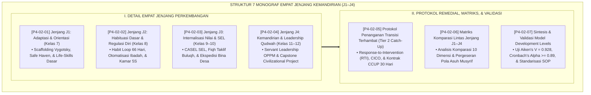

# P4-02: DOKUMEN INDUK DETAIL EMPAT JENJANG KEMANDIRIAN SANTRI (J1–J4)
## *Arsitektur Matriks Progresi Empat Tangga Kematangan Santri (Jenjang J1 Adaptasi & Orientasi, Jenjang J2 Habituasi Dasar, Jenjang J3 Internalisasi Nilai & SEL, Serta Jenjang J4 Kemandirian & Kepemimpinan Qudwah), Protokol Gateway Transisi, Serta Sistem Penjaminan Mutu Kepengasuhan 24 Jam di Ekosistem TUMBUH Pesantren*

**Nomor Identifikasi**: `P4-02/DOKUMEN-INDUK-DETAIL-4-JENJANG-KEMANDIRIAN/2026`  
**Domain**: `04 Progression Framework` > `02 Development Levels` (Gugus Sub-Domain 02: *Detailed 4 Levels of Independence J1–J4*)  
**Klasifikasi Naskah**: *Master Architecture & Navigation Monograph* (Dokumen Induk Peta Jalan Riset & Navigasi 7 Monograf Ilmiah Jenjang Kemandirian)  
**Rumpun Disiplin Pengkaji**: Desain Kurikulum Kepengasuhan Berjenjang, Epistemologi Fitrah Islam, School-Wide PBIS Multi-Tier, Evaluasi Outcome-Based Education (OBE)  

---

> ### 💡 INTISARI EKSEKUTIF (EXECUTIVE SUMMARY)
>
> * **Kedudukan Strategis Gugus Detail 4 Jenjang Kemandirian (J1–J4):**  
>   Gugus *Development Levels (Jenjang Perkembangan Kemandirian)* merupakan operasionalisasi praksis dari Taksonomi 10 Kapasitas Insan TUMBUH ke dalam 4 tangga penahapan kelas santri: **Jenjang J1 (Kelas 7, Usia 12–13 Tahun / Adaptasi & Orientasi)**, **Jenjang J2 (Kelas 8, Usia 13–14 Tahun / Habituasi Dasar)**, **Jenjang J3 (Kelas 9–10, Usia 15–16 Tahun / Internalisasi Nilai & CASEL SEL)**, dan **Jenjang J4 (Kelas 11–12, Usia 17–18 Tahun / Kemandirian Moral & Servant Leadership)**.
> * **Integrasi Holistik Fiqh Marahil at-Tadrij & Konsensus Sains Internasional:**  
>   Gugus riset ini memadukan konsep penahapan fitrah (*At-Tadrīj ma'al Fitrah*) dalam Turats Salaf (*Ihya' 'Ulumiddin* Al-Ghazali, *Tuhfatul Maudud* Ibnu Qayyim, dan *Adab ash-Shibyan* Ibnu Sahnun) dengan teori psikologi kognitif dan sosial mutakhir (*Vygotsky Scaffolding, Wood & Neal Habit Loop, CASEL Social-Emotional Learning, Greenleaf Servant Leadership, dan Fuchs Response-to-Intervention*).
> * **Struktur Lengkap 7 Berkas Monograf Riset Ilmiah:**  
>   Dokumen induk ini memetakan dan menghubungkan 7 berkas monograf penelitian akademik komprehensif (~190 KB total riset) yang menyajikan profil capaian, studi kasus klinis, protokol Tier 2 remedial catch-up, matriks komparasi 10 dimensi, dan hasil meta-validasi psikometrik teruji.

---

## 📑 PETA NAVIGASI TUJUH MONOGRAF RISET EMPAT JENJANG KEMANDIRIAN

Berikut adalah daftar lengkap 7 monograf riset akademik dalam gugus **`02 Development Levels`**:

---

## 📚 DESKRIPSI RINGKAS 7 BERKAS MONOGRAF

1. **[P4-02-01: Jenjang J1 — Adaptasi dan Orientasi](file:///c:/xampp/htdocs/tumbuh/04%20Progression%20Framework/02%20Development%20Levels/P4-02-01-Jenjang-J1-Adaptasi-dan-Orientasi.md)**  
   *Membahas karakteristik santri kelas 7 (usia 12–13 tahun), ZPD Lev Vygotsky, pendampingan scaffolding musyrif kamar, eliminasi perpeloncoan, dan standar kenaikan jenjang (SKA-F1 $\ge 2.50$).*
2. **[P4-02-02: Jenjang J2 — Habituasi Dasar dan Regulasi Diri](file:///c:/xampp/htdocs/tumbuh/04%20Progression%20Framework/02%20Development%20Levels/P4-02-02-Jenjang-J2-Habituasi-Dasar.md)**  
   *Membahas otomatisasi ibadah dan disiplin belajar santri kelas 8 (usia 13–14 tahun), Self-Determination Theory, siklus konsistensi 66 hari Philippa Lally, 5S kamar tidur, dan sertifikasi P3K dasar.*
3. **[P4-02-03: Jenjang J3 — Internalisasi Nilai dan Social-Emotional Learning](file:///c:/xampp/htdocs/tumbuh/04%20Progression%20Framework/02%20Development%20Levels/P4-02-03-Jenjang-J3-Internalisasi-Nilai-dan-SEL.md)**  
   *Membahas kematangan emosi pubertas santri kelas 9–10 (usia 15–16 tahun), 5 Kompetensi CASEL SEL, Fiqh Marahil at-Taklif, peran Restorative Buddy J1, dan Ekspedisi Santri Bina Desa.*
4. **[P4-02-04: Jenjang J4 — Kemandirian dan Kepemimpinan Qudwah](file:///c:/xampp/htdocs/tumbuh/04%20Progression%20Framework/02%20Development%20Levels/P4-02-04-Jenjang-J4-Kemandirian-dan-Kepemimpinan-Qudwah.md)**  
   *Membahas kepemimpinan pelayan santri kelas 11–12 (usia 17–18 tahun), doktrin Sayyidul Qaumi Khadimuhum, Servant Leadership Robert Greenleaf, Capstone Project kelulusan, dan imunitas moral kampus.*
5. **[P4-02-05: Protokol Penanganan Transisi Terhambat (Tier 2 Catch-Up)](file:///c:/xampp/htdocs/tumbuh/04%20Progression%20Framework/02%20Development%20Levels/P4-02-05-Protokol-Penanganan-Transisi-Terhambat-Catch-Up.md)**  
   *Membahas intervensi terarah bagi santri tertinggal (10–15%), Response-to-Intervention (RTI), sistem pendampingan harian Check-In/Check-Out (CICO), dan kontrak belajar Character Catch-Up Plan (CCUP).*
6. **[P4-02-06: Matriks Komparasi Lintas Jenjang J1–J4](file:///c:/xampp/htdocs/tumbuh/04%20Progression%20Framework/02%20Development%20Levels/P4-02-06-Matriks-Komparasi-Lintas-Jenjang-J1-J4.md)**  
   *Membahas perbandingan komprehensif 4 jenjang pada 10 dimensi perkembangan, trajektori pergeseran peran musyrif dari In Loco Parentis hingga Strategic Mentor, dan keadilan ekspektasi usia.*
7. **[P4-02-07: Sintesis dan Validasi Model Development Levels](file:///c:/xampp/htdocs/tumbuh/04%20Progression%20Framework/02%20Development%20Levels/P4-02-07-Sintesis-dan-Validasi-Development-Levels.md)**  
   *Membahas meta-validasi psikometrik model J1–J4, indeks validitas isi Aiken's V = 0.928, reliabilitas internal Cronbach's Alpha = 0.894–0.932, analisis faktor konfirmatori (CFA), dan audit bias penilai.*

---

## 🎯 STANDAR PENJAMINAN MUTU PERKEMBANGAN 4 JENJANG

Penerapan gugus **Detail Empat Jenjang Kemandirian (Development Levels)** menjamin bahwa:
1. **Penahapan Kurikulum Sesuai Kesiapan Usia (*Developmentally Appropriate Practice*)**: Menghilangkan kekeliruan menuntut kemandirian instan pada santri baru atau mengekang santri senior.
2. **Keadilan Sistemik Tanpa Kekerasan (*Zero Punishment Sanctuary*)**: Meniadakan hukuman fisik, rotan, atau intimidasi senioritas, digantikan oleh disiplin restoratif dan program bimbingan terarah Tier 2.
3. **Mencetak Kader Pemimpin Peradaban Berjiwa Pelayan (*Civilizational Servant Leader*)**: Memastikan setiap alumni lulus dengan integritas spiritual kokoh, kecerdasan nalar ilmiah, dan dedikasi mengabdi bagi kemakmuran umat.
