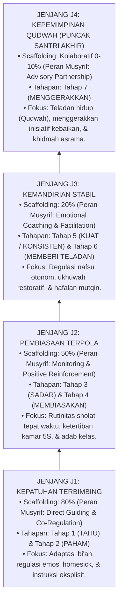

# P4-02: DETAIL EMPAT JENJANG KEMANDIRIAN SANTRI (J1, J2, J3, J4)
## *Monograf Riset: Arsitektur 4 Jenjang Kemandirian Adab Asrama (J1 Terbimbing, J2 Pembiasaan, J3 Mandiri, J4 Qudwah), Korelasi 10 Tahapan Pembentukan Karakter (Tahu s/d Pemberdaya), Matriks Scaffolding Decay Musyrif, serta Protokol Transisi PBIS*

**Nomor Identifikasi**: `P4-02/MONOGRAF-INDUK-4-JENJANG-KEMANDIRIAN/2026`  
**Domain**: `04 Progression Framework` > `02 Development Levels`  
**Klasifikasi Naskah**: *Academic Research Monograph* (Monograf 4 Jenjang Kemandirian Santri)  
**Rumpun Disiplin Pengkaji**: Desain Taksonomi Kemandirian, Manajemen Asrama PBIS, Psikologi Perkembangan Remaja, Fiqh Tadarruj  

---

> ### 💡 INTISARI EKSEKUTIF (EXECUTIVE SUMMARY)
>
> * **Nomenklatur Baku: Jenjang Kemandirian J1–J4:**  
>   Untuk membedakan secara tegas dengan **10 Tahapan Pembentukan Karakter (Tahap 1–10)**, empat tingkatan kemandirian santri dinamakan **Jenjang J1, J2, J3, dan J4**:
>   1. **Jenjang J1: Kepatuhan Terbimbing (*Guided Compliance*)** $\rightarrow$ Mencakup *Tahap 1 (Tahu)* & *Tahap 2 (Paham)*. Scaffolding musyrif: 80%.  
>   2. **Jenjang J2: Pembiasaan Terpola (*Habituated Practice*)** $\rightarrow$ Mencakup *Tahap 3 (Sadar)* & *Tahap 4 (Membiasakan)*. Scaffolding musyrif: 50%.  
>   3. **Jenjang J3: Kemandirian Stabil (*Autonomous Stability*)** $\rightarrow$ Mencakup *Tahap 5 (Kuat/Konsisten)* & *Tahap 6 (Memberi Teladan)*. Scaffolding musyrif: 20%.  
>   4. **Jenjang J4: Kepemimpinan Qudwah (*Exemplary Leadership*)** $\rightarrow$ Mencakup *Tahap 7 (Menggerakkan)* (Puncak Santri Akhir). Scaffolding musyrif: Kolaboratif (0–10%).  
>   * **Pasca-Pesantren (Pengabdian & Alumni)** $\rightarrow$ Mencakup *Tahap 8 (Pelaksana)*, *Tahap 9 (Pembina)*, dan *Tahap 10 (Pemberdaya)*.

---

## 🏛️ 1. ARSITEKTUR KOMPREHENSIF 4 JENJANG KEMANDIRIAN (J1–J4)

---

| Jenjang / Fase Ekosistem | Tahapan Karakter Padanan | Profil Institusional & Praktik Perilaku Nyata | Peran Pendampingan / Tanggung Jawab | Target Tahapan |
| :--- | :--- | :--- | :--- | :---: |
| **Jenjang J1 (Kepatuhan Terbimbing)** | **1. TAHU** **2. PAHAM** | **Santri Baru (Kelas 7 MTs/SMP)**: Memerlukan instruksi eksplisit, bimbingan adab shalat, penyesuaian kamar, & pemahaman dalil/hikmah. | **Instruktur & Pengasuh Langsung** (80% Scaffolding Musyrif). | Semester 1 (Bulan 1–6) |
| **Jenjang J2 (Pembiasaan Terpola)** | **3. SADAR** **4. MEMBIASAKAN** | **Santri Madya (Kelas 8 MTs/SMP)**: Bangun subuh mandiri, kamar rapi standar 5S, adab kelas konsisten terpola menjadi kebiasaan harian. | **Fasilitator & Penguat Positif** (50% Scaffolding + Apresiasi 4:1). | Semester 2–4 (Tahun 1–2) |
| **Jenjang J3 (Kemandirian Stabil)** | **5. KUAT / KONSISTEN** **6. MEMBERI TELADAN** | **Santri Menengah (Kelas 9–10 MA/SMA)**: Istiqamah beribadah tanpa diawasi, tahan godaan teman, memancarkan adab teladan di kamar. | **Coach Dialogis & Konselor BK** (20% Scaffolding Reflektif). | Semester 5–8 (Tahun 3–4) |
| **Jenjang J4 (Kepemimpinan Qudwah)** | **7. MENGGERAKKAN** | **Santri Akhir (Kelas 11–12) / Santri Pengabdian Awal**: Menjadi motor penggerak kebaikan, inisiator kegiatan asrama, & teladan aktif bagi adik kelas. | **Mitra Kolaboratif & Penasihat** (0–10% Supervisi Strategis). | Semester 9–12 & Tahun Pengabdian |
| **Pasca-Pesantren: Fase Eksekutor** | **8. PELAKSANA** | **Alumni Lanjut Khidmah di Pondok / Guru-Guru Baru (Tahun 1–3)**: Mengemban amanah eksekusi KBM kelas, teknis piket asrama, & operasional pondok. | **Pelaksana Lapangan & Musyrif Muda** (Dibimbing Guru Senior). | Alumni Mengajar / Staf Baru |
| **Pasca-Pesantren: Fase Pengasuh** | **9. PEMBINA** | **Guru Senior / Asatidz Berpengalaman (Sudah Lulus S1/Senior)**: Membimbing, mengasuh, melatih guru baru, mengelola konseling santri, & membina bi'ah. | **Murabbi, Coach, & Supervisor Pengasuhan** (Pilar Asrama). | Guru Tetap / Asatidz Senior |
| **Pasca-Pesantren: Fase Strategis** | **10. PEMBERDAYA** | **Pimpinan Lembaga / Kyai / Mudir / Pemegang Jabatan Tertinggi**: Menetapkan visi kebijakan makro, memajukan institusi, & memberdayakan peradaban umat. | **Strategic Leader & Empowerer Peradaban** (Pengambil Kebijakan). | Dewan Masyayikh & Pimpinan |

---

## 🏛️ 3. PROTOKOL TRANSISI BERBASIS BUKTI (*EVIDENCE-BASED GATEWAY*)

1. **Syarat Transisi J1 $\rightarrow$ J2**: Konsistensi shalat berjamaah $\ge 80\%$ selama 40 hari, mampu mengelola emosi transisi, dan merapikan tempat tidur mandiri.
2. **Syarat Transisi J2 $\rightarrow$ J3**: Skor BARS 10 karakter mencapai level mandiri konsisten, hafalan mutqin sesuai target tahunan, dan nihil perundungan.
3. **Syarat Transisi J3 $\rightarrow$ J4**: Terbukti menjadi teladan adab di asrama, mampu memimpin kelompok diskusi, dan lulus verifikasi evaluasi 360 derajat.
4. **Protokol Catch-Up Tier 2 PBIS**: Santri yang belum memenuhi syarat transisi mendapatkan bimbingan restoratif terarah dalam kelompok kecil tanpa stigma negatif.
