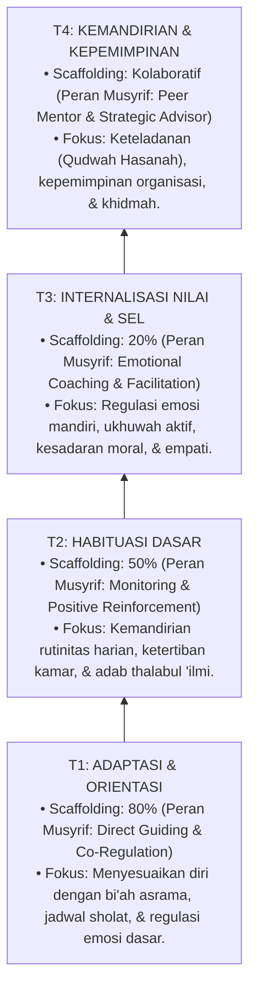
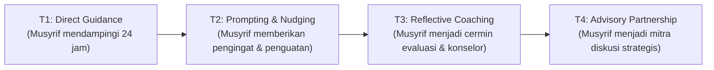

# P4-02: Detail 4 Tangga Perkembangan Santri (T1, T2, T3, T4)

## Status Dokumen
* **Status**: 🌟 **A+ (Tervalidasi & Siap Diimplementasikan)**
* **Sub-Domain**: `04 Progression Framework / 02 Development Levels`
* **Penanggung Jawab Keilmuan**: Dewan Keilmuan TUMBUH (*Pakar Desain Kurikulum Adab & Pakar Bimbingan Konseling*)

---

## 1. Arsitektur Komprehensif Tangga T1–T4

---

## 2. Profil & Matriks Karakteristik Santri Melintasi Tangga T1–T4

### Tangga T1: Adaptasi & Orientasi
* **Target Durasi**: Bulan 1 hingga Bulan 6 (Fase Awal).
* **Indikator Perilaku Kunci**:
  * Mengenal dan mengikuti jadwal harian pesantren dengan pendampingan musyrif.
  * Mampu menyampaikan emosi/keluhan (*homesick*) secara konstruktif kepada musyrif/konselor.
  * Menjaga kebersihan area pribadi (tempat tidur & lemari) dengan arahan langsung.
* **Bentuk Penguatan Positif PBIS**: *Behavioral Nudges*, pujian spesifik verbal (*4:1 Magic Ratio*), dan pengkondisian lingkungan yang ramah emosi.

### Tangga T2: Habituasi Dasar
* **Target Durasi**: Bulan 7 hingga Tahun ke-2.
* **Indikator Perilaku Kunci**:
  * Bangun tepat waktu dan siap sholat berjamaah tanpa perlu dibangunkan berulang kali.
  * Mampu mengelola jadwal piket kamar dan piket kelas secara mandiri (*Munazhzham fi Syu'unih*).
  * Menunjukkan adab dasar kepada guru, musyrif, dan sesama teman.
* **Bentuk Penguatan Positif PBIS**: Sistem poin apresiasi portofolio adab harian dan sertifikat capaian milestone kebersihan/kedisiplinan.

### Tangga T3: Internalisasi Nilai & SEL
* **Target Durasi**: Tahun ke-2 hingga Tahun ke-3.
* **Indikator Perilaku Kunci**:
  * Melakukan amalan sunnah dan mutabaah harian atas kesadaran intrinsik (*Self-Determination*).
  * Mampu menyelesaikan perbedaan pendapat atau konflik antar teman melalui dialog restoratif tanpa kekerasan.
  * Memiliki dorongan empati tinggi dan membantu teman yang mengalami kesulitan belajar/hafalan.
* **Bentuk Penguatan Positif PBIS**: Kesempatan menjadi ketua kelompok diskusi, pembimbing adik kelas (*Peer Assistant*), dan apresiasi kepemimpinan adab.

### Tangga T4: Kemandirian & Kepemimpinan Qudwah
* **Target Durasi**: Tahun ke-3 hingga Kelulusan.
* **Indikator Perilaku Kunci**:
  * Menjadi teladan (*Qudwah Hasanah*) dalam seluruh aspek adab, ibadah, dan kebersihan lingkungan.
  * Mampu memimpin proyek sosial kemasyarakatan (*Khidmah Keumatan*) atau kepengurusan organisasi santri secara profesional.
  * Memiliki regulasi diri utuh (*Mujahadatun Linafsih*) dan kesiapan mandiri pasca-pesantren (*Qadirun 'Alal Kasb*).
* **Bentuk Penguatan Positif PBIS**: Kepercayaan memegang peran strategis kepemimpinan santri dan pin kehormatan *Qudwah Santri TUMBUH*.

---

## 3. Matriks Peran Musyrif & Perampingan Bimbingan (*Scaffolding Decay*)

---

## 4. SOP Penanganan Transisi Terhambat (*Catch-Up Protocol*)

Apabila seorang santri mengalami hambatan untuk naik dari T1 ke T2 atau T2 ke T3:
1. **Analisis Akar Masalah (FBA)**: Musyrif dan Tim BK melakukan evaluasi apakah hambatan bersifat fungsional (misal: masalah kesehatan fisik), emosional (*homesick* kronis), atau akademik.
2. **Intervensi Tier 2 PBIS**: Memberikan pendampingan dalam kelompok kecil (*Small Group Social Skills/Regulasi Diri*) selama 4–6 minggu.
3. **Restoratif & Non-Stigmatisasi**: Dilarang menyebut santri sebagai "santri lambat" atau "bermasalah". Proses evaluasi berfokus pada kemajuan individu (*Growth Mindset*).
