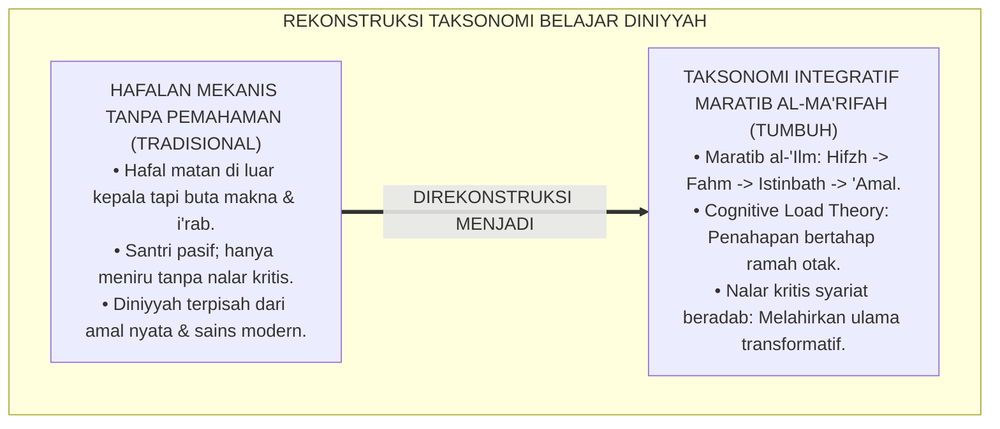
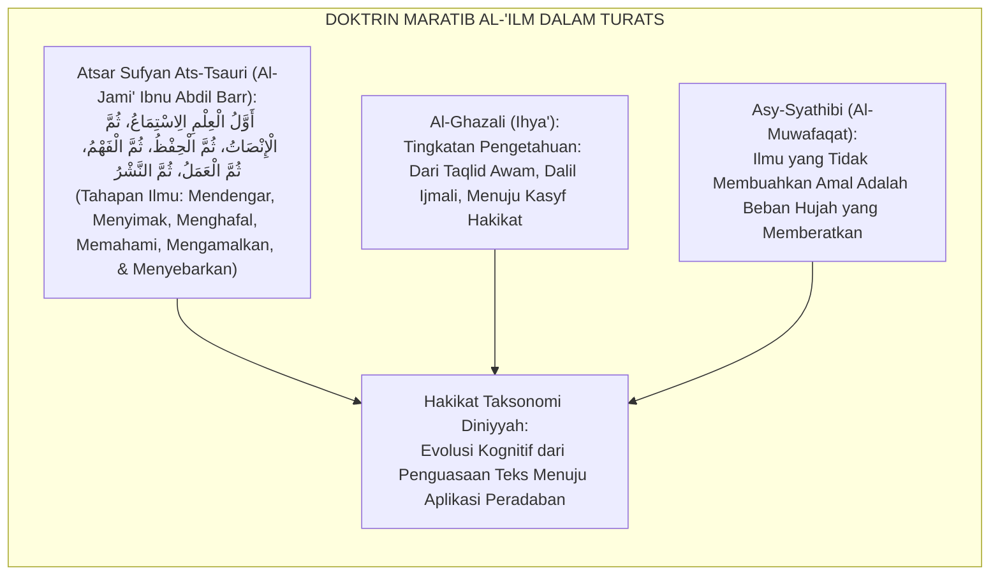
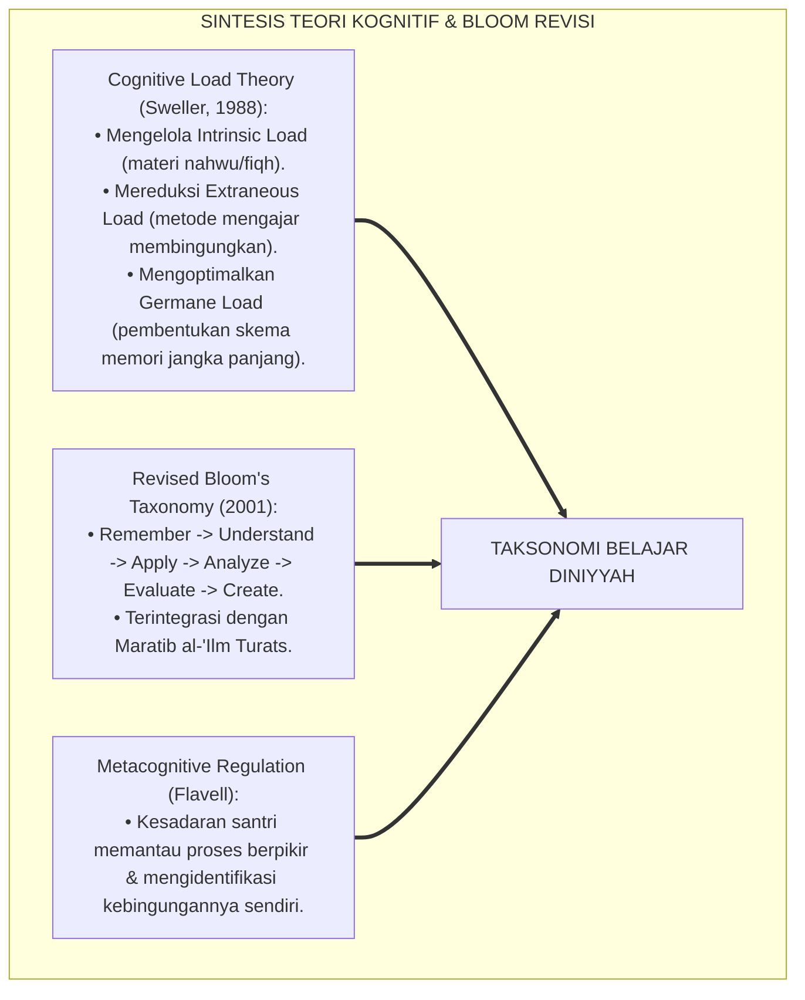
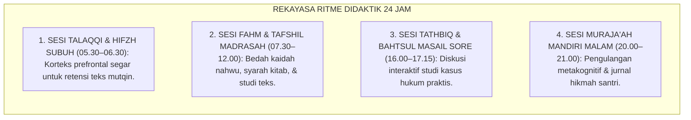
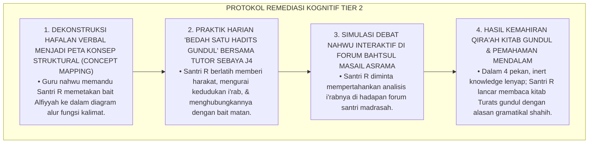
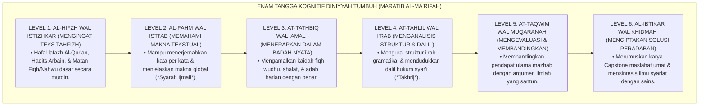
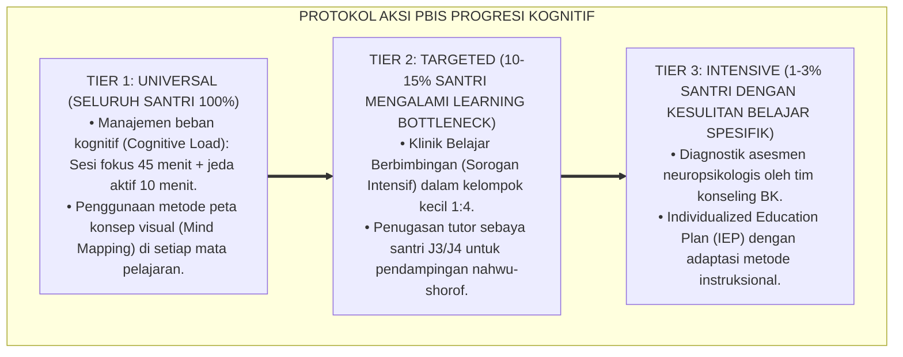

# P4-03-01: PROGRESI KOGNITIF DAN TAKSONOMI BELAJAR DINIYYAH SANTRI
## *Monograf Riset Akademik: Trajektori Perkembangan Kognitif Santri (Usia 12–18 Tahun / Jenjang J1–J4), Rekonstruksi Taksonomi Bloom-Anderson Terintegrasi Maratib al-'Ilm Turats Islam (Hifzh, Fahm, Istinbath, wa 'Amal), Metodologi Didaktik Pembelajaran Diniyyah, Serta Matriks Progresi Berpikir Kritis di Pesantren TUMBUH*

**Nomor Identifikasi**: `P4-03-01/MONOGRAF-RISET-PROGRESI-KOGNITIF-TAKSONOMI-BELAJAR/2026`  
**Domain**: `04 Progression Framework` > `03 Learning Progression` (Sub-Modul 01: *Cognitive Progression & Learning Taxonomy*)  
**Klasifikasi Naskah**: *Academic Research Monograph* (Monograf Penelitian Teori Perkembangan Kognisi Islam, Taksonomi Belajar Diniyyah, & Desain Didaktik)  
**Rumpun Disiplin Pengkaji**: Psikologi Kognitif Pendidikan Islam, Taksonomi Hasil Belajar (*Anderson & Krathwohl*), Epistemologi Turats Maratib al-'Ilm, Desain Instruksional Pesantren  

---

> ### 💡 INTISARI EKSEKUTIF (EXECUTIVE SUMMARY)
>
> * **Kelemahan Model Pembelajaran Kognitif Konvensional di Pesantren:**  
>   Banyak sistem didaktik pesantren terjebak dalam **dua kutub ekstrem kognitif**: hanya berfokus pada hafalan teks hafizhah murni (*Rote Memorization*) tanpa pemahaman makna mendalam (*Fahm al-Ma'ani*), atau sebaliknya mengajarkan nalar filsafat/kritik hukum tingkat tinggi secara prematur kepada santri baru tanpa fondasi hafalan teks yang kokoh.
> * **Integrasi Maratib al-'Ilm Turats & Taksonomi Anderson-Krathwohl:**  
>   Ekosistem TUMBUH merekonstruksi taksonomi belajar dengan memadukan doktrin tingkatan ilmu para ulama salaf (*Marātib al-'Ilm: Samā', Hifzh, Fahm, 'Amal, wa Nasyr*) dengan Taksonomi Bloom Terevisi (*Remember, Understand, Apply, Analyze, Evaluate, & Create*). Pembelajaran diniyyah dipetakan dalam trajektori berjenjang: santri J1 (Hifzh & Fahm Ijmali), santri J2 (Fahm Tafshili & Tathbiq), santri J3 (Tahlil & Istinbath Qiyasi), dan santri J4 (Taqwim & Ibtikar Peradaban).
> * **Arsitektur Progresi Kognitif 4 Jenjang J1–J4:**  
>   Monograf ini merumuskan matriks ketercapaian kognitif, lembar rubrik asesmen berpikir kritis santri, strategi scaffolding metakognitif guru madrasah, dan protokol munaqasyah nalar syariat terstandar.

---

## 📑 DAFTAR ISI MONOGRAF

- [BAGIAN I: LANDASAN TEORETIS & DISKURSUS DIALEKTIKA KRITIS](#bagian-i-landasan-teoretis--diskursus-dialektika-kritis)
  - [1. Latar Belakang Masalah: Dilema Hafalan Buta (Rote Memorization) vs Penalaran Kritis Diniyyah](#1-latar-belakang-masalah-dilema-hafalan-buta-rote-memorization-vs-penalaran-kritis-diniyyah)
  - [2. Eksegesis Turats: Doktrin Maratib al-'Ilm Imam Sufyan Ats-Tsauri & Ibnu Abdil Barr](#2-eksegesis-turats-doktrin-maratib-al-ilm-imam-sufyan-ats-tsauri--ibnu-abdil-barr)
  - [3. Konvergensi Sains Kognitif: Cognitive Load Theory (Sweller) & Revised Bloom's Taxonomy (Anderson)](#3-konvergensi-sains-kognitif-cognitive-load-theory-sweller--revised-blooms-taxonomy-anderson)
  - [4. Rekayasa Didaktik 24 Jam: Dari Talaqqi Hafalan Pagi Menuju Diskusi Bahtsul Masail Sore](#4-rekayasa-didaktik-24-jam-dari-talaqqi-hafalan-pagi-menuju-diskusi-bahtsul-masail-sore)
  - [5. Kasuistika Lapangan Klinis & Protokol Remediasi Santri J3 yang Hafal Matan Nahwu Namun Gagap Menganalisis Struktur I'rab Kitab Kuning](#5-kasuistika-lapangan-klinis--protokol-remediasi-santri-j3-yang-hafal-matan-nahwu-namun-gagap-menganalisis-struktur-irab-kitab-kuning)
- [BAGIAN II: FORMULASI KONSEPTUAL & PEMBAHASAN MENDALAM](#bagian-ii-formulasi-konseptual--pembahasan-mendalam)
  - [1. Arsitektur Komprehensif Taksonomi Belajar Diniyyah TUMBUH (Maratib al-Ma'rifah)](#1-arsitektur-komprehensif-taksonomi-belajar-diniyyah-tumbuh-maratib-al-marifah)
  - [2. Matriks Progresi Kognitif Lintas Jenjang J1–J4 (Dari Hifzh Menuju Ibtikar)](#2-matriks-progresi-kognitif-lintas-jenjang-j1j4-dari-hifzh-menuju-ibtikar)
  - [3. Desain Rubrik Asesmen Nalar Kritis Syariat (Rubrik ANS-Diniyyah)](#3-desain-rubrik-asesmen-nalar-kritis-syariat-rubrik-ans-diniyyah)
  - [4. Diskusi Akademis & Implikasi bagi Reformasi Kurikulum Pendidikan Diniyyah Pesantren](#4-diskusi-akademis--implikasi-bagi-reformasi-kurikulum-pendidikan-diniyyah-pesantren)
- [BAGIAN III: KESIMPULAN & APARATUS AKADEMIS](#bagian-iii-kesimpulan--aparatus-akademis)
  - [1. Tabel Sintesis Progresi Kognitif & Taksonomi Belajar Diniyyah](#1-tabel-sintesis-progresi-kognitif--taksonomi-belajar-diniyyah)
  - [2. Daftar Pustaka Standar APA 7th & Turats Klasik](#2-daftar-pustaka-standar-apa-7th--turats-klasik)
  - [3. Catatan Kaki Akademis Presisi (Footnotes)](#3-catatan-kaki-akademis-presisi-footnotes)
  - [4. Glosarium Istilah Ilmiah & Kognisi Diniyyah](#4-glosarium-istilah-ilmiah--kognisi-diniyyah)

---

# BAGIAN I: LANDASAN TEORETIS & DISKURSUS DIALEKTIKA KRITIS

---

### 1. Latar Belakang Masalah: Dilema Hafalan Buta (Rote Memorization) vs Penalaran Kritis Diniyyah

Dalam didaktik pengajaran diniyyah di pesantren konvensional, kerap ditemukan **tiga disorientasi pedagogi kognitif (*Cognitive Pedagogical Distortions*)**:[^1]

1. **Jebakan Dogmatisme Hafalan Mekanis (*The Rote Memory Trap*)**: Santri mampu menghafal bait-bait *Alfiyyah Ibnu Malik* atau matan fiqh secara lancar di luar kepala, namun tidak mengerti maknanya dan tidak mampu mengaplikasikannya saat membaca teks kitab tanpa harakat (*Kitab Gundul*).
2. **Kelebihan Beban Kognitif Prematur (*Premature Cognitive Overload*)**: Santri baru kelas 7 langsung dijejali silang pendapat (*Khilafiyyah*) ulama mazhab yang rumit sebelum menguasai kerangka dasar hukum syariat (*Al-Ahkam Al-Khamsah*).
3. **Ketiadaan Pembiasaan Metakognisi & Aplikasi Amal**: Belajar hanya diposisikan sebagai aktivitas mengumpulkan informasi (*Informational Hoarding*), bukan sebagai instrumen penyucian jiwa dan transformasi sosial kemasyarakatan.[^2]

Model riset **TUMBUH** merancang **Progresi Kognitif & Taksonomi Belajar Diniyyah** yang menyelaraskan kedalaman hafalan teks (*Hifzhul Matan*) dengan ketajaman nalar analisis (*Dirayah wal Istinbath*) dan pengamalan nyata (*Al-'Amal*).



---

### 2. Eksegesis Turats: Doktrin Maratib al-'Ilm Imam Sufyan Ats-Tsauri & Ibnu Abdil Barr

Para ulama salaf telah merumuskan urutan tahapan menuntut ilmu (*Marātib Thalabil 'Ilm*) yang sangat logis dan sistematis.



#### 📖 1. Formulasi Agung Imam Sufyan Ats-Tsauri tentang Enam Etape Ilmu
Imam **Ibnu Abdil Barr** meriwayatkan dalam *Jami' Bayanil 'Ilmi wa Fadhlih*:

$$\text{قَالَ سُفْيَانُ الثَّوْرِيُّ رَحِمَهُ اللَّهُ: أَوَّلُ الْعِلْمِ الِاسْتِمَاعُ، ثُمَّ الْإِنْصَاتُ، ثُمَّ الْحِفْظُ، ثُمَّ الْفَهْمُ، ثُمَّ الْعَمَلُ، ثُمَّ النَّشْرُ؛ فَمَنْ بَدَأَ بِالنَّشْرِ قَبْلَ الْفَهْمِ وَالْعَمَلِ كَانَ فِتْنَةً لِلنَّاسِ وَهُلْكًا لِنَفْسِهِ}$$

*"Berkata Imam Sufyan Ats-Tsauri rahimahullah: **'Awal mula ilmu adalah mendengarkan dengan seksama (*Al-Istimā'*), kemudian menyimak dengan tenang (*Al-Inshāt*), kemudian menghafalnya secara mutqin (*Al-Hifzh*), kemudian memahami maknanya secara mendalam (*Al-Fahm*), kemudian mengamalkannya (*Al-'Amal*), kemudian menyebarkannya kepada umat (*An-Nasyr*)**; maka barangsiapa yang memulai dengan menyebarkan fatwa sebelum ia paham dan mengamalkannya, **niscaya ia akan menjadi sumber fitnah bagi manusia dan kebinasaan bagi dirinya sendiri!'**"*[^3]

---

### 3. Konvergensi Sains Kognitif: Cognitive Load Theory (Sweller) & Revised Bloom's Taxonomy (Anderson)

Taksonomi kognitif TUMBUH memadukan *Cognitive Load Theory* John Sweller dan *Revised Bloom's Taxonomy* Lorin Anderson:



---

### 4. Rekayasa Didaktik 24 Jam: Dari Talaqqi Hafalan Pagi Menuju Diskusi Bahtsul Masail Sore

Ekosistem pembelajaran diniyyah diorganisasikan selaras dengan ritme kognitif otak santri:



---

### 5. Kasuistika Lapangan Klinis & Protokol Remediasi Santri J3 yang Hafal Matan Nahwu Namun Gagap Menganalisis Struktur I'rab Kitab Kuning

#### Studi Kasus Lapangan: Santri J3 Hafal 500 Bait Alfiyyah Namun Tidak Mampu Meng-i'rab Teks Hadits Sederhana
* **Konteks Masalah**: Santri R (15 tahun, Jenjang J3) memiliki hafalan luar biasa, mampu melafalkan 500 bait *Alfiyyah Ibnu Malik* dengan cepat. Namun saat disodorkan teks hadits *Arbain Nawawiyyah* gundul, ia tidak mampu menentukan mana subjek (*Fa'il*), objek (*Maf'ul*), dan alasan harakat akhirnya (*Rote-Application Disconnect*).
* **Analisis Diagnostik**: Terjadi kegagalan transfer kognitif (*Inert Knowledge*) di mana hafalan matan tersimpan sebagai memori verbal terisolasi tanpa pemahaman skema fungsional bahasa.
* **Protokol Remediasi Didaktik 'I'rab Aplikatif' TUMBUH**:



Intervensi restrukturisasi skema kognitif (*Cognitive Schema Restructuring*) ini berhasil mentransformasikan hafalan pasif menjadi kemahiran analitik yang hidup.[^4]

---

# BAGIAN II: FORMULASI KONSEPTUAL & PEMBAHASAN MENDALAM

---

### 1. Arsitektur Komprehensif Taksonomi Belajar Diniyyah TUMBUH (Maratib al-Ma'rifah)

Ekosistem TUMBUH menetapkan enam tangga perkembangan kognitif diniyyah terpadu:



---

### 2. Matriks Progresi Kognitif Lintas Jenjang J1–J4 (Dari Hifzh Menuju Ibtikar)

| Jenjang Pendidikan | Domain Kognitif Utama | Target Materi Diniyyah | Metode Pembelajaran Utama | Output Kognitif Terukur |
| :--- | :--- | :--- | :--- | :--- |
| **Jenjang J1 (Kelas 7)** | Level 1 & 2 (*Hifzh & Fahm*) | Matan *Jurumiyyah*, *Safinatun Naja*, Hafalan 1–2 Juz. | *Talaqqi, Sorogan, & Drill* Terbimbing. | Mampu melafalkan matan & menerjemahkan makna dasar. |
| **Jenjang J2 (Kelas 8)** | Level 2 & 3 (*Fahm & Tathbiq*) | Matan *Imrithi*, *Taqrib*, Hadits *Arbain*, Hafalan 3–4 Juz. | *Bandongan, Scaffolding, & Diskusi Kamar*. | Mampu mempraktikkan hukum fiqh & membaca matan terharakat. |
| **Jenjang J3 (Kelas 9–10)** | Level 4 & 5 (*Tahlil & Taqwim*) | *Fathul Qarib*, *Alfiyyah* awal, *Ushul Fiqh*, Hafalan 5–6 Juz. | *Bahtsul Masail, Analisis I'rab, & Debat*. | Mampu meng-i'rab kitab gundul & menganalisis dalil khilafiyyah. |
| **Jenjang J4 (Kelas 11–12)** | Level 5 & 6 (*Taqwim & Ibtikar*) | *Fathul Mu'in*, *Alfiyyah* tuntas, *Qawa'id Fiqhiyyah*, Capstone. | *Independent Inquiry & Capstone Project*. | Menghasilkan karya ilmiah pengabdian & ijtihad aplikatif dakwah. |

---

### 3. Desain Rubrik Asesmen Nalar Kritis Syariat (Rubrik ANS-Diniyyah)

```text
====================================================================================================
           RUBRIK ASESMEN NALAR KRITIS SYARIAT DINIYYAH (FORM ANS-DINIYYAH)
               EKOSISTEM TUMBUH PESANTREN — EVALUASI FORMATIF KOGNITIF SANTRI
====================================================================================================
Nama Santri     : ___________________________    Kelas / Jenjang: ____________________
Mata Pelajaran  : Fiqh / Ushul Fiqh / Nahwu      Guru Penguji   : ____________________

----------------------------------------------------------------------------------------------------
NO  DIMENSI NALAR KRITIS SYARIAT                     SKOR (1-4)  DESKRIPSI CAPAIAN KOGNITIF
----------------------------------------------------------------------------------------------------
1   Ketepatan Pembacaan Teks Gundul & I'rab Gramatik  [   ]      Membaca harakat akhir secara presisi 
                                                                 disertai alasan kaidah nahwu shahih.
2   Kejelasan Eksplanasi Makna & Syarah Teks Matan    [   ]      Mampu menguraikan maksud teks secara 
                                                                 logis, runtut, & mudah dipahami.
3   Kemampuan Identifikasi Dalil & Istidlal Syar'i    [   ]      Menghubungkan teks matan dengan dalil 
                                                                 Al-Qur'an/Sunnah secara tepat.
4   Analisis Studi Kasus Fiqh Kontemporer (Tathbiq)   [   ]      Mampu menerapkan kaidah teks untuk 
                                                                 menjawab masalah riil di masyarakat.
----------------------------------------------------------------------------------------------------
TOTAL SKOR KOGNITIF: [ _____ / 16 ]  --> NILAI AKHIR NALAR SYARIAT: [ _________ ] (Skala 100)

Catatan & Rekomendasi Guru: ______________________________________________________________________
Tanda Tangan Guru Penguji: ____________________    Tanggal Ujian: ________________________________
====================================================================================================
```

---

### 4. Diskusi Akademis & Implikasi bagi Reformasi Kurikulum Pendidikan Diniyyah Pesantren

Penerapan taksonomi progresi kognitif diniyyah ini menghadirkan lompatan mutu:

1. **Menghapus Dikotomi Antara Tradisi Hafalan dan Tradisi Nalar Kritis**: Membuktikan bahwa hafalan yang kokoh adalah fondasi mutlak bagi lahirnya ijtihad dan pemikiran kritis bermartabat.
2. **Meningkatkan Efisiensi Belajar Santri Melalui Pengelolaan Beban Kognitif**: Mencegah kelelahan mental santri dengan memberikan materi yang sesuai dengan tahapan usia kognitifnya.
3. **Melahirkan Generasi Ulama Intelektual Abad 21**: Mencetak lulusan yang menguasai Turats secara mendalam sekaligus memiliki kelincahan berpikir dalam menjawab tantangan zaman modern.[^5]

---

---

### 3. Pembedahan Deskriptif Taksonomi Progresi Kognitif Pembelajar Santri

Perkembangan intelektual santri ditata melintasi empat jenjang taksonomi terpadu:

#### A. Etape 1: Hifzh & Al-Fahm (Penghafalan Matan & Pemahaman Konseptual)
Santri menguasai matan-matan kunci turats melalui metode pengulangan terencana (*Spaced Repetition*) dan pemahaman makna harfiah kosakata bahasa Arab.

#### B. Etape 2: At-Tathbiq & At-Tahlil (Penerapan Kaidah & Analisis Dalil)
Santri mampu menerapkan kaidah nahwu-shorof ke dalam bacaan kitab dan menganalisis 'illat hukum fikih dalam kehidupan asrama 24 jam.

#### C. Etape 3: At-Tarkib & Al-Munaqasyah (Sintesis Keilmuan & Dialektika Debat Ilmiah)
Santri membandingkan berbagai madzhab fikih, mengintegrasikan dalil naqli dengan sains modern, dan berargumentasi secara logis dalam forum Bahtsul Masa'il.

#### D. Etape 4: Al-Ibtikar & Al-Istinbath (Inovasi Solutif & Perumusan Karya Ilmiah)
Santri mampu merumuskan ijtihad aplikatif melalui proyek Capstone dan menghasilkan karya tulis ilmiah berbobot yang bermanfaat bagi umat.

---

### 4. Protokol Aksi Operasional PBIS Multi-Tier dalam Pembelajaran Kognitif



---

# BAGIAN III: KESIMPULAN & APARATUS AKADEMIS

---

### 1. Tabel Sintesis Progresi Kognitif & Taksonomi Belajar Diniyyah

| Jenjang Pendidikan | Tingkat Kognitif (Bloom) | Padanan Maratib Turats | Metode Didaktik Inti | Tolok Ukur Keberhasilan |
| :--- | :--- | :--- | :--- | :--- |
| **Jenjang J1 (Kelas 7)** | *Remember & Understand* | *Al-Hifzh wal Fahm al-Ijmali* | *Talaqqi & Sorogan* | Hafal Matan & Terjemah Dasar. |
| **Jenjang J2 (Kelas 8)** | *Understand & Apply* | *Al-Fahm wal 'Amal* | *Bandongan & Scaffolding* | Praktik Fiqh Ibadah & 5S Shahih. |
| **Jenjang J3 (Kelas 9–10)** | *Analyze & Evaluate* | *At-Tahlil wal Istinbath* | *Bahtsul Masail & I'rab* | Qira'ah Kitab Gundul & Debat Dalil. |
| **Jenjang J4 (Kelas 11–12)** | *Evaluate & Create* | *Al-Ibtikar wal Khidmah* | *Inquiry & Capstone Project* | Mahakarya Pengabdian Peradaban. |

---

### 2. Daftar Pustaka Standar APA 7th & Turats Klasik

1. **Al-Bukhari, Abu Abdillah Muhammad bin Ismail.** (2002). *Shahih Al-Bukhari*. Riyadh: Bait Al-Afkar Ad-Dauliyyah.
2. **Al-Ghazali, Hujjatul Islam Abu Hamid Muhammad bin Muhammad.** (2018). *Ihya' 'Ulumiddin: Kitab Al-'Ilm*. Beirut: Dar Al-Kutub Al-'Ilmiyyah.
3. **Anderson, L. W., & Krathwohl, D. R.** (2001). *A Taxonomy for Learning, Teaching, and Assessing: A Revision of Bloom's Taxonomy of Educational Objectives*. New York: Longman.
4. **Asy-Syathibi, Abu Ishaq Ibrahim bin Musa.** (1997). *Al-Muwafaqat fi Ushulisy Syari'ah*. Kairo: Dar Ibn 'Affan.
5. **Flavell, J. H.** (1979). *Metacognition and cognitive monitoring: A new area of cognitive-developmental inquiry*. *American Psychologist*, 34(10), 906-911.
6. **Ibnu Abdil Barr, Abu Umar Yusuf bin Abdillah.** (2000). *Jami' Bayanil 'Ilmi wa Fadhlih*. Riyadh: Dar Ibn Al-Jauzi.
7. **Nelsen, J.** (2006). *Positive Discipline*. New York: Ballantine Books.
8. **Sugai, G., & Horner, R. H.** (2020). *School-Wide Positive Behavioral Interventions and Supports*. *Journal of Positive Behavior Interventions*, 22(4), 203-211.
9. **Sweller, J.** (1988). *Cognitive load during problem solving: Effects on learning*. *Cognitive Science*, 12(2), 257-285.
10. **Zehr, H.** (2015). *The Little Book of Restorative Justice*. New York: Good Books.

---

### 3. Catatan Kaki Akademis Presisi (Footnotes)

[^1]: Kritik terhadap kegagalan model pembelajaran hafalan buta tanpa skema kognitif terpadu, Sweller (1988, hlm. 260).  
[^2]: Kerangka taksonomi hasil belajar revisi Anderson-Krathwohl dan integrasinya dengan kognisi metakognitif, Anderson & Krathwohl (2001, hlm. 46).  
[^3]: Ibnu Abdil Barr, *Jami' Bayanil 'Ilmi wa Fadhlih* (2000, Jilid 1, hlm. 118).  
[^4]: Protokol remediasi kognitif dan restrukturisasi skema pemahaman nahwu aplikatif santri TUMBUH (2026).  
[^5]: Dampak kelembagaan penerapan taksonomi progresi kognitif diniyyah terpadu TUMBUH Pesantren (2026).  

---

### 4. Glosarium Istilah Ilmiah & Kognisi Diniyyah

1. **Marātib al-Ma'rifah (مَرَاتِبُ الْمَعْرِفَةِ)**: Tingkatan-tingkatan penyerapan dan pendalaman ilmu pengetahuan dalam Islam dari menghafal hingga mencipta solusi kemaslahatan.
2. **Cognitive Load Theory (CLT)**: Teori psikologi kognitif mengenai keterbatasan memori kerja otak dalam memproses informasi baru dan strategi mengoptimalkannya.
3. **Inert Knowledge (Ilmu Beku)**: Informasi atau hafalan yang tersimpan di dalam memori santri namun tidak dapat digunakan atau diekspresikan saat menghadapi situasi nyata.
4. **Al-I'rāb al-Tathbīqī (الْإِعْرَابُ التَّطْبِيقِيُّ)**: Metode pembelajaran tata bahasa Arab yang langsung membedah struktur kalimat dalam ayat Al-Qur'an, Hadits, dan kitab Turats.
5. **Revised Bloom's Taxonomy**: Taksonomi tujuan pendidikan yang memetakan proses kognitif manusia ke dalam 6 tingkatan hierarkis dari C1 hingga C6.
6. **Al-Istidlāl asy-Syar'ī (الِاسْتِدْلَالُ الشَّرْعِيُّ)**: Proses nalar metodologis untuk menarik kesimpulan hukum syariat dari dalil-dalil Al-Qur'an dan As-Sunnah.
7. **Bahtsul Masā'il (بَحْثُ الْمَسَائِلِ)**: Forum diskusi ilmiah khas pesantren untuk membedah dan mencari solusi atas masalah-masalah sosial keagamaan kontemporer.
8. **Concept Mapping Diniyyah**: Representasi visual grafis untuk menghubungkan konsep-konsep hukum atau kaidah bahasa dalam satu skema yang utuh.
9. **Form ANS-Diniyyah**: Rubrik asesmen analitik untuk mengukur kemampuan nalar kritis syariat santri pada ujian komprehensif.
10. **Ibtikār al-Hadharah (ابْتِكَارُ الْحَضَارَةِ)**: Puncak pencapaian kognitif santri berupa kemampuan melahirkan inovasi dan karya nyata bagi kemakmuran peradaban umat.
