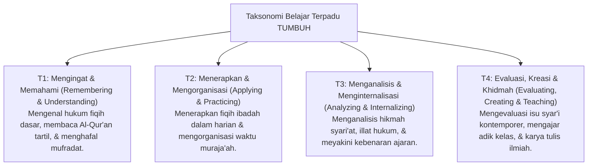

# P4-03-01: Progresi Kognitif dan Taksonomi Belajar Santri

## Status Dokumen
* **Status**: 🌟 **A+ (Tervalidasi & Siap Diimplementasikan)**
* **Sub-Domain**: `04 Progression Framework / 03 Learning Progression`
* **Penanggung Jawab Keilmuan**: Dewan Keilmuan TUMBUH (*Pakar Psikologi Belajar & Pakar Pedagogi Master Guru*)

---

## 1. Taksonomi Belajar Terpadu TUMBUH

Progresi kognitif belajar santri memadukan **Taksonomi Bloom Revisi (Anderson & Krathwohl)** dengan **Taksonomi Internalisasi Nilai (Marzano & Krathwohl)** melintasi Tangga T1 hingga T4:

---

## 2. Matriks Capaian Kognitif Berjenjang Melintasi T1–T4

| Tangga Belajar | Ranah Kognitif (Bloom) | Ranah Afektif / Value (Krathwohl) | Ranah Psikomotorik / Pembiasaan |
| :--- | :--- | :--- | :--- |
| **T1 (Adaptasi)** | *Remembering*: Menghafal bacaan sholat & ayat Al-Qur'an dasar. | *Receiving*: Memperhatikan penjelasan ustadz di kelas dengan adab. | Menirukan gerakan sholat & wudhu sesuai sunnah. |
| **T2 (Habituasi)** | *Understanding & Applying*: Menjelaskan syarat/rukun ibadah & menerapkannya. | *Responding*: Mengikuti kegiatan halaqah ilmiah dengan antusias. | Konsistensi setoran hafalan harian tanpa perlu dipaksa. |
| **T3 (Internalisasi)** | *Analyzing*: Menganalisis dalil-dalil hukum fiqih & perbedaan pendapat ulama. | *Valuing*: Menginternalisasi ajaran Islam sebagai panduan hidup pribadi. | Mampu memperbaiki kesalahan bacaan hafalan sendiri secara cermat. |
| **T4 (Kemandirian)** | *Evaluating & Creating*: Merumuskan riset kajian kitab & solusi kemasyarakatan. | *Characterization by Value*: Berkarakter Islami utuh dalam seluruh keputusan hidup. | Mengajar Al-Qur'an/Turats (*Badal Ustadz*) dengan metode pedagogi baik. |

---

## 3. Strategi Pembelajaran Berdiferensiasi (*Differentiated Instruction*)

1. **Diagnosis Kemampuan Awal**: Setiap santri baru menjalani tes pemetaan kognitif dan gaya belajar (Visual, Auditori, Kinestetik) saat masuk.
2. **Fleksibilitas Laju Belajar (*Self-Paced Progression*)**: Santri yang memiliki kecepatan hafalan/pemahaman tinggi diberikan pengayaan (*Enrichment*), sementara santri yang butuh waktu ekstra mendapatkan remediasi tanpa dipaksa menyamai standar linier seragam.
