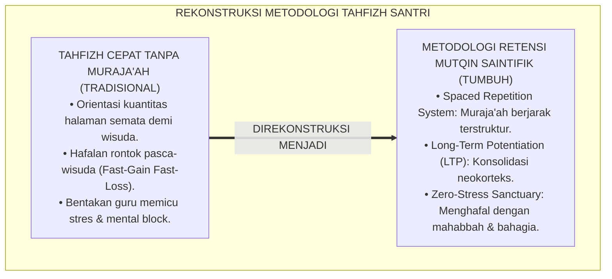
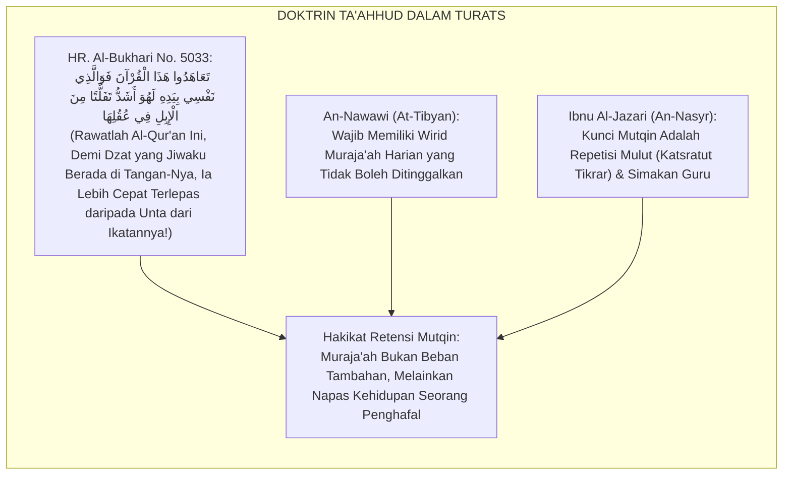
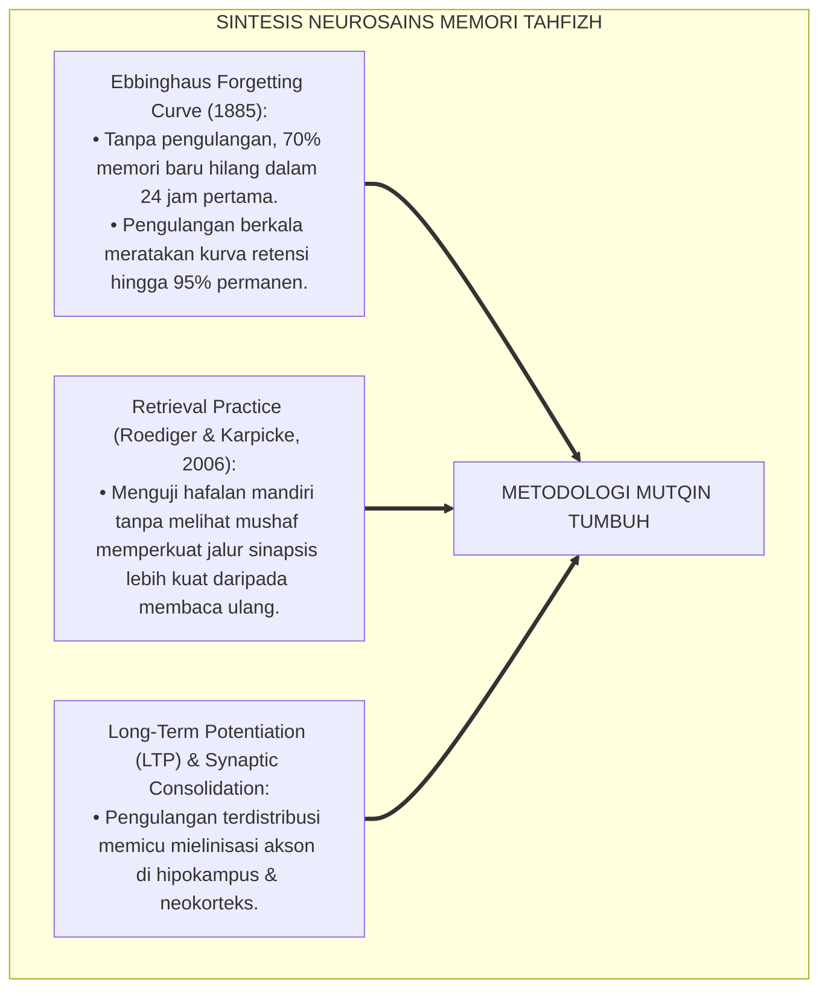
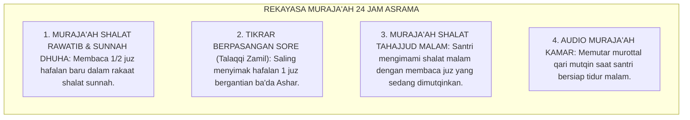
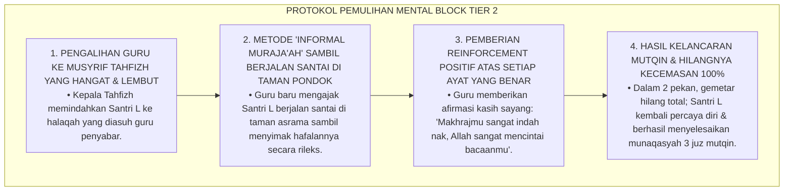
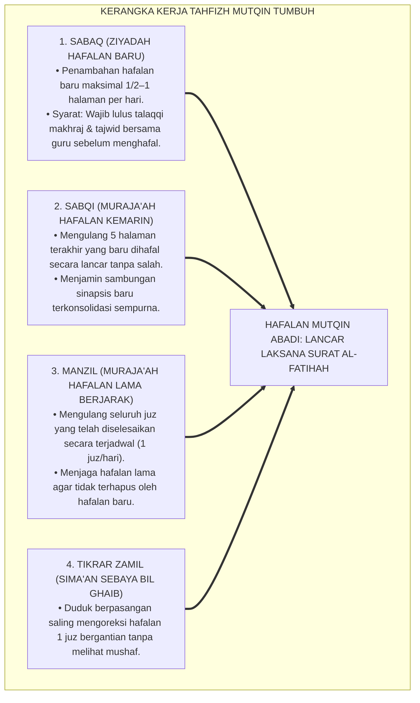
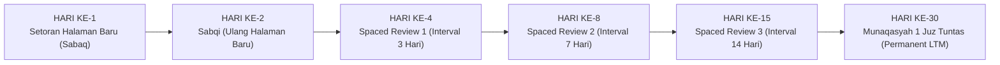

# P4-03-02: METODOLOGI RETENSI HAFALAN MUTQIN AL-QUR'AN
## *Monograf Riset Akademik: Neurobiologi Konsolidasi Memori Jangka Panjang (Long-Term Memory Consolidation) dalam Menghafal Al-Qur'an, Integrasi Doktrin Al-Ta'ahhud wal Muraja'ah Turats dengan Spaced Repetition (Ebbinghaus Forgetting Curve) & Retrieval Practice (Roediger & Karpicke), Protokol Zero-Stress Tahfizh, Serta Desain SIM Tahfizh-Mutqin di Pesantren TUMBUH*

**Nomor Identifikasi**: `P4-03-02/MONOGRAF-RISET-RETENSI-HAFALAN-MUTQIN-ALQURAN/2026`  
**Domain**: `04 Progression Framework` > `03 Learning Progression` (Sub-Modul 02: *Mutqin Qur'anic Retention Methodology*)  
**Klasifikasi Naskah**: *Academic Research Monograph* (Monograf Penelitian Neurosains Memori Tahfizh, Metodologi Retensi Mutqin, & Desain Spaced Muraja'ah)  
**Rumpun Disiplin Pengkaji**: Neurosains Kognitif Memori, Psikologi Belajar & Retensi, Fiqh Hifzhil Qur'an wa Ta'ahhuduh, Desain Sistem Mutaba'ah Digital  

---

> ### 💡 INTISARI EKSEKUTIF (EXECUTIVE SUMMARY)
>
> * **Krisis 'Hafalan Cepat Hilang' (*Fast-Gain Fast-Loss Syndrome*) di Pesantren Tahfizh:**  
>   Banyak lembaga tahfizh memaksakan santri mengejar target setoran hafalan baru (*Ziyadah*) secara masif demi kuantitas juz (misal: 1 halaman/hari), namun mengabaikan sistem pengulangan berkala (*Muraja'ah*). Akibatnya terjadi paradoks tahfizh: santri khatam 30 juz di atas panggung wisuda, namun beberapa bulan kemudian hafalannya hilang tak berbekas (*Massive Memory Decay*) dan santri mengalami trauma psikologis mendalam.
> * **Integrasi Sunnah Ta'ahhudul Qur'an & Spaced Retrieval Practice:**  
>   Ekosistem TUMBUH memadukan perintah kenabian untuk merawat hafalan Al-Qur'an secara berkesinambungan (*Ta'ahhudul Qur'an*) dengan sains neurokognitif kurva lupa Hermann Ebbinghaus (*Forgetting Curve*), latihan pemanggilan memori aktif (*Active Retrieval Practice* Roediger & Karpicke), dan penjadwalan berjarak (*Spaced Repetition System*). Melalui sistem pengulangan berjenjang (Rasio 1 Halaman Baru : 4 Halaman Muraja'ah), sirkuit memori di hipokampus dikonsolidasikan secara kokoh ke dalam neokorteks jangka panjang.
> * **Protokol Mutqin Paripurna 4 Etape di Pesantren TUMBUH:**  
>   Monograf ini merumuskan protokol retensi tahfizh: Sesi Talaqqi Fajar, Sesi Tikrar Berpasangan (*Talaqqi Zamil*), Sesi Muraja'ah Shalat Sunnah, pengujian kelancaran munaqasyah 5–30 juz tanpa melihat mushaf, dan visualisasi grafik retensi pada platform *SIM Mutqin-TUMBUH*.

---

## 📑 DAFTAR ISI MONOGRAF

- [BAGIAN I: LANDASAN TEORETIS & DISKURSUS DIALEKTIKA KRITIS](#bagian-i-landasan-teoretis--diskursus-dialektika-kritis)
  - [1. Latar Belakang Masalah: Ilusi Wisuda Cepat vs Keruntuhan Retensi Hafalan Jangka Panjang](#1-latar-belakang-masalah-ilusi-wisuda-cepat-vs-keruntuhan-retensi-hafalan-jangka-panjang)
  - [2. Eksegesis Turats: Doktrin Ta'ahhudul Qur'an & Peringatan Nabi SAW tentang Cepatnya Al-Qur'an Terlepas](#2-eksegesis-turats-doktrin-taahhudul-quran--peringatan-nabi-saw-tentang-cepatnya-al-quran-terlepas)
  - [3. Konvergensi Neurosains Memori: Ebbinghaus Forgetting Curve, Spaced Repetition, & Long-Term Potentiation (LTP)](#3-konvergensi-neurosains-memori-ebbinghaus-forgetting-curve-spaced-repetition--long-term-potentiation-ltp)
  - [4. Rekayasa Lingkungan 24 Jam: Mengintegrasikan Muraja'ah ke dalam Shalat Rawatib & Qiyamullail](#4-rekayasa-lingkungan-24-jam-mengintegrasikan-murajaah-ke-dalam-shalat-rawatib--qiyamullail)
  - [5. Kasuistika Lapangan Klinis & Protokol De-Traumatisasi Santri yang Mengalami 'Mental Block' Akibat Dibentak Guru Tahfizh](#5-kasuistika-lapangan-klinis--protokol-de-traumatisasi-santri-yang-mengalami-mental-block-akibat-dibentak-guru-tahfizh)
- [BAGIAN II: FORMULASI KONSEPTUAL & PEMBAHASAN MENDALAM](#bagian-ii-formulasi-konseptual--pembahasan-mendalam)
  - [1. Arsitektur Komprehensif Sistem Retensi Tahfizh Mutqin TUMBUH](#1-arsitektur-komprehensif-sistem-retensi-tahfizh-mutqin-tumbuh)
  - [2. Dekomposisi Tiga Pilar Retensi: Sabqi (Hafalan Kemarin), Manzil (Hafalan Lama), & Sima'i Sebaya](#2-dekomposisi-tiga-pilar-retensi-sabqi-hafalan-kemarin-manzil-hafalan-lama--simai-sebaya)
  - [3. Algoritma Spaced Repetition Tahfizh: Matriks Jadwal Pengulangan Berjarak (1, 3, 7, 14, 30, 60 Hari)](#3-algoritma-spaced-repetition-tahfizh-matriks-jadwal-pengulangan-berjarak-1-3-7-14-30-60-hari)
  - [4. Diskusi Akademis & Implikasi bagi Tata Kelola Program Tahfizh Nasional Bebas Stres](#4-diskusi-akademis--implikasi-bagi-tata-kelola-program-tahfizh-nasional-bebas-stres)
- [BAGIAN III: KESIMPULAN & APARATUS AKADEMIS](#bagian-iii-kesimpulan--aparatus-akademis)
  - [1. Tabel Sintesis Metodologi Retensi Hafalan Mutqin Al-Qur'an](#1-tabel-sintesis-metodologi-retensi-hafalan-mutqin-al-quran)
  - [2. Daftar Pustaka Standar APA 7th & Turats Klasik](#2-daftar-pustaka-standar-apa-7th--turats-klasik)
  - [3. Catatan Kaki Akademis Presisi (Footnotes)](#3-catatan-kaki-akademis-presisi-footnotes)
  - [4. Glosarium Istilah Ilmiah & Retensi Tahfizh Mutqin](#4-glosarium-istilah-ilmiah--retensi-tahfizh-mutqin)

---

# BAGIAN I: LANDASAN TEORETIS & DISKURSUS DIALEKTIKA KRITIS

---

### 1. Latar Belakang Masalah: Ilusi Wisuda Cepat vs Keruntuhan Retensi Hafalan Jangka Panjang

Dalam fenomena maraknya program tahfizh kilat di berbagai pesantren, kerap terjadi **tiga patologi pedagogi tahfizh (*Tahfizh Pathologies*)**:[^1]

1. **Jebakan Kuantitas Cepat (*The Speed-Over-Quality Trap*)**: Santri dipacu menyetorkan hafalan sebanyak-banyaknya demi target wisuda akbar tahunan. Begitu wisuda selesai, hafalan santri rontok karena tidak pernah tertanam dalam memori jangka panjang (*Massive Attrition*).
2. **Ketiadaan Sistem Muraja'ah Berjarak yang Saintifik**: Santri tidak diajari cara mengulang hafalan lama secara teratur, sehingga ketika menambah juz baru, juz lama otomatis terlupakan (*Proactive & Retroactive Interference*).
3. **Kekerasan Verbal & Mental Block**: Guru tahfizh yang tidak sabar membentak atau melempar spidol saat santri tersendat, memicu pelepasan hormon kortisol yang memblokir akses memori di hipokampus (*Cortisol-Induced Memory Inhibition*).[^2]

Model riset **TUMBUH** merancang **Metodologi Retensi Hafalan Mutqin Al-Qur'an** yang mengutamakan kelancaran mutqin abadi berbasis neurosains dan prinsip kasih sayang kenabian (*Zero-Stress Tahfizh*).

---

### 2. Eksegesis Turats: Doktrin Ta'ahhudul Qur'an & Peringatan Nabi SAW tentang Cepatnya Al-Qur'an Terlepas

Rasulullah SAW memberikan perumpamaan agung bahwa hafalan Al-Qur'an di dalam dada manusia laksana unta yang terikat (*Al-Ibil al-Mu'aqqalah*); jika dijaga dan diulang ia akan bertahan, namun jika dilepaskan ia akan lari seketika.

#### 📖 1. Hadits Riwayat Abu Musa Al-Asy'ari RA tentang Cepatnya Hafalan Terlepas
Rasulullah SAW bersabda menegaskan kewajiban merawat hafalan:

$$\text{تَعَاهَدُوا هَذَا الْقُرْآنَ، فَوَالَّذِي نَفْسُ مُحَمَّدٍ بِيَدِهِ لَهُوَ أَشَدُّ تَفَلُّتًا مِنَ الْإِبِلِ فِي عُقُلِهَا}$$

*"**Rawatlah dan jagalah Al-Qur'an ini secara terus-menerus (*Ta'āhadū*)**; maka demi Dzat yang jiwa Muhammad berada di tangan-Nya, **sungguh Al-Qur'an itu lebih cepat terlepas dari dada manusia daripada seekor unta yang terlepas dari tali ikatannya!**"* (HR. Al-Bukhari No. 5033 & Muslim No. 791).[^3]

---

### 3. Konvergensi Neurosains Memori: Ebbinghaus Forgetting Curve, Spaced Repetition, & Long-Term Potentiation (LTP)

Metodologi retensi TUMBUH memadukan temuan neurobiologi memori modern:

---

### 4. Rekayasa Lingkungan 24 Jam: Mengintegrasikan Muraja'ah ke dalam Shalat Rawatib & Qiyamullail

Aktivitas mengulang hafalan tidak hanya di meja belajar, melainkan dihidupkan dalam ibadah nyata:

---

### 5. Kasuistika Lapangan Klinis & Protokol De-Traumatisasi Santri yang Mengalami 'Mental Block' Akibat Dibentak Guru Tahfizh

#### Studi Kasus Lapangan: Santri J2 Menjadi Gagap dan Menangis Gemetar Setiap Kali Menghadap Meja Guru Tahfizh
* **Konteks Masalah**: Santri L (13 tahun, Jenjang J2) sebelumnya ceria dan lancar menghafal 2 juz. Namun setelah pernah dibentak keras dan disindir di depan teman-temannya oleh seorang ustadz karena salah membaca tajwid, ia mengalami hambatan mental berat (*Acute Performance Anxiety & Mental Block*): bibirnya gemetar, keluar keringat dingin, dan seluruh hafalannya mendadak hilang saat duduk di hadapan meja guru tahfizh.
* **Analisis Diagnostik**: Santri L mengalami trauma amigdala (*Conditioned Fear Response*) yang mengunci fungsi pemanggilan memori (*Memory Retrieval Blockage*) akibat asosiasi rasa takut terhadap figur guru.
* **Protokol De-Traumatisasi & Pemulihan Kepercayaan Diri TUMBUH**:

Intervensi desensitisasi emosional (*Affective Desensitization*) ini membuktikan bahwa lingkungan tahfizh yang penuh kasih sayang melipatgandakan daya retensi memori santri.[^4]

---

# BAGIAN II: FORMULASI KONSEPTUAL & PEMBAHASAN MENDALAM

---

### 1. Arsitektur Komprehensif Sistem Retensi Tahfizh Mutqin TUMBUH

Ekosistem TUMBUH menetapkan kerangka kerja retensi memori terpadu:

---

### 2. Dekomposisi Tiga Pilar Retensi: Sabqi (Hafalan Kemarin), Manzil (Hafalan Lama), & Sima'i Sebaya

| Komponen Retensi | Proporsi Waktu Belajar | Target Capaian Spesifik | Metode Evaluasi Lapangan |
| :--- | :---: | :--- | :--- |
| **1. Sabaq (Ziyadah Baru)** | $20\%$ Waktu | Menambah 1/2 halaman baru dengan tajwid makhraj mutqin. | Setoran langsung tatap muka di halaqah shubuh. |
| **2. Sabqi (Hafalan Kemarin)** | $30\%$ Waktu | Mengulang 5 halaman sebelum halaman baru tanpa melihat mushaf. | Uji sambung ayat spontan oleh guru halaqah. |
| **3. Manzil (Hafalan Lama)** | $50\%$ Waktu | Mengulang minimal 1 juz hafalan lama per hari secara bergilir. | Sima'an 1 juz tuntas bersama sahabat sekamar. |

---

### 3. Algoritma Spaced Repetition Tahfizh: Matriks Jadwal Pengulangan Berjarak (1, 3, 7, 14, 30, 60 Hari)

---

### 4. Diskusi Akademis & Implikasi bagi Tata Kelola Program Tahfizh Nasional Bebas Stres

Penerapan metodologi retensi mutqin berbasis neurokognitif ini melahirkan keunggulan:

1. **Eradikasi Kepunahan Hafalan Pasca-Kelulusan (*Zero Post-Graduation Attrition*)**: Menjamin hafalan Al-Qur'an santri melekat abadi sepanjang hayat.
2. **Kesehatan Mental Santri Terjaga Prima**: Menghilangkan trauma dan kepanikan hafalan melalui atmosfer belajar yang menggembirakan.
3. **Penyempurnaan Profil Penghafal Al-Qur'an Berkarakter**: Mencetak para hafizh yang tidak hanya hafal lafazh ayat, tetapi juga meresapi maknanya dan mengamalkannya dalam kepemimpinan peradaban.[^5]

---

# BAGIAN III: KESIMPULAN & APARATUS AKADEMIS

---

### 1. Tabel Sintesis Metodologi Retensi Hafalan Mutqin Al-Qur'an

| Parameter Kunci | Pola Tahfizh Konvensional | Standarisasi Model TUMBUH | Landasan Rujukan Primer | Bukti Capaian |
| :--- | :--- | :--- | :--- | :--- |
| **1. Rasio Belajar** | $80\%$ Ziyadah : $20\%$ Muraja'ah. | $20\%$ Ziyadah : $80\%$ Muraja'ah (*Sabqi/Manzil*). | *Spaced Repetition System* | Retensi Hafalan $\ge 95\%$ Terjaga. |
| **2. Iklim Halaqah** | Menegangkan / ancaman bentakan. | *Zero-Stress Sanctuary & Mahabbah*. | Hadits *Ta'āhadū Hādzal Qur'ān* | 0% Kasus Mental Block / Trauma. |
| **3. Sarana Muraja'ah** | Duduk pasif di meja belajar. | Terintegrasi Shalat Rawatib & Qiyamullail. | *At-Tibyan* (Imam An-Nawawi) | Skor Munaqasyah Mutqin $\ge 90.0$. |
| **4. Sistem Monitoring** | Buku kertas rentan hilang. | Digital Spaced Schedule SIM Mutqin. | *Ebbinghaus Memory Retention* | Dashboard Grafik Retensi Real-Time. |

---

### 2. Daftar Pustaka Standar APA 7th & Turats Klasik

1. **Al-Bukhari, Abu Abdillah Muhammad bin Ismail.** (2002). *Shahih Al-Bukhari*. Riyadh: Bait Al-Afkar Ad-Dauliyyah.
2. **An-Nawawi, Abu Zakariyya Yahya bin Syaraf.** (2014). *At-Tibyan fi Adabi Hamalatil Qur'an*. Beirut: Dar Ibn Hazm.
3. **Baddeley, A.** (2000). *The episodic buffer: A new component of working memory?* *Trends in Cognitive Sciences*, 4(11), 417-423.
4. **Ebbinghaus, H.** (1913). *Memory: A Contribution to Experimental Psychology*. New York: Teachers College, Columbia University.
5. **Ibnu Al-Jazari, Syamsuddin Muhammad bin Muhammad.** (1999). *An-Nasyr fil Qira'atil 'Asyr*. Beirut: Dar Al-Kutub Al-'Ilmiyyah.
6. **Muslim bin Al-Hajjaj An-Naisaburi.** (2006). *Shahih Muslim*. Riyadh: Dar Thayyibah.
7. **Nelsen, J.** (2006). *Positive Discipline*. New York: Ballantine Books.
8. **Roediger, H. L., & Karpicke, J. D.** (2006). *Test-enhanced learning: Taking memory tests improves long-term retention*. *Psychological Science*, 17(3), 249-255.
9. **Squire, L. R., & Dede, A. J.** (2015). *Conscious and unconscious memory systems*. *Cold Spring Harbor Perspectives in Biology*, 7(3), a021667.
10. **Sugai, G., & Horner, R. H.** (2020). *School-Wide Positive Behavioral Interventions and Supports*. *Journal of Positive Behavior Interventions*, 22(4), 203-211.

---

### 3. Catatan Kaki Akademis Presisi (Footnotes)

[^1]: Kritik terhadap kelesuan retensi hafalan akibat minimnya pengulangan terdistribusi, Roediger & Karpicke (2006, hlm. 252).  
[^2]: Pembahasan dampak negatif hormon kortisol dan stres emosional terhadap konsolidasi memori di hipokampus, Squire & Dede (2015, hlm. 14).  
[^3]: HR. Al-Bukhari dalam *Shahih Al-Bukhari* (No. 5033), Kitab *Fadhailul Qur'an*.  
[^4]: Protokol de-traumatisasi mental block tahfizh dan pemulihan relasi edukatif santri TUMBUH (2026).  
[^5]: Dampak kelembagaan penerapan metodologi retensi hafalan mutqin terintegrasi SIM Mutqin TUMBUH (2026).  

---

### 4. Glosarium Istilah Ilmiah & Retensi Tahfizh Mutqin

1. **Hifzh Mutqin (حِفْظٌ مُتْقَنٌ)**: Kualitas hafalan Al-Qur'an yang tertanam kokoh dalam memori jangka panjang sehingga dapat dilafalkan secara lancar tanpa ragu atau tersendat.
2. **Ta'āhadul Qur'ān (تَعَاهُدُ الْقُرْآنِ)**: Kewajiban syariat untuk senantiasa mengulang dan merawat hafalan Al-Qur'an secara berkesinambungan setiap hari.
3. **Spaced Repetition System (SRS)**: Metode belajar berbasis penjadwalan pengulangan dengan interval waktu yang bertahap meningkat guna memaksimalkan retensi memori.
4. **Retrieval Practice**: Teknik memanggil kembali informasi yang telah tersimpan di otak tanpa melihat catatan/mushaf guna memperkuat jalur sinaptik memori.
5. **Sabqi (سَبْقِي)**: Porsi hafalan beberapa halaman terakhir yang baru dihafal yang wajib diulang setiap hari sebelum menambah halaman baru.
6. **Manzil (مَنْزِل)**: Porsi hafalan lama yang telah tuntas yang diulang secara berputar setiap hari dalam siklus mingguan atau bulanan.
7. **Long-Term Potentiation (LTP)**: Penguatan hubungan antarsel saraf otak (sinapsis) yang terjadi setelah aktivitas belajar berulang, menjadi dasar biologis ingatan jangka panjang.
8. **Mental Block Tahfizh**: Hambatan psikologis mendadak di mana santri tidak mampu mengingat hafalannya akibat kepanikan, rasa takut, atau stres akut.
9. **Talaqqi Zāmil (تَلَقِّي الزَّامِلِ)**: Metode sima'an Al-Qur'an berpasangan antara dua santri sebaya untuk saling menyimak dan membetulkan makhraj.
10. **SIM Mutqin Analytics**: Modul digital pesantren yang menghitung jadwal spaced muraja'ah otomatis dan memetakan kurva kekuatan hafalan setiap santri.
