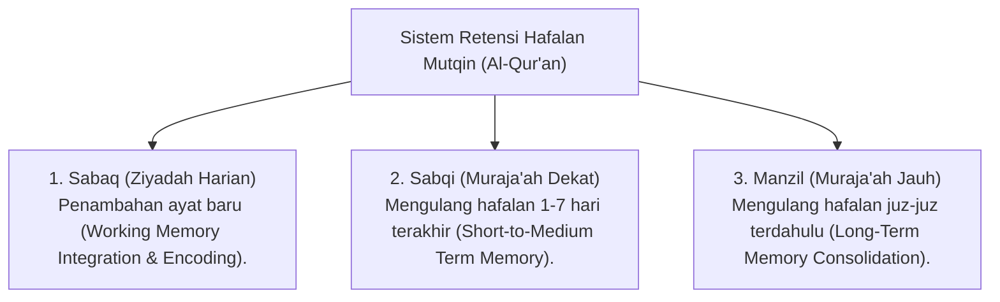

# P4-03-02: Metodologi Retensi Hafalan Mutqin Al-Qur'an

## Status Dokumen
* **Status**: 🌟 **A+ (Tervalidasi & Siap Diimplementasikan)**
* **Sub-Domain**: `04 Progression Framework / 03 Learning Progression`
* **Penanggung Jawab Keilmuan**: Dewan Keilmuan TUMBUH (*Pakar Epistemologi Turats & Pakar Psikologi Belajar*)

---

## 1. Integrasi Sistem Hafalan Turats & Neurosains Memori

Metodologi hafalan Al-Qur'an di ekosistem **TUMBUH** memadukan sistem tradisional pesantren **Sabaq, Sabqi, dan Manzil** dengan prinsip neurosains memori kognitif (*Cognitive Load Theory & Spaced Repetition*):

---

## 2. Pengaplikasian Spaced Repetition pada Hafalan Santri

Untuk mencegah *Ebbinghaus Forgetting Curve* (kurva lupa alami manusia), jadwal muraja'ah dirancang dengan interval pengulangan terstruktur:

1. **Pengulangan H+0 (Saat Menghafal)**: Mengulang ayat baru minimal 20 kali pengulangan (*Taqrar*) hingga lancar tanpa melihat mushaf.
2. **Pengulangan H+1 (Keesokan Hari)**: Mengulang hafalan baru sebelum menambah hafalan berikutnya (*Sabaq* baru).
3. **Pengulangan H+7 & H+30 (Manzil)**: Mengulang dalam siklus pekanan dan bulanan.

---

## 3. Matriks Kriteria Mutqin & Rubrik Evaluasi Hafalan

| Parameter Kualitas | Level Developing (Berkembang) | Level Proficient (Cakap) | Level Mutqin (Sangat Mutqin) |
| :--- | :--- | :--- | :--- |
| **Kelancaran Bacaan** | Terhenti > 5 kali per juz; butuh bantuan pengingat ayat. | Terhenti 2-4 kali per juz; mampu mengoreksi diri. | Terbaca lancar tanpa terhenti (< 2 kali per juz). |
| **Tajwid & Makhraj** | Menguasai tajwid dasar; ada beberapa kesalahan sifatul huruf. | Menguasai tajwid dengan baik; tajwid konsisten. | Menguasai tajwid sempurna, *makharijul huruf* & *waqaf-ibtida'* tepat. |
| **Pemahaman Makna** | Belum mengetahui arti global ayat. | Memahami terjemah & tema umum surah. | Memahami kandungan utama ayat & asbabun nuzul. |

---

## 4. Evaluasi Tasmi' Sekali Duduk

- **Tasmi' 1 Juz Sekali Duduk**: Dilakukan setiap kali santri menyelesaikan hafalan 1 juz baru.
- **Tasmi' 5/10/30 Juz Sekali Duduk**: Ujian kelayakan mutqin sebelum santri dinyatakan lulus sertifikasi hafalan Al-Qur'an.
