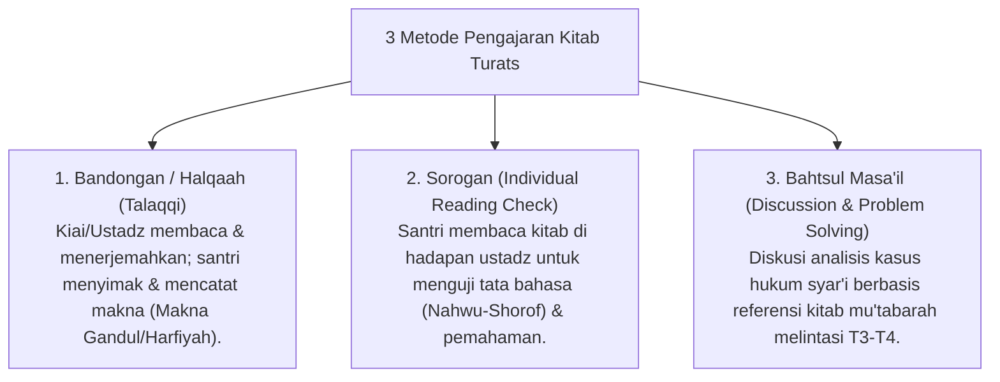

# P4-03-03: Metodologi Pembelajaran Kitab Turats dan Dirasah Islamiyah

## Status Dokumen
* **Status**: 🌟 **A+ (Tervalidasi & Siap Diimplementasikan)**
* **Sub-Domain**: `04 Progression Framework / 03 Learning Progression`
* **Penanggung Jawab Keilmuan**: Dewan Keilmuan TUMBUH (*Pakar Epistemologi Turats & Pakar Pedagogi Master Guru*)

---

## 1. Konseptualisasi Pembelajaran Turats di Ekosistem TUMBUH

Pembelajaran kitab kuno/klasik (*Turats*) tidak hanya mentransfer teks (*Lafazh*), melainkan mentransfer epistemologi Islam, metodologi berpikir ulama (*Manhaj Al-Fikr*), serta internalisasi nilai adab ke dalam kehidupan sehari-hari.

---

## 2. Jenjang Kitab Turats Sesuai Jenjang Kemandirian TUMBUH (J1–J4)

| Tangga Belajar | Bidang Fiqih & Aqidah | Bidang Adab & Akhlak | Bidang Alat (Bahasa Arab) |
| :--- | :--- | :--- | :--- |
| **Jenjang J1** | *Matn Safinatun Naja* / *Aqidatul Awam*. | *Taisirul Khalaq* / *Adabul 'Alim wal Muta'allim* (Bab Awal). | *Matn Al-Ajurrumiyyah* (Dasar Nahwu). |
| **Jenjang J2** | *Matn Al-Ghayah wat Taqrib* (Abu Syuja'). | *Ta'limul Muta'allim* (Imam Al-Zarnuji). | *Al-Amtsilah As-Tashrifiyyah* (Shorof) & *Ajurrumiyyah* Lanjutan. |
| **Jenjang J3** | *Fathul Qarib Al-Mujib* / *Bulughul Maram*. | *Adabul 'Alim wal Muta'allim* (Imam An-Nawawi) / *Minhajul 'Abidin*. | *Qathrun Nada* / *Alfiyyah Ibnu Malik* (Jilid 1). |
| **Jenjang J4** | *Fathul Mu'in* / *Fiqih Maqashid Syari'ah*. | *Ihya 'Ulumuddin* (Ringkasan/Rub' Al-Muhlikat & Al-Munjiyat). | *Alfiyyah Ibnu Malik* Lanjutan & Balaghah (*Jauharul Maknun*). |

---

## 3. Integrasi Critical Realism & Analisis Hikmah

Ustadz pengajar kitab diwajibkan menghubungkan teks klasik dengan realitas kontemporer melalui metode **3-Lapis Analisis**:
1. **Analisis Tekstual (*Lughawiyah*)**: Memastikan kebenaran i'rab, kaidah nahwu-shorof, dan makna kata.
2. **Analisis Konseptual (*Fiqhiyah/Ushuliyah*)**: Memahami dalil, *illat* hukum, dan maqashid syari'ah di balik dalil.
3. **Analisis Kontekstual (*Waqi'iyah*)**: Mengaktualisasikan solusi kitab terhadap persoalan sosial dan etika modern.
