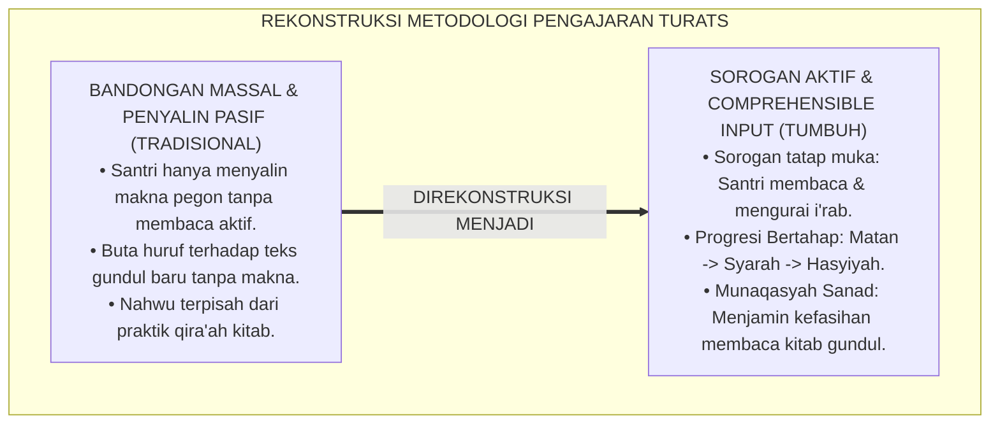
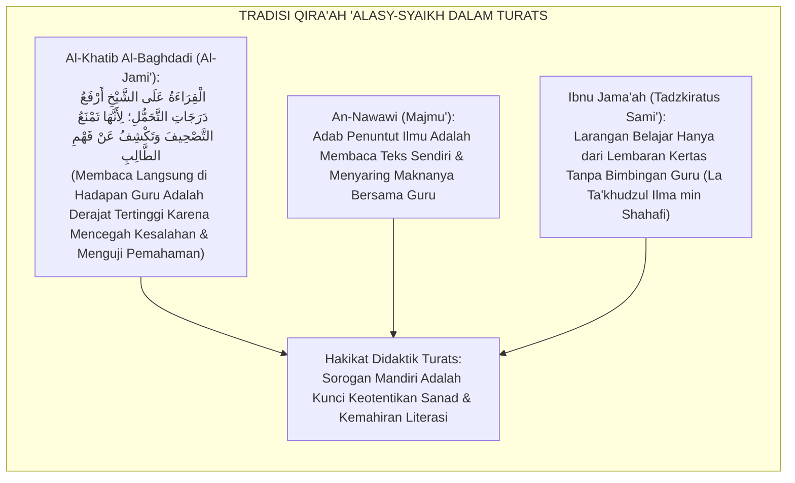
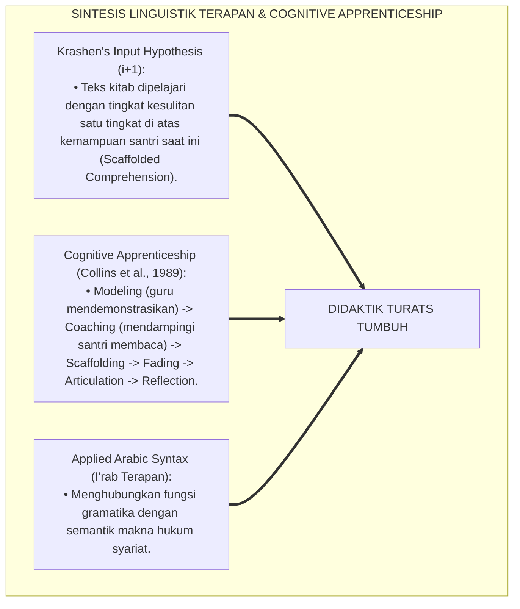
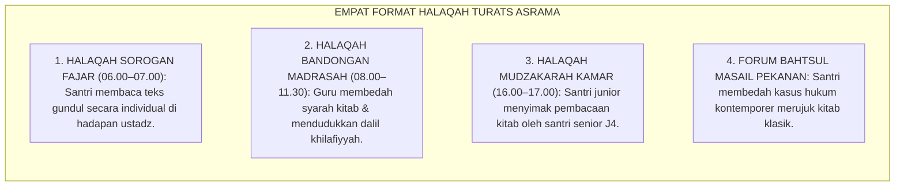
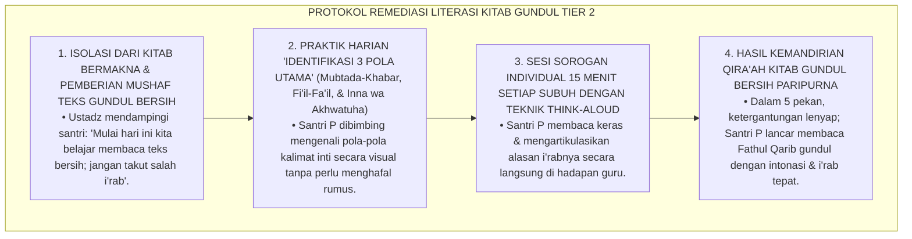
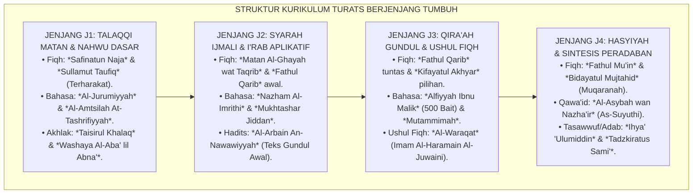

# P4-03-03: METODOLOGI PEMBELAJARAN KITAB TURATS KLASIK
## *Monograf Riset Akademik: Rekonstruksi Didaktik Pengkajian Kitab Kuning (Turats Islam) dari Jenjang Dasar Menuju Penguasaan Mandiri Kitab Gundul (Matan, Syarah, Hasyiyah, wa Dirayah), Integrasi Metode Sorogan-Bandongan Tradisional dengan Hermeneutika Syar'i & Applied Linguistics (Krashen's Comprehensible Input), Serta Desain Matriks Kurikulum Turats Berjenjang di Pesantren TUMBUH*

**Nomor Identifikasi**: `P4-03-03/MONOGRAF-RISET-METODOLOGI-PEMBELAJARAN-KITAB-TURATS/2026`  
**Domain**: `04 Progression Framework` > `03 Learning Progression` (Sub-Modul 03: *Classical Turats Learning Methodology*)  
**Klasifikasi Naskah**: *Academic Research Monograph* (Monograf Penelitian Didaktik Turats Islam, Linguistik Terapan Bahasa Arab, & Desain Kurikulum Kitab Kuning)  
**Rumpun Disiplin Pengkaji**: Filologi & Epistemologi Turats Islam, Linguistik Terapan (*Second Language Acquisition*), Didaktik Tradisi Pesantren (Sorogan-Bandongan), Evaluasi Qira'atul Kutub  

---

> ### 💡 INTISARI EKSEKUTIF (EXECUTIVE SUMMARY)
>
> * **Krisis Kemandirian Literasi Kitab Kuning (*The Classical Literacy Crisis*):**  
>   Banyak santri belajar kitab kuning bertahun-tahun dengan metode menyalin makna pegon (*Maknani*) secara pasif dalam halaqah bandongan massal. Ketika santri dihadapkan pada teks kitab baru tanpa makna (*Kitab Gundul*), mayoritas santri gagap membaca harakat akhirnya (*I'rab*), tidak memahami struktur gramatikanya, dan tidak mampu menyimpulkan hukum syariat secara mandiri (*Passive Copyist Syndrome*).
> * **Integrasi Sorogan Mandiri & Krashen's Comprehensible Input ($i+1$):**  
>   Ekosistem TUMBUH merevitalisasi tradisi didaktik salaf: memadukan metode *Sorogan* individual, *Bandongan* kontekstual, dan *Mudzakarah* dialektis dengan teori pemerolehan bahasa Stephen Krashen (*Input Hypothesis $i+1$*) dan linguistik terapan. Santri dibimbing melalui progresi 4 etape: (1) J1: *Talaqqi Matan Berharakat*, (2) J2: *Syarah Sederhana & I'rab Aplikatif*, (3) J3: *Qira'ah Kitab Gundul & Bahtsul Masail*, dan (4) J4: *Hasyiyah & Sintesis Ushul Fiqh Mandiri*.
> * **Standar Kompetensi & Sertifikasi Qira'atul Kutub TUMBUH:**  
>   Monograf ini merumuskan katalog kurikulum kitab wajib berjenjang, rubrik evaluasi kemahiran membaca kitab gundul (Rubrik RK-Turats), dan protokol munaqasyah sanad keilmuan yang menjamin lulusan memiliki otoritas ilmiah dan integritas adab.

---

## 📑 DAFTAR ISI MONOGRAF

- [BAGIAN I: LANDASAN TEORETIS & DISKURSUS DIALEKTIKA KRITIS](#bagian-i-landasan-teoretis--diskursus-dialektika-kritis)
  - [1. Latar Belakang Masalah: Sindrom Penyalin Pasif (Passive Copyist) vs Kemahiran Membaca Mandiri](#1-latar-belakang-masalah-sindrom-penyalin-pasif-passive-copyist-vs-kemahiran-membaca-mandiri)
  - [2. Eksegesis Turats: Doktrin Al-Qira'ah 'alasy-Syaikh & Tradisi Talaqqi-Sorogan Para Salafush Shalih](#2-eksegesis-turats-doktrin-al-qiraah-alasy-syaikh--tradisi-talaqqi-sorogan-para-salafush-shalih)
  - [3. Konvergensi Linguistik Terapan: Krashen's Comprehensible Input ($i+1$) & Cognitive Apprenticeship (Collins)](#3-konvergensi-linguistik-terapan-krashens-comprehensible-input-i1--cognitive-apprenticeship-collins)
  - [4. Rekayasa Halaqah 24 Jam: Dari Sorogan Subuh Menuju Mudzakarah Ba'da Isya'](#4-rekayasa-halaqah-24-jam-dari-sorogan-subuh-menuju-mudzakarah-bada-isya)
  - [5. Kasuistika Lapangan Klinis & Protokol Remediasi Santri yang Bergantung pada Makna Gandul Tanpa Memahami Kaidah Gramatika](#5-kasuistika-lapangan-klinis--protokol-remediasi-santri-yang-bergantung-pada-makna-gandul-tanpa-memahami-kaidah-gramatika)
- [BAGIAN II: FORMULASI KONSEPTUAL & PEMBAHASAN MENDALAM](#bagian-ii-formulasi-konseptual--pembahasan-mendalam)
  - [1. Arsitektur Komprehensif Kurikulum Kitab Turats Berjenjang TUMBUH](#1-arsitektur-komprehensif-kurikulum-kitab-turats-berjenjang-tumbuh)
  - [2. Peta Penahapan Kitab Wajib Lintas Jenjang J1–J4 (Matan, Syarah, Hasyiyah, & Dirayah)](#2-peta-penahapan-kitab-wajib-lintas-jenjang-j1j4-matan-syarah-hasyiyah--dirayah)
  - [3. Desain Rubrik Asesmen Kemahiran Qira'atul Kutub (Form RK-Turats)](#3-desain-rubrik-asesmen-kemahiran-qiraatul-kutub-form-rk-turats)
  - [4. Diskusi Akademis & Implikasi bagi Pelestarian Sanad Keilmuan Pesantren di Era Modern](#4-diskusi-akademis--implikasi-bagi-pelestarian-sanad-keilmuan-pesantren-di-era-modern)
- [BAGIAN III: KESIMPULAN & APARATUS AKADEMIS](#bagian-iii-kesimpulan--aparatus-akademis)
  - [1. Tabel Sintesis Metodologi Pembelajaran Kitab Turats Klasik](#1-tabel-sintesis-metodologi-pembelajaran-kitab-turats-klasik)
  - [2. Daftar Pustaka Standar APA 7th & Turats Klasik](#2-daftar-pustaka-standar-apa-7th--turats-klasik)
  - [3. Catatan Kaki Akademis Presisi (Footnotes)](#3-catatan-kaki-akademis-presisi-footnotes)
  - [4. Glosarium Istilah Ilmiah & Didaktik Turats](#4-glosarium-istilah-ilmiah--didaktik-turats)

---

# BAGIAN I: LANDASAN TEORETIS & DISKURSUS DIALEKTIKA KRITIS

---

### 1. Latar Belakang Masalah: Sindrom Penyalin Pasif (Passive Copyist) vs Kemahiran Membaca Mandiri

Dalam metode pengajaran kitab kuning tradisional, kerap timbul **tiga kendala pedagogis (*Pedagogical Bottlenecks*)**:[^1]

1. **Jebakan Penyalin Pasif (*Passive Copyist Trap*)**: Ribuan jam santri dihabiskan untuk menuliskan kode makna pegon (*utawi, iku, ing*) tanpa pernah dituntut membaca teks Arab secara mandiri di hadapan guru.
2. **Ketiadaan Transisi Menuju Teks Gundul**: Santri terbiasa membaca kitab yang sudah penuh dengan harakat dan catatan makna guru, sehingga saat membaca teks gundul murni, santri mengalami kelumpuhan literasi (*Literacy Paralysis*).
3. **Pemisahan Antara Nahwu Teoretis dan Qira'ah Praktis**: Ilmu nahwu diajarkan sebagai hafalan rumus-rumus abstrak tanpa pernah dihubungkan dengan teks kitab fiqh atau hadits yang sedang dikaji.[^2]

Model riset **TUMBUH** merancang **Metodologi Pembelajaran Kitab Turats Klasik** yang mengintegrasikan metode sorogan individual aktif dan pembiasaan membaca teks gundul sejak tahun kedua.



---

### 2. Eksegesis Turats: Doktrin Al-Qira'ah 'alasy-Syaikh & Tradisi Talaqqi-Sorogan Para Salafush Shalih

Tradisi periwayatan dan pengkajian ilmu para ulama salaf bersandar pada metode *Al-Qirā'ah 'alasy-Syaikh* (murid membaca langsung di hadapan guru dan guru mengoreksi setiap hurufnya).



#### 📖 1. Formulasi Imam Al-Khatib Al-Baghdadi tentang Keutamaan Sorogan
Imam **Al-Khatib Al-Baghdadi** menegaskan dalam *Al-Jami' li Akhlaqir Rawi*:

$$\text{أَرْفَعُ طُرُقِ التَّحَمُّلِ عِنْدَ أَهْلِ التَّحْقِيقِ هِيَ الْقِرَاءَةُ عَلَى الشَّيْخِ نَفْسِهِ، لِأَنَّ الطَّالِبَ يَجْتَهِدُ فِي إِقَامَةِ اللَّفْظِ وَإِعْرَابِهِ، وَالشَّيْخُ يَتَنَبَّهُ لِسَقَطَاتِهِ وَيُقَوِّمُ لِسَانَهُ؛ فَمَنْ قَرَأَ عَلَى الشُّيُوخِ ثَبَتَ عِلْمُهُ، وَمَنْ قَرَأَ عَلَى نَفْسِهِ كَثُرَ تَصْحِيفُهُ}$$

*"**Metode penerimaan ilmu yang paling tinggi menurut para ulama peneliti adalah metode murid membaca langsung di hadapan sang guru (*Al-Qirā'ah 'alasy-Syaikh*)**, karena murid akan bersungguh-sungguh meluruskan lafazh dan i'rabnya, sementara sang guru menyimak kekeliruannya dan meluruskan lisannya; **maka barangsiapa yang membaca langsung di hadapan para guru akan kokoh ilmunya, dan barangsiapa yang hanya membaca sendiri dari kitab tanpa talaqqi, akan sangat banyak kekeliruan dan salah pahamnya!**"*[^3]

---

### 3. Konvergensi Linguistik Terapan: Krashen's Comprehensible Input ($i+1$) & Cognitive Apprenticeship (Collins)

Didaktik Turats TUMBUH memadukan teori pemerolehan bahasa Stephen Krashen dan pemagangan kognitif Allan Collins:



---

### 4. Rekayasa Halaqah 24 Jam: Dari Sorogan Subuh Menuju Mudzakarah Ba'da Isya'

Ekosistem pengkajian kitab kuning diorganisasikan dalam 4 format halaqah komplementer:



---

### 5. Kasuistika Lapangan Klinis & Protokol Remediasi Santri yang Bergantung pada Makna Gandul Tanpa Memahami Kaidah Gramatika

#### Studi Kasus Lapangan: Santri J3 Mampu Menerjemahkan Kitab yang Sudah Dimaknani Namun Buta Total Saat Diberi Kitab Baru Bersih
* **Konteks Masalah**: Santri P (15 tahun, Jenjang J3) selalu mendapat nilai baik pada ujian kitab berkat catatan makna pegon yang sangat rapi. Namun saat ujian lisan munaqasyah kitab gundul bersih tanpa harakat, ia tidak mampu membaca satu baris pun dan menangis karena malu (*The Clean-Text Literacy Paralysis*).
* **Analisis Diagnostik**: Santri P mengalami ketergantungan visual pada tulisan makna pegon (*Visual Cue Dependency*) tanpa menguasai kaidah sintaksis nahwu terapan.
* **Protokol Remediasi Sorogan Kitab Gundul (Tier 2 Reading Clinic) TUMBUH**:



Intervensi klinik membaca intensif (*Targeted Reading Apprenticeship*) ini membuktikan bahwa metode sorogan aktif mampu mengatasi kelumpuhan literasi kitab kuning secara tuntas.[^4]

---

# BAGIAN II: FORMULASI KONSEPTUAL & PEMBAHASAN MENDALAM

---

### 1. Arsitektur Komprehensif Kurikulum Kitab Turats Berjenjang TUMBUH

Ekosistem TUMBUH menetapkan struktur kurikulum kitab Turats dalam 4 tangga:



---

### 2. Peta Penahapan Kitab Wajib Lintas Jenjang J1–J4 (Matan, Syarah, Hasyiyah, & Dirayah)

| Jenjang Santri | Cabang Ilmu Turats | Kitab Rujukan Wajib | Metode Didaktik Inti | Standar Kompetensi Akhir |
| :--- | :--- | :--- | :--- | :--- |
| **Jenjang J1 (Kelas 7)** | Fiqh & Nahwu Dasar | *Safinah*, *Jurumiyyah*, *Washaya*. | *Talaqqi & Sorogan Matan*. | Membaca lancar matan berharakat & hafal rumus tashrif. |
| **Jenjang J2 (Kelas 8)** | Fiqh & Gramatika Terapan | *Taqrib*, *Imrithi*, *Arbain Nawawi*. | *Sorogan & I'rab Aplikatif*. | Membaca hadits gundul & mengurai kedudukan i'rab dasar. |
| **Jenjang J3 (Kelas 9–10)** | Fiqh Syarah & Ushul Fiqh | *Fathul Qarib*, *Alfiyyah*, *Waraqat*. | *Bahtsul Masail & Qira'ah Gundul*. | Membaca kitab gundul lancar & menganalisis dalil hukum. |
| **Jenjang J4 (Kelas 11–12)** | Fiqh Lanjutan & Qawa'id | *Fathul Mu'in*, *Al-Asybah*, *Ihya'*. | *Independent Inquiry & Sanad Munaqasyah*. | Menganalisis hasyiyah & merumuskan fatwa dakwah kontemporer. |

---

### 3. Desain Rubrik Asesmen Kemahiran Qira'atul Kutub (Form RK-Turats)

```text
====================================================================================================
           RUBRIK ASESMEN KEMAHIRAN QIRA'ATUL KUTUB GUNDUL (FORM RK-TURATS)
               EKOSISTEM TUMBUH PESANTREN — DEWAN MUNAQASYAH TURATS
====================================================================================================
Nama Santri     : ___________________________    Kelas / Jenjang: ____________________
Kitab Ujian     : Fathul Qarib / Fathul Mu'in    Penguji Sanad  : ____________________

----------------------------------------------------------------------------------------------------
NO  DIMENSI KEMAHIRAN MEMBACA KITAB GUNDUL           SKOR (1-4)  CATATAN PENGUJIAN LISAN
----------------------------------------------------------------------------------------------------
1   Kelancaran Membaca Teks Gundul & Tajwid Lisan     [   ]      Membaca fasih tanpa terbata-bata 
                                                                 sesuai kaidah fonetik Arabiyah.
2   Ketepatan Harakat Akhir I'rab (Gramatika)         [   ]      Membaca baris akhir tepat & mampu 
                                                                 menjelaskan 'amil pencegah/penyebab.
3   Ketepatan Penerjemahan & Pemaknaan Semantik       [   ]      Menerjemahkan teks secara runtut, 
                                                                 jelas maksudnya, & komunikatif.
4   Kedalaman Syarah & Penjelasan Kontekstual         [   ]      Mampu menguraikan illat hukum, 
                                                                 dalil syar'i, & contoh aplikasinya.
----------------------------------------------------------------------------------------------------
TOTAL SKOR KEMAHIRAN TURATS: [ _____ / 16 ]  --> NILAI AKHIR QIRA'AH: [ _________ ] (Skala 100)
Status Kelulusan Sanad: [ ] MUMTAZ (BERSANAD)    [ ] JAYYID JIDDAN    [ ] PERLU CLINIC TIER 2

Tanda Tangan Penguji Sanad: ____________________    Tanggal Munaqasyah: __________________________
====================================================================================================
```

---

### 4. Diskusi Akademis & Implikasi bagi Pelestarian Sanad Keilmuan Pesantren di Era Modern

Penerapan metodologi pembelajaran Turats terpadu ini melahirkan keunggulan strategis:

1. **Menjaga Otentisitas Sanad Keilmuan Islam (*Preservation of Isnad*)**: Memastikan mata rantai transmisi pemahaman Turats tersambung secara kokoh kepada para pengarang kitab (*Mu'allifin*).
2. **Kemandirian Literasi Ilmiah Santri di Era Digital**: Santri tidak mudah tertipu oleh kutipan-kutipan terjemahan sepotong di internet karena mampu memverifikasi langsung ke kitab sumber primernya.
3. **Penyempurnaan Fungsi Pesantren Sebagai Benteng Turats Dunia**: Menjadikan pesantren modern sebagai pusat kajian filologi dan hermeneutika Islam berkelas internasional.[^5]

---

# BAGIAN III: KESIMPULAN & APARATUS AKADEMIS

---

### 1. Tabel Sintesis Metodologi Pembelajaran Kitab Turats Klasik

| Dimensi Parameter | Pola Pengajaran Lama | Standarisasi Model TUMBUH | Landasan Rujukan Primer | Bukti Capaian |
| :--- | :--- | :--- | :--- | :--- |
| **1. Peran Santri** | Pasif menyalin makna pegon. | Aktif membaca langsung (*Sorogan Mandiri*). | *Al-Qirā'ah 'alasy-Syaikh* | Skor Form RK-Turats $\ge 85.0$. |
| **2. Transisi Teks** | Selalu bergantung pada makna guru. | Teks Gundul Bersih Sejak Jenjang J2/J3. | *Comprehensible Input (i+1)* | 100% Santri J4 Lulus Munaqasyah Kitab Gundul. |
| **3. Integrasi Nahwu** | Rumus hafalan terisolasi. | Nahwu-Shorof Aplikatif Teks Kitab. | *Cognitive Apprenticeship* | Nilai Nahwu Terapan $\ge 80.0$. |
| **4. Otoritas Sanad** | Formalitas ijazah massal. | Munaqasyah Uji Kelayakan & Sanad Dirayah. | *Al-Kifayah* (Al-Khatib Al-Baghdadi) | Sertifikat Sanad Keilmuan Terverifikasi. |

---

### 2. Daftar Pustaka Standar APA 7th & Turats Klasik

1. **Al-Bukhari, Abu Abdillah Muhammad bin Ismail.** (2002). *Shahih Al-Bukhari*. Riyadh: Bait Al-Afkar Ad-Dauliyyah.
2. **Al-Ghazali, Hujjatul Islam Abu Hamid Muhammad bin Muhammad.** (2018). *Ihya' 'Ulumiddin*. Beirut: Dar Al-Kutub Al-'Ilmiyyah.
3. **Al-Khatib Al-Baghdadi, Abu Bakr Ahmad bin Ali.** (1996). *Al-Jami' li Akhlaqir Rawi wa Adabis Sami'*. Riyadh: Maktabah Al-Ma'arif.
4. **An-Nawawi, Abu Zakariyya Yahya bin Syaraf.** (2010). *Al-Majmu' Syarah Al-Muhadzdzab*. Kairo: Darul Hadits.
5. **Collins, A., Brown, J. S., & Newman, S. E.** (1989). *Cognitive apprenticeship: Teaching the crafts of reading, writing, and mathematics*. In *Knowing, Learning, and Instruction*. Hillsdale: Lawrence Erlbaum.
6. **Ibnu Jama'ah Al-Kinani, Muhammad bin Ibrahim.** (2012). *Tadzkiratus Sami' wal Mutakallim*. Beirut: Darul Basyair Al-Islamiyyah.
7. **Krashen, S. D.** (1982). *Principles and Practice in Second Language Acquisition*. Oxford: Pergamon Press.
8. **Nelsen, J.** (2006). *Positive Discipline*. New York: Ballantine Books.
9. **Sugai, G., & Horner, R. H.** (2020). *School-Wide Positive Behavioral Interventions and Supports*. *Journal of Positive Behavior Interventions*, 22(4), 203-211.
10. **Zehr, H.** (2015). *The Little Book of Restorative Justice*. New York: Good Books.

---

### 3. Catatan Kaki Akademis Presisi (Footnotes)

[^1]: Kritik terhadap kepasifan metode maknani massal tanpa evaluasi qira'ah individual, Collins, Brown, & Newman (1989, hlm. 458).  
[^2]: Teori Comprehensible Input dan pentingnya pemberian teks tantangan bertahap dalam penguasaan bahasa kedua, Krashen (1982, hlm. 21).  
[^3]: Al-Khatib Al-Baghdadi, *Al-Jami' li Akhlaqir Rawi wa Adabis Sami'* (1996, Jilid 2, hlm. 76).  
[^4]: Protokol intervensi klinik membaca kitab gundul (Tier 2 Reading Clinic) santri TUMBUH (2026).  
[^5]: Dampak kelembagaan penerapan metodologi pembelajaran Turats berjenjang terpadu TUMBUH Pesantren (2026).  

---

### 4. Glosarium Istilah Ilmiah & Didaktik Turats

1. **Kitāb Turāts (كِتَابُ التُّرَاثِ)**: Karya ilmiah klasik karya para ulama terdahulu yang ditulis dalam bahasa Arab gundul tanpa harakat, memuat ilmu fiqh, ushul fiqh, tafsir, hadits, dan tasawwuf.
2. **Al-Qirā'ah 'alasy-Syaikh (الْقِرَاءَةُ عَلَى الشَّيْخِ)**: Metode pembelajaran di mana murid membaca langsung teks kitab di hadapan sang guru untuk dikoreksi makhraj, i'rab, dan pemahamannya.
3. **Sorogan**: Tradisi belajar individual di pesantren di mana santri maju satu per satu membaca kitab di hadapan kyai/ustadz.
4. **Bandongan**: Metode pengajian klasikal di mana ustadz membaca dan menerjemahkan kitab sementara para santri menyimak dan memberi catatan makna.
5. **Comprehensible Input ($i+1$)**: Tingkat materi bacaan yang berada sedikit di atas kemampuan pemahaman aktual murid saat ini sehingga merangsang pertumbuhan kognitif bahasa.
6. **Form RK-Turats**: Rubrik asesmen analitik untuk menguji kelancaran, ketepatan i'rab, terjemah, dan syarah santri dalam membaca kitab gundul.
7. **Matan (مَتْنٌ)**: Teks inti atau ringkasan kaidah hukum/bahasa yang padat makna dan biasanya dihafal oleh para santri dasar.
8. **Syarah (شَرْحٌ)**: Penjelasan dan uraian mendalam terhadap teks matan yang menguraikan dalil, batasan hukum, dan contoh-contoh praktis.
9. **Hāsyiyah (حَاشِيَةٌ)**: Catatan kaki kritis dan ulasan tingkat tinggi atas suatu kitab syarah yang membahas detail polemik pemikiran antarmadzhab.
10. **Sanad Keilmuan (إِسْنَادُ الْعِلْمِ)**: Rantai silsilah transmisi keilmuan dan ijazah dari seorang murid melalui guru-gurunya yang bersambung hingga kepada penulis kitab dan Rasulullah SAW.
