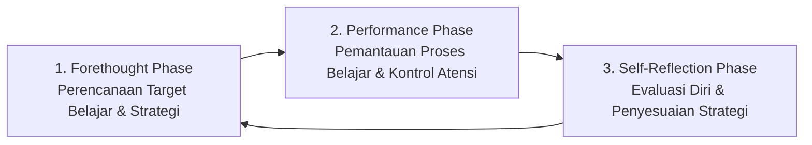
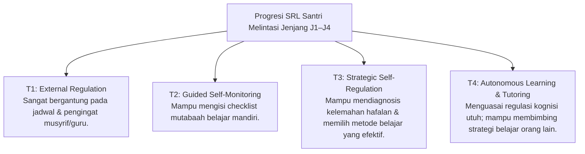

# P4-03-04: Perkembangan Metakognisi dan Self-Regulated Learning Santri

## Status Dokumen
* **Status**: 🌟 **A+ (Tervalidasi & Siap Diimplementasikan)**
* **Sub-Domain**: `04 Progression Framework / 03 Learning Progression`
* **Penanggung Jawab Keilmuan**: Dewan Keilmuan TUMBUH (*Pakar Psikologi Belajar & Pakar Neurosains Perkembangan*)

---

## 1. Konseptualisasi Metakognisi & Self-Regulated Learning (SRL)

Metakognisi adalah kemampuan santri untuk **memikirkan cara berpikirnya sendiri** (*Thinking about Thinking*), sementara *Self-Regulated Learning* (SRL) adalah kapasitas santri merencanakan, memantau, dan mengevaluasi proses belajarnya secara mandiri.

---

## 2. Progresi Metakognisi Santri Melintasi Jenjang J1–J4

---

## 3. Matriks Komponen Self-Regulated Learning Santri

| Dimensi SRL | Indikator Operasional Belajar | Instrumen Pendukung PBIS |
| :--- | :--- | :--- |
| **Goal Setting (Penetapan Target)** | Santri mampu merumuskan target mingguan hafalan & muraja'ah secara spesifik (SMART Goals). | *Jurnal Target Belajar Mingguan*. |
| **Self-Monitoring (Pemantauan Diri)** | Mampu mendeteksi saat atensinya buyar dan melakukan penyesuaian tempat/waktu belajar. | *Lembar Mutabaah Mandiri Digital*. |
| **Adaptive Strategy (Strategi Adaptif)** | Bila hafalan sulit, santri mengubah strategi (misal: dari visual ke murottal audio). | *Katalog Teknik Menghafal Efektif*. |
| **Self-Evaluation (Evaluasi Diri)** | Santri tidak menyalahkan orang lain atas kegagalan uji hafalan, melainkan menggeledah perencanaan belajarnya. | *Form Refleksi Ujian Formatif*. |

---

## 4. Peran Pengajar dalam Menumbuhkan Metakognisi

- **Model Thinking Aloud**: Ustadz mendemonstrasikan bagaimana cara memecahkan masalah nahwu atau menghafal ayat rumit secara terbuka di depan kelas.
- **Formative Feedback vs Summative Stigma**: Pengajar memberikan masukan yang berfokus pada **proses belajar (*effort/strategy*)**, bukan menyematkan label inteligensi permanen.
