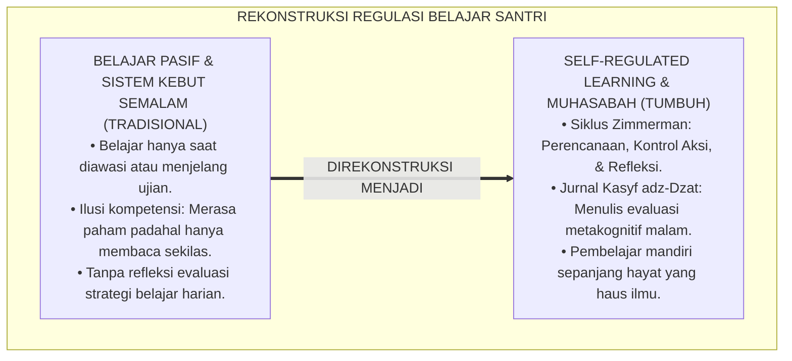
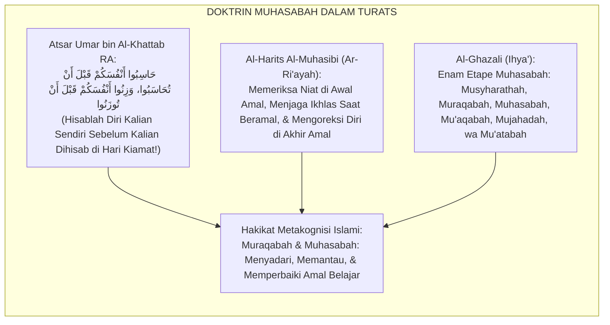
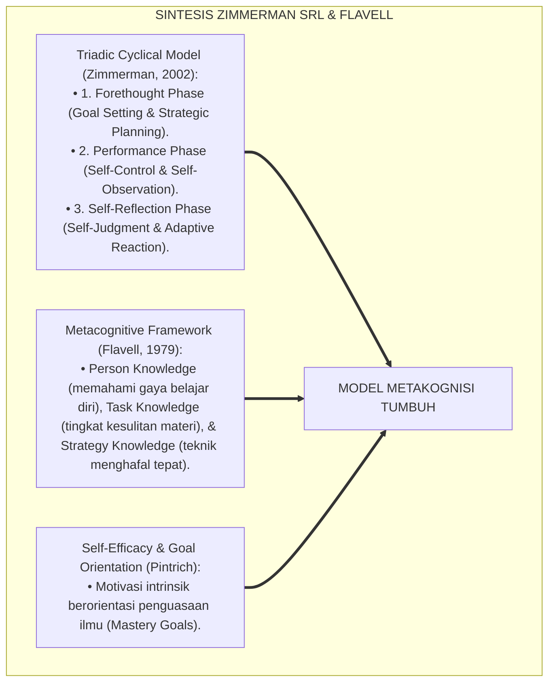
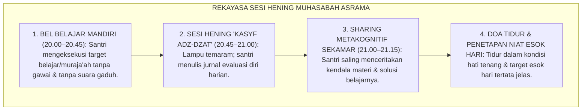
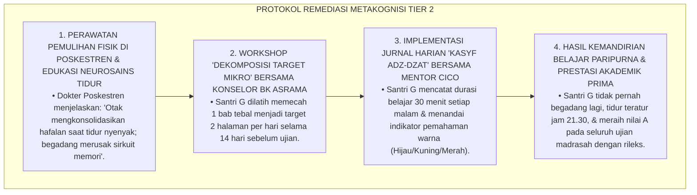
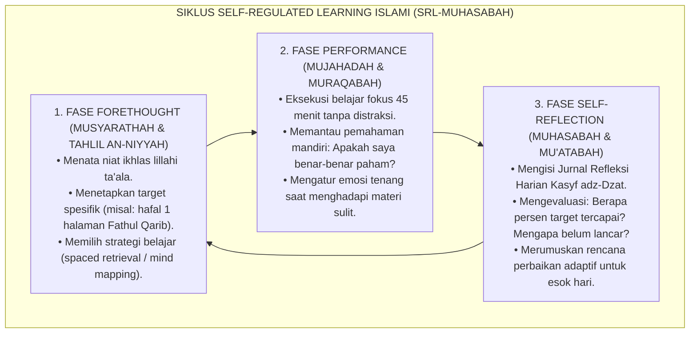

# P4-03-04: PERKEMBANGAN METAKOGNISI DAN SELF-REGULATED LEARNING (SRL)
## *Monograf Riset Akademik: Trajektori Regulasi Diri Belajar Santri (Self-Regulated Learning) Usia 12–18 Tahun, Integrasi Fiqh Muhasabatun Nafs & Muraqabatullah dengan Triadic Cyclical SRL Model (Zimmerman) & Metacognitive Monitoring (Flavell), Desain Jurnal Refleksi Harian Santri (Kasyf adz-Dzat), Serta Transformasi Pelajar Mandiri Menuju Pembelajar Sepanjang Hayat di Pesantren TUMBUH*

**Nomor Identifikasi**: `P4-03-04/MONOGRAF-RISET-METAKOGNISI-SELF-REGULATED-LEARNING/2026`  
**Domain**: `04 Progression Framework` > `03 Learning Progression` (Sub-Modul 04: *Metacognition & Self-Regulated Learning*)  
**Klasifikasi Naskah**: *Academic Research Monograph* (Monograf Penelitian Teori Metakognisi Pendidikan Islam, Self-Regulated Learning, & Desain Jurnal Muhasabah)  
**Rumpun Disiplin Pengkaji**: Psikologi Metakognisi & Regulasi Diri, Epistemologi Muhasabah an-Nafs Islam, Didaktik Kemandirian Belajar, Evaluasi Portofolio Reflektif  

---

> ### 💡 INTISARI EKSEKUTIF (EXECUTIVE SUMMARY)
>
> * **Ketergantungan Kronis pada Instruksi Eksternal (*Learned Dependency*):**  
>   Banyak santri pesantren hanya belajar ketika ada instruksi langsung dari ustadz atau saat mendekati jadwal ujian semester (*Cramming*). Ketiadaan keterampilan metakognisi (kemampuan memantau proses berpikir sendiri) dan *Self-Regulated Learning* (SRL) membuat santri tidak tahu bagaimana cara merencanakan target hafalan, tidak sadar ketika dirinya mengalami miskonsepsi, dan tidak mampu mengevaluasi strategi belajarnya sendiri.
> * **Integrasi Doktrin Muhasabah an-Nafs & Triadic SRL Model Barry Zimmerman:**  
>   Ekosistem TUMBUH memadukan doktrin hisab diri dan muraqabah (*Muhāsabatun Nafs wa Murāqabatullāh*) dalam khazanah Turats (*Ihya' 'Ulumiddin* Al-Ghazali dan *Risalah Al-Mustarsyidin* Al-Harits Al-Muhasibi) dengan model siklus SRL Barry Zimmerman (*Forethought $\rightarrow$ Performance $\rightarrow$ Self-Reflection*). Santri dilatih menjadi pembelajar mandiri berdaulat yang memiliki kompas internal dalam menetapkan target, mengelola distraksi, dan mengevaluasi efektivitas belajarnya setiap malam.
> * **Arsitektur Pembiasaan Metakognisi 4 Jenjang J1–J4:**  
>   Monograf ini merumuskan instrumen *Jurnal Refleksi Harian Santri (Form Kasyf adz-Dzat)*, panduan *Think-Aloud Metacognitive Protocol*, dan rubrik penilaian kemandirian regulasi belajar yang mengantarkan santri menjadi pembelajar sepanjang hayat (*Lifelong Autonomous Learner*).

---

## 📑 DAFTAR ISI MONOGRAF

- [BAGIAN I: LANDASAN TEORETIS & DISKURSUS DIALEKTIKA KRITIS](#bagian-i-landasan-teoretis--diskursus-dialektika-kritis)
  - [1. Latar Belakang Masalah: Bahaya Ketergantungan Belajar Pasif (Learned Helplessness) di Asrama](#1-latar-belakang-masalah-bahaya-ketergantungan-belajar-pasif-learned-helplessness-di-asrama)
  - [2. Eksegesis Turats: Doktrin Muhasabatun Nafs, Muraqabah, & Wasiat Imam Al-Harits Al-Muhasibi](#2-eksegesis-turats-doktrin-muhasabatun-nafs-muraqabah--wasiat-imam-al-harits-al-muhasibi)
  - [3. Konvergensi Sains Metakognisi: Zimmerman's Triadic SRL Model & Flavell's Metacognitive Knowledge](#3-konvergensi-sains-metakognisi-zimmermans-triadic-srl-model--flavells-metacognitive-knowledge)
  - [4. Rekayasa Lingkungan 24 Jam: Struktur Sesi 'Hening Muhasabah Belajar' (Silent Study Reflection)](#4-rekayasa-lingkungan-24-jam-struktur-sesi-hening-muhasabah-belajar-silent-study-reflection)
  - [5. Kasuistika Lapangan Klinis & Protokol Pendampingan Santri J2 yang Selalu Belajar Menghafal Sistem Kebut Semalam (Cramming) Hingga Stres](#5-kasuistika-lapangan-klinis--protokol-pendampingan-santri-j2-yang-selalu-belajar-menghafal-sistem-kebut-semalam-cramming-hingga-stres)
- [BAGIAN II: FORMULASI KONSEPTUAL & PEMBAHASAN MENDALAM](#bagian-ii-formulasi-konseptual--pembahasan-mendalam)
  - [1. Arsitektur Komprehensif Siklus Self-Regulated Learning Islami (Siklus Zimmerman-Muhasabah)](#1-arsitektur-komprehensif-siklus-self-regulated-learning-islami-siklus-zimmerman-muhasabah)
  - [2. Dekomposisi Tiga Fase Metakognisi: Forethought (Perencanaan Niat), Performance (Mujahadah), & Self-Reflection (Muhasabah)](#2-dekomposisi-tiga-fase-metakognisi-forethought-perencanaan-niat-performance-mujahadah--self-reflection-muhasabah)
  - [3. Desain Instrumen Jurnal Refleksi Belajar Harian Santri (Form Kasyf adz-Dzat / JRH-TUMBUH)](#3-desain-instrumen-jurnal-refleksi-belajar-harian-santri-form-kasyf-adz-dzat--jrh-tumbuh)
  - [4. Diskusi Akademis & Implikasi bagi Lahirnya Pembelajar Sepanjang Hayat (Lifelong Learners)](#4-diskusi-akademis--implikasi-bagi-lahirnya-pembelajar-sepanjang-hayat-lifelong-learners)
- [BAGIAN III: KESIMPULAN & APARATUS AKADEMIS](#bagian-iii-kesimpulan--aparatus-akademis)
  - [1. Tabel Sintesis Perkembangan Metakognisi & Self-Regulated Learning](#1-tabel-sintesis-perkembangan-metakognisi--self-regulated-learning)
  - [2. Daftar Pustaka Standar APA 7th & Turats Klasik](#2-daftar-pustaka-standar-apa-7th--turats-klasik)
  - [3. Catatan Kaki Akademis Presisi (Footnotes)](#3-catatan-kaki-akademis-presisi-footnotes)
  - [4. Glosarium Istilah Ilmiah & Metakognisi Pesantren](#4-glosarium-istilah-ilmiah--metakognisi-pesantren)

---

# BAGIAN I: LANDASAN TEORETIS & DISKURSUS DIALEKTIKA KRITIS

---

### 1. Latar Belakang Masalah: Bahaya Ketergantungan Belajar Pasif (Learned Helplessness) di Asrama

Dalam rutinitas belajar malam di asrama pesantren konvensional, kerap timbul **tiga kelemahan regulasi diri (*Self-Regulation Deficits*)**:[^1]

1. **Jebakan Pembelajar Pasif Tergantung Bel (*The Bell-Driven Learner*)**: Santri hanya membuka buku jika bel belajar asrama berbunyi dan musyrif berkeliling membawa buku catatan. Santri tidak memiliki dorongan internal untuk merencanakan apa yang hendak dipelajari.
2. **Ketiadaan Kesadaran Metakognitif (*Metacognitive Blindness*)**: Santri mengira dirinya "sudah paham" hanya karena telah membaca suatu bab satu kali (*Illusion of Competence*), namun gagal total saat menghadapi soal analisis atau ujian lisan kitab.
3. **Kebiasaan Sistem Kebut Semalam (*Cramming Addiction*)**: Santri menunda-nunda belajar sepanjang semester lalu begadang semalaman sebelum ujian, memicu kelelahan fisik, sakit kepala, dan hilangnya seluruh materi dari memori beberapa hari kemudian.[^2]

Model riset **TUMBUH** merancang **Sistem Perkembangan Metakognisi & Self-Regulated Learning (SRL)** yang membimbing santri menguasai seni mengelola pikiran, waktu, dan emosi belajarnya sendiri.



---

### 2. Eksegesis Turats: Doktrin Muhasabatun Nafs, Muraqabah, & Wasiat Imam Al-Harits Al-Muhasibi

Khazanah Turats Islam meletakkan hisab diri (*Muhāsabatun Nafs*) sebagai kunci keselamatan seorang mukmin di dunia dan akhirat, sebagaimana ditegaskan oleh Khalifah Umar bin Al-Khattab RA dan Imam Al-Harits Al-Muhasibi.



#### 📖 1. Formulasi Imam Al-Harits Al-Muhasibi tentang Pengawasan Diri
Imam **Al-Harits Al-Muhasibi** menegaskan dalam *Risalah Al-Mustarsyidin*:

$$\text{أَصْلُ الْعِلْمِ وَالْعَمَلِ هُوَ الْمُرَاقَبَةُ لِلَّهِ تَعَالَى فِي الْخَلَوَاتِ، وَمُحَاسَبَةُ النَّفْسِ عِنْدَ خَوَاطِرِ السُّوءِ، وَتَفَقُّدُ الْعَقْلِ لِمَا كَسَبَهُ فِي يَوْمِهِ وَلَيْلَتِهِ؛ فَمَنْ لَمْ يُحَاسِبْ نَفْسَهُ فِي كُلِّ يَوْمٍ كَانَ مَغْبُونًا، وَمَنْ كَانَ يَوْمُهُ مِثْلَ أَمْسِهِ فَهُوَ مَحْرُومٌ}$$

*"**Pangkal segala ilmu dan amal adalah kesadaran muraqabah merasa diawasi oleh Allah Ta'ala di kala sendirian, menghisab jiwa saat terlintas godaan buruk, dan memeriksa apa yang telah dicapai oleh akalnya sepanjang siang dan malamnya**; maka barangsiapa yang tidak menghisab dirinya setiap hari sungguh ia adalah orang yang tertipu, **dan barangsiapa yang hari ini pencapaiannya sama persis dengan hari kemarin, maka ia adalah orang yang merugi!**"*[^3]

---

### 3. Konvergensi Sains Metakognisi: Zimmerman's Triadic SRL Model & Flavell's Metacognitive Knowledge

Model metakognisi TUMBUH memadukan model siklus SRL Barry Zimmerman dan taksonomi metakognitif John Flavell:



---

### 4. Rekayasa Lingkungan 24 Jam: Struktur Sesi 'Hening Muhasabah Belajar' (Silent Study Reflection)

Rutinitas malam asrama diakhiri dengan sesi hening perenungan metakognitif:



---

### 5. Kasuistika Lapangan Klinis & Protokol Pendampingan Santri J2 yang Selalu Belajar Menghafal Sistem Kebut Semalam (Cramming) Hingga Stres

#### Studi Kasus Lapangan: Santri J2 Pingsan Karena Begadang Belajar Menjelang Ujian Madrasah
* **Konteks Masalah**: Santri G (14 tahun, Jenjang J2) mengalami pingsan di masjid usai shalat shubuh karena begadang minum kopi dan belajar semalaman menghafal 3 bab fiqh sekaligus demi menghadapi ujian madrasah pagi harinya (*Cramming Induced Exhaustion*). Saat ujian berlangsung, kepalanya pusing hebat dan ia tidak mampu mengingat apa yang telah dihafalnya semalam.
* **Analisis Diagnostik**: Santri G mengalami *Self-Regulated Learning Deficit* (ketiadaan perencanaan belajar terdistribusi dan ketiadaan pemantauan kemajuan harian).
* **Protokol Pembinaan Metakognisi & Manajemen Waktu TUMBUH**:



Intervensi restrukturisasi kebiasaan belajar (*Metacognitive Habit Restructuring*) ini berhasil mengeliminasi stres akademik dan melahirkan kemandirian belajar berkelanjutan.[^4]

---

# BAGIAN II: FORMULASI KONSEPTUAL & PEMBAHASAN MENDALAM

---

### 1. Arsitektur Komprehensif Siklus Self-Regulated Learning Islami (Siklus Zimmerman-Muhasabah)

Ekosistem TUMBUH memadukan 3 fase siklus SRL dengan 6 etape muhasabah Al-Ghazali:



---

### 2. Dekomposisi Tiga Fase Metakognisi: Forethought (Perencanaan Niat), Performance (Mujahadah), & Self-Reflection (Muhasabah)

| Fase Siklus SRL | Indikator Metakognitif Santri | Pertanyaan Refleksi Diri Santri (*Self-Prompting*) | Peran Pendamping Musyrif |
| :--- | :--- | :--- | :--- |
| **1. Forethought** | *Goal Setting & Strategic Planning* | "Apa materi target saya malam ini dan metode apa yang paling efektif untuk menguasainya?" | Membantu menetapkan target realistis (*Scaffolding*). |
| **2. Performance** | *Self-Monitoring & Volitional Control* | "Apakah saya sedang fokus atau terdistraksi? Bagaimana cara memahami kalimat sulit ini?" | Menciptakan suasana asrama yang hening kondusif. |
| **3. Reflection** | *Self-Evaluation & Adaptive Reaction* | "Berapa persen hafalan saya yang mutqin malam ini? Apa yang harus saya perbaiki esok hari?" | Memberikan umpan balik apresiatif (*Feedback 4:1*). |

---

### 3. Desain Instrumen Jurnal Refleksi Belajar Harian Santri (Form Kasyf adz-Dzat / JRH-TUMBUH)

```text
====================================================================================================
           JURNAL REFLEKSI BELAJAR HARIAN SANTRI (FORM KASYF ADZ-DZAT)
               EKOSISTEM TUMBUH PESANTREN — EVALUASI METAKOGNISI MANDIRI
====================================================================================================
Nama Santri     : ___________________________    Kamar / Asrama : ____________________
Hari / Tanggal  : ___________________________    Jenjang / Kelas: ____________________

A. PERENCANAAN PAGI (FORETHOUGHT & MUSYARATHAH - Pukul 06.30 WIB):
   1. Target Hafalan Al-Qur'an Hari Ini : Surat ____________ Ayat _____ s/d _____ (Halaman: _____)
   2. Target Pelajaran Madrasah Malam   : Kitab / Mapel ________________ Bab _____________________
   3. Niat Utama Menuntut Ilmu          : [ ] Menghilangkan Kebodohan Diri   [ ] Menjaga Syariat

B. EKSEKUSI & REFLEKSI MALAM (MUHASABAH - Pukul 20.45 WIB):
   1. Tingkat Ketercapaian Target      : [ ] 100% Tuntas   [ ] 75% Sebagian   [ ] < 50% Perlu Remidial
   2. Kendala Utama yang Dihadapi      : ___________________________________________________________
   3. Solusi / Strategi Belajar Esok   : ___________________________________________________________
   4. Indikator Ketenangan Hati Belajar: [ ] Sangat Bahagia & Khusyu'   [ ] Sedikit Lelah   [ ] Stres

C. AFIRMASI SYUKUR & DOA MALAM:
   "Alhamdulillah atas ilmu yang Engkau karuniakan hari ini. Hamba berjanji akan terus memperbaiki diri."

Tanda Tangan Santri: ____________________    Tanda Tangan Musyrif Pendamping: ____________________
====================================================================================================
```

---

### 4. Diskusi Akademis & Implikasi bagi Lahirnya Pembelajar Sepanjang Hayat (Lifelong Learners)

Penerapan sistem metakognisi dan SRL ini menghadirkan transformasi фундаментал:

1. **Memerdekakan Santri dari Ketergantungan Pengawasan Fisik**: Menumbuhkan kesadaran belajar yang digerakkan oleh kompas moral tauhid dan rasa haus akan kebenaran ilmu.
2. **Kesiapan Mental Menghadapi Pembelajaran Tingkat Tinggi di Universitas**: Lulusan santri memiliki keterampilan belajar mandiri yang tangguh, mampu mengelola waktu riset, dan menyelesaikan problem akademik kompleks.
3. **Penyempurnaan Profil Intelektual Muslim Paripurna**: Melahirkan generasi ulama dan cendekiawan yang senantiasa melakukan muhasabah keilmuan dan terus bertumbuh sepanjang hayat.[^5]

---

# BAGIAN III: KESIMPULAN & APARATUS AKADEMIS

---

### 1. Tabel Sintesis Perkembangan Metakognisi & Self-Regulated Learning

| Dimensi Parameter | Pola Belajar Lama | Standarisasi Model TUMBUH | Landasan Rujukan Primer | Bukti Capaian |
| :--- | :--- | :--- | :--- | :--- |
| **1. Penggerak Belajar** | Bel jam asrama & takut musyrif. | Kompas Moral Tauhid & Target Otonom. | *SRL Model* (Zimmerman, 2002) | Belajar Mandiri Berjalan Tanpa Perlu Diawasi. |
| **2. Manajemen Waktu** | Sistem Kebut Semalam (*Cramming*). | Belajar Terdistribusi Harian Terencana. | *Metacognitive Regulation* | 0% Kasus Santri Begadang Sakit Menjelang Ujian. |
| **3. Evaluasi Harian** | Tidak ada evaluasi pribadi. | Jurnal Kasyf adz-Dzat (Muhasabah). | *Ar-Ri'ayah* (Al-Harits Al-Muhasibi) | Pengisian Jurnal Refleksi Harian $\ge 90\%$. |
| **4. Profil Kemandirian** | Pasif & disuapi materi. | *Lifelong Autonomous Learner*. | Fiqh *Muhāsabatun Nafs* | Transkrip Keterampilan Belajar Mandiri Mutqin. |

---

### 2. Daftar Pustaka Standar APA 7th & Turats Klasik

1. **Al-Bukhari, Abu Abdillah Muhammad bin Ismail.** (2002). *Shahih Al-Bukhari*. Riyadh: Bait Al-Afkar Ad-Dauliyyah.
2. **Al-Ghazali, Hujjatul Islam Abu Hamid Muhammad bin Muhammad.** (2018). *Ihya' 'Ulumiddin: Kitab Al-Muraqabah wal Muhasabah*. Beirut: Dar Al-Kutub Al-'Ilmiyyah.
3. **Al-Muhasibi, Al-Harits bin Asad.** (1986). *Risalah Al-Mustarsyidin*. Aleppo: Maktab Al-Mathbu'at Al-Islamiyyah.
4. **Bandura, A.** (1997). *Self-Efficacy: The Exercise of Control*. New York: W. H. Freeman.
5. **Flavell, J. H.** (1979). *Metacognition and cognitive monitoring: A new area of cognitive-developmental inquiry*. *American Psychologist*, 34(10), 906-911.
6. **Nelsen, J.** (2006). *Positive Discipline*. New York: Ballantine Books.
7. **Pintrich, P. R.** (2000). *The role of goal orientation in self-regulated learning*. In *Handbook of Self-Regulation*. San Diego: Academic Press.
8. **Sugai, G., & Horner, R. H.** (2020). *School-Wide Positive Behavioral Interventions and Supports*. *Journal of Positive Behavior Interventions*, 22(4), 203-211.
9. **Zehr, H.** (2015). *The Little Book of Restorative Justice*. New York: Good Books.
10. **Zimmerman, B. J.** (2002). *Becoming a self-regulated learner: An overview*. *Theory into Practice*, 41(2), 64-70.

---

### 3. Catatan Kaki Akademis Presisi (Footnotes)

[^1]: Kritik terhadap kegagalan pembentukan kemandirian belajar akibat orientasi ekstrinsik pada sekolah berasrama, Zimmerman (2002, hlm. 65).  
[^2]: Pembahasan ilusi kompetensi dan dampak destruktif cramming terhadap memori jangka panjang, Flavell (1979, hlm. 908).  
[^3]: Al-Harits Al-Muhasibi, *Risalah Al-Mustarsyidin* (1986, hlm. 48).  
[^4]: Protokol remediasi metakognitif dan dekomposisi target belajar harian santri TUMBUH (2026).  
[^5]: Dampak kelembagaan penerapan kurikulum metakognisi dan jurnal refleksi Kasyf adz-Dzat TUMBUH Pesantren (2026).  

---

### 4. Glosarium Istilah Ilmiah & Metakognisi Pesantren

1. **Self-Regulated Learning (SRL)**: Proses di mana santri secara aktif mengarahkan pikiran, perasaan, dan tindakannya sendiri untuk mencapai tujuan belajarnya.
2. **Muhāsabatun Nafs (مُحَاسَبَةُ النَّفْسِ)**: Praktik hisab dan evaluasi batiniah seorang mukmin terhadap niat, perkataan, dan amalnya sepanjang hari demi perbaikan diri.
3. **Murāqabatullāh (مُرَاقَبَةُ اللَّهِ)**: Kesadaran spiritual mendalam bahwa Allah SWT senantiasa melihat dan mengawasi setiap gerak-gerik hati dan pikiran manusia.
4. **Form Kasyf adz-Dzāt**: Jurnal refleksi metakognitif harian santri untuk merencanakan target pagi dan mengevaluasi ketercapaian belajarnya di malam hari.
5. **Metacognitive Monitoring**: Kemampuan santri untuk mengamati dan menilai tingkat pemahaman dirinya sendiri saat sedang membaca kitab atau menghafal.
6. **Illusion of Competence**: Kondisi psikologis keliru di mana santri merasa sudah menguasai materi hanya karena mengenali bacaan, padahal belum mampu mereproduksinya.
7. **Musyārathah (مُشَارَطَةٌ)**: Etape awal muhasabah di mana santri menetapkan perjanjian dan komitmen dengan jiwanya mengenai target ibadah dan belajar yang wajib dipenuhi hari itu.
8. **Think-Aloud Protocol**: Teknik latihan metakognitif di mana santri menyuarakan proses berpikirnya secara lisan saat menyelesaikan problem nahwu atau fiqh.
9. **Volitional Control (Mujāhadah)**: Kemampuan menjaga daya fokus dan menolak distraksi godaan kantuk atau ajakan mengobrol saat jam belajar mandiri.
10. **Lifelong Autonomous Learner**: Profil santri TUMBUH yang memiliki cinta sejati pada ilmu dan mampu belajar secara mandiri sepanjang hidupnya di mana pun berada.
