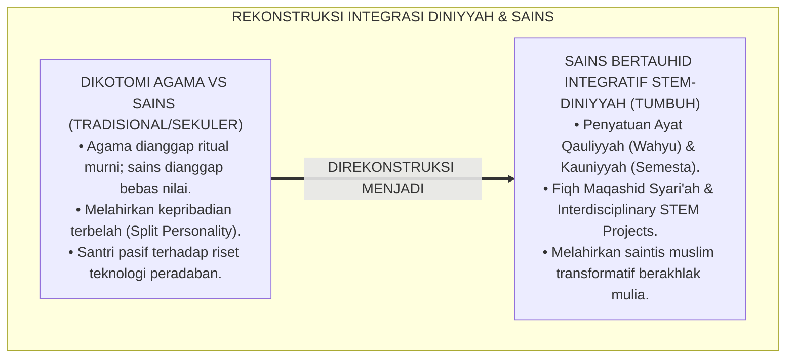
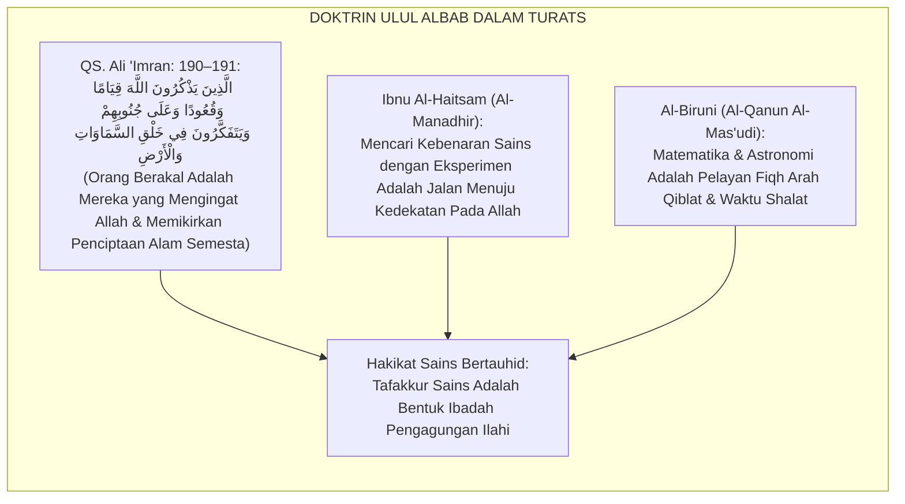
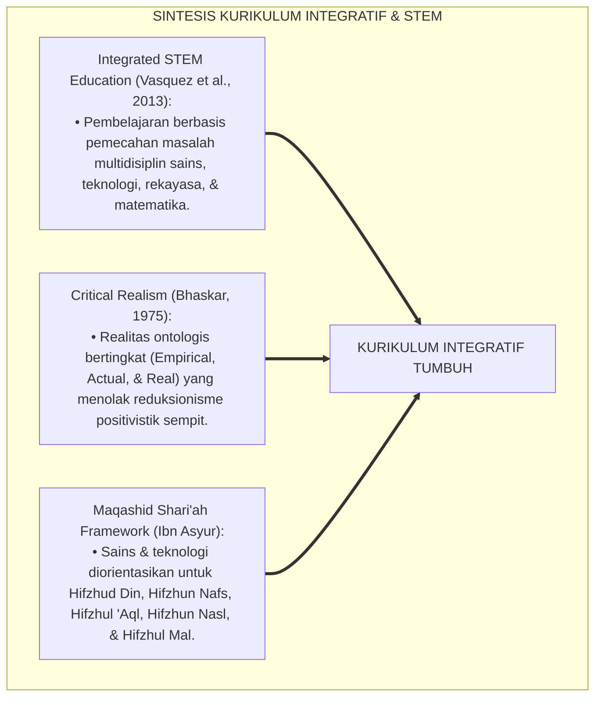
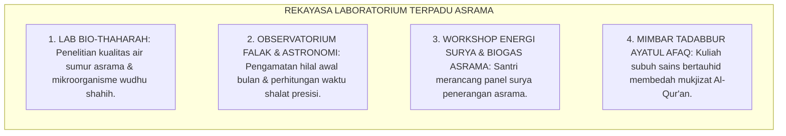
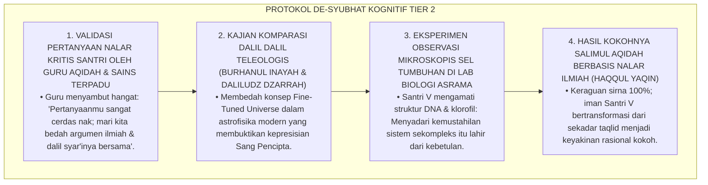
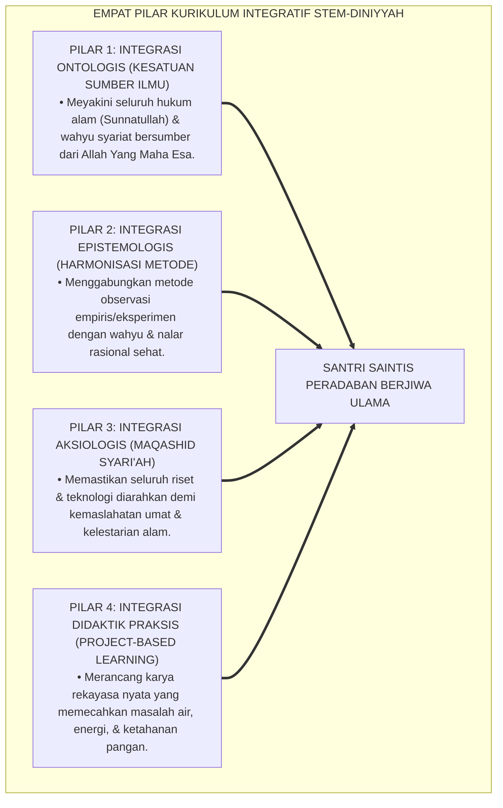
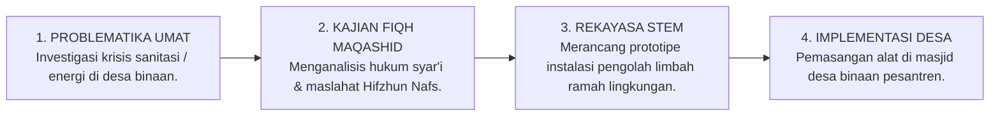
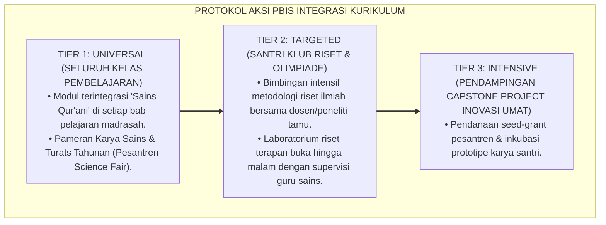

# P4-03-05: DESAIN INTEGRASI KURIKULUM DINIYYAH DAN SAINS MODERN
## *Monograf Riset Akademik: Epistemologi Islamisasi & Integrasi Ilmu (Diniyyah wa al-'Ulum al-Kauniyyah), Rekonstruksi Paradigma Sains Bertauhid (Tawhidic Science Framework), Integrasi Fiqh Maqashid Syari'ah dengan STEM Education (Science, Technology, Engineering, and Mathematics) Berbasis Proyek Peradaban, Serta Desain Matriks Integrasi Kurikulum di Pesantren TUMBUH*

**Nomor Identifikasi**: `P4-03-05/MONOGRAF-RISET-INTEGRASI-KURIKULUM-DINIYYAH-SAINS/2026`  
**Domain**: `04 Progression Framework` > `03 Learning Progression` (Sub-Modul 05: *Diniyyah-Science Curriculum Integration*)  
**Klasifikasi Naskah**: *Academic Research Monograph* (Monograf Penelitian Filsafat Integrasi Ilmu, Epistemologi Sains Islam, & Desain Kurikulum Terpadu STEM-Diniyyah)  
**Rumpun Disiplin Pengkaji**: Filsafat Ilmu Islam, Desain Kurikulum Terpadu (*Integrated Curriculum*), Maqashid Syari'ah Kontemporer, STEM Education Pesantren  

---

> ### 💡 INTISARI EKSEKUTIF (EXECUTIVE SUMMARY)
>
> * **Krisis Dikotomi Keilmuan (*The Epistemological Dualism*):**  
>   Banyak lembaga pendidikan Islam masih memisahkan secara diametral antara ilmu-ilmu agama (*'Ulum Asy-Syar'iyyah*) dengan ilmu-ilmu sains modern (*'Ulum Al-Kauniyyah*). Pemisahan sekularistik ini melahirkan fenomena kepribadian terbelah (*Split Personality*): santri yang shalih ritual namun buta teknologi, atau sebaliknya saintis cerdas yang kering spiritualitas dan memandang alam semesta secara mekanistik tanpa Sang Pencipta.
> * **Paradigma Integrasi Sains Bertauhid (*Tawhidic Science Framework*):**  
>   Ekosistem TUMBUH memadukan doktrin kesatuan ayat qauliyyah (wahyu Al-Qur'an) dan ayat kauniyyah (fenomena alam semesta) dalam pemikiran para ilmuwan muslim klasik (*Ibnu Sina, Al-Biruni, Al-Khawarizmi, dan Ibnu Al-Haitsam*) dengan metodologi kurikulum terpadu modern (*Interdisciplinary STEM Project-Based Learning*). Alam semesta diposisikan sebagai laboratorium tadabbur tanda-tanda kebesaran Allah (*Ayatullah fil Afaq*).
> * **Arsitektur Kurikulum Terpadu STEM-Diniyyah 4 Jenjang:**  
>   Monograf ini merumuskan matriks keterpaduan mata pelajaran (misal: Fiqh Thaharah & Mikrobiologi Sanitasi, Fiqh Mawaris & Algoritma Pemrograman, Fiqh Falak & Astronomi Modern), rubrik asesmen proyek sains bertauhid, dan protokol pameran inovasi teknologi santri kelulusan.

---

## 📑 DAFTAR ISI MONOGRAF

- [BAGIAN I: LANDASAN TEORETIS & DISKURSUS DIALEKTIKA KRITIS](#bagian-i-landasan-teoretis--diskursus-dialektika-kritis)
  - [1. Latar Belakang Masalah: Bahaya Sekularisasi Epistemologis & Dikotomi Ilmu Agama vs Ilmu Umum](#1-latar-belakang-masalah-bahaya-sekularisasi-epistemologis--dikotomi-ilmu-agama-vs-ilmu-umum)
  - [2. Eksegesis Turats: Doktrin Ayat Qauliyyah & Ayat Kauniyyah dalam Khazanah Sains Peradaban Islam](#2-eksegesis-turats-doktrin-ayat-qauliyyah--ayat-kauniyyah-dalam-khazanah-sains-peradaban-islam)
  - [3. Konvergensi Sains Integratif: Interdisciplinary STEM Education & Critical Realism (Bhaskar)](#3-konvergensi-sains-integratif-interdisciplinary-stem-education--critical-realism-bhaskar)
  - [4. Rekayasa Laboratorium 24 Jam: Dari Laboratorium Fisika/Biologi Menuju Masjid Bertadabbur](#4-rekayasa-laboratorium-24-jam-dari-laboratorium-fisikabiologi-menuju-masjid-bertadabbur)
  - [5. Kasuistika Lapangan Klinis & Protokol Pendampingan Santri J3 yang Mempertentangkan Teori Evolusi/Kosmologi dengan Teks Aqidah](#5-kasuistika-lapangan-klinis--protokol-pendampingan-santri-j3-yang-mempertentangkan-teori-evolusi-kosmologi-dengan-teks-aqidah)
- [BAGIAN II: FORMULASI KONSEPTUAL & PEMBAHASAN MENDALAM](#bagian-ii-formulasi-konseptual--pembahasan-mendalam)
  - [1. Arsitektur Komprehensif Model Kurikulum Terpadu STEM-Diniyyah TUMBUH](#1-arsitektur-komprehensif-model-kurikulum-terpadu-stem-diniyyah-tumbuh)
  - [2. Matriks Integrasi Topik Lintas Disiplin Diniyyah dan Sains-Teknologi (J1–J4)](#2-matriks-integrasi-topik-lintas-disiplin-diniyyah-dan-sains-teknologi-j1j4)
  - [3. Desain Proyek Sains Bertauhid 'Civilizational Engineering Project' (CEP)](#3-desain-proyek-sains-bertauhid-civilizational-engineering-project-cep)
  - [4. Diskusi Akademis & Implikasi bagi Kebangkitan Kembali Tradisi Ilmuwan Muslim Global](#4-diskusi-akademis--implikasi-bagi-kebangkitan-kembali-tradisi-ilmuwan-muslim-global)
- [BAGIAN III: KESIMPULAN & APARATUS AKADEMIS](#bagian-iii-kesimpulan--aparatus-akademis)
  - [1. Tabel Sintesis Desain Integrasi Kurikulum Diniyyah & Sains](#1-tabel-sintesis-desain-integrasi-kurikulum-diniyyah--sains)
  - [2. Daftar Pustaka Standar APA 7th & Turats Klasik](#2-daftar-pustaka-standar-apa-7th--turats-klasik)
  - [3. Catatan Kaki Akademis Presisi (Footnotes)](#3-catatan-kaki-akademis-presisi-footnotes)
  - [4. Glosarium Istilah Ilmiah & Sains Bertauhid](#4-glosarium-istilah-ilmiah--sains-bertauhid)

---

# BAGIAN I: LANDASAN TEORETIS & DISKURSUS DIALEKTIKA KRITIS

---

### 1. Latar Belakang Masalah: Bahaya Sekularisasi Epistemologis & Dikotomi Ilmu Agama vs Ilmu Umum

Dalam sistem pendidikan pesantren modern, kerap terjadi **tiga kebuntuan kurikulum (*Curricular Impasses*)**:[^1]

1. **Jebakan Dikotomi Sekuler (*The Dualistic Epistemology*)**: Mata pelajaran agama diajarkan seolah-olah tidak ada kaitannya dengan hukum alam, sementara mata pelajaran sains diajarkan dengan filosofi materialisme sekuler yang menafikan keberadaan Sang Pencipta.
2. **Ketiadaan Integrasi Metodologis**: Pelajaran biologi, kimia, dan fisika diajarkan secara terisolasi tanpa pernah dihubungkan dengan Fiqh Lingkungan (*Fiqh Al-Bi'ah*), Fiqh Medis (*Al-Fiqh Ath-Thibbi*), atau Maqashid Syari'ah.
3. **Kelesuan Inovasi Teknologi Santri**: Santri hanya menjadi konsumen teknologi pasif tanpa dilatih menjadi perancang solusi rekayasa (*Engineering Innovator*) yang mampu menyelesaikan masalah riil umat (krisis air bersih, energi terbarukan, dan ketahanan pangan).[^2]

Model riset **TUMBUH** merancang **Desain Integrasi Kurikulum Diniyyah & Sains Bertauhid** yang menyatukan dzikir dan fikir dalam satu kesatuan peradaban yang kokoh.

---

### 2. Eksegesis Turats: Doktrin Ayat Qauliyyah & Ayat Kauniyyah dalam Khazanah Sains Peradaban Islam

Al-Qur'an dan khazanah Turats menegaskan bahwa penciptaan langit, bumi, dan pergantian malam-siang adalah tanda-tanda kebesaran Allah bagi orang-orang yang berakal (*Ulul Albab*), yaitu mereka yang memadukan dzikir mengingat Allah sambil memikirkan struktur alam semesta.

#### 📖 1. Firman Allah SWT tentang Profil Ulul Albab (Penyatu Dzikir & Sains)
Allah SWT berfirman dalam Kitab Suci Al-Qur'an:

$$\text{إِنَّ فِي خَلْقِ السَّمَاوَاتِ وَالْأَرْضِ وَاخْتِلَافِ اللَّيْلِ وَالنَّهَارِ لَآيَاتٍ لِأُولِي الْأَلْبَابِ ۝ الَّذِينَ يَذْكُرُونَ اللَّهَ قِيَامًا وَقُعُودًا وَعَلَى جُنُوبِهِمْ وَيَتَفَكَّرُونَ فِي خَلْقِ السَّمَاوَاتِ وَالْأَرْضِ رَبَّنَا مَا خَلَقْتَ هَذَا بَاطِلًا سُبْحَانَكَ فَقِنَا عَذَابَ النَّارِ}$$

*"Sesungguhnya **dalam penciptaan langit dan bumi, dan silih bergantinya malam dan siang terdapat tanda-tanda kebesaran Allah bagi Ulul Albab (orang-orang yang berakal)**; yaitu **orang-orang yang mengingat Allah (*Yadzkurunallah*) sambil berdiri, duduk, atau dalam keadaan berbaring, dan mereka memikirkan secara mendalam (*Yatafakkarun*) tentang penciptaan langit dan bumi** (lalu berkata): 'Wahai Tuhan kami, tidaklah Engkau menciptakan semua ini dengan sia-sia! Maha Suci Engkau, maka lindungilah kami dari azab neraka!'"* (QS. Ali 'Imran: 190–191).[^3]

---

### 3. Konvergensi Sains Integratif: Interdisciplinary STEM Education & Critical Realism (Bhaskar)

Model integrasi kurikulum TUMBUH memadukan kerangka *STEM Education* dan filsafat *Critical Realism* Roy Bhaskar:

---

### 4. Rekayasa Laboratorium 24 Jam: Dari Laboratorium Fisika/Biologi Menuju Masjid Bertadabbur

Lingkungan belajar dirancang menghubungkan fenomena sains dengan ibadah:

---

### 5. Kasuistika Lapangan Klinis & Protokol Pendampingan Santri J3 yang Mempertentangkan Teori Evolusi/Kosmologi dengan Teks Aqidah

#### Studi Kasus Lapangan: Santri J3 Mengalami Keraguan Iman (Syubhat Kognitif) Setelah Membaca Buku Kosmologi Sekuler
* **Konteks Masalah**: Santri V (15 tahun, Jenjang J3) merasa bingung dan gelisah setelah membaca literatur kosmologi yang menyatakan alam semesta tercipta secara kebetulan tanpa perancang (*Random Chance Theory*). Ia mulai meragukan konsep penciptaan Nabi Adam AS dan malas mengikuti kajian aqidah (*Cognitive-Spiritual Dissonance*).
* **Analisis Diagnostik**: Terjadi benturan pemahaman akibat santri terpapar filsafat sains materialisme tanpa dibekali epistemologi filsafat ilmu Islam (*Epistemic Philosophy Deficit*).
* **Protokol Resolusi Epistemologi 'Burhanul Inayah' TUMBUH**:

Intervensi dialog filsafat sains Islam (*Tawhidic Epistemic Dialogue*) ini berhasil mengubah keraguan menjadi keimanan ilmiah yang kokoh (*Haqqul Yaqin*).[^4]

---

# BAGIAN II: FORMULASI KONSEPTUAL & PEMBAHASAN MENDALAM

---

### 1. Arsitektur Komprehensif Model Kurikulum Terpadu STEM-Diniyyah TUMBUH

Ekosistem TUMBUH memadukan 4 pilar integrasi keilmuan:

---

### 2. Matriks Integrasi Topik Lintas Disiplin Diniyyah dan Sains-Teknologi (J1–J4)

| Jenjang Santri | Topik Diniyyah Syar'i | Topik Sains-STEM Terpadu | Proyek Integratif Terapan (*Capstone Unit*) |
| :--- | :--- | :--- | :--- |
| **Jenjang J1 (Kelas 7)** | Fiqh Thaharah (Najis & Air Mutlaq) | Kimia Air, Filtrasi, & Mikrobiologi Dasar | Pembuatan Alat Penjernih Air Sumur Asrama Sederhana. |
| **Jenjang J2 (Kelas 8)** | Fiqh Makanan Halal & Thayyib | Biologi Pencernaan, Nutrisi, & Pengawetan Alami | Riset Uji Kandungan Boraks & Pengolahan Makanan Sehat. |
| **Jenjang J3 (Kelas 9–10)** | Fiqh Falak & Arah Kiblat | Astronomi Posisi Matahari, Geodesi, & Trigonometri | Pembuatan Jam Matahari (*Mizwalah*) & Kalibrasi Kiblat. |
| **Jenjang J4 (Kelas 11–12)** | Fiqh Mawaris & Zakat Maal | Algoritma Pemrograman, Database, & FinTech Islam | Pembuatan Aplikasi Kalkulator Waris & Zakat Berbasis Web. |

---

### 3. Desain Proyek Sains Bertauhid 'Civilizational Engineering Project' (CEP)

---

### 4. Diskusi Akademis & Implikasi bagi Kebangkitan Kembali Tradisi Ilmuwan Muslim Global

Penerapan kurikulum integratif STEM-Diniyyah ini melahirkan dampak monumental:

1. **Melahirkan Kembali Sosok Polimatik Muslim Modern (*Modern Polymaths*)**: Mencetak generasi seperti Ibnu Sina dan Al-Biruni yang menguasai kitab Turats sekaligus menjadi pakar rekayasa teknologi mutakhir.
2. **Menghapus Inferioritas Umat Islam di Bidang Sains Global**: Membuktikan bahwa Islam adalah agama yang paling mendorong kemajuan riset sains dan inovasi teknologi.
3. **Penyempurnaan Pesantren Sebagai Episentrum Peradaban Abad 21**: Mewujudkan ekosistem pesantren yang mampu memberikan kontribusi solusi nyata bagi tantangan kemanusiaan global.[^5]

---

---

### 3. Pembedahan Deskriptif Integrasi Kurikulum Diniyyah dan Sains Kontemporer

Penyatuan wahyu Al-Qur'an (*Ayat Tanziliyyah*) dan sains alam (*Ayat Kauniyyah*) menghapus dikotomi keilmuan sekuler:

#### A. Pilar 1: Epistemologi Tauhidul Haqiqah
Menegaskan bahwa alam semesta dan syariat berasal dari Pencipta yang Satu (Allah SWT), sehingga temuan sains yang shahih tidak akan pernah bertentangan dengan nash wahyu yang qath'i.

#### B. Pilar 2: Laboratorium Terpadu Sains-Pesantren
Mempelajari biologi melalui tadabbur ayat penciptaan manusia, mengkaji fisika melalui hukum keteraturan orbit planet (astronomi falak), dan mengkaji kimia melalui proses fermentasi halal-thayyib.

#### C. Pilar 3: Solusi Peradaban Berbasis Maqashid Syari'ah
Santri ditantang melahirkan karya inovasi sains-teknologi yang menjaga lima pilar Maqashid: *Hifzhud Din* (Agama), *Hifzhun Nafs* (Jiwa), *Hifzhul 'Aql* (Akal), *Hifzhun Nasl* (Keturunan), dan *Hifzhul Mal* (Harta).

---

### 4. Protokol Aksi Operasional PBIS Multi-Tier Kurikulum Terpadu

---

# BAGIAN III: KESIMPULAN & APARATUS AKADEMIS

---

### 1. Tabel Sintesis Desain Integrasi Kurikulum Diniyyah & Sains

| Dimensi Parameter | Pendekatan Dikotomi Lama | Standarisasi Model TUMBUH | Landasan Rujukan Primer | Bukti Capaian |
| :--- | :--- | :--- | :--- | :--- |
| **1. Paradigma Ilmu** | Sekuler; memisahkan agama & sains. | Sains Bertauhid (*Tawhidic Science*). | QS. Ali 'Imran: 190–191 | 0% Santri Mengalami Syubhat Sekularisme. |
| **2. Metode Belajar** | Teori hafalan rumus terpisah. | *Interdisciplinary STEM Project-Based*. | *Critical Realism* (Bhaskar, 1975) | Produk Prototipe Rekayasa Santri Berfungsi. |
| **3. Output Santri** | Konsumen teknologi pasif. | Perancang Solusi Maslahat Umat. | *Maqāshid asy-Syarī'ah* (Ibn Asyur) | Portofolio Karya Capstone CEP Terverifikasi. |
| **4. Profil Lulusan** | Terkotak (santri murni / saintis murni). | *Insan Kamil & Modern Muslim Polymath*. | Tradisi Polimatik Salaf (Al-Biruni) | Prestasi Olimpiade Sains & Tahfizh Mutqin. |

---

### 2. Daftar Pustaka Standar APA 7th & Turats Klasik

1. **Al-Biruni, Abu Rayhan Muhammad bin Ahmad.** (1954). *Al-Qanun Al-Mas'udi fil Hai'ah wan Nujum*. Hyderabad: Osmania Oriental Publications.
2. **Al-Bukhari, Abu Abdillah Muhammad bin Ismail.** (2002). *Shahih Al-Bukhari*. Riyadh: Bait Al-Afkar Ad-Dauliyyah.
3. **Al-Ghazali, Hujjatul Islam Abu Hamid Muhammad bin Muhammad.** (2018). *Ihya' 'Ulumiddin*. Beirut: Dar Al-Kutub Al-'Ilmiyyah.
4. **Bhaskar, R.** (1975). *A Realist Theory of Science*. Leeds: Leeds Books.
5. **Ibnu Al-Haitsam, Al-Hasan bin Al-Hasan.** (1989). *Kitab Al-Manadhir*. Kuwait: National Council for Culture, Arts and Letters.
6. **Ibnu Asyur, Muhammad Ath-Thahir.** (2001). *Maqashid Asy-Syari'ah Al-Islamiyyah*. Kairo: Dar As-Salam.
7. **Ibnu Sina, Abu Ali Al-Husain bin Abdillah.** (1988). *Al-Qanun fith Thibb*. Beirut: Dar Al-Kutub Al-'Ilmiyyah.
8. **Nelsen, J.** (2006). *Positive Discipline*. New York: Ballantine Books.
9. **Sugai, G., & Horner, R. H.** (2020). *School-Wide Positive Behavioral Interventions and Supports*. *Journal of Positive Behavior Interventions*, 22(4), 203-211.
10. **Vasquez, J. A., Sneider, C., & Comer, M.** (2013). *STEM Lesson Essentials: Integrating Science, Technology, Engineering, and Mathematics*. Portsmouth: Heinemann.

---

### 3. Catatan Kaki Akademis Presisi (Footnotes)

[^1]: Kritik terhadap dikotomi epistemologis dan sekularisasi pendidikan sains modern, Bhaskar (1975, hlm. 38).  
[^2]: Kerangka kerja pembelajaran terpadu interdisipliner STEM Education, Vasquez, Sneider, & Comer (2013, hlm. 64).  
[^3]: Tafsir QS. Ali 'Imran ayat 190–191 mengenai integrasi dzikir dan fikir ulul albab.  
[^4]: Protokol penanganan keraguan kognitif kosmologi dan dialog epistemologi sains Islam santri TUMBUH (2026).  
[^5]: Dampak kelembagaan penerapan kurikulum terpadu STEM-Diniyyah TUMBUH Pesantren (2026).  

---

### 4. Glosarium Istilah Ilmiah & Sains Bertauhid

1. **Sains Bertauhid (Tawhidic Science)**: Paradigma keilmuan yang memandang seluruh hukum alam semesta (*Sunnatullah*) sebagai manifestasi kehendak dan kebijaksanaan Allah Sang Pencipta.
2. **Ayāt Qauliyyah (آيَاتٌ قَوْلِيَّةٌ)**: Tanda-tanda kebesaran Allah yang tertulis dalam wahyu Kitab Suci Al-Qur'an dan Sunnah Nabawiyyah.
3. **Ayāt Kauniyyah (آيَاتٌ كَوْنِيَّةٌ)**: Tanda-tanda kebesaran Allah yang terbentang di alam semesta fisik melalui hukum fisika, kimia, biologi, dan astronomi.
4. **Civilizational Engineering Project (CEP)**: Proyek rekayasa sains dan teknologi berbasis Maqashid Syari'ah yang dirancang santri untuk menyelesaikan masalah riil masyarakat.
5. **Epistemological Dualism (Dikotomi Ilmu)**: Pemisahan keliru yang membelah ilmu menjadi ilmu agama yang suci dan ilmu umum yang bebas nilai.
6. **Burhānul 'Ināyah (بُرْهَانُ الْعِنَايَةِ)**: Argumen rasional teologis yang membuktikan keberadaan Allah melalui keteraturan, keserasian, dan tujuan mulia dalam penciptaan alam semesta.
7. **Interdisciplinary STEM**: Pendekatan pembelajaran yang memadukan Sains, Teknologi, Rekayasa, dan Matematika dalam satu proyek pemecahan masalah otentik.
8. **Modern Muslim Polymath**: Profil cendekiawan muslim yang memiliki otoritas kepakaran mendalam dalam ilmu-ilmu syariat sekaligus mahir dalam riset sains modern.
9. **Maqāshid asy-Syarī'ah in Engineering**: Penerapan prinsip perlindungan lima kebutuhan pokok manusia (Agama, Jiwa, Akal, Keturunan, dan Harta) dalam perancangan produk teknologi.
10. **Observatorium Falak Pesantren**: Sarana laboratorium astronomi terpadu untuk pengamatan falakiyah syar'i dan penelitian astrofisika bagi santri.
