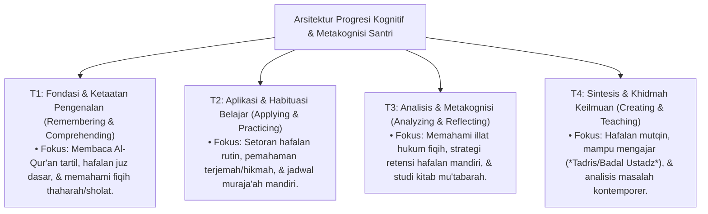
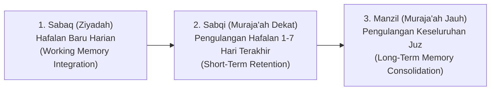

# P4-03: Progresi Belajar Diniyyah, Metakognisi & Retensi Hafalan Santri

## Status Dokumen
* **Status**: 🌟 **A+ (Tervalidasi & Siap Diimplementasikan)**
* **Sub-Domain**: `04 Progression Framework / 03 Learning Progression`
* **Penanggung Jawab Keilmuan**: Dewan Keilmuan TUMBUH (*Pakar Psikologi Belajar & Pakar Epistemologi Turats*)

---

## 1. Arsitektur Progresi Kognitif Belajar Santri

---

## 2. Metodologi Retensi Hafalan Mutqin (Al-Qur'an & Kitab Klasik)

Memadukan tradisi *Talaqqi/Sama'* Turats dengan neurosains memori kognitif (*Cognitive Load Theory & Spaced Repetition*):

### Kurva Retensi Memory & Evaluasi Mutqin
1. **Spaced Repetition Schedule**: Pengulangan dilakukan pada interval H+1, H+3, H+7, H+14, dan H+30 untuk mencegah *Ebbinghaus Forgetting Curve*.
2. **Kriteria Mutqin**:
   - Lancar tanpa terhenti lebih dari 2 kali per juz.
   - Menguasai makhraj huruf, tajwid, dan waqaf-ibtida'.
   - Memahami makna global (*Ma'ani al-Ayat*).

---

## 3. Tahapan Perkembangan Metakognisi Santri (T1–T4)

| Tangga Progresi | Strategi Belajar | Metakognisi (Monitoring Diri) | Peran Pengajar / Musyrif |
| :--- | :--- | :--- | :--- |
| **T1 (Adaptasi)** | *Guided Learning*: Mengikuti pola setoran yang ditentukan guru. | Belum mampu mengidentifikasi kesalahan hafalan sendiri; butuh koreksi langsung. | Memberikan *scaffolding* teknik menghafal (visual/auditori). |
| **T2 (Habituasi)** | *Structured Self-Study*: Menentukan jam muraja'ah pribadi. | Mulai menyadari juz mana yang lemah dan butuh pengulangan ekstra. | Menyediakan *check-list* mutabaah harian. |
| **T3 (Internalisasi)** | *Self-Regulated Learning*: Memilih teknik hafalan sesuai karakteristik kognitif diri. | Mampu menganalisis sebab kelalaian belajar dan menyesuaikan strategi. | Memberikan *feedback* formatif kualitatif & fasilitasi diskusi. |
| **T4 (Kemandirian)** | *Autonomous & Reflective Learning*: Mengaitkan ayat/hadits dengan realitas sosial. | Menguasai regulasi kognisi utuh; mampu membimbing metode belajar adik kelas. | Mitra diskusi ilmiah & pembimbing riset/khidmah santri. |

---

## 4. Evaluasi Formatif Berkelanjutan

- **Bukan Sekadar Nilai Angka**: Evaluasi akademik dan hafalan menggunakan *Developmental Rubrics* yang menilai usaha (*effort/mujahadah*), konsistensi, dan ketelitian (*itqan*).
- **Feedback Loop Positif**: Setiap ujian setoran memberikan rekomendasi perbaikan konstruktif tanpa membuat santri merasa putus asa atau minder.
