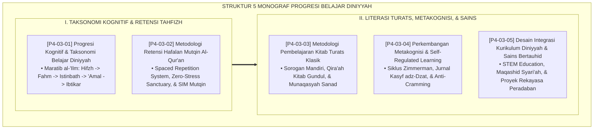

# P4-03: DOKUMEN INDUK PROGRESI BELAJAR DINIYYAH DAN METAKOGNISI SANTRI
## *Peta Arsitektur Transmisi Keilmuan Islam Terpadu (Progresi Kognitif Taksonomi Diniyyah, Retensi Hafalan Mutqin Al-Qur'an, Pembelajaran Kitab Turats Klasik, Self-Regulated Learning & Metakognisi, Serta Integrasi Sains Bertauhid STEM) di Ekosistem TUMBUH Pesantren*

**Nomor Identifikasi**: `P4-03/DOKUMEN-INDUK-PROGRESI-BELAJAR-DINIYYAH-METAKOGNISI/2026`  
**Domain**: `04 Progression Framework` > `03 Learning Progression` (Gugus Sub-Domain 03: *Diniyyah Learning Progression & Metacognition*)  
**Klasifikasi Naskah**: *Master Architecture & Navigation Monograph* (Dokumen Induk Peta Jalan Riset & Navigasi 5 Monograf Ilmiah Progresi Belajar)  
**Rumpun Disiplin Pengkaji**: Epistemologi Ilmu Islam & Metodologi Turats, Neurosains Kognitif Pembelajaran, Self-Regulated Learning (SRL), STEM-Diniyyah Integration  

---

> ### 💡 INTISARI EKSEKUTIF (EXECUTIVE SUMMARY)
>
> * **Kedudukan Strategis Gugus Progresi Belajar Diniyyah & Metakognisi:**  
>   Gugus *Learning Progression (Progresi Pembelajaran Diniyyah & Metakognisi)* merupakan jantung transmisi keilmuan (*Naqlul 'Ilm*) di pesantren yang menjembatani tradisi adab salafush shalih dengan neurobiologi kognisi modern. Pendidikan di pesantren bukan sekadar transfer teks hafalan secara mekanis, melainkan pembentukan struktur skema berpikir syariat yang kokoh (*Malakah Fiqhiyyah*), retensi hafalan mutqin abadi, kemampuan membaca kitab kuning gundul secara mandiri, kemandirian metakognisi hisab diri (*Muhasabah Belajar*), dan penguasaan sains teknologi bertauhid.
> * **Integrasi Holistik Turats & Neurosains Kognitif:**  
>   Gugus riset ini memadukan konsep *Maratib al-'Ilm* dan *Ta'ahhudul Qur'an* para ulama (*Ihya' 'Ulumiddin* Al-Ghazali, *At-Tibyan* An-Nawawi, dan *Jami' Bayanil 'Ilm* Ibnu Abdil Barr) dengan sains kognitif internasional (*Cognitive Load Theory Sweller, Spaced Repetition Ebbinghaus, Krashen's Comprehensible Input, Zimmerman's SRL Model, dan Integrated STEM Education*).
> * **Struktur Lengkap 5 Berkas Monograf Riset Ilmiah:**  
>   Dokumen induk ini memetakan dan menghubungkan 5 berkas monograf penelitian akademik komprehensif (~140 KB total riset) yang menyajikan panduan pedagogi kelas, halaqah tahfizh bebas stres, kurikulum kitab berjenjang, jurnal refleksi malam, dan proyek rekayasa sains peradaban.

---

## 📑 PETA NAVIGASI LIMA MONOGRAF RISET PROGRESI BELAJAR DINIYYAH

Berikut adalah daftar lengkap 5 monograf riset akademik dalam gugus **`03 Learning Progression`**:

---

## 📚 DESKRIPSI RINGKAS 5 BERKAS MONOGRAF

1. **[P4-03-01: Progresi Kognitif dan Taksonomi Belajar Diniyyah](file:///c:/xampp/htdocs/tumbuh/04%20Progression%20Framework/03%20Learning%20Progression/P4-03-01-Progresi-Kognitif-dan-Taksonomi-Belajar.md)**  
   *Membahas rekonstruksi Taksonomi Bloom Terevisi dengan Maratib al-'Ilm Sufyan Ats-Tsauri, Cognitive Load Theory John Sweller, eliminasi hafalan buta, dan rubrik nalar kritis syariat (Form ANS-Diniyyah).*
2. **[P4-03-02: Metodologi Retensi Hafalan Mutqin Al-Qur'an](file:///c:/xampp/htdocs/tumbuh/04%20Progression%20Framework/03%20Learning%20Progression/P4-03-02-Metodologi-Retensi-Hafalan-Mutqin-Al-Quran.md)**  
   *Membahas konsolidasi memori jangka panjang tahfizh, doktrin Ta'ahhudul Qur'an, Spaced Repetition Hermann Ebbinghaus, Active Retrieval Practice, eliminasi trauma bentakan, dan algoritma jadwal muraja'ah berjarak.*
3. **[P4-03-03: Metodologi Pembelajaran Kitab Turats Klasik](file:///c:/xampp/htdocs/tumbuh/04%20Progression%20Framework/03%20Learning%20Progression/P4-03-03-Metodologi-Pembelajaran-Kitab-Turats.md)**  
   *Membahas didaktik pengkajian kitab kuning, metode Sorogan mandiri Al-Qira'ah 'alasy-Syaikh, Comprehensible Input Stephen Krashen ($i+1$), kurikulum kitab wajib berjenjang J1–J4, dan rubrik asesmen membaca kitab gundul (Form RK-Turats).*
4. **[P4-03-04: Perkembangan Metakognisi dan Self-Regulated Learning](file:///c:/xampp/htdocs/tumbuh/04%20Progression%20Framework/03%20Learning%20Progression/P4-03-04-Perkembangan-Metakognisi-dan-Self-Regulated-Learning.md)**  
   *Membahas kemandirian belajar santri, doktrin Muhasabatun Nafs Al-Harits Al-Muhasibi, Triadic Cyclical SRL Barry Zimmerman, eliminasi sistem kebut semalam (cramming), dan Jurnal Refleksi Kasyf adz-Dzat.*
5. **[P4-03-05: Desain Integrasi Kurikulum Diniyyah dan Sains Modern](file:///c:/xampp/htdocs/tumbuh/04%20Progression%20Framework/03%20Learning%20Progression/P4-03-05-Desain-Integrasi-Kurikulum-Diniyyah-Sains.md)**  
   *Membahas epistemologi sains bertauhid (Ayat Qauliyyah & Kauniyyah), integrasi Maqashid Syari'ah dengan interdisciplinary STEM Education, eliminasi dikotomi ilmu, dan proyek rekayasa peradaban di desa binaan.*

---

## 🎯 STANDAR PENJAMINAN MUTU PEMBELAJARAN DINIYYAH

Penerapan gugus **Progresi Belajar Diniyyah dan Metakognisi (Learning Progression)** menjamin bahwa:
1. **Keotentikan Sanad & Kedalaman Nalar (*Authentic Mastery & Critical Reasoning*)**: Santri menguasai Al-Qur'an dan kitab Turats klasik dengan pemahaman mendalam, fasih membaca teks gundul, dan bersanad shahih.
2. **Kemandirian Belajar Sepanjang Hayat (*Autonomous Lifelong Learner*)**: Santri memiliki regulasi diri metakognitif dan kebiasaan muhasabah yang menjadikannya pembelajar mandiri berdaulat.
3. **Penyatuan Dzikir dan Fikir Peradaban (*Polymathic Integration*)**: Menghasilkan lulusan yang kokoh aqidah dan ibadahnya sekaligus unggul dalam sains, riset, dan teknologi modern bagi kemakmuran peradaban umat manusia.
