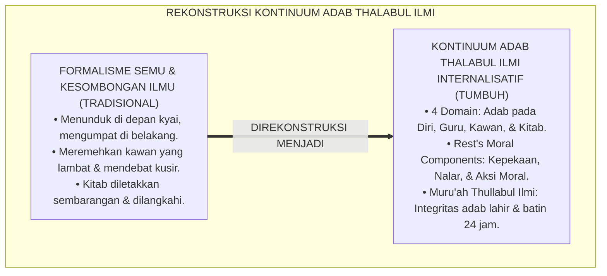
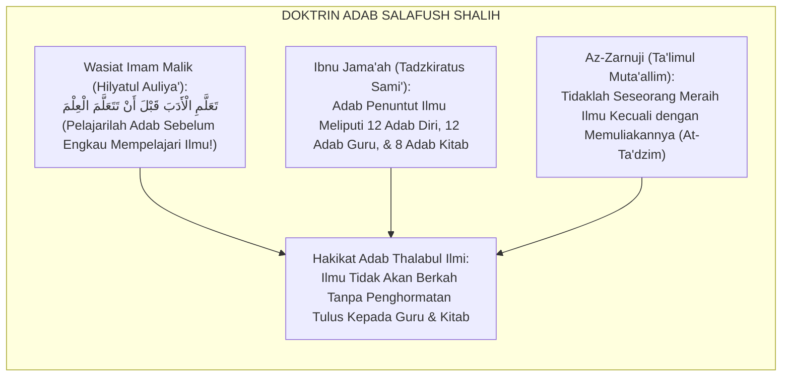
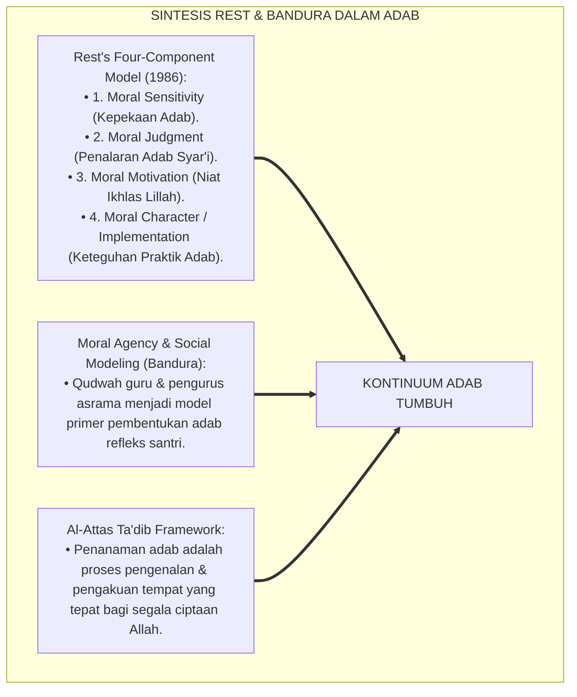
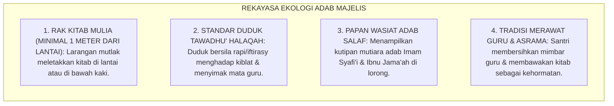
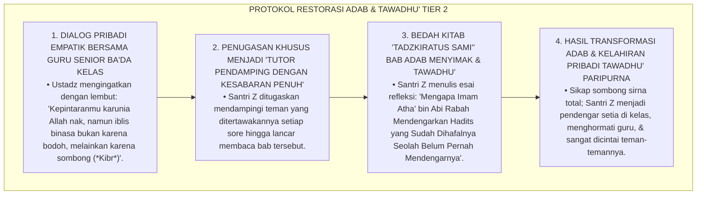
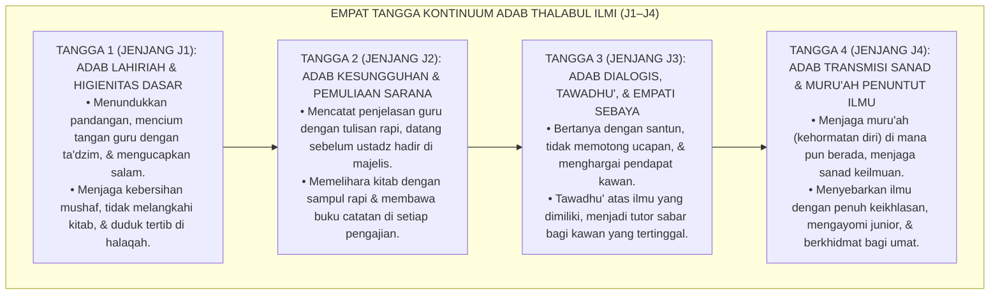
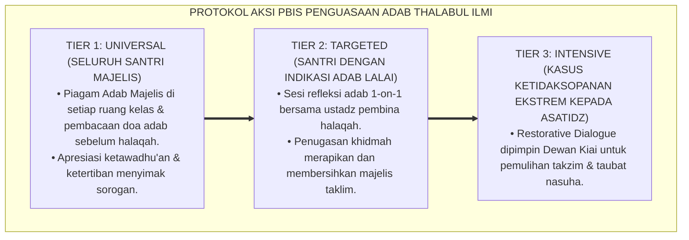

# P4-04-01: KONTINUUM PENGUASAAN ADAB THALABUL ILMI SANTRI
## *Monograf Riset Akademik: Trajektori Evolusi Adab Penuntut Ilmu (Adab ma'an-Nafs, ma'as-Syaikh, ma'az-Zamil, wa ma'al-Kitab) Sepanjang Jenjang J1–J4, Integrasi Doktrin Ta'dzimul Ilmi wa Ahlihi Turats Klasik dengan Teori Internalisasi Moral (Rest's Four-Component Model & Bandura's Social Learning), Serta Matriks Rubrik Observasi Adab di Ekosistem Pesantren Berbasis TUMBUH*

**Nomor Identifikasi**: `P4-04-01/MONOGRAF-RISET-KONTINUUM-ADAB-THALABUL-ILMI/2026`  
**Domain**: `04 Progression Framework` > `04 Mastery Progression` (Sub-Modul 01: *Adab Thalabul Ilmi Mastery Continuum*)  
**Klasifikasi Naskah**: *Academic Research Monograph* (Monograf Penelitian Epistemologi Adab Penuntut Ilmu, Progresi Etika Akademik Islam, & Rubrik Observasi Adab)  
**Rumpun Disiplin Pengkaji**: Epistemologi Adab Islam (*Ta'dibiyyah*), Psikologi Perkembangan Moral (*Rest's Moral Components*), Sosiologi Halaqah Pesantren, Evaluasi Karakter Autentik  

---

> ### 💡 INTISARI EKSEKUTIF (EXECUTIVE SUMMARY)
>
> * **Krisis Formalisme & Erosi Adab Akademik di Era Modern:**  
>   Di banyak lembaga pendidikan, adab kerap direduksi sekadar menjadi "kepatuhan lahiriah yang kaku" (seperti bersalaman sambil membungkuk ekstrem) namun kering dari penghormatan batin terhadap kemuliaan ilmu (*Ta'zhīmul 'Ilm*). Ketika santri berhadapan dengan perbedaan pendapat atau saat berada di luar pengawasan kyai, sikap meremehkan guru, mencela kawan belajar, dan memperlakukan buku/kitab secara tidak terhormat (*Su'ul Adab*) kerap menyeruak ke permukaan.
> * **Integrasi Ta'dzimul Ilmi Salaf & Rest's Four-Component Moral Model:**  
>   Ekosistem TUMBUH merekonstruksi penguasaan adab thalabul ilmi dengan memadukan karya-karya adab agung para ulama (*Tadzkiratus Sami'* Ibnu Jama'ah, *Ta'limul Muta'allim* Az-Zarnuji, dan *Hilyah Thalibil 'Ilm* Bakr Abu Zaid) dengan *Four-Component Moral Model* James Rest (*Moral Sensitivity, Moral Judgment, Moral Motivation, & Moral Character*). Adab diposisikan sebagai **kontinuum evolutif 4 etape**: dari pembiasaan sopan santun fisik dasar (J1), adab mencatat & memuliakan kitab (J2), adab dialogis & tawadhu' ilmiah (J3), hingga adab transmisi sanad & menjaga muru'ah penuntut ilmu (J4).
> * **Arsitektur Kontinuum Adab 4 Jenjang J1–J4:**  
>   Monograf ini merumuskan rubrik observasi adab 360 derajat (Rubrik ADAB-TI), protokol adab halaqah kelas, etika digital thalabul ilmi, dan standar evaluasi kenaikan tangga kematangan adab.

---

## 📑 DAFTAR ISI MONOGRAF

- [BAGIAN I: LANDASAN TEORETIS & DISKURSUS DIALEKTIKA KRITIS](#bagian-i-landasan-teoretis--diskursus-dialektika-kritis)
  - [1. Latar Belakang Masalah: Bahaya 'Pintar Tanpa Adab' & Formalisme Sikap Semu](#1-latar-belakang-masalah-bahaya-pintar-tanpa-adab--formalisme-sikap-semu)
  - [2. Eksegesis Turats: Doktrin Ta'dzimul Ilmi wa Ahlihi dalam Khazanah Ta'dib Islam](#2-eksegesis-turats-doktrin-tadzimul-ilmi-wa-ahlihi-dalam-khazanah-tadib-islam)
  - [3. Konvergensi Sains Perkembangan Moral: Rest's Four-Component Model & Bandura's Moral Agency](#3-konvergensi-sains-perkembangan-moral-rests-four-component-model--banduras-moral-agency)
  - [4. Rekayasa Lingkungan 24 Jam: Ekologi Pembiasaan Adab Majelis & Etika Memuliakan Kitab](#4-rekayasa-lingkungan-24-jam-ekologi-pembiasaan-adab-majelis--etika-memuliakan-kitab)
  - [5. Kasuistika Lapangan Klinis & Protokol Pendampingan Santri J3 yang Memotong Pembicaraan Guru dan Meremehkan Penjelasan Teman di Kelas](#5-kasuistika-lapangan-klinis--protokol-pendampingan-santri-j3-yang-memotong-pembicaraan-guru-dan-meremehkan-penjelasan-teman-di-kelas)
- [BAGIAN II: FORMULASI KONSEPTUAL & PEMBAHASAN MENDALAM](#bagian-ii-formulasi-konseptual--pembahasan-mendalam)
  - [1. Arsitektur Komprehensif Kontinuum Penguasaan Adab Thalabul Ilmi TUMBUH](#1-arsitektur-komprehensif-kontinuum-penguasaan-adab-thalabul-ilmi-tumbuh)
  - [2. Dekomposisi Empat Domain Adab: Adab ma'an-Nafs, ma'as-Syaikh, ma'az-Zamil, wa ma'al-Kitab](#2-dekomposisi-empat-domain-adab-adab-maan-nafs-maas-syaikh-maaz-zamil-wa-maal-kitab)
  - [3. Matriks Progresi Kontinuum Adab Lintas Jenjang J1–J4](#3-matriks-progresi-kontinuum-adab-lintas-jenjang-j1j4)
  - [4. Diskusi Akademis & Implikasi bagi Reformasi Budaya Akademik Pesantren Abad 21](#4-diskusi-akademis--implikasi-bagi-reformasi-budaya-akademik-pesantren-abad-21)
- [BAGIAN III: KESIMPULAN & APARATUS AKADEMIS](#bagian-iii-kesimpulan--aparatus-akademis)
  - [1. Tabel Sintesis Kontinuum Penguasaan Adab Thalabul Ilmi](#1-tabel-sintesis-kontinuum-penguasaan-adab-thalabul-ilmi)
  - [2. Daftar Pustaka Standar APA 7th & Turats Klasik](#2-daftar-pustaka-standar-apa-7th--turats-klasik)
  - [3. Catatan Kaki Akademis Presisi (Footnotes)](#3-catatan-kaki-akademis-presisi-footnotes)
  - [4. Glosarium Istilah Ilmiah & Adab Thalabul Ilmi](#4-glosarium-istilah-ilmiah--adab-thalabul-ilmi)

---

# BAGIAN I: LANDASAN TEORETIS & DISKURSUS DIALEKTIKA KRITIS

---

### 1. Latar Belakang Masalah: Bahaya 'Pintar Tanpa Adab' & Formalisme Sikap Semu

Dalam dinamika pendidikan pesantren modern, kerap timbul **tiga krisis etika akademik (*Academic Ethical Crises*)**:[^1]

1. **Jebakan Intelektual Angkuh (*The Arrogant Intellectual Trap*)**: Santri yang memiliki hafalan banyak atau nilai rapor tinggi merasa lebih hebat dari orang lain, gemar mendebat guru secara tidak sopan (*Jidal 'Aqim*), dan merendahkan kawan yang lambat belajar.
2. **Formalisme Adab Hipokrit (*Performative Politeness*)**: Santri hanya bersikap manis dan menunduk saat di depan kyai/pengasuh, namun berbicara kasar, melempar kitab di lantai, dan mengumpat di belakang pengasuh.
3. **Pelecehan Terhadap Sumber Ilmu (*Disrespect to Sacred Knowledge*)**: Kitab-kitab suci dan catatan ilmu diletakkan sembarangan di bawah kasur, dilangkahi, atau dicoret-coret dengan gambar tidak senonoh.[^2]

Model riset **TUMBUH** merancang **Kontinuum Penguasaan Adab Thalabul Ilmi** yang menginternalisasikan adab ke dalam lubuk jiwa terdalam (*Nafsiyyah Thahirah*), menjadikan penghormatan kepada ilmu sebagai ekspresi ketakwaan kepada Allah SWT.

---

### 2. Eksegesis Turats: Doktrin Ta'dzimul Ilmi wa Ahlihi dalam Khazanah Ta'dib Islam

Khazanah Turats meletakkan adab mendahului ilmu (*Al-Adab Qablal 'Ilm*). Imam Malik bin Anas berpesan kepada pemuda Quraisy: *"Pelajarilah adab sebelum engkau mempelajari ilmu!"*

#### 📖 1. Formulasi Syaikh Burhanuddin Az-Zarnuji tentang Kunci Keberkahan Ilmu
Syaikh **Az-Zarnuji** menegaskan dalam *Ta'limul Muta'allim*:

$$\text{اعْلَمْ بِأَنَّ طَالِبَ الْعِلْمِ لَا يَنَالُ الْعِلْمَ وَلَا يَنْتَفِعُ بِهِ إِلَّا بِتَعْظِيمِ الْعِلْمِ وَأَهْلِهِ، وَتَعْظِيمِ الْأُسْتَاذِ وَتَوْقِيرِهِ؛ قِيلَ: مَا وَصَلَ مَنْ وَصَلَ إِلَّا بِالْحُرْمَةِ، وَمَا سَقَطَ مَنْ سَقَطَ إِلَّا بِتَرْكِ الْحُرْمَةِ وَالتَّعْظِيمِ}$$

*"**Ketahuilah bahwasanya seorang penuntut ilmu tidak akan pernah meraih ilmu dan tidak akan mampu memetik manfaat ilmunya melainkan dengan memuliakan ilmu (*Ta'zhīmul 'Ilm*) beserta para ahlinya, dan memuliakan sang guru (*Ta'zhīmul Ustādz*) serta menghormatinya**; dikatakan dalam hikmah para ulama: **'Tidaklah seseorang sampai pada derajat kemuliaan ilmu melainkan karena ia menjaga penghormatan (*Al-Hurmah*), dan tidaklah seseorang tersungkur jatuh binasa melainkan karena ia meninggalkan penghormatan dan pengagungan terhadap ilmu!'**"*[^3]

---

### 3. Konvergensi Sains Perkembangan Moral: Rest's Four-Component Model & Bandura's Moral Agency

Kontinuum adab TUMBUH memadukan *Four-Component Moral Model* James Rest dan *Moral Agency* Albert Bandura:

---

### 4. Rekayasa Lingkungan 24 Jam: Ekologi Pembiasaan Adab Majelis & Etika Memuliakan Kitab

Lingkungan asrama dan madrasah dirancang menghidupkan budaya pemuliaan ilmu:

---

### 5. Kasuistika Lapangan Klinis & Protokol Pendampingan Santri J3 yang Memotong Pembicaraan Guru dan Meremehkan Penjelasan Teman di Kelas

#### Studi Kasus Lapangan: Santri J3 Berdebat dengan Nada Sombong dan Menertawakan Kesalahan Bacaan Kitab Temannya
* **Konteks Masalah**: Di kelas madrasah, Santri Z (15 tahun, Jenjang J3, ranking 1 kelas) sering memotong penjelasan ustadz dengan nada menggurui (*Arrogant Interruption*) dan menertawakan kawan sekalasnya yang keliru membaca i'rab kitab *Fathul Qarib*. Tindakannya membuat suasana kelas tegang dan kawan-kawannya merasa minder (*Academic Bullying & Su'ul Adab*).
* **Analisis Diagnostik**: Santri Z mengalami *Intellectual Arrogance & Moral Sensitivity Deficit* (kecerdasan kognitif tinggi yang tidak diimbangi dengan kepekaan rasa tawadhu' dan empati persaudaraan).
* **Protokol Restorasi Adab & Bimbingan Tawadhu' TUMBUH**:

Intervensi restorasi adab (*Adab Restoration Coaching*) ini menyembuhkan kesombongan intelektual dan menumbuhkan kerendahhatian penuntut ilmu sejati.[^4]

---

# BAGIAN II: FORMULASI KONSEPTUAL & PEMBAHASAN MENDALAM

---

### 1. Arsitektur Komprehensif Kontinuum Penguasaan Adab Thalabul Ilmi TUMBUH

Ekosistem TUMBUH memetakan evolusi adab ke dalam 4 tangga penahapan:

---

### 2. Dekomposisi Empat Domain Adab: Adab ma'an-Nafs, ma'as-Syaikh, ma'az-Zamil, wa ma'al-Kitab

| Domain Adab | Deskripsi Esensi Syariat | Indikator Perilaku Teramati di Pesantren | Landasan Rujukan Turats |
| :--- | :--- | :--- | :--- |
| **1. Adab ma'an-Nafs** | Menyucikan niat ikhlas lillah & menjaga kebersihan jasad serta kesucian hati dari riya' dan 'ujub. | Niat lurus belajar, pakaian bersih rapi wangi, tidak membanggakan diri. | *Ihya'* (Imam Al-Ghazali) |
| **2. Adab ma'as-Syaikh** | Memuliakan guru, menyimak khusyu', tidak memotong pembicaraan, dan mendoakan kebaikan guru. | Datang sebelum guru, mencatat dawuh, berbicara santun, tidak mendebat. | *Tadzkiratus Sami'* (Ibnu Jama'ah) |
| **3. Adab ma'az-Zamil** | Menjaga ukhuwah, tidak merendahkan, saling menyemangati, dan berbagi catatan ilmu. | Tidak menertawakan kesalahan kawan, tutor sebaya sabar, Al-Itsar catatan. | *Ta'limul Muta'allim* (Az-Zarnuji) |
| **4. Adab ma'al-Kitab** | Memuliakan teks kitab, tidak meletakkan di lantai, menyampul rapi, & memegang dengan suci wudhu. | Kitab di rak tinggi, bersampul, tulisan catatan beradab, memegang dengan tangan kanan. | *Hilyah Thalibil 'Ilm* (Bakr Abu Zaid) |

---

### 3. Matriks Progresi Kontinuum Adab Lintas Jenjang J1–J4

| Dimensi Adab | Jenjang J1 (Kelas 7) | Jenjang J2 (Kelas 8) | Jenjang J3 (Kelas 9–10) | Jenjang J4 (Kelas 11–12) |
| :--- | :--- | :--- | :--- | :--- |
| **Adab Diri** | Ikhlas belajar dasar, pakaian bersih, wudhu sebelum masuk majelis. | Disiplin waktu majelis, menjauhi ghibah, menjaga fokus belajar. | Muraqabah hati dari 'ujub, qiyamullail penenang jiwa, muhasabah. | Keikhlasan paripurna (*Lillahi Ta'ala*), muru'ah penuntut ilmu sejati. |
| **Adab Guru** | Salam takzim, mencium tangan, mendengarkan tanpa gaduh. | Datang 10 menit sebelum guru, mencatat teratur, khidmah meja guru. | Bertanya dengan izin santun, menerima koreksi guru dengan lapang dada. | Berkhidmat tulus pada guru, menjaga nama baik & sanad guru sepanjang hayat. |
| **Adab Kawan** | Tidak mengejek fisik, menyapa ramah, berbagi ruang duduk. | Tidak mencela nilai kawan, membantu meminjamkan alat tulis secara tertib. | Mengapresiasi kelebihan kawan, tutor sebaya sabar, anti-jidal debat kusir. | Mengayomi seluruh adik kelas, menjadi pelindung keutuhan ukhuwah asrama. |
| **Adab Kitab** | Membawa kitab dengan dua tangan di dada, tidak meletakkan di lantai. | Menyampul kitab rapi, menulis makna beradab, menyimpan di rak meja. | Membaca kitab gundul dengan wudhu, menata kitab berdasar kemuliaan ilmu. | Menjaga kelestarian naskah Turats, riset kritis kitab dengan adab filologi. |

---

### 4. Diskusi Akademis & Implikasi bagi Reformasi Budaya Akademik Pesantren Abad 21

Penerapan kontinuum penguasaan adab thalabul ilmi menghasilkan keunggulan peradaban:

1. **Melahirkan Sarjana Muslim yang Beradab Sebelum Berilmu (*Adab-First Scholars*)**: Mencegah lahirnya intelektual sekuler yang cerdas namun merusak tatanan moral masyarakat.
2. **Harmonisasi Hubungan Guru-Santri yang Sarat Keberkahan (*Barakah of Ilm*)**: Menumbuhkan ikatan ruhani yang mendalam antara pendidik dan murid yang menjadi saluran turunnya taufiq Allah SWT.
3. **Penyempurnaan Pesantren Sebagai Suaka Adab Peradaban (*Sanctuary of Ta'dib*)**: Menjadikan pesantren sebagai percontohan peradaban beradab tinggi yang menginspirasi dunia pendidikan global.[^5]

---

---

### 3. Pembedahan Deskriptif Kontinuum Penguasaan Adab Thalabul Ilmi

Penguasaan adab menuntut ilmu ditata melalui empat etape pendakian moral:

#### A. Etape 1: Adab Diri & Kesucian Niat (Tahdzibun Niyyah)
Santri memurnikan tujuan belajar semata-mata untuk mengangkat kebodohan dari diri sendiri, mengamalkan syariat, dan mengharap ridha Allah SWT, bukan demi popularitas atau perdebatan kusir.

#### B. Etape 2: Adab Majelis & Penghormatan Guru (Ta'dzimul Asatidz)
Menjaga adab duduk yang khusyuk di hadapan guru, tidak memotong pembicaraan, menyimak dengan tawadhu', dan mendoakan kebaikan bagi para asatidz dan ulama musannif kitab.

#### C. Etape 3: Adab Kitab & Literasi Barakah (Hurmatul Kutub)
Memuliakan kitab-kitab turats: tidak meletakkan kitab di lantai, memegang dalam keadaan suci, mencatat faedah ilmu dengan rapi, dan menjaga kelestarian fisik kitab.

#### D. Etape 4: Pengamalan & Keteladanan Nyata (Al-'Amal bil 'Ilm)
Setiap kaidah adab yang dipelajari diwujudkan dalam tindakan refleks: santri yang mengkaji bab kebersihan menjadi orang pertama yang membersihkan kamar mandi, santri yang mengkaji bab ukhuwah memuliakan kawan sekamar.

---

### 4. Protokol Aksi Operasional PBIS Multi-Tier Adab Thalabul Ilmi

---

# BAGIAN III: KESIMPULAN & APARATUS AKADEMIS

---

### 1. Tabel Sintesis Kontinuum Penguasaan Adab Thalabul Ilmi

| Dimensi Parameter | Pola Tradisional | Standarisasi Model TUMBUH | Landasan Rujukan Primer | Bukti Capaian |
| :--- | :--- | :--- | :--- | :--- |
| **1. Orientasi Adab** | Formalisme fisik semata. | Internalisasi Batiniah 4 Domain Adab. | *Ta'limul Muta'allim* (Az-Zarnuji) | Form Observasi ADAB-TI $\ge 90.0$. |
| **2. Perlakuan Kitab** | Sering tercecer di lantai. | Standar Pemuliaan Kitab Suci & Turats. | *Tadzkiratus Sami'* (Ibnu Jama'ah) | 100% Kitab Bersampul & Tersusun di Rak Mulia. |
| **3. Iklim Majelis** | Pasif / Sesekali Mendebat Kusir. | Majelis Dialogis Penuh Mahabbah & Tawadhu'. | *Rest's Moral Component Model* | 0% Kasus Debat Kasar / Mengejek Kawan. |
| **4. Profil Akhir** | Pintar namun angkuh. | *Khadimul Ilmi: Cerdas, Tawadhu', & Beradab*. | Wasiat Imam Malik bin Anas | Transkrip Adab Santri Terverifikasi Mutqin. |

---

### 2. Daftar Pustaka Standar APA 7th & Turats Klasik

1. **Abu Dawud As-Sijistani, Sulaiman bin Al-Asy'ats.** (2009). *Sunan Abi Dawud*. Beirut: Dar Ar-Risalah Al-'Alamiyyah.
2. **Abu Zaid, Bakr bin Abdillah.** (1996). *Hilyah Thalibil 'Ilm*. Riyadh: Darul 'Ashimah.
3. **Al-Attas, Syed Muhammad Naquib.** (1980). *The Concept of Education in Islam: A Framework for an Islamic Philosophy of Education*. Kuala Lumpur: ABIM.
4. **Al-Bukhari, Abu Abdillah Muhammad bin Ismail.** (2002). *Shahih Al-Bukhari*. Riyadh: Bait Al-Afkar Ad-Dauliyyah.
5. **Al-Ghazali, Hujjatul Islam Abu Hamid Muhammad bin Muhammad.** (2018). *Ihya' 'Ulumiddin: Kitab Al-'Ilm*. Beirut: Dar Al-Kutub Al-'Ilmiyyah.
6. **Az-Zarnuji, Burhanul Islam.** (2008). *Ta'limul Muta'allim Thariqat Ta'allum*. Beirut: Dar Ibn Hazm.
7. **Bandura, A.** (2002). *Selective moral disengagement in the exercise of moral agency*. *Journal of Moral Education*, 31(2), 101-119.
8. **Ibnu Jama'ah Al-Kinani, Muhammad bin Ibrahim.** (2012). *Tadzkiratus Sami' wal Mutakallim fi Adabil 'Alim wal Muta'allim*. Beirut: Darul Basyair Al-Islamiyyah.
9. **Nelsen, J.** (2006). *Positive Discipline*. New York: Ballantine Books.
10. **Rest, J. R.** (1986). *Moral Development: Advances in Research and Theory*. New York: Praeger.

---

### 3. Catatan Kaki Akademis Presisi (Footnotes)

[^1]: Kritik terhadap erosi adab akademik dan intelektualisme tanpa etika, Rest (1986, hlm. 52).  
[^2]: Konseptualisasi Ta'dib sebagai inti pendidikan Islam menurut Prof. Syed Muhammad Naquib Al-Attas (1980, hlm. 18).  
[^3]: Az-Zarnuji, *Ta'limul Muta'allim Thariqat Ta'allum* (2008, hlm. 42).  
[^4]: Protokol restorasi adab dan bimbingan tawadhu' santri berprestasi TUMBUH (2026).  
[^5]: Dampak kelembagaan penerapan kontinuum penguasaan adab thalabul ilmi TUMBUH Pesantren (2026).  

---

### 4. Glosarium Istilah Ilmiah & Adab Thalabul Ilmi

1. **Ta'dīb (تَأْدِيبٌ)**: Proses penanaman adab dan akhlak mulia ke dalam jiwa manusia agar mampu mengenali dan menempatkan segala sesuatu pada posisi yang tepat dan adil.
2. **Ta'zhīmul 'Ilm (تَعْظِيمُ الْعِلْمِ)**: Sikap memuliakan dan mengagungkan ilmu pengetahuan, para ulama, kitab sumber, dan sarana belajar sebagai wujud ketakwaan kepada Allah SWT.
3. **Rest's Four-Component Model**: Model psikologi perkembangan moral yang memetakan perilaku moral menjadi 4 proses psikologis: kepekaan, pertimbangan, motivasi, dan karakter implementasi.
4. **Murū'ah (مُرُوءَةٌ)**: Penjagaan kehormatan diri, kesopanan budi pekerti, dan kepantasan sosial seorang penuntut ilmu dari hal-hal yang merendahkan martabat.
5. **Adab ma'as-Syaikh (أَدَبٌ مَعَ الشَّيْخِ)**: Kumpulan etika dan tata krama seorang santri dalam berinteraksi, menyimak, bertanya, dan berkhidmat kepada sang guru.
6. **Adab ma'al-Kitāb (أَدَبٌ مَعَ الْكِتَابِ)**: Kumpulan etika dalam memperlakukan kitab suci dan buku ilmu pengetahuan, seperti menjaga kebersihan, menyampul, dan tidak meletakkan di lantai.
7. **Jidāl 'Aqīm (جِدَالٌ عَقِيمٌ)**: Perdebatan kusir tanpa adab yang hanya bertujuan memuaskan hawa nafsu ingin menang sendiri dan merendahkan lawan bicara.
8. **Tawādhu' 'Ilmī (تَوَاضُعٌ عِلْمِيٌّ)**: Kerendahhatian intelektual yang menyadari bahwa semakin bertambah ilmu seseorang, semakin ia menyadari betapa luasnya kebodohan dirinya.
9. **Form ADAB-TI**: Rubrik observasi 360 derajat untuk mengevaluasi konsistensi pengamalan 4 domain adab thalabul ilmi santri di asrama dan kelas.
10. **Khadīmul 'Ilmi wal 'Ulamā'**: Derajat kehormatan spiritual bagi santri dalam sistem TUMBUH yang mendedikasikan hidupnya untuk memuliakan ilmu dan melayani para ulama demi kemakmuran umat.
