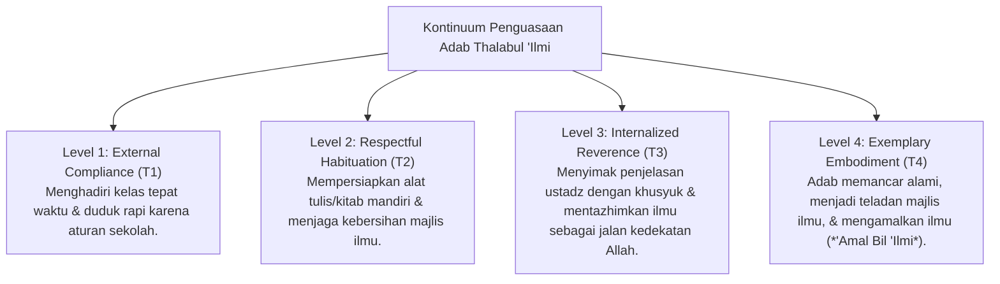

# P4-04-01: Kontinuum Penguasaan Adab Thalabul 'Ilmi Santri

## Status Dokumen
* **Status**: 🌟 **A+ (Tervalidasi & Siap Diimplementasikan)**
* **Sub-Domain**: `04 Progression Framework / 04 Mastery Progression`
* **Penanggung Jawab Keilmuan**: Dewan Keilmuan TUMBUH (*Pakar Desain Kurikulum Adab & Pakar Filosofi TUMBUH*)

---

## 1. Konseptualisasi Adab Thalabul 'Ilmi

Dalam tradisi pesantren ekosistem **TUMBUH**, adab menempati posisi sebelum ilmu (*Al-Adabu Qablal 'Ilmi*). Penguasaan adab menuntut ilmu berkembang dari kepatuhan fisik luar menuju pengagungan ilmu (*Ta'zhimul 'Ilmi*) dan penghormatan tulus kepada guru (*Tawadhu'*).

---

## 2. Rincian Indikator Adab Kelas, Ustadz & Kitab

| Dimensi Adab | Indikator Jenjang J1–T2 (Pondasi) | Indikator Jenjang J3–T4 (Penguasaan & Qudwah) |
| :--- | :--- | :--- |
| **Adab Terhadap Guru (Ustadz)** | Mengucapkan salam, menyapa dengan bahasa santun, & mendengarkan instruksi. | Bersikap tawadhu', mendoakan guru, & menjaga kehormatan guru di dalam/luar majlis. |
| **Adab Terhadap Majlis Ilmu** | Duduk rapi, tidak memotong pembicaraan, & menjaga ketertiban kelas. | Menjaga khusyuknya majlis, mengajukan pertanyaan berbobot, & membantu kerapihan kelas. |
| **Adab Terhadap Kitab & Alat** | Membawa kitab tepat waktu & meletakkan di atas meja (tidak di lantai). | Memegang kitab dengan suci/wudhu, merawat jilid kitab, & mencatat makna secara teliti. |

---

## 3. Rubrik Penilaian Adab Thalabul 'Ilmi (PBIS Continuum)

1. **Emerging (T1)**: Menunjukkan adab dasar dengan dorongan dan arahan ustadz.
2. **Developing (T2)**: Menunjukkan adab konsisten tanpa perlu diarah berulang kali.
3. **Proficient (T3)**: Menginternalisasi nilai adab; menunjukkan kepedulian pada majlis.
4. **Exemplary (T4)**: Menjadi contoh teladan adab (*Qudwah*) bagi seluruh peserta majlis.
