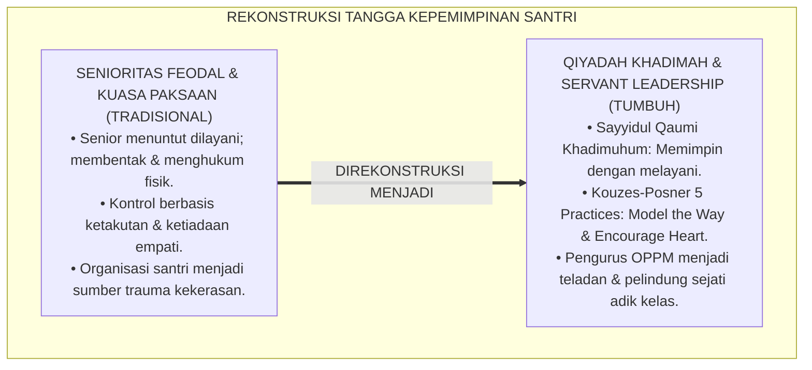
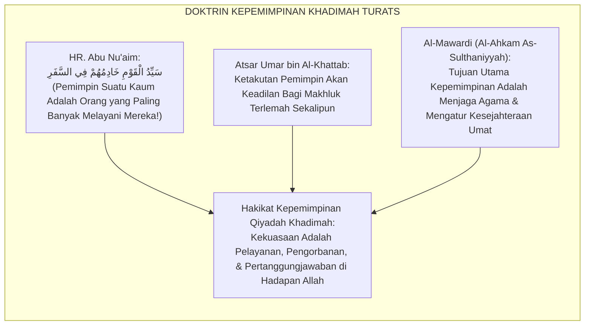
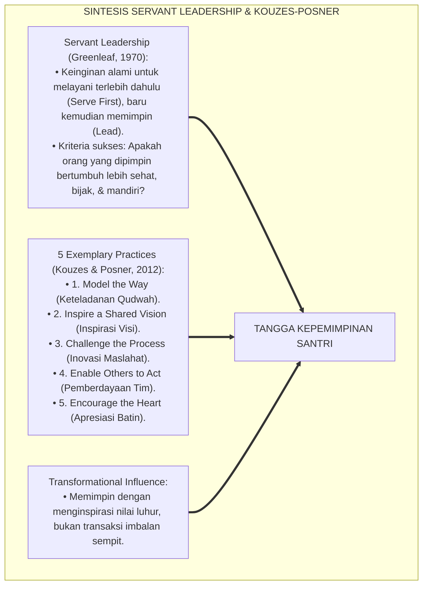
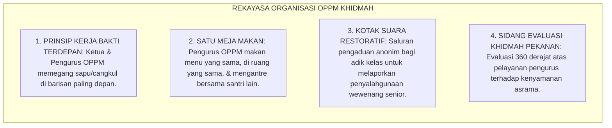
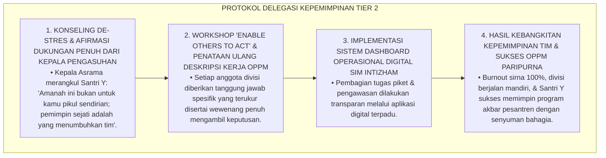
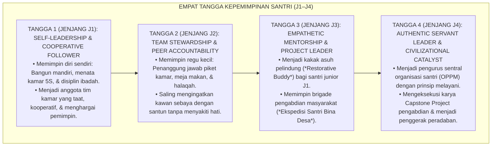
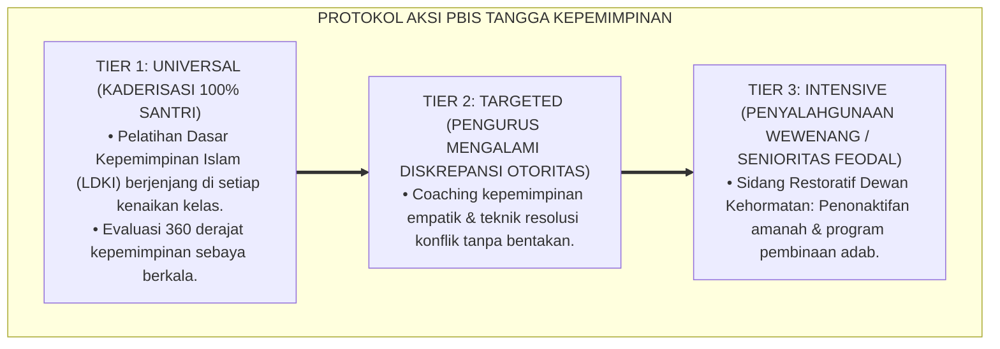

# P4-04-02: TANGGA KEPEMIMPINAN SANTRI — SERVANT LEADERSHIP (QIYADAH KHADIMAH)
## *Monograf Riset Akademik: Trajektori Evolusi Kepemimpinan Santri dari Followership Mandiri Menuju Transformational Servant Leader (Jenjang J1–J4), Integrasi Doktrin Sayyidul Qaumi Khadimuhum dengan Greenleaf's Servant Leadership & Kouzes-Posner's Leadership Challenge, Serta Desain Matriks Kaderisasi Kepemimpinan Tanpa Feodalisme di Ekosistem Pesantren Berbasis TUMBUH*

**Nomor Identifikasi**: `P4-04-02/MONOGRAF-RISET-TANGGA-KEPEMIMPINAN-SERVANT-LEADERSHIP/2026`  
**Domain**: `04 Progression Framework` > `04 Mastery Progression` (Sub-Modul 02: *Servant Leadership Mastery Staircase*)  
**Klasifikasi Naskah**: *Academic Research Monograph* (Monograf Penelitian Teori Kepemimpinan Islam, Servant Leadership Berjenjang, & Manajemen Kaderisasi Santri)  
**Rumpun Disiplin Pengkaji**: Kepemimpinan Islam & Fiqh Siyasah Syar'iyyah, Teori Kepemimpinan Organisasi (*Servant & Transformational Leadership*), Psikologi Kepemimpinan Remaja, School-Wide PBIS  

---

> ### 💡 INTISARI EKSEKUTIF (EXECUTIVE SUMMARY)
>
> * **Krisis Kepemimpinan Feodal & Otoriter di Organisasi Santri:**  
>   Banyak organisasi santri (OPPM/OSIS Pesantren) terjebak dalam warisan budaya feodal: santri senior yang memegang tampuk pengurus merasa berhak bersikap arogan, membentak, menindas adik kelas, dan menolak melakukan pekerjaan fisik. Model kepemimpinan toksik ini mereproduksi rantai kekerasan (*Cycle of Abuse*) dan merusak karakter kepemimpinan generasi muda.
> * **Integrasi Sayyidul Qaumi Khadimuhum & Servant Leadership Robert Greenleaf:**  
>   Ekosistem TUMBUH merekonstruksi hakikat kepemimpinan dengan memadukan hadits kenabian agung *"Sayyidul Qaumi Khādimuhum"* (Pemimpin suatu kaum adalah pelayan mereka) dengan teori *Servant Leadership* Robert Greenleaf dan *The Five Exemplary Leadership Practices* James Kouzes & Barry Posner (*Model the Way, Inspire a Shared Vision, Challenge the Process, Enable Others to Act, & Encourage the Heart*). Pemimpin sejati diukur bukan dari berapa banyak orang yang melayaninya, melainkan dari berapa banyak orang yang ia layani dan ia selamatkan dari kesulitan.
> * **Tangga Progresi Kepemimpinan 4 Etape J1–J4:**  
>   Monograf ini merumuskan 4 tangga kepemimpinan: (1) J1: *Self-Leadership & Cooperative Followership*, (2) J2: *Team Stewardship & Peer Accountability*, (3) J3: *Empathetic Mentorship & Village Project Leader*, dan (4) J4: *Authentic Servant Leadership OPPM & Civilizational Catalyst*.

---

## 📑 DAFTAR ISI MONOGRAF

- [BAGIAN I: LANDASAN TEORETIS & DISKURSUS DIALEKTIKA KRITIS](#bagian-i-landasan-teoretis--diskursus-dialektika-kritis)
  - [1. Latar Belakang Masalah: Bahaya Otoritarianisme Senioritas vs Kepemimpinan Berbasis Pelayanan](#1-latar-belakang-masalah-bahaya-otoritarianisme-senioritas-vs-kepemimpinan-berbasis-pelayanan)
  - [2. Eksegesis Turats: Doktrin Qiyadah Khadimah Khulafaur Rasyidin & Al-Ahkam As-Sulthaniyyah](#2-eksegesis-turats-doktrin-qiyadah-khadimah-khulafaur-rasyidin--al-ahkam-as-sulthaniyyah)
  - [3. Konvergensi Sains Kepemimpinan: Greenleaf's Servant Leadership & Kouzes-Posner's Leadership Challenge](#3-konvergensi-sains-kepemimpinan-greenleafs-servant-leadership--kouzes-posners-leadership-challenge)
  - [4. Rekayasa Lingkungan 24 Jam: Struktur Organisasi OPPM Tanpa Hak Istimewa (No Privilege Sanctuary)](#4-rekayasa-lingkungan-24-jam-struktur-organisasi-oppm-tanpa-hak-istimewa-no-privilege-sanctuary)
  - [5. Kasuistika Lapangan Klinis & Protokol Transformasi Ketua OPPM yang Mengundurkan Diri Karena Stres Menghadapi Beban Amanah Organisasi](#5-kasuistika-lapangan-klinis--protokol-transformasi-ketua-oppm-yang-mengundurkan-diri-karena-stres-menghadapi-beban-amanah-organisasi)
- [BAGIAN II: FORMULASI KONSEPTUAL & PEMBAHASAN MENDALAM](#bagian-ii-formulasi-konseptual--pembahasan-mendalam)
  - [1. Arsitektur Komprehensif Tangga Kepemimpinan Santri (Qiyadah Khadimah)](#1-arsitektur-komprehensif-tangga-kepemimpinan-santri-qiyadah-khadimah)
  - [2. Dekomposisi Empat Etape Tangga Kepemimpinan: Dari Self-Leadership Menuju Civilizational Catalyst](#2-dekomposisi-empat-etape-tangga-kepemimpinan-dari-self-leadership-menuju-civilizational-catalyst)
  - [3. Desain Rubrik Evaluasi Kinerja Kepemimpinan Pelayan 360 Derajat (Form RKP-OPPM)](#3-desain-rubrik-evaluasi-kinerja-kepemimpinan-pelayan-360-derajat-form-rkp-oppm)
  - [4. Diskusi Akademis & Implikasi bagi Penjaminan Mutu Kepemimpinan Bangsa Indonesia Masa Depan](#4-diskusi-akademis--implikasi-bagi-penjaminan-mutu-kepemimpinan-bangsa-indonesia-masa-depan)
- [BAGIAN III: KESIMPULAN & APARATUS AKADEMIS](#bagian-iii-kesimpulan--aparatus-akademis)
  - [1. Tabel Sintesis Tangga Kepemimpinan Santri (Servant Leadership)](#1-tabel-sintesis-tangga-kepemimpinan-santri-servant-leadership)
  - [2. Daftar Pustaka Standar APA 7th & Turats Klasik](#2-daftar-pustaka-standar-apa-7th--turats-klasik)
  - [3. Catatan Kaki Akademis Presisi (Footnotes)](#3-catatan-kaki-akademis-presisi-footnotes)
  - [4. Glosarium Istilah Ilmiah & Kepemimpinan Qiyadah Khadimah](#4-glosarium-istilah-ilmiah--kepemimpinan-qiyadah-khadimah)

---

# BAGIAN I: LANDASAN TEORETIS & DISKURSUS DIALEKTIKA KRITIS

---

### 1. Latar Belakang Masalah: Bahaya Otoritarianisme Senioritas vs Kepemimpinan Berbasis Pelayanan

Dalam kultur kepemimpinan organisasi santri tradisional, kerap terjadi **tiga distorsi kekuasaan (*Power Distortions*)**:[^1]

1. **Jebakan Aristokrasi Senior (*Senior Aristocracy Trap*)**: Pengurus santri senior merasa memiliki kasta lebih tinggi yang tidak boleh ditegur, bebas dari tugas piket kebersihan, dan berhak memerintah adik kelas dengan nada tinggi.
2. **Penggunaan Ketakutan Sebagai Alat Kontrol (*Coercive Power Exploitation*)**: Penegakan aturan asrama disandarkan pada rasa takut adik kelas terhadap bentakan dan ancaman fisik senior, bukan pada keteladanan akhlak (*Qudwah Hasanah*).
3. **Ketiadaan Pembiasaan Empati dan Kepedulian Pemimpin**: Pengurus tidak peka terhadap kondisi adik kelas yang sedang sakit, kelelahan, atau mengalami kesulitan belajar, sehingga organisasi dipandang sebagai "mesin penindas" yang menakutkan.[^2]

Model riset **TUMBUH** merancang **Tangga Kepemimpinan Santri (Servant Leadership / Qiyadah Khadimah)** yang mendidik santri bahwa kehormatan pemimpin sejati terletak pada kerendahan hatinya untuk melayani, melindungi, dan menumbuhkan orang-orang yang dipimpinnya.



---

### 2. Eksegesis Turats: Doktrin Qiyadah Khadimah Khulafaur Rasyidin & Al-Ahkam As-Sulthaniyyah

Para sahabat Nabi SAW mempraktikkan bahwa pemimpin adalah pengabdi yang memikul beban terberat umat. Khalifah Umar bin Al-Khattab RA berkata: *"Seandainya ada seekor keledai yang terperosok di jalanan kota Baghdad, sungguh aku takut Allah akan menuntutku di hari kiamat: Mengapa engkau tidak meratakan jalan untuknya, wahai Umar?!"*



#### 📖 1. Wasiat Khalifah Abu Bakar Ash-Shiddiq RA Saat Dilantik Menjadi Pemimpin
Diriwayatkan dalam *Tarikh Ath-Thabari*:

$$\text{أَيُّهَا النَّاسُ، إِنِّي قَدْ وُلِّيتُ عَلَيْكُمْ وَلَسْتُ بِخَيْرِكُمْ، فَإِنْ أَحْسَنْتُ فَأَعِينُونِي، وَإِنْ أَسَأْتُ فَقَوِّمُونِي؛ الصِّدْقُ أَمَانَةٌ، وَالْكَذِبُ خِيَانَةٌ، وَالضَّعِيفُ فِيكُمْ قَوِيٌّ عِنْدِي حَتَّى أُرِيحَ عَلَيْهِ حَقَّهُ إِنْ شَاءَ اللَّهُ، وَالْقَوِيُّ فِيكُمْ ضَعِيفٌ عِنْدِي حَتَّى آخُذَ الْحَقَّ مِنْهُ إِنْ شَاءَ اللَّهُ}$$

*"Wahai sekalian manusia! **Sesungguhnya aku telah diangkat memimpin kalian padahal aku bukanlah orang yang terbaik di antara kalian; maka jika aku berbuat kebaikan bantulah aku, dan jika aku menyimpang maka luruskanlah aku!** Kejujuran adalah amanah dan kedustaan adalah khianat; **dan orang yang paling lemah di antara kalian adalah orang yang kuat di sisiku hingga aku kembalikan haknya kepadanya insya Allah; dan orang yang paling kuat di antara kalian adalah orang yang lemah di sisiku hingga aku ambil hak orang lain darinya insya Allah!**"*[^3]

---

### 3. Konvergensi Sains Kepemimpinan: Greenleaf's Servant Leadership & Kouzes-Posner's Leadership Challenge

Tangga kepemimpinan TUMBUH memadukan teori *Servant Leadership* Robert Greenleaf dan *The Leadership Challenge* Kouzes-Posner:



---

### 4. Rekayasa Lingkungan 24 Jam: Struktur Organisasi OPPM Tanpa Hak Istimewa (No Privilege Sanctuary)

Tata kelola organisasi santri dirancang menghapus privilese feodal:



---

### 5. Kasuistika Lapangan Klinis & Protokol Transformasi Ketua OPPM yang Mengundurkan Diri Karena Stres Menghadapi Beban Amanah Organisasi

#### Studi Kasus Lapangan: Ketua OPPM J4 Mengalami Burnout Akut dan Menolak Memimpin Akibat Memikul Semua Pekerjaan Sendiri
* **Konteks Masalah**: Santri Y (17 tahun, Jenjang J4, Ketua Bagian Pengasuhan OPPM) mengalami kelelahan mental berat (*Executive Burnout*), mengurung diri di kamar, dan mengajukan surat pengunduran diri. Ia merasa kewalahan karena seluruh divisi tidak berjalan dan ia mengerjakan semua laporan piket dan penegakan disiplin sendirian (*Heroic Leadership Fallacy & Micromanagement Trap*).
* **Analisis Diagnostik**: Santri Y terjebak dalam paradigma kepemimpinan pahlawan tunggal (*Lone Ranger Fallacy*) dan ketiadaan keterampilan pendelegasian wewenang (*Delegation & Team Empowerment Deficit*).
* **Protokol Restrukturisasi Kepemimpinan Kolaboratif TUMBUH**:



Intervensi kepemimpinan kolaboratif (*Empowerment & Shared Leadership Coaching*) ini mengubah kepemimpinan yang melelahkan menjadi kerja tim yang menggembirakan.[^4]

---

# BAGIAN II: FORMULASI KONSEPTUAL & PEMBAHASAN MENDALAM

---

### 1. Arsitektur Komprehensif Tangga Kepemimpinan Santri (Qiyadah Khadimah)

Ekosistem TUMBUH memetakan evolusi kepemimpinan ke dalam 4 tangga progresif:



---

### 2. Dekomposisi Empat Etape Tangga Kepemimpinan: Dari Self-Leadership Menuju Civilizational Catalyst

| Etape Kepemimpinan | Jenjang Target | Fokus Kompetensi Inti | Manifestasi Perilaku Lapangan | Standar Evaluasi Terverifikasi |
| :--- | :--- | :--- | :--- | :--- |
| **1. Self-Leadership** | Jenjang J1 (Kelas 7) | Mengendalikan hawa nafsu, manajemen waktu mandiri, ketaatan beradab. | Disiplin shalat tepat waktu, kamar rapi 5S, merawat barang pribadi. | Skor Skala Kesiapan Adaptasi ($SKA \ge 2.50$). |
| **2. Team Stewardship** | Jenjang J2 (Kelas 8) | Mengkoordinasi regu piket, tutor sebaya, akuntabilitas tim. | Memastikan kamar bersih 5S, membantu kawan menghafal, antre tertib. | Skor Lembar Mutaba'ah Konsistensi ($LMK \ge 2.75$). |
| **3. Empathetic Mentorship** | Jenjang J3 (Kelas 9–10) | Mengayomi adik kelas, meredakan konflik damai, memimpin bakti desa. | Mendampingi adik asuh J1 dengan kasih sayang, mengajar TPA desa. | Skor Skala Kematangan SEL ($SKE \ge 3.00$). |
| **4. Servant Leadership** | Jenjang J4 (Kelas 11–12) | Transformational influence, memimpin OPPM tanpa kekerasan, Capstone. | Menjadi teladan fisik paling depan, advokasi anti-bullying, Capstone tuntas. | Skor Rubrik Kepemimpinan Pelayan ($RKP \ge 3.25$). |

---

### 3. Desain Rubrik Evaluasi Kinerja Kepemimpinan Pelayan 360 Derajat (Form RKP-OPPM)

```text
====================================================================================================
           RUBRIK EVALUASI KEPEMIMPINAN PELAYAN 360 DERAJAT (FORM RKP-OPPM)
               EKOSISTEM TUMBUH PESANTREN — DEWAN PENGASUHAN SANTRI
====================================================================================================
Nama Pengurus   : ___________________________    Jabatan / Divisi: ____________________
Jenjang / Kelas : Jenjang J4 (Kelas 12)          Periode Amanah  : ____________________

----------------------------------------------------------------------------------------------------
NO  DIMENSI KEPEMIMPINAN PELAYAN (SERVANT LEADERSHIP)   SKOR (1-4)  BUKTI OBSERVASI 360 DERAJAT
----------------------------------------------------------------------------------------------------
1   Model the Way (Keteladanan Qudwah Terdepan)          [   ]      Hadir paling awal di masjid, kerja 
                                                                    bakti barisan depan, tutur kata santun.
2   Enable Others to Act (Pemberdayaan Adik Kelas)       [   ]      Membina adik asuh dengan sabar, 
                                                                    tidak membentak, mendengarkan masukan.
3   Zero-Bullying Guardian (Pelindung Anti-Kekerasan)    [   ]      Menegakkan aturan tanpa hukuman fisik, 
                                                                    melindungi santri lemah dari perundungan.
4   Encourage the Heart (Apresiasi & Penguatan Hati)     [   ]      Memberikan pujian atas kemajuan kawan, 
                                                                    merangkul santri yang sedang bersedih.
----------------------------------------------------------------------------------------------------
TOTAL SKOR KEPEMIMPINAN: [ _____ / 16 ]  --> INDEKS QIYADAH KHADIMAH: [ _________ ] (Skala 100)
Status Evaluasi: [ ] KHADIMUL UMMAH MUMTAZ (TELADAN)    [ ] JAYYID JIDDAN    [ ] PERLU COACHING

Tanda Tangan Ketua Dewan Pengasuhan: __________________    Tanggal Pleno: ________________________
====================================================================================================
```

---

### 4. Diskusi Akademis & Implikasi bagi Penjaminan Mutu Kepemimpinan Bangsa Indonesia Masa Depan

Penerapan tangga kepemimpinan servant leadership ini menghasilkan lompatan peradaban:

1. **Mencetak Generasi Pemimpin Bangsa yang Antikorupsi dan Berjiwa Pengabdi**: Memutus mentalitas feodal ingin dilayani dan menggantinya dengan etos kerja ikhlas melayani rakyat.
2. **Menjadikan Pesantren Kawah Candradimuka Pemimpin Peradaban Dunia**: Membuktikan bahwa kepemimpinan Islam adalah kepemimpinan yang memanusiakan manusia, berkeadilan, dan membawa rahmat bagi semesta alam (*Rahmatan lil 'Alamin*).
3. **Penyempurnaan Ekosistem Sekolah Berasrama yang Aman dan Damai**: Menghapus total mitos bahwa kepemimpinan santri harus keras dan menakutkan.[^5]

---

---

### 3. Pembedahan Deskriptif Tangga Kepemimpinan Santri (Servant Leadership)

Evolusi kepemimpinan santri bergerak dari pengikut teladan menuju pelayan peradaban:

#### A. Level 1: Follower Beradab (Exemplary Followers)
Santri menjalankan instruksi dengan penuh amanah, mendukung program asrama secara aktif, dan memberikan masukan konstruktif dengan adab santun.

#### B. Level 2: Pemimpin Regu Kamar (Small Group Facilitators)
Mengkoordinasikan piket kebersihan kamar, merawat kawan sekamar yang sakit, dan menciptakan atmosfer kamar tidur yang hangat dan suportif.

#### C. Level 3: Koordinator Divisi & Event Organizer (Program Leaders)
Memimpin kepanitiaan acara-acara besar pondok (Pekan Olahraga & Seni, Ramadhan di Ma'had, Ekspedisi Desa) dengan manajemen waktu dan koordinasi tim yang solid.

#### D. Level 4: Pengurus Sentral OPPM (Servant Leaders Paripurna)
Mengemban kepemimpinan sentral dengan filosofi *Khidmah Total*: mengutamakan kenyamanan adik kelas di atas kepentingan pribadi dan mengayomi seluruh santri dengan prinsip keadilan.

---

### 4. Protokol Aksi Operasional PBIS Multi-Tier Kepemimpinan Santri



---

# BAGIAN III: KESIMPULAN & APARATUS AKADEMIS

---

### 1. Tabel Sintesis Tangga Kepemimpinan Santri (Servant Leadership)

| Dimensi Parameter | Pola Kepemimpinan Lama | Standarisasi Model TUMBUH | Landasan Rujukan Primer | Bukti Capaian |
| :--- | :--- | :--- | :--- | :--- |
| **1. Hakikat Memimpin** | Memerintah & dilayani junior. | Melayani & melindungi (*Sayyidul Qaumi Khadimuhum*). | *Servant Leadership* (Greenleaf, 1970) | 0% Kasus Senioritas Feodal / Eksploitasi. |
| **2. Pendisiplinan** | Bentakan keras & hukuman fisik. | Keteladanan Qudwah & Disiplin Restoratif. | *The Leadership Challenge* (2012) | Evaluasi 360 Derajat Kepuasan Adik Kelas $\ge 90\%$. |
| **3. Kerja Tim** | Single fighter (Beban di ketua). | *Empowerment & Shared Leadership*. | *Al-Ahkam As-Sulthaniyyah* (Al-Mawardi) | 100% Program Kerja Divisi OPPM Tuntas. |
| **4. Profil Akhir** | Otoriter / Feodalistis. | *Authentic Servant Leader & Khadimul Ummah*. | Khutbah Pelantikan Khalifah Abu Bakar | Sertifikat Kepemimpinan Qudwah Paripurna. |

---

### 2. Daftar Pustaka Standar APA 7th & Turats Klasik

1. **Abu Nu'aim Al-Isfahani, Ahmad bin Abdillah.** (1988). *Hilyatul Auliya' wa Thabaqatul Ashfiya'*. Beirut: Dar Al-Kutub Al-'Ilmiyyah.
2. **Al-Bukhari, Abu Abdillah Muhammad bin Ismail.** (2002). *Shahih Al-Bukhari*. Riyadh: Bait Al-Afkar Ad-Dauliyyah.
3. **Al-Mawardi, Abu Al-Hasan Ali bin Muhammad.** (2006). *Al-Ahkam As-Sulthaniyyah*. Beirut: Dar Al-Kutub Al-'Ilmiyyah.
4. **Ath-Thabari, Abu Ja'far Muhammad bin Jarir.** (1997). *Tarikh Al-Umam wal Muluk (Tarikh Ath-Thabari)*. Beirut: Darul Kutub Al-'Ilmiyyah.
5. **Greenleaf, R. K.** (1970). *The Servant as Leader*. Newton Centre: Robert K. Greenleaf Center.
6. **Ibnu Taimiyyah, Taqiyuddin Ahmad.** (1998). *As-Siyasah Asy-Syar'iyyah*. Beirut: Darul Ma'rifah.
7. **Kouzes, J. M., & Posner, B. Z.** (2012). *The Leadership Challenge: How to Make Extraordinary Things Happen in Organizations* (5th ed.). San Francisco: Jossey-Bass.
8. **Muslim bin Al-Hajjaj An-Naisaburi.** (2006). *Shahih Muslim*. Riyadh: Dar Thayyibah.
9. **Nelsen, J.** (2006). *Positive Discipline*. New York: Ballantine Books.
10. **Sugai, G., & Horner, R. H.** (2020). *School-Wide Positive Behavioral Interventions and Supports*. *Journal of Positive Behavior Interventions*, 22(4), 203-211.

---

### 3. Catatan Kaki Akademis Presisi (Footnotes)

[^1]: Kritik terhadap distorsi kekuasaan feodal dan kepemimpinan kekerasan di sekolah berasrama, Greenleaf (1970, hlm. 14).  
[^2]: Pembahasan lima praktik kepemimpinan teladan dalam The Leadership Challenge, Kouzes & Posner (2012, hlm. 38).  
[^3]: Khutbah pelantikan Khalifah Abu Bakar Ash-Shiddiq RA dalam *Tarikh Ath-Thabari* (1997, Jilid 2, hlm. 244).  
[^4]: Protokol restrukturisasi kepemimpinan kolaboratif dan penanganan burnout pengurus OPPM TUMBUH (2026).  
[^5]: Dampak kelembagaan penerapan tangga kepemimpinan santri servant leadership TUMBUH Pesantren (2026).  

---

### 4. Glosarium Istilah Ilmiah & Kepemimpinan Qiyadah Khadimah

1. **Qiyādah Khādimah (قِيَادَةٌ خَادِمَةٌ)**: Paradigma kepemimpinan Islam di mana pemimpin memposisikan dirinya sebagai pelayan umat yang mencurahkan tenaga untuk kemaslahatan pengikutnya.
2. **Sayyidul Qaumi Khādimuhum (سَيِّدُ الْقَوْمِ خَادِمُهُمْ)**: Hadits kenabian agung yang menetapkan bahwa derajat kemuliaan pemimpin ditentukan oleh kesediaannya melayani orang lain.
3. **Servant Leadership**: Teori kepemimpinan modern Robert Greenleaf yang menekankan pelayanan, empati, penyembuhan, kesadaran, dan komitmen terhadap pertumbuhan manusia.
4. **Model the Way**: Praktik kepemimpinan teladan di mana pemimpin menjadi orang pertama yang mempraktikkan nilai-nilai yang ia serukan kepada orang lain.
5. **No Privilege Sanctuary**: Kebijakan pesantren yang menegaskan bahwa pengurus organisasi santri tidak memiliki hak istimewa makanan atau pembebasan kerja bakti.
6. **Heroic Leadership Fallacy**: Kesalahan berpikir di mana seorang pemimpin merasa harus menyelesaikan semua masalah sendirian tanpa mempercayai timnya.
7. **Form RKP-OPPM**: Rubrik penilaian 360 derajat untuk mengevaluasi kinerja kepemimpinan pelayan pengurus organisasi santri OPPM.
8. **Shared Leadership**: Model kepemimpinan kolaboratif di mana wewenang dan tanggung jawab didistribusikan secara adil kepada seluruh anggota tim.
9. **Zero-Bullying Guardian**: Peran kehormatan pengurus santri senior sebagai pelindung mutlak keselamatan seluruh santri junior dari kekerasan.
10. **Civilizational Catalyst**: Puncak tangga kepemimpinan santri J4 yang mampu menjadi motor penggerak kebangkitan peradaban di mana pun berada.
