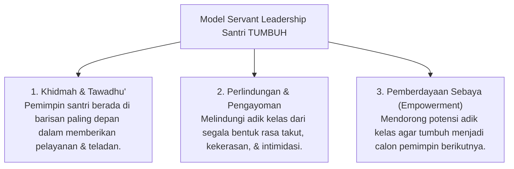

# P4-04-02: Tangga Kepemimpinan Santri (Servant Leadership)

## Status Dokumen
* **Status**: 🌟 **A+ (Tervalidasi & Siap Diimplementasikan)**
* **Sub-Domain**: `04 Progression Framework / 04 Mastery Progression`
* **Penanggung Jawab Keilmuan**: Dewan Keilmuan TUMBUH (*Pakar Tata Kelola Qudwah & Pakar Psikologi Sosial Santri*)

---

## 1. Konseptualisasi Servant Leadership dalam Islam

Kepemimpinan santri dalam ekosistem **TUMBUH** berlandaskan kaidah Nabawiyah **"Sayyidul Qaumi Khaadimuhum"** (Pemimpin suatu kaum adalah pelayan bagi mereka). Kepemimpinan dipahami sebagai **Amanah Khidmah**, bukan hak istimewa (*privilege*) untuk memerintah atau menindas junior.

---

## 2. Progresi Tangga Kepemimpinan (T1–T4)

| Tangga Kepemimpinan | Fokus Organisasi / Peran | Lingkup Tanggung Jawab | Indikator Keberhasilan |
| :--- | :--- | :--- | :--- |
| **T1: Self-Leadership** | Kepemimpinan Diri Sendiri. | Mengatur jadwal pribadi, kebersihan diri, & regulasi emosi. | Mandiri dalam rutinitas harian tanpa arahan terus-menerus. |
| **T2: Peer Support** | Pendamping Sebaya Kelompok. | Membantu teman kamar dalam kebersihan & sholat berjamaah. | Terbentuknya ukhuwah & kohesi kelompok kamar yang solid. |
| **T3: Junior Leadership** | Pengurus Panitia / Asisten Mentor. | Menjadi ketua panitia kegiatan & asisten pembimbing adik kelas. | Berhasil mengeksekusi proyek kelompok dengan empati & kepedulian. |
| **T4: Senior Servant Leadership** | Pengurus Organisasi Santri Mandiri. | Memimpin OSIS/OPPM, mengelola khidmah, & menjadi Qudwah utama. | Organisasi santri berjalan efisien, aman, & bebas dari kekerasan/senioritas. |

---

## 3. SOP Kaderisasi Kepemimpinan Bebas Feodalisme

1. **Seleksi Berbasis Rekam Adab PBIS**: Pemilihan pengurus santri T4 didasarkan pada catatan konsistensi adab dan rekomendasi 360-derajat, bukan popularitas politik atau fisik.
2. **Pakta Integritas Anti-Intimidasi**: Setiap pengurus santri menandatangani pakta integritas penolakan segala bentuk hukuman fisik/verbal terhadap junior.
3. **Pembinaan Berkala oleh Musyrif**: Pengurus santri mendapatkan pembekalan mingguan mengenai teknik manajemen organisasi positif, komunikasi empati, dan regulasi stres.
