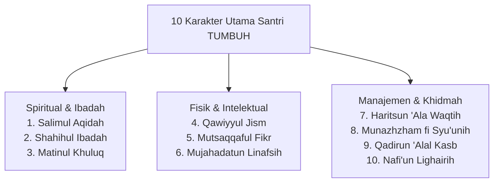

# P4-04-03: Matriks Internalisasi 10 Karakter Muwashafat Santri

## Status Dokumen
* **Status**: 🌟 **A+ (Tervalidasi & Siap Diimplementasikan)**
* **Sub-Domain**: `04 Progression Framework / 04 Mastery Progression`
* **Penanggung Jawab Keilmuan**: Dewan Keilmuan TUMBUH (*Pakar Desain Kurikulum Adab & Pakar Epistemologi Turats*)

---

## 1. Peta 10 Karakter Utama Santri TUMBUH (*Muwashafat*)

Dokumen ini memetakan perkembangan **10 Karakter Utama Santri TUMBUH** melintasi Jenjang J1 (Adaptasi), T2 (Habituasi), T3 (Internalisasi), hingga T4 (Qudwah/Kemandirian):

---

## 2. Matriks Progresi Perkembangan 10 Karakter (J1–J4)

| Karakter Muwashafat | Tingkat T1 (Adaptasi) | Tingkat T2 (Habituasi) | Tingkat T3 (Internalisasi) | Tingkat T4 (Qudwah & Khidmah) |
| :--- | :--- | :--- | :--- | :--- |
| **1. Salimul Aqidah** | Mengenal tauhid dasar & bebas khurafat. | Memahami pembatal iman & tadabbur alam. | Menginternalisasi keyakinan iman dalam ujian hidup. | Kokoh berakidah & mampu membentengi fikrah orang lain. |
| **2. Shahihul Ibadah** | Menirukan gerakan & bacaan sholat benar. | Sholat berjamaah tepat waktu mandiri. | Konsisten menjalankan ibadah sunnah intrinsik. | Menjadi imam/muadzin & teladan khusyuk ibadah. |
| **3. Matinul Khuluq** | Menjauhi kata kasar & sopan pada ustadz. | Tertib beradab dalam pergaulan asrama. | Empati sosial & resolusi konflik restoratif. | Teladan adab mulia & penengah kedamaian. |
| **4. Qawiyyul Jism** | Olahraga rutin & kebersihan diri dasar. | Menjaga kebugaran fisik & nutrisi sehat. | Mandiri menjaga kesehatan & P3K dasar. | Teladan pola hidup sehat & olahraga sunnah. |
| **5. Mutsaqqaful Fikr** | Menghafal pelajaran & membaca lancar. | Pemahaman konsep & kajian terstruktur. | Berpikir kritis syar'i & analisis hikmah. | Mampu riset ilmiah & mengajar adik kelas. |
| **6. Mujahadatun Linafsih** | Menahan diri dari pelanggaran tata tertib. | Regulasi emosi & tidak melampiaskan amarah. | Mujahadah melawan malas & hawa nafsu. | Disiplin diri utuh & istiqamah amalan malam. |
| **7. Haritsun 'Ala Waqtih** | Menghadiri kegiatan tepat waktu. | Mengisi waktu luang dengan kegiatan positif. | Manajemen waktu mandiri (studi & muraja'ah). | Mengoptimalkan waktu untuk khidmah & produktivitas. |
| **8. Munazhzham fi Syu'unih** | Merapikan lemari dengan arahan. | Piket kebersihan kamar mandiri & rapi. | Pengelolaan administrasi & barang teratur. | Manajemen organisasi & ketertiban sistemik. |
| **9. Qadirun 'Alal Kasb** | Mengenal konsep kewirausahaan Islami. | Menjaga kepemilikan barang & tidak boros. | Menjalankan proyek wirausaha sederhana. | Mandiri finansial & menguasai literasi keuangan. |
| **10. Nafi'un Lighairih** | Ikut kerja bakti lingkungan kamar. | Menolong kawan yang membutuhkan bantuan. | Merancang kegiatan sosial kelompok. | Memimpin proyek khidmah masyarakat luas. |
