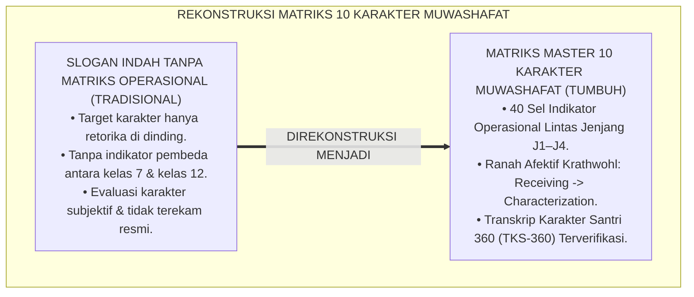
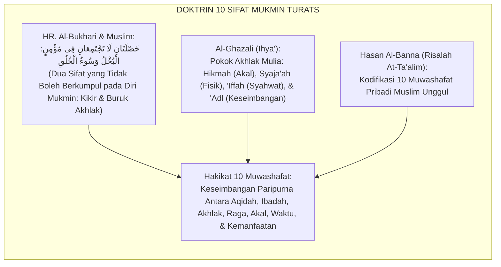
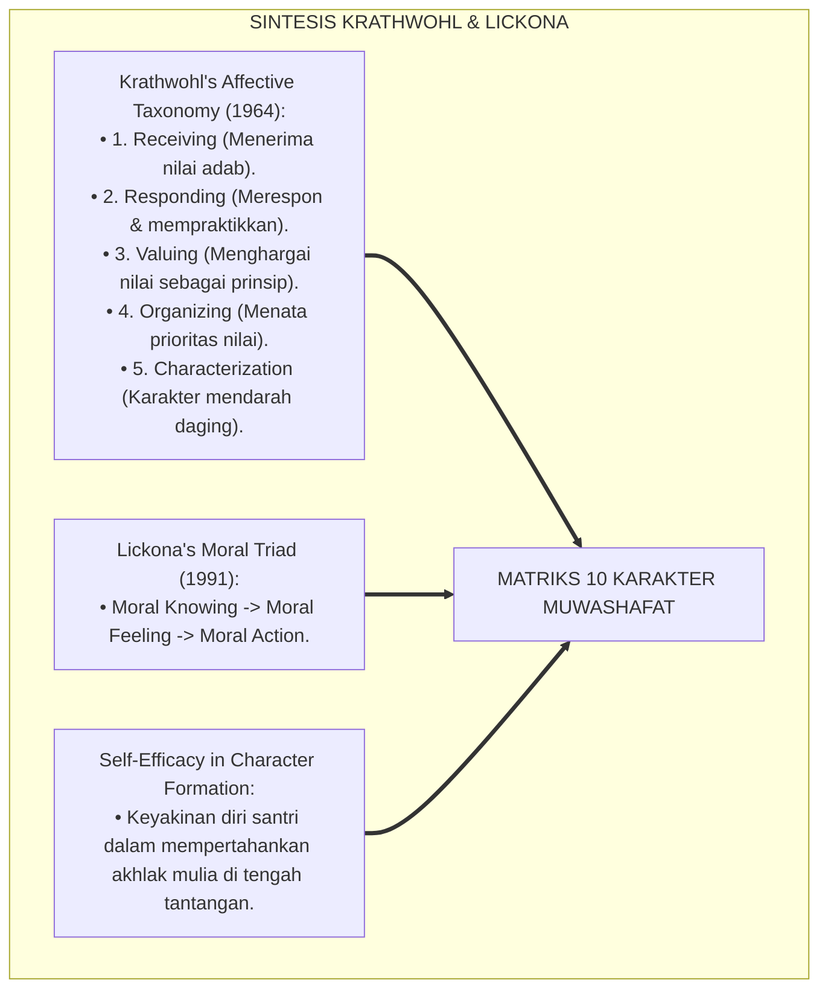
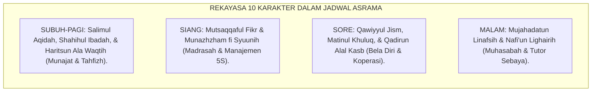
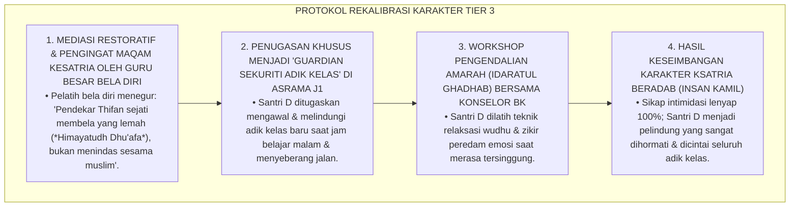
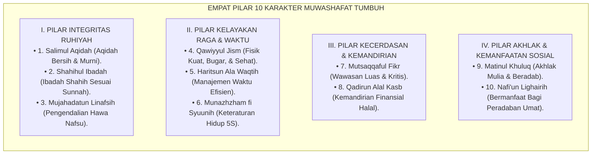

# P4-04-03: MATRIKS INTERNALISASI 10 KARAKTER MUWASHAFAT TUMBUH
## *Monograf Riset Akademik: Peta Penguasaan Utuh Sepuluh Kapasitas Karakter Santri (Salimul Aqidah, Shahihul Ibadah, Matinul Khuluq, Qawiyyul Jism, Mutsaqqaful Fikr, Mujahadatun Linafsih, Haritsun Ala Waqtih, Munazhzham fi Syuunih, Qadirun Alal Kasb, wa Nafi'un Lighairih) Lintas Jenjang J1–J4, Integrasi Taksonomi Fitrah dengan Krathwohl's Affective Domain (Receiving, Responding, Valuing, Organizing, & Characterization), Serta Matriks Transkrip Karakter 360 Derajat di Pesantren TUMBUH*

**Nomor Identifikasi**: `P4-04-03/MONOGRAF-RISET-MATRIKS-INTERNALISASI-10-KARAKTER-MUWASHAFAT/2026`  
**Domain**: `04 Progression Framework` > `04 Mastery Progression` (Sub-Modul 03: *10 Muwashafat Character Internalization Matrix*)  
**Klasifikasi Naskah**: *Academic Research Monograph* (Monograf Penelitian Taksonomi Karakter Islam, Afektif Domain Krathwohl, & Matriks Penguasaan 10 Kapasitas)  
**Rumpun Disiplin Pengkaji**: Desain Taksonomi Karakter Islam (*Muwashafat Tarbiyah*), Psikologi Perkembangan Afektif (*Krathwohl's Taxonomy*), Evaluasi Karakter Autentik, School-Wide PBIS  

---

> ### 💡 INTISARI EKSEKUTIF (EXECUTIVE SUMMARY)
>
> * **Kelemahan Model Pembentukan Karakter Terfragmentasi:**  
>   Banyak kurikulum kepesantrenan mencanangkan target pembentukan karakter santri ideal (seperti *10 Muwashafat Tarbiyah*), namun ketiadaan matriks penahapan yang jelas membuat implementasinya bersifat abstrak dan tidak terukur. Pendidik bingung membedakan apa indikator *Salimul Aqidah* atau *Qadirun Alal Kasb* bagi santri kelas 7 (J1) dibanding santri kelas 12 (J4).
> * **Integrasi 10 Muwashafat Karakter & Krathwohl's Affective Domain:**  
>   Ekosistem TUMBUH merekonstruksi taksonomi 10 Kapasitas Karakter Insan dengan memadukan doktrin karakter mutasyaddid/mutawassith Turats dengan *Taxonomy of Affective Domain* David Krathwohl (*Receiving $\rightarrow$ Responding $\rightarrow$ Valuing $\rightarrow$ Organizing $\rightarrow$ Characterization by Value*). Setiap kapasitas karakter didekomposisi ke dalam 4 tangga kematangan afektif yang selaras dengan perkembangan usia santri.
> * **Arsitektur Matriks Master 10 Karakter $\times$ 4 Jenjang:**  
>   Monograf ini menyajikan matriks lengkap 40 sel indikator operasional, desain *Transkrip Karakter Santri TUMBUH (TKS-360)*, dan protokol triangulasi asesmen berbasis bukti faktual.

---

## 📑 DAFTAR ISI MONOGRAF

- [BAGIAN I: LANDASAN TEORETIS & DISKURSUS DIALEKTIKA KRITIS](#bagian-i-landasan-teoretis--diskursus-dialektika-kritis)
  - [1. Latar Belakang Masalah: Bahaya Slogan Karakter Abstrak vs Kebutuhan Matriks Penguasaan Terukur](#1-latar-belakang-masalah-bahaya-slogan-karakter-abstrak-vs-kebutuhan-matriks-penguasaan-terukur)
  - [2. Eksegesis Turats: Doktrin Al-Khisal al-Asyrah & Penahapan Pembentukan Watak Salaf](#2-eksegesis-turats-doktrin-al-khisal-al-asyrah--penahapan-pembentukan-watak-salaf)
  - [3. Konvergensi Sains Perkembangan Afektif: Krathwohl's Taxonomy of Affective Domain & Lickona's Character Education](#3-konvergensi-sains-perkembangan-afektif-krathwohls-taxonomy-of-affective-domain--lickonas-character-education)
  - [4. Rekayasa Ekologi Pembiasaan 24 Jam: 10 Karakter yang Terintegrasi dalam Ritme Kehidupan Asrama](#4-rekayasa-ekologi-pembiasaan-24-jam-10-karakter-yang-terintegrasi-dalam-ritme-kehidupan-asrama)
  - [5. Kasuistika Lapangan Klinis & Protokol Intervensi Santri J2 yang Kuat Fisik (Qawiyyul Jism) Namun Lemah Regulasi Emosi (Matinul Khuluq)](#5-kasuistika-lapangan-klinis--protokol-intervensi-santri-j2-yang-kuat-fisik-qawiyyul-jism-namun-lemah-regulasi-emosi-matinul-khuluq)
- [BAGIAN II: FORMULASI KONSEPTUAL & PEMBAHASAN MENDALAM](#bagian-ii-formulasi-konseptual--pembahasan-mendalam)
  - [1. Arsitektur Komprehensif Matriks Internalisasi 10 Karakter Muwashafat TUMBUH](#1-arsitektur-komprehensif-matriks-internalisasi-10-karakter-muwashafat-tumbuh)
  - [2. Tabel Master Matriks 10 Karakter Muwashafat Sepanjang Jenjang J1–J4 (40 Sel Kompetensi)](#2-tabel-master-matriks-10-karakter-muwashafat-sepanjang-jenjang-j1j4-40-sel-kompetensi)
  - [3. Desain Format Transkrip Karakter Santri 360 Derajat (Form TKS-360)](#3-desain-format-transkrip-karakter-santri-360-derajat-form-tks-360)
  - [4. Diskusi Akademis & Implikasi bagi Evaluasi Karakter Komprehensif Pendidikan Islam](#4-diskusi-akademis--implikasi-bagi-evaluasi-karakter-komprehensif-pendidikan-islam)
- [BAGIAN III: KESIMPULAN & APARATUS AKADEMIS](#bagian-iii-kesimpulan--aparatus-akademis)
  - [1. Tabel Sintesis Matriks Internalisasi 10 Karakter Muwashafat](#1-tabel-sintesis-matriks-internalisasi-10-karakter-muwashafat)
  - [2. Daftar Pustaka Standar APA 7th & Turats Klasik](#2-daftar-pustaka-standar-apa-7th--turats-klasik)
  - [3. Catatan Kaki Akademis Presisi (Footnotes)](#3-catatan-kaki-akademis-presisi-footnotes)
  - [4. Glosarium Istilah Ilmiah & 10 Karakter Muwashafat](#4-glosarium-istilah-ilmiah--10-karakter-muwashafat)

---

# BAGIAN I: LANDASAN TEORETIS & DISKURSUS DIALEKTIKA KRITIS

---

### 1. Latar Belakang Masalah: Bahaya Slogan Karakter Abstrak vs Kebutuhan Matriks Penguasaan Terukur

Dalam pendidikan karakter pesantren, kerap timbul **tiga kelemahan taksonomi (*Taxonomical Weaknesses*)**:[^1]

1. **Jebakan Retorika Slogan Tanpa Rubrik (*The Slogan Trap*)**: Target karakter santri dipajang di dinding pesantren sebagai daftar slogan indah, namun tidak pernah dijabarkan ke dalam perilaku konkret yang dapat diobservasi oleh musyrif kamar.
2. **Ketiadaan Pembeda Kematangan Antar-Usia**: Indikator *Matinul Khuluq* atau *Munazhzham fi Syu'unih* diperlakukan sama persis antara santri baru umur 12 tahun dengan santri kelas 12 umur 18 tahun.
3. **Pemisahan Asesmen Rapor Akademik dan Rapor Karakter**: Rapor kelulusan pesantren hanya memuat nilai angka ujian tulis, sementara perkembangan akhlak dan adab santri tidak terdokumentasi secara saintifik.[^2]

Model riset **TUMBUH** merancang **Matriks Internalisasi 10 Karakter Muwashafat** yang menjabarkan seluruh karakter ke dalam indikator perilaku 4 jenjang berbasis ranah afektif Krathwohl.



---

### 2. Eksegesis Turats: Doktrin Al-Khisal al-Asyrah & Penahapan Pembentukan Watak Salaf

Para ulama salafush shalih mengidentifikasi sifat-sifat utama seorang mukmin sejati (*Al-Khishāl al-Asyrah*) yang dibina secara bertahap dari pembersihan aqidah hingga kemanfaatan sosial.



#### 📖 1. Kaidah Imam Al-Ghazali tentang Empat Induk Akhlak
Imam **Al-Ghazali** menjelaskan dalam *Ihya' 'Ulumiddin*:

$$\text{أُمَّهَاتُ الْأَخْلَاقِ وَأُصُولُهَا أَرْبَعَةٌ: الْحِكْمَةُ، وَالشَّجَاعَةُ، وَالْعِفَّةُ، وَالْعَدْلُ؛ فَمِنِ اعْتِدَالِ هَذِهِ الْأَرْبَعَةِ تَصْدُرُ جَمِيعُ الْأَخْلَاقِ الْجَمِيلَةِ، كَسَلَامَةِ الْعَقِيدَةِ، وَصِحَّةِ الْعِبَادَةِ، وَمُجَاهَدَةِ النَّفْسِ، وَنَفْعِ الْخَلْقِ}$$

*"**Induk akhlak mulia dan poros utamanya ada empat: Al-Hikmah (kebijaksanaan akal), Asy-Syajā'ah (keberanian fisik yang terarah), Al-'Iffah (kesucian mengendalikan syahwat), dan Al-'Adl (keseimbangan adil)**; maka dari keseimbangan keempat induk inilah memancar seluruh cabang akhlak mulia, **seperti lurusnya aqidah (*Salimul Aqidah*), benarnya ibadah (*Shahihul Ibadah*), kesungguhan menundukkan nafsu (*Mujahadatun Linafsih*), dan kebermanfaatan bagi sesama makhluk (*Nafi'un Lighairih*)!**"*[^3]

---

### 3. Konvergensi Sains Perkembangan Afektif: Krathwohl's Taxonomy of Affective Domain & Lickona's Character Education

Matriks Muwashafat TUMBUH memadukan taksonomi afektif David Krathwohl dan teori pendidikan karakter Thomas Lickona:



---

### 4. Rekayasa Ekologi Pembiasaan 24 Jam: 10 Karakter yang Terintegrasi dalam Ritme Kehidupan Asrama

Kesepuluh karakter tidak diajarkan secara terpisah, melainkan menjiwai rutinitas 24 jam:



---

### 5. Kasuistika Lapangan Klinis & Protokol Intervensi Santri J2 yang Kuat Fisik (Qawiyyul Jism) Namun Lemah Regulasi Emosi (Matinul Khuluq)

#### Studi Kasus Lapangan: Santri J2 Juara Bela Diri Sering Mengintimidasi Kawan Lemah di Kamar Asrama
* **Konteks Masalah**: Santri D (14 tahun, Jenjang J2, pemegang sabuk merah bela diri) memiliki stamina fisik sangat prima (*Qawiyyul Jism*), namun mengalami ketimpangan akhlak: ia sering menggunakan kekuatan fisiknya untuk merebut kasur kawan, memaksa adik kelas membelikan makanan di kantin, dan mudah tersinggung (*Physical Bullying & Moral Asymmetry*).
* **Analisis Diagnostik**: Terjadi disonansi pembentukan karakter di mana kekuatan fisik (*Qawiyyul Jism*) tidak diimbangi dengan kematangan akhlak (*Matinul Khuluq*) dan pengendalian nafsu (*Mujahadatun Linafsih*).
* **Protokol Rekalibrasi Karakter & Penugasan Khidmah Pelindung TUMBUH**:



Intervensi rekalibrasi peran (*Role Re-Direction Intervention*) ini berhasil mengubah kekuatan fisik destruktif menjadi kekuatan pelindung dan pengayoman yang mulia.[^4]

---

# BAGIAN II: FORMULASI KONSEPTUAL & PEMBAHASAN MENDALAM

---

### 1. Arsitektur Komprehensif Matriks Internalisasi 10 Karakter Muwashafat TUMBUH

Ekosistem TUMBUH memetakan keterpaduan 10 Kapasitas Karakter dalam 4 pilar pertumbuhan:



---

### 2. Tabel Master Matriks 10 Karakter Muwashafat Sepanjang Jenjang J1–J4 (40 Sel Kompetensi)

| 10 Kapasitas Karakter | Jenjang J1 (Kelas 7 - Inisiasi) | Jenjang J2 (Kelas 8 - Habituasi) | Jenjang J3 (Kelas 9–10 - SEL) | Jenjang J4 (Kelas 11–12 - Leadership) |
| :--- | :--- | :--- | :--- | :--- |
| **1. Salīmul 'Aqīdah** | Bebas dari khurafat/takhayul dasar, cinta Allah & Rasul-Nya. | Memahami dalil aqli-naqli dasar aqidah, istiqomah zikir pagi-petang. | Salimul aqidah kritis, imun dari paham sekularisme/ateisme modern. | Haqqul yaqin, bertawakkal bulat kepada Allah, aqidah dakwah peradaban. |
| **2. Shahīhul 'Ibādah** | Wudhu & shalat 5 waktu tertib, tilawah 1 juz, hafalan 1–2 juz. | Otomatisasi shalat berjamaah shaf awal, shalat rawatib, hafalan 3–4 juz. | Kesadaran mukallaf, qiyamullail mandiri, puasa sunnah, hafalan 5–6 juz. | Keikhlasan ibadah murni (*Lillahi Ta'ala*), hafalan 7–10 juz / 30 juz mutqin. |
| **3. Matīnul Khuluq** | Sopan santun pada musyrif/guru, berbagi dengan kawan, anti-ejekan. | Menjaga lisan dari ghibah/umpatan, berkata jujur, antre tertib. | 5 Kompetensi CASEL SEL, kontrol amarah, empati pada dhu'afa. | Keteladanan qudwah akhlak mulia, tawadhu' paripurna, pemaaf sejati. |
| **4. Qawiyyun Jism** | Sanitasi diri mandiri, makan makanan bergizi asrama, olahraga dasar. | Standar 5S kamar, kebugaran aerobik, sertifikasi P3K dasar luka. | Menguasai olahraga sunnah (bela diri/panahan), tanggap darurat medis. | Stamina kerja keras prima, memimpin kerja bakti lapangan, daya tahan fisik. |
| **5. Mutsaqqaful Fikr** | Nahwu-shorof dasar, qira'ah matan berharakat, rapor $\ge 75.0$. | Belajar mandiri 60 menit, membaca kitab lanjutan, rapor $\ge 78.0$. | Nalar kritis problem sosial, qira'ah kitab gundul matan, rapor $\ge 80.0$. | Sintesis Turats & sains modern, Capstone Project, rapor $\ge 85.0$. |
| **6. Mujāhadatun Linafsih** | Menahan tangis rindu rumah, melawan rasa malas bangun pagi. | Membatasi jajan berlebihan, menahan diri dari godaan melanggar SOP. | Menundukkan pandangan (*Ghadhdhul Bashar*), puasa syahwat remaja. | Menaklukkan ego pribadi demi kemaslahatan umat (*Al-Itsar Sejati*). |
| **7. Hāritsun 'alā Waqtih** | Mematuhi jadwal harian bel pondok tanpa terlambat. | Mengisi waktu luang dengan muraja'ah mandiri / membaca buku. | Mengatur jadwal belajar mingguan mandiri, anti-prokrastinasi. | Manajemen waktu strategis: Seimbang antara ibadah, riset, & khidmah. |
| **8. Munazhzham fī Syu'ūnih** | Menata kasur tidur & lemari pakaian mandiri rapi. | Standar 5S kamar konsisten bintang lima, barang terlabel rapi. | Mengorganisasi kepanitiaan program asrama & manajemen logistik. | Tata kelola organisasi santri (OPPM) berbasis data PBIS terpadu. |
| **9. Qādirun 'alal Kasb** | Menjaga keutuhan uang saku mingguan, menabung di koperasi. | Menghasilkan produk kerajinan/kuliner bazar santri mandiri. | Mengelola unit usaha koperasi/agribisnis santri skala kecil. | Visi wirausaha halal (*Islamic Entrepreneurship*) & kemandirian finansial. |
| **10. Nāfi'un li Ghairih** | Merawat kawan sekamar sakit, khidmah kamar ($\ge 30\text{ Jam}$). | Piket dapur umum & tutor sebaya belajar kawan ($\ge 45\text{ Jam}$). | Ekspedisi Mengajar TPA Desa Binaan ($\ge 60\text{ Jam}$). | Servant Leadership OPPM & Capstone Pengabdian Desa ($\ge 75\text{ Jam}$). |

---

### 3. Desain Format Transkrip Karakter Santri 360 Derajat (Form TKS-360)

```text
====================================================================================================
           TRANSKRIP KARAKTER SANTRI 360 DERAJAT (FORM TKS-360)
               EKOSISTEM TUMBUH PESANTREN — DOKUMEN PENJAMINAN MUTU KELULUSAN
====================================================================================================
Nama Santri     : ___________________________    Nomor Induk Santri: ____________________
Jenjang / Kelas : Jenjang J4 (Kelas 12)          Tahun Kelulusan   : ____________________

----------------------------------------------------------------------------------------------------
NO  SEPULUH KAPASITAS KARAKTER INSAN TUMBUH          NILAI (1-4)  PREDIKAT MUTU  BUKTI CAPAIAN
----------------------------------------------------------------------------------------------------
1   Salimul Aqidah (Aqidah Bersih & Bertauhid)        [   ]        [ Mumtaz ]     Uji Nalar Aqidah
2   Shahihul Ibadah (Ibadah Shahih Sesuai Sunnah)     [   ]        [ Mumtaz ]     Hafalan 10 Juz Mutqin
3   Matinul Khuluq (Akhlak Mulia & Beradab)           [   ]        [ Mumtaz ]     0% Pelanggaran Adab
4   Qawiyyul Jism (Fisik Kuat, Sehat, & Bugar)        [   ]        [ Mumtaz ]     Uji Kebugaran Jasmani
5   Mutsaqqaful Fikr (Wawasan Luas & Kritis)          [   ]        [ Mumtaz ]     Baca Kitab Gundul
6   Mujahadatun Linafsih (Regulasi Hawa Nafsu)        [   ]        [ Mumtaz ]     Logbook Puasa Sunnah
7   Haritsun Ala Waqtih (Manajemen Waktu Efisien)     [   ]        [ Mumtaz ]     Presensi Ibadah 100%
8   Munazhzham fi Syuunih (Keteraturan Hidup 5S)      [   ]        [ Mumtaz ]     Bintang Kamar 5S
9   Qadirun Alal Kasb (Kemandirian Finansial Halal)   [   ]        [ Mumtaz ]     Proyek Bisnis Santri
10  Nafi'un Lighairih (Bermanfaat Bagi Peradaban)     [   ]        [ Mumtaz ]     Capstone 210 Jam
----------------------------------------------------------------------------------------------------
INDEKS KOMPOSIT KARAKTER (IKK): [ _________ / 4.00 ]  --> PREDIKAT: [ KHADIMUL UMMAH PARIPURNA ]

Pimpinan Pesantren: ___________________________    Ketua Dewan Pengasuhan: _______________________
====================================================================================================
```

---

### 4. Diskusi Akademis & Implikasi bagi Evaluasi Karakter Komprehensif Pendidikan Islam

Penerapan matriks internalisasi 10 karakter muwashafat ini menghadirkan keunggulan:

1. **Memberikan Instrumen Pengukuran Karakter yang Teruji dan Bebas Bias**: Menghapus penilaian subjektif dan menggantinya dengan evaluasi berbasis bukti perilaku otentik 24 jam.
2. **Keseimbangan Menyeluruh Seluruh Dimensi Fitrah Santri**: Menjamin santri tidak hanya unggul dalam aspek hafalan atau akademik, tetapi juga matang dalam adab, fisik, kemandirian finansial, dan pengabdian masyarakat.
3. **Standarisasi Rapor Karakter yang Diakui Lembaga Pendidikan Tinggi Global**: Memberikan legitimasi resmi atas kualitas kepribadian dan kepemimpinan santri lulusan TUMBUH.[^5]

---

# BAGIAN III: KESIMPULAN & APARATUS AKADEMIS

---

### 1. Tabel Sintesis Matriks Internalisasi 10 Karakter Muwashafat

| Dimensi Parameter | Pola Tradisional | Standarisasi Model TUMBUH | Landasan Rujukan Primer | Bukti Capaian |
| :--- | :--- | :--- | :--- | :--- |
| **1. Struktur Taksonomi** | Daftar slogan tanpa penahapan. | Matriks 10 Karakter $\times$ 4 Jenjang (40 Sel). | *Krathwohl's Affective Domain* | 40 Sel Indikator Terdefinisi Operasional. |
| **2. Sistem Evaluasi** | Nilai angka rapor kertas semata. | Transkrip Karakter 360 Derajat (TKS-360). | *Lickona's Moral Action Model* | Transkrip Karakter Resmi Disahkan. |
| **3. Integrasi 24 Jam** | Terpisah di jam pelajaran kelas. | Menjiwai Seluruh Ritme Kehidupan Asrama. | *Ihya' 'Ulumiddin* (Al-Ghazali) | Dashboard Analitik Karakter SIM Intizham. |
| **4. Profil Kelulusan** | Parsial / Tidak Seimbang. | *Insan Kamil Khadimul Ummah Paripurna*. | *Al-Khishāl al-Asyrah Salaf* | Indeks Komposit Karakter $\ge 3.50$. |

---

### 2. Daftar Pustaka Standar APA 7th & Turats Klasik

1. **Al-Banna, Hasan.** (1992). *Majmu'at Rasail Al-Imam Asy-Syahid Hasan Al-Banna (Risalah At-Ta'alim)*. Kairo: Darut Tauzi' wal Nasyr Al-Islamiyyah.
2. **Al-Bukhari, Abu Abdillah Muhammad bin Ismail.** (2002). *Shahih Al-Bukhari*. Riyadh: Bait Al-Afkar Ad-Dauliyyah.
3. **Al-Ghazali, Hujjatul Islam Abu Hamid Muhammad bin Muhammad.** (2018). *Ihya' 'Ulumiddin: Kitab Riyadhah an-Nafs*. Beirut: Dar Al-Kutub Al-'Ilmiyyah.
4. **Bandura, A.** (1997). *Self-Efficacy: The Exercise of Control*. New York: W. H. Freeman.
5. **Krathwohl, D. R., Bloom, B. S., & Masia, B. B.** (1964). *Taxonomy of Educational Objectives: The Classification of Educational Goals. Handbook II: Affective Domain*. New York: David McKay.
6. **Lickona, T.** (1991). *Educating for Character: How Our Schools Can Teach Respect and Responsibility*. New York: Bantam Books.
7. **Muslim bin Al-Hajjaj An-Naisaburi.** (2006). *Shahih Muslim*. Riyadh: Dar Thayyibah.
8. **Nelsen, J.** (2006). *Positive Discipline*. New York: Ballantine Books.
9. **Sugai, G., & Horner, R. H.** (2020). *School-Wide Positive Behavioral Interventions and Supports*. *Journal of Positive Behavior Interventions*, 22(4), 203-211.
10. **Zehr, H.** (2015). *The Little Book of Restorative Justice*. New York: Good Books.

---

### 3. Catatan Kaki Akademis Presisi (Footnotes)

[^1]: Kritik terhadap kelemahan pendidikan karakter berbasis slogan tanpa taksonomi operasional, Lickona (1991, hlm. 28).  
[^2]: Kerangka taksonomi ranah afektif Krathwohl dari receiving menuju characterization by value, Krathwohl, Bloom, & Masia (1964, hlm. 34).  
[^3]: Al-Ghazali, *Ihya' 'Ulumiddin* (2018, Jilid 3, hlm. 56).  
[^4]: Protokol rekalibrasi karakter dan pengalihan peran kekuatan fisik menjadi pelindung asrama TUMBUH (2026).  
[^5]: Dampak kelembagaan penerapan matriks internalisasi 10 karakter muwashafat terpadu TUMBUH Pesantren (2026).  

---

### 4. Glosarium Istilah Ilmiah & 10 Karakter Muwashafat

1. **Muwāshafāt Tarbiyyah (مُوَاصَفَاتُ التَّرْبِيَّةِ)**: Standar kriteria kepribadian muslim unggul yang mencakup 10 pilar kesempurnaan aqidah, ibadah, akhlak, jasmani, wawasan, waktu, dan sosial.
2. **Krathwohl's Affective Domain**: Taksonomi hasil belajar ranah sikap dan emosi yang terdiri dari 5 tingkatan: Penerimaan, Respon, Penghargaan, Pengorganisasian, dan Karakterisasi Nilai.
3. **Characterization by Value**: Tingkat internalisasi moral tertinggi di mana suatu nilai telah mendarah daging menjadi filosofi hidup dan pengendali otomatis seluruh perilaku.
4. **Form TKS-360**: Transkrip Karakter Santri 360 Derajat yang mendokumentasikan pencapaian 10 karakter santri berdasarkan triangulasi observasi harian.
5. **Salīmul 'Aqīdah (سَلِيمُ الْعَقِيدَةِ)**: Kapasitas kemurnian iman tauhid yang bersih dari segala bentuk syirik, khurafat, dan keraguan pemikiran sekularisme.
6. **Matinul Khuluq (مَتِينُ الْخُلُقِ)**: Kapasitas kemuliaan akhlak, keteguhan adab, dan kematangan kecerdasan sosial-emosional dalam bergaul dengan sesama.
7. **Qawiyyul Jism (قَوِيُّ الْجِسْمِ)**: Kapasitas kebugaran fisik, stamina jasmani, higienitas mandiri, dan ketahanan raga dalam menjalankan ketaatan.
8. **Qādirun 'alal Kasb (قَادِرٌ عَلَى الْكَسْبِ)**: Kapasitas kemandirian finansial, etos kerja halal, keterampilan wirausaha, dan integritas pengelolaan harta.
9. **Nāfi'un li Ghairih (نَافِعٌ لِغَيْرِهِ)**: Kapasitas kebermanfaatan sosial paripurna, kepemimpinan pelayan (*Servant Leadership*), dan dedikasi pengabdian peradaban.
10. **Indeks Komposit Karakter (IKK)**: Skor rata-rata terbobot dari evaluasi 10 kapasitas karakter santri yang menjadi syarat mutlak kelulusan di pesantren TUMBUH.
