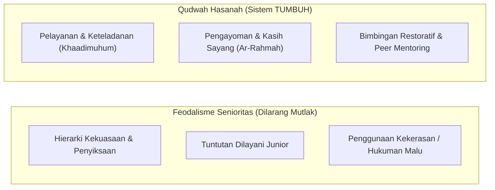
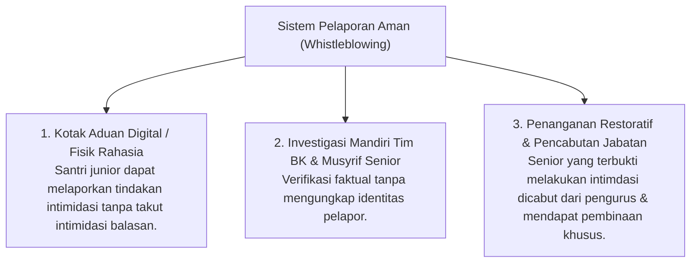

# P4-04-04: Sistem Keteladanan Qudwah dan Anti-Feodalisme Senioritas

## Status Dokumen
* **Status**: 🌟 **A+ (Tervalidasi & Siap Diimplementasikan)**
* **Sub-Domain**: `04 Progression Framework / 04 Mastery Progression`
* **Penanggung Jawab Keilmuan**: Dewan Keilmuan TUMBUH (*Pakar Tata Kelola Qudwah & Pakar Arsitektur PBIS Restoratif*)

---

## 1. Konseptualisasi Qudwah vs Feodalisme

Budaya senioritas di lembaga pendidikan sering kali berisiko berbelok menjadi feodalisme—di mana santri senior menuntut perlakuan istimewa dan menggunakan kekuasaan untuk mengintimidasi junior. Ekosistem **TUMBUH** menggantikan budaya ini dengan **Sistem Qudwah Hasanah Restoratif**:

---

## 2. Standar Etika & Perilaku Santri Senior T3 & T4

1. **Prinsip Kasih Sayang Kepada Junior (*Rahmatush Shighar*)**:
   - Rasulullah SAW bersabda: *"Bukan termasuk golongan kami orang yang tidak menyayangi yang lebih muda di antara kami dan tidak menghormati yang lebih tua."* (HR. Tirmidzi).
2. **Larangan Menyuruh Junior untuk Kepentingan Pribadi**:
   - Dilarang keras menyuruh santri T1/T2 mencuci pakaian, mencuci piring, atau membeli makanan untuk kepentingan pribadi santri T3/T4.
3. **Wewenang Kedisiplinan Terbatas & Konstruktif**:
   - Pengurus santri T4 tidak berhak menjatuhkan hukuman fisik, denda uang pribadi, atau pembentakan. Pelanggaran adab junior wajib dilaporkan kepada musyrif untuk ditindaklanjuti sesuai SOP PBIS.

---

## 3. Sistem Pemantauan & Pelaporan Pelanggaran Senioritas

---

## 4. Indikator Keberhasilan Bi'ah Qudwah Pesantren

- Terciptanya suasana asrama yang hangat, di mana santri junior merasa aman dan nyaman berinteraksi dengan santri senior.
- Adanya inisiatif santri senior membantu hafalan, pelajaran, dan adaptasi adik kelas secara sukarela (*Peer Mentoring Initiative*).
