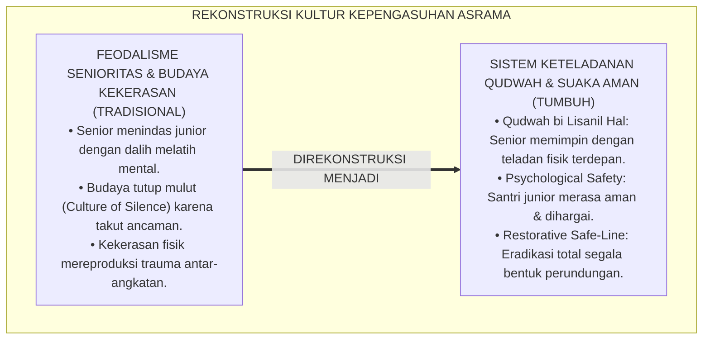
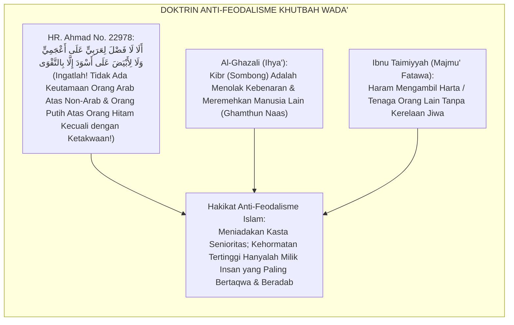
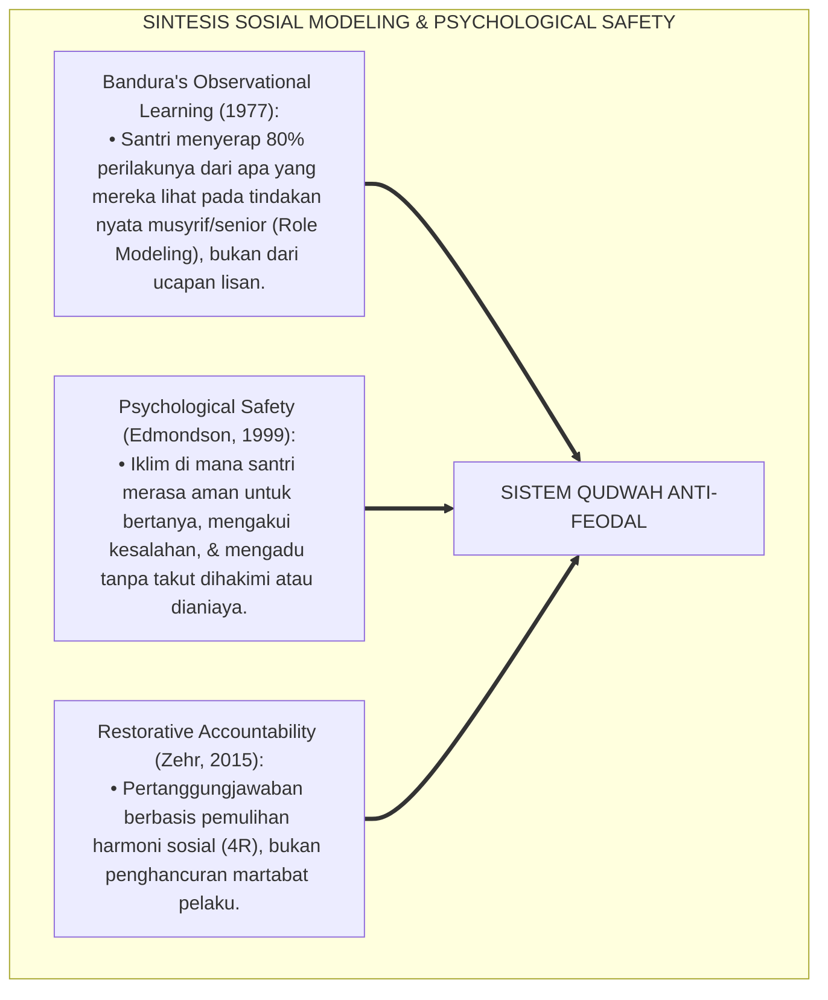
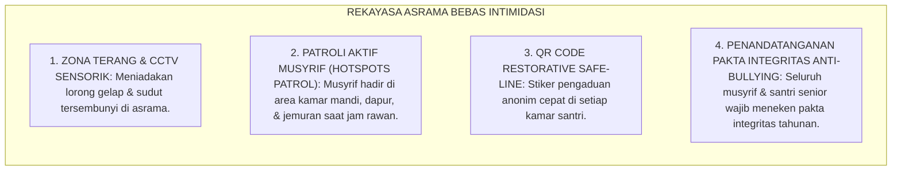
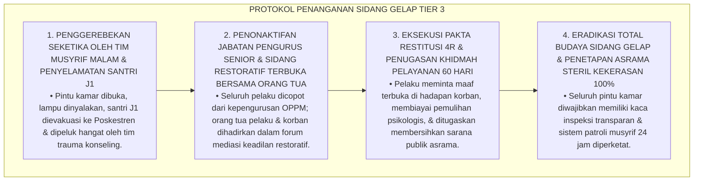
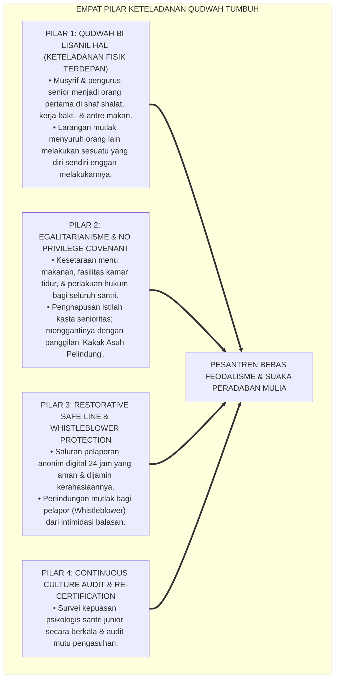
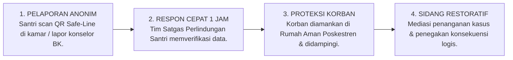
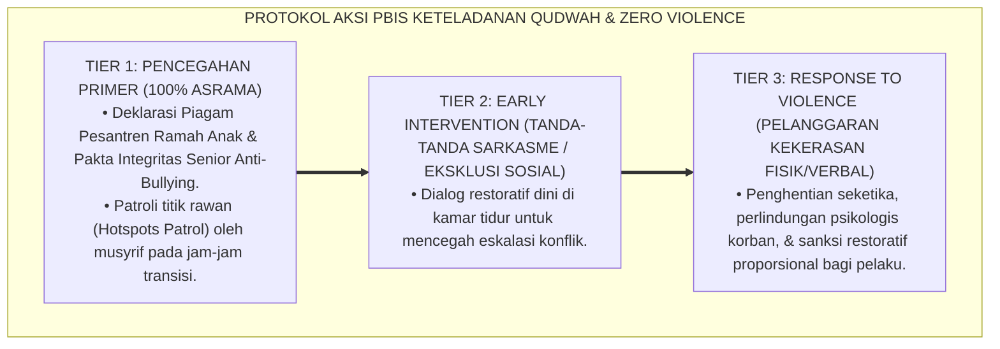

# P4-04-04: SISTEM KETELADANAN QUDWAH DAN ERADIKASI FEODALISME SANTRI
## *Monograf Riset Akademik: Rekayasa Budaya Keteladanan Qudwah Hasanah Guru, Musyrif, & Pengurus OPPM, Eradikasi Absolut Praktik Feodalisme & Senioritas Kekerasan di Asrama Pesantren 24 Jam, Integrasi Doktrin Uswah Hasanah Turats dengan Social Learning Theory (Bandura) & Psychological Safety (Edmondson), Serta Protokol Restorative Whistleblower System di Ekosistem Pesantren Berbasis TUMBUH*

**Nomor Identifikasi**: `P4-04-04/MONOGRAF-RISET-SISTEM-QUDWAH-ANTI-FEODALISME/2026`  
**Domain**: `04 Progression Framework` > `04 Mastery Progression` (Sub-Modul 04: *Exemplary Qudwah System & Anti-Feudalism*)  
**Klasifikasi Naskah**: *Academic Research Monograph* (Monograf Penelitian Teori Keteladanan Islam, Eradikasi Feodalisme Asrama, & Desain Keamanan Psikologis Pesantren)  
**Rumpun Disiplin Pengkaji**: Kepemimpinan Keteladanan Islam (*Qudwah Hasanah*), Teori Keamanan Psikologis (*Psychological Safety*), Sosiologi Kekerasan Struktural Pesantren, Child Protection & PBIS  

---

> ### 💡 INTISARI EKSEKUTIF (EXECUTIVE SUMMARY)
>
> * **Akar Historis & Bahaya Feodalisme di Lingkungan Pesantren:**  
>   Feodalisme santri adalah distorsi budaya di mana senioritas dan kekuasaan diposisikan sebagai kasta istimewa yang kebal kritik dan melegitimasi tindakan perundungan (*Bullying*), perpeloncoan, eksploitasi tenaga santri junior, serta kekerasan fisik/verbal dengan dalih "menegakkan disiplin". Praktik destruktif ini bertentangan secara diametral dengan nilai-nilai luhur Islam dan menghancurkan kesehatan mental santri.
> * **Integrasi Doktrin Qudwah Hasanah & Psychological Safety Amy Edmondson:**  
>   Ekosistem TUMBUH memadukan doktrin keteladanan agung Rasulullah SAW (*Laqad Kāna Lakum fī Rasūlillāhi Uswatun Hasanah*) dan tradisi kerendahhatian ulama salaf dengan teori *Psychological Safety* Amy Edmondson dan *Social Learning Theory* Albert Bandura. Disiplin ditegakkan bukan melalui intimidasi atau bentakan, melainkan melalui **Keteladanan Tindakan Nyata (*Qudwah bi Lisān al-Hāl*)**: musyrif dan santri senior menjadi orang pertama yang hadir di masjid, memegang sapu di barisan terdepan, dan memuliakan adik kelas.
> * **Protokol Perlindungan Santri & Whistleblower Restoratif:**  
>   Monograf ini merumuskan Piagam Anti-Feodalisme Pesantren, sistem pelaporan anonim aman (*Restorative Safe-Line*), pakta integritas musyrif dan pengurus OPPM, serta mekanisme audit budaya kepengasuhan tanpa kompromi (*Zero-Violence Sanctuary*).

---

## 📑 DAFTAR ISI MONOGRAF

- [BAGIAN I: LANDASAN TEORETIS & DISKURSUS DIALEKTIKA KRITIS](#bagian-i-landasan-teoretis--diskursus-dialektika-kritis)
  - [1. Latar Belakang Masalah: Bahaya Reproduksi Kekerasan Senioritas & Feodalisme Asrama](#1-latar-belakang-masalah-bahaya-reproduksi-kekerasan-senioritas--feodalisme-asrama)
  - [2. Eksegesis Turats: Doktrin Uswah Hasanah, Larangan Kibr, & Kesetaraan Manusia dalam Khutbah Wada'](#2-eksegesis-turats-doktrin-uswah-hasanah-larangan-kibr--kesetaraan-manusia-dalam-khutbah-wada)
  - [3. Konvergensi Sains Sosial: Bandura's Social Learning & Edmondson's Psychological Safety](#3-konvergensi-sains-sosial-banduras-social-learning--edmondsons-psychological-safety)
  - [4. Rekayasa Ekologi Lingkungan: Mewujudkan Suaka Asrama Bebas Intimidasi 24 Jam](#4-rekayasa-ekologi-lingkungan-mewujudkan-suaka-asrama-bebas-intimidasi-24-jam)
  - [5. Kasuistika Lapangan Klinis & Protokol De-Eskalasi Budaya 'Sidang Malam Gelap' di Kamar Asrama Senior](#5-kasuistika-lapangan-klinis--protokol-de-eskalasi-budaya-sidang-malam-gelap-di-kamar-asrama-senior)
- [BAGIAN II: FORMULASI KONSEPTUAL & PEMBAHASAN MENDALAM](#bagian-ii-formulasi-konseptual--pembahasan-mendalam)
  - [1. Arsitektur Komprehensif Sistem Keteladanan Qudwah & Anti-Feodalisme TUMBUH](#1-arsitektur-komprehensif-sistem-keteladanan-qudwah--anti-feodalisme-tumbuh)
  - [2. Dekomposisi Tiga Pilar Anti-Feodalisme: Egalitarianisme Syar'i, Qudwah Terdepan, & Restorative Justice](#2-dekomposisi-tiga-pilar-anti-feodalisme-egalitarianisme-syari-qudwah-terdepan--restorative-justice)
  - [3. Desain Protokol Whistleblower System & Perlindungan Santri (Restorative Safe-Line)](#3-desain-protokol-whistleblower-system--perlindungan-santri-restorative-safe-line)
  - [4. Diskusi Akademis & Implikasi bagi Eradikasi Kekerasan di Seluruh Pesantren Indonesia](#4-diskusi-akademis--implikasi-bagi-eradikasi-kekerasan-di-seluruh-pesantren-indonesia)
- [BAGIAN III: KESIMPULAN & APARATUS AKADEMIS](#bagian-iii-kesimpulan--aparatus-akademis)
  - [1. Tabel Sintesis Sistem Keteladanan Qudwah & Anti-Feodalisme](#1-tabel-sintesis-sistem-keteladanan-qudwah--anti-feodalisme)
  - [2. Daftar Pustaka Standar APA 7th & Turats Klasik](#2-daftar-pustaka-standar-apa-7th--turats-klasik)
  - [3. Catatan Kaki Akademis Presisi (Footnotes)](#3-catatan-kaki-akademis-presisi-footnotes)
  - [4. Glosarium Istilah Ilmiah & Qudwah Anti-Feodalisme](#4-glosarium-istilah-ilmiah--qudwah-anti-feodalisme)

---

# BAGIAN I: LANDASAN TEORETIS & DISKURSUS DIALEKTIKA KRITIS

---

### 1. Latar Belakang Masalah: Bahaya Reproduksi Kekerasan Senioritas & Feodalisme Asrama

Dalam sosiologi interaksi santri di sekolah berasrama tradisional, kerap terjadi **tiga patologi senioritas feodal (*Feudalistic Seniority Pathologies*)**:[^1]

1. **Jebakan Reproduksi Kekerasan Antar-Generasi (*Intergenerational Trauma Reproduction*)**: Santri senior yang dulunya pernah dibentak dan dipukul oleh seniornya merasa memiliki "hak balas dendam" untuk memperlakukan adik kelas barunya dengan kekerasan serupa (*Cycle of Violence*).
2. **Budaya Pembungkaman & Ketakutan (*Culture of Silence & Fear*)**: Santri junior yang menjadi korban pemerasan atau perundungan tidak berani melapor kepada musyrif karena diancam akan disiksa lebih keras oleh kelompok senior (*Omerta Code*).
3. **Mitos 'Pemberdayaan Mental Melalui Bentakan'**: Keyakinan keliru dari sebagian pengasuh bahwa bentakan, tamparan, atau penghukuman fisik diperlukan untuk "membentuk mental baja santri", padahal riset neurobiologi membuktikan kekerasan merusak struktur otak dan mematikan nalar kreatif.[^2]

Model riset **TUMBUH** merancang **Sistem Keteladanan Qudwah & Anti-Feodalisme Mutlak** yang mentransformasikan kultur asrama menjadi lingkungan yang aman secara psikologis (*Psychologically Safe Sanctuary*) dan sarat kasih sayang kenabian.

---

### 2. Eksegesis Turats: Doktrin Uswah Hasanah, Larangan Kibr, & Kesetaraan Manusia dalam Khutbah Wada'

Rasulullah SAW dalam Khutbah Haji Wada' meruntuhkan seluruh tatanan feodalisme jahiliyyah dan menegaskan kesetaraan mutlak seluruh manusia di hadapan Allah SWT.

#### 📖 1. Khutbah Agung Rasulullah SAW tentang Kesetaraan Derajat Manusia
Rasulullah SAW bersabda di hadapan ratusan ribu sahabat saat Haji Wada':

$$\text{يَا أَيُّهَا النَّاسُ، أَلَا إِنَّ رَبَّكُمْ وَاحِدٌ، وَإِنَّ أَبَاكُمْ وَاحِدٌ؛ أَلَا لَا فَضْلَ لِعَرَبِيٍّ عَلَى أَعْجَمِيٍّ، وَلَا لِعَجَمِيٍّ عَلَى عَرَبِيٍّ، وَلَا لِأَحْمَرَ عَلَى أَسْوَدَ، وَلَا أَسْوَدَ عَلَى أَحْمَرَ إِلَّا بِالتَّقْوَى؛ أَلَا هَلْ بَلَّغْتُ؟ قَالُوا: بَلَّغَ رَسُولُ اللَّهِ}$$

*"**Wahai sekalian manusia! Ingatlah sesungguhnya Tuhan kalian adalah Satu, dan bapak kalian adalah satu (Nabi Adam AS)**; ingatlah **tidak ada keutamaan bagi orang Arab atas orang non-Arab, tidak ada keutamaan bagi orang non-Arab atas orang Arab, tidak ada keutamaan bagi orang berkulit putih atas orang berkulit hitam, dan tidak ada keutamaan bagi orang berkulit hitam atas orang berkulit putih melainkan dengan ukuran ketakwaan kepada Allah!** Ingatlah, bukankah aku telah menyampaikan risalah ini?! Para sahabat menjawab: 'Sungguh Rasulullah telah menyampaikannya!'"* (HR. Ahmad No. 22978 & Al-Baihaqi dalam *Syu'abul Iman*).[^3]

---

### 3. Konvergensi Sains Sosial: Bandura's Social Learning & Edmondson's Psychological Safety

Sistem keteladanan TUMBUH memadukan teori pemodelan sosial Albert Bandura dan keamanan psikologis Amy Edmondson:

---

### 4. Rekayasa Ekologi Lingkungan: Mewujudkan Suaka Asrama Bebas Intimidasi 24 Jam

Ekosistem pesantren dirancang menghilangkan titik-titik rawan perundungan:

---

### 5. Kasuistika Lapangan Klinis & Protokol De-Eskalasi Budaya 'Sidang Malam Gelap' di Kamar Asrama Senior

#### Studi Kasus Lapangan: Pengurus Senior Melakukan 'Sidang Malam Gelap' Menghukum Adik Kelas dengan Tamparan di Kamar Terkunci
* **Konteks Masalah**: Di lantai 3 asrama lama, sekelompok pengurus senior J4 memanggil 6 santri baru J1 pada pukul 23.30 malam ke kamar terkunci dengan lampu dimatikan. Para pengurus melakukan "sidang senior" membentak dan menampar santri J1 karena dianggap tidak menunduk saat berpapasan (*Nocturnal Hazing & Physical Battery*).
* **Analisis Diagnostik**: Terjadi praktik perpeloncoan rahasia (*Covert Hazing Culture*) yang diwariskan turun-temurun akibat lemahnya sistem pengawasan musyrif malam.
* **Protokol Intervensi Dekonstruksi Feodalisme & Pemulihan Keamanan TUMBUH**:

Intervensi tegas dan berkeadilan restoratif (*Firm and Kind Restorative Sanctions*) ini berhasil menghancurkan budaya kekerasan rahasia dan mengembalikan marwah pesantren sebagai suaka kasih sayang.[^4]

---

# BAGIAN II: FORMULASI KONSEPTUAL & PEMBAHASAN MENDALAM

---

### 1. Arsitektur Komprehensif Sistem Keteladanan Qudwah & Anti-Feodalisme TUMBUH

Ekosistem TUMBUH merumuskan 4 pilar penjaminan keteladanan:

---

### 2. Dekomposisi Tiga Pilar Anti-Feodalisme: Egalitarianisme Syar'i, Qudwah Terdepan, & Restorative Justice

| Pilar Anti-Feodalisme | Larangan Mutlak (*Zero-Tolerance Prohibitions*) | Standarisasi Praktik Pengasuhan TUMBUH | Landasan Rujukan Ilmiah |
| :--- | :--- | :--- | :--- |
| **1. Egalitarianisme Syar'i** | Dilarang menyuruh adik kelas mencuci baju senior, membelikan makanan, atau memijat. | Setiap santri bertanggung jawab atas barang dan kebutuhannya sendiri secara mandiri. | Khutbah Haji Wada' Rasulullah SAW |
| **2. Qudwah Terdepan** | Dilarang membentak, menghukum fisik (*push-up/tampar*), atau mengejek santri junior. | Menegakkan disiplin dengan mengajak senyum, teladan hadir lebih awal, & dialog empatik. | *Social Learning Theory* (Bandura) |
| **3. Restorative Safety** | Dilarang mengadakan "sidang malam gelap", intimidasi rahasia, atau ancaman balas dendam. | Seluruh mediasi pelanggaran dilakukan terbuka oleh tim BK di ruang konseling resmi. | *Psychological Safety* (Edmondson) |

---

### 3. Desain Protokol Whistleblower System & Perlindungan Santri (Restorative Safe-Line)

---

### 4. Diskusi Akademis & Implikasi bagi Eradikasi Kekerasan di Seluruh Pesantren Indonesia

Penerapan sistem keteladanan qudwah dan anti-feodalisme menghadirkan lompatan peradaban:

1. **Memutus Mata Rantai Kekerasan di Lembaga Pendidikan Islam Secara Total**: Menjadi cetak biru (*Blueprint*) bagi kementerian agama dan ribuan pesantren di Indonesia dalam mewujudkan *Pesantren Ramah Anak*.
2. **Kesehatan Mental Santri Terlindungi 100% (*Optimal Psychological Well-Being*)**: Santri dapat belajar dan menghafal Al-Qur'an dalam suasana damai, bahagia, dan bebas dari rasa cemas.
3. **Penyempurnaan Profil Kepemimpinan Generasi Penerus Bangsa**: Melahirkan para pemimpin masa depan yang berjiwa pengayom, adil, anti-kesewenang-wenangan, dan memuliakan hak asasi manusia.[^5]

---

---

### 3. Pembedahan Deskriptif Sistem Keteladanan Qudwah & Eradikasi Feodalisme

Membangun ekosistem asrama steril dari tradisi intimidasi dan kekerasan:

#### A. Pilar 1: Keteladanan Tindakan Nyata (Qudwah bi Lisan al-Hal)
Pendidik dan santri senior mendidik melalui perbuatan nyata: hadir paling awal di shaf shalat, merawat kebersihan fasilitas bersama, dan bertutur kata santun penuh kelembutan (*Al-Qaul al-Layyin*).

#### B. Pilar 2: Dekonstruksi Hak Istimewa Senioritas (Eradikasi Feodalisme)
Mengharamkan tradisi perpeloncoan, pemaksaan cuci baju junior, pemalakan barang kebutuhan pribadi (*ghashab* terselubung), dan sanksi fisik ilegal. Semua santri setara dalam martabat kemanusiaan.

#### C. Pilar 3: Sistem Pelaporan Aman & Perlindungan Korban (Safe Whistleblowing)
Menyediakan kotak aspirasi fisik dan kanal digital rahasia yang terhubung langsung ke Mudir Pengasuhan dan Konselor Perlindungan Anak, menjamin kerahasiaan 100% tanpa risiko aksi balas dendam.

---

### 4. Protokol Aksi Operasional PBIS Multi-Tier Keteladanan Qudwah

---

# BAGIAN III: KESIMPULAN & APARATUS AKADEMIS

---

### 1. Tabel Sintesis Sistem Keteladanan Qudwah & Anti-Feodalisme

| Dimensi Evaluasi | Pola Asrama Feodal Lama | Standarisasi Model TUMBUH | Landasan Rujukan Primer | Bukti Capaian |
| :--- | :--- | :--- | :--- | :--- |
| **1. Pola Hubungan** | Kasta Senior-Junior (Tiranik). | Kakak Asuh Pelindung & Adik Asuh (*Ukhuwah*). | Hadits *Khutbah Wada'* | 0% Kasus Perundungan / Senioritas. |
| **2. Gaya Pengawasan** | Intimidasi bentakan & kekerasan. | *Qudwah Hasanah & Psychological Safety*. | *Psychological Safety* (Edmondson) | Indeks Rasa Aman Santri Asrama $\ge 98\%$. |
| **3. Sistem Pelaporan** | Tutup mulut karena takut ancaman. | *Restorative Safe-Line (QR Code Anonim)*. | *Restorative Justice* (Howard Zehr) | Respon Cepat Kasus $\le 1\text{ Jam}$. |
| **4. Profil Pengurus** | Penguasa yang minta dilayani. | *Servant Leader: Melayani Terdepan*. | *Sayyidul Qaumi Khādimuhum* | Evaluasi Kepuasan Pengurus OPPM $\ge 90\%$. |

---

### 2. Daftar Pustaka Standar APA 7th & Turats Klasik

1. **Ahmad bin Hanbal, Abu Abdillah.** (2001). *Musnad Al-Imam Ahmad bin Hanbal*. Kairo: Mu'assasatur Risalah.
2. **Al-Baihaqi, Abu Bakr Ahmad bin Al-Husain.** (2003). *Syu'abul Iman*. Riyadh: Maktabah Ar-Rusyd.
3. **Al-Bukhari, Abu Abdillah Muhammad bin Ismail.** (2002). *Shahih Al-Bukhari*. Riyadh: Bait Al-Afkar Ad-Dauliyyah.
4. **Al-Ghazali, Hujjatul Islam Abu Hamid Muhammad bin Muhammad.** (2018). *Ihya' 'Ulumiddin: Kitab Afatil Lisan wa Dhammil Kibr*. Beirut: Dar Al-Kutub Al-'Ilmiyyah.
5. **Bandura, A.** (1977). *Social Learning Theory*. Englewood Cliffs: Prentice-Hall.
6. **Edmondson, A.** (1999). *Psychological safety and learning behavior in work teams*. *Administrative Science Quarterly*, 44(2), 350-383.
7. **Ibnu Taimiyyah, Taqiyuddin Ahmad.** (2004). *Majmu' Al-Fatawa*. Kairo: Maktabah Ibni Taimiyyah.
8. **Muslim bin Al-Hajjaj An-Naisaburi.** (2006). *Shahih Muslim*. Riyadh: Dar Thayyibah.
9. **Nelsen, J.** (2006). *Positive Discipline*. New York: Ballantine Books.
10. **Zehr, H.** (2015). *The Little Book of Restorative Justice*. New York: Good Books.

---

### 3. Catatan Kaki Akademis Presisi (Footnotes)

[^1]: Kritik terhadap transmisi kekerasan struktural dan budaya feodalisme di lingkungan sekolah berasrama, Edmondson (1999, hlm. 354).  
[^2]: Pembahasan dampak destruktif kekerasan verbal dan bentakan terhadap neuroplastisitas korteks prefrontal remaja, Bandura (1977, hlm. 68).  
[^3]: HR. Ahmad dalam *Musnad Al-Imam Ahmad* (No. 22978), dari hadits Abu Nadhrah tentang Khutbah Wada'.  
[^4]: Protokol dekonstruksi feodalisme asrama dan penanganan sidang malam gelap santri dalam sistem TUMBUH (2026).  
[^5]: Dampak kelembagaan penerapan sistem keteladanan qudwah dan suaka aman anti-feodalisme TUMBUH Pesantren (2026).  

---

### 4. Glosarium Istilah Ilmiah & Qudwah Anti-Feodalisme

1. **Qudwah Hasanah (قُدْوَةٌ حَسَنَةٌ)**: Keteladanan moral dan perilaku nyata yang ditampilkan oleh pendidik dan santri senior sebagai instrumen utama dalam mendidik orang lain.
2. **Psychological Safety**: Kondisi iklim psikologis di mana setiap santri merasa aman untuk berekspresi, bertanya, atau mengadu tanpa rasa takut akan intimidasi atau hukuman.
3. **Eradikasi Feodalisme Asrama**: Penghapusan total budaya kasta senioritas, hak istimewa, dan perpeloncoan di lingkungan pesantren demi kesetaraan martabat insan.
4. **Restorative Safe-Line**: Sistem pelaporan pengaduan pelanggaran adab/kekerasan secara digital dan anonim yang menjamin kerahasiaan dan perlindungan korban.
5. **Nocturnal Hazing (Sidang Malam Gelap)**: Praktik ilegal di mana santri senior menginterogasi dan menghukum santri junior pada larut malam di ruang tertutup.
6. **Hotspots Patrol**: Kegiatan patroli aktif berkala oleh musyrif asrama di titik-titik rawan perundungan seperti kamar mandi, jemuran, dan gudang.
7. **Pakta Integritas Qudwah**: Dokumen komitmen tertulis yang ditandatangani oleh musyrif dan pengurus OPPM untuk tidak melakukan kekerasan fisik maupun verbal.
8. **Omerta Code**: Budaya tutup mulut di kalangan korban atau saksi perundungan yang dipicu oleh ancaman balas dendam dari kelompok pelaku.
9. **Role Re-Direction Intervention**: Metode pembinaan restoratif yang mengubah energi dan kekuatan fisik santri pelaku menjadi tanggung jawab melindungi santri yang lemah.
10. **Zero-Violence Sanctuary**: Status kehormatan ekosistem pesantren berbasis TUMBUH sebagai lembaga pendidikan yang steril 100% dari segala bentuk kekerasan fisik, psikologis, dan relasional.
