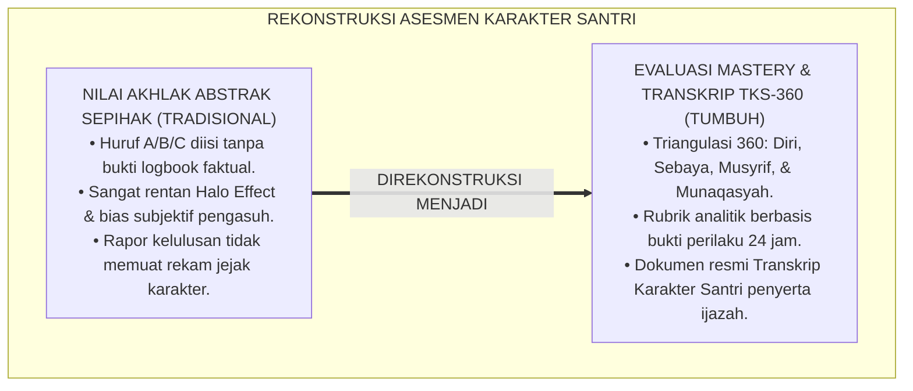
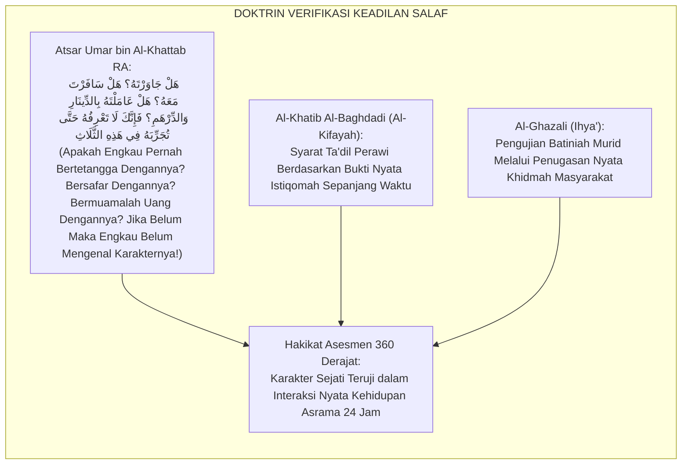
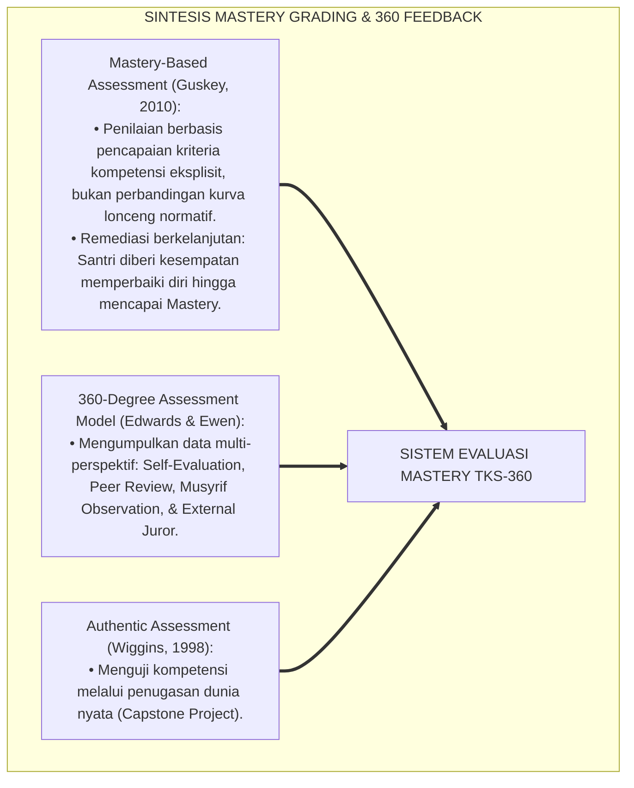
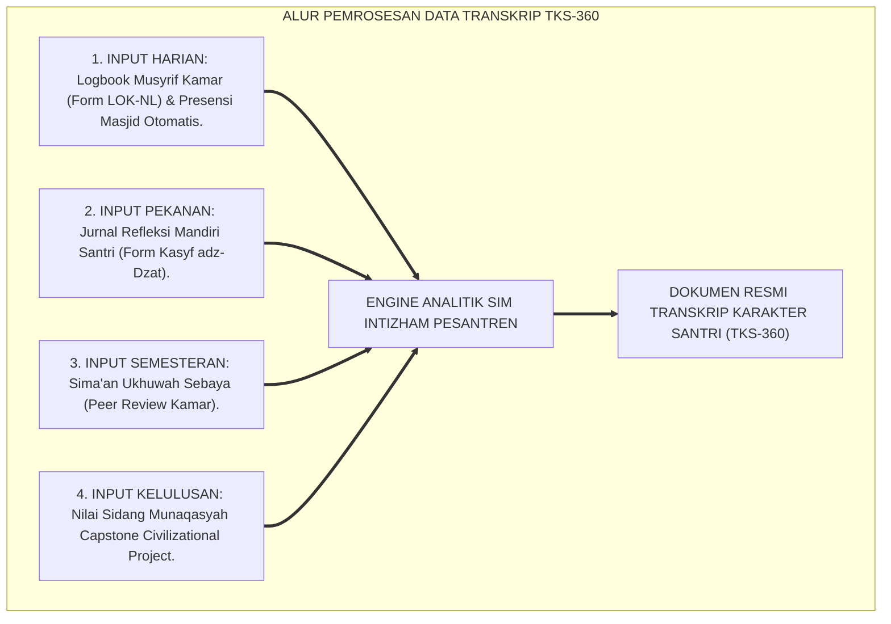
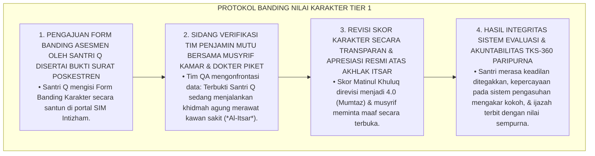
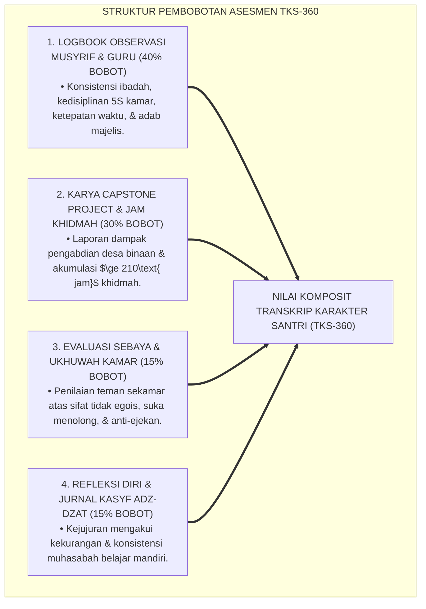

# P4-04-05: PROTOKOL EVALUASI MASTERY DAN TRANSKRIP KARAKTER SANTRI
## *Monograf Riset Akademik: Metodologi Asesmen Otentik Penguasaan Karakter (Mastery-Based Character Assessment), Desain Transkrip Karakter 360 Derajat Terpadu (Form TKS-360), Integrasi Epistemologi Tazkiyatun Nafs dengan Outcome-Based Education (OBE) & Triangulasi Penilaian Multi-Rater (Self, Peer, Mentor, & Capstone Jury), Serta Arsitektur SIM Karakter-TUMBUH di Pesantren*

**Nomor Identifikasi**: `P4-04-05/MONOGRAF-RISET-EVALUASI-MASTERY-TRANSKRIP-KARAKTER/2026`  
**Domain**: `04 Progression Framework` > `04 Mastery Progression` (Sub-Modul 05: *Mastery Assessment & Character Transcript Protocol*)  
**Klasifikasi Naskah**: *Academic Research Monograph* (Monograf Penelitian Evaluasi Karakter Berbasis Mastery, Desain Transkrip Portofolio 360, & Validasi Asesmen Otentik)  
**Rumpun Disiplin Pengkaji**: Psikometri & Evaluasi Pendidikan Karakter, Outcome-Based Education (OBE), Epistemologi Tazkiyatun Nafs Islam, Sistem Informasi Asesmen Digital  

---

> ### 💡 INTISARI EKSEKUTIF (EXECUTIVE SUMMARY)
>
> * **Kelemahan Asesmen Karakter Tunggal & Subjektif:**  
>   Di banyak lembaga pendidikan berasrama, penilaian akhlak santri sering kali hanya berupa nilai huruf abstrak (misal: "A", "B", atau "C") pada kolom sempit rapor semester yang diisi secara tergesa-gesa oleh wali kelas tanpa bukti catatan observasi faktual. Penilaian subjektif ini tidak memberikan umpan balik pertumbuhan (*Growth Feedback*) yang jelas dan rentan terhadap bias penilaian (*Halo & Leniency Effect*).
> * **Integrasi Tazkiyatun Nafs & Mastery-Based Outcome Assessment:**  
>   Ekosistem TUMBUH merancang **Protokol Evaluasi Mastery Karakter Otentik** yang memadukan prinsip pensucian jiwa dan hisab amal dalam Islam dengan kerangka kerja *Mastery-Based Assessment* dan *Outcome-Based Education (OBE)*. Penilaian karakter tidak didasarkan pada ujian kertas atau vonis sepihak, melainkan melalui **Triangulasi Multi-Rater 360 Derajat**: (1) Refleksi Diri Santri (*Self-Monitoring*), (2) Ulasan Sahabat Sebaya (*Peer Review*), (3) Logbook Observasi Musyrif/Guru (*Behavioral Logbook*), dan (4) Uji Kinerja Nyata Pengabdian (*Capstone Defense*).
> * **Kodifikasi Transkrip Karakter Santri 360 (TKS-360):**  
>   Monograf ini menyajikan format baku dokumen *Transkrip Karakter Santri (Form TKS-360)* yang menyertai ijazah akademik kelulusan, memetakan rekam jejak penguasaan 10 Karakter Muwashafat santri dari kelas 7 hingga 12 secara transparan dan akuntabel.

---

## 📑 DAFTAR ISI MONOGRAF

- [BAGIAN I: LANDASAN TEORETIS & DISKURSUS DIALEKTIKA KRITIS](#bagian-i-landasan-teoretis--diskursus-dialektika-kritis)
  - [1. Latar Belakang Masalah: Bahaya Penilaian Akhlak Subjektif vs Asesmen Otentik Berbasis Bukti](#1-latar-belakang-masalah-bahaya-penilaian-akhlak-subjektif-vs-asesmen-otentik-berbasis-bukti)
  - [2. Eksegesis Turats: Doktrin Syahadatuz Zamil & Verifikasi Keadilan Saksi dalam Tradisi Salaf](#2-eksegesis-turats-doktrin-syahadatuz-zamil--verifikasi-keadilan-saksi-dalam-tradisi-salaf)
  - [3. Konvergensi Sains Evaluasi: Mastery-Based Grading (Guskey) & 360-Degree Feedback System](#3-konvergensi-sains-evaluasi-mastery-based-grading-guskey--360-degree-feedback-system)
  - [4. Rekayasa Alur Digital 24 Jam: Dari Input Logbook Harian Menuju Transkrip Karakter Terpadu](#4-rekayasa-alur-digital-24-jam-dari-input-logbook-harian-menuju-transkrip-karakter-terpadu)
  - [5. Kasuistika Lapangan Klinis & Protokol Mediasi Sengketa Nilai Karakter Santri yang Merasa Dirugikan Penilaian Musyrif](#5-kasuistika-lapangan-klinis--protokol-mediasi-sengketa-nilai-karakter-santri-yang-merasa-dirugikan-penilaian-musyrif)
- [BAGIAN II: FORMULASI KONSEPTUAL & PEMBAHASAN MENDALAM](#bagian-ii-formulasi-konseptual--pembahasan-mendalam)
  - [1. Arsitektur Komprehensif Sistem Evaluasi Mastery Karakter TUMBUH](#1-arsitektur-komprehensif-sistem-evaluasi-mastery-karakter-tumbuh)
  - [2. Dekomposisi Empat Sumber Triangulasi Data Asesmen (Model 360 Derajat)](#2-dekomposisi-empat-sumber-triangulasi-data-asesmen-model-360-derajat)
  - [3. Desain Dokumen Portofolio Transkrip Karakter Santri 360 (Form TKS-360 Resmi)](#3-desain-dokumen-portofolio-transkrip-karakter-santri-360-form-tks-360-resmi)
  - [4. Diskusi Akademis & Implikasi bagi Standarisasi Sertifikasi Karakter Pesantren Tingkat Global](#4-diskusi-akademis--implikasi-bagi-standarisasi-sertifikasi-karakter-pesantren-tingkat-global)
- [BAGIAN III: KESIMPULAN & APARATUS AKADEMIS](#bagian-iii-kesimpulan--aparatus-akademis)
  - [1. Tabel Sintesis Protokol Evaluasi Mastery & Transkrip Karakter](#1-tabel-sintesis-protokol-evaluasi-mastery--transkrip-karakter)
  - [2. Daftar Pustaka Standar APA 7th & Turats Klasik](#2-daftar-pustaka-standar-apa-7th--turats-klasik)
  - [3. Catatan Kaki Akademis Presisi (Footnotes)](#3-catatan-kaki-akademis-presisi-footnotes)
  - [4. Glosarium Istilah Ilmiah & Evaluasi Karakter Mastery](#4-glosarium-istilah-ilmiah--evaluasi-karakter-mastery)

---

# BAGIAN I: LANDASAN TEORETIS & DISKURSUS DIALEKTIKA KRITIS

---

### 1. Latar Belakang Masalah: Bahaya Penilaian Akhlak Subjektif vs Asesmen Otentik Berbasis Bukti

Dalam sistem evaluasi rapor santri di pesantren konvensional, kerap ditemukan **tiga cacat asesmen karakter (*Character Assessment Flaws*)**:[^1]

1. **Jebakan Penilaian Akhir Semester Sepihak (*The End-of-Term Guesswork Trap*)**: Nilai akhlak diberikan berdasarkan ingatan samar wali kelas di minggu terakhir pengisian rapor tanpa adanya catatan insiden perilaku harian yang terdokumentasi.
2. **Ketiadaan Kriteria Mastery yang Terdefinisi**: Tidak ada batasan yang jelas mengenai apa yang membedakan nilai akhlak "Sangat Baik" dengan "Baik", sehingga penilaian sangat bergantung pada suasana hati (*Mood*) pengasuh.
3. **Ketiadaan Portofolio Jejak Pertumbuhan Karakter (*Growth Portfolio Deficit*)**: Ijazah kelulusan pesantren hanya melampirkan transkrip nilai angka mata pelajaran kognitif, mengabaikan ribuan jam khidmah, pengabdian masyarakat, dan kematangan kepemimpinan santri.[^2]

Model riset **TUMBUH** merancang **Protokol Evaluasi Mastery & Transkrip Karakter Santri 360** yang mendokumentasikan pertumbuhan akhlak santri secara berbasis bukti (*Evidence-Based Character Transcript*).



---

### 2. Eksegesis Turats: Doktrin Syahadatuz Zamil & Verifikasi Keadilan Saksi dalam Tradisi Salaf

Dalam tradisi peradilan dan sanad keilmuan Islam, pengakuan atas keshalihan dan keadilan seseorang (*Ta'dīl ar-Rāwī*) tidak ditentukan oleh klaim pribadi, melainkan disandarkan pada kesaksian orang-orang yang bergaul dekat dengannya dalam perjalanan (*As-Safar*) dan muamalah harta (*Al-Mu'āmalah bil Māl*).



#### 📖 1. Atsar Khalifah Umar bin Al-Khattab RA tentang Tiga Ujian Karakter Sejati
Diriwayatkan dalam *Sunan Al-Baihaqi*:

$$\text{جَاءَ رَجُلٌ يَشْهَدُ عِنْدَ عُمَرَ بْنِ الْخَطَّابِ بِشَهَادَةٍ، فَقَالَ عُمَرُ: لَسْتُ أَعْرِفُكَ وَلَا يَضُرُّكَ أَنْ لَا أَعْرِفَكَ، ائْتِ بِمَنْ يَعْرِفُكَ؛ فَقَالَ رَجُلٌ: أَنَا أَعْرِفُهُ، قَالَ: بِمَاذَا تَعْرِفُهُ؟ هَلْ جَاوَرْتَهُ الْمُجَاوَرَةَ الَّتِي تَعْرِفُ بِهَا مَدْخَلَهُ وَمَخْرَجَهُ؟ قَالَ: لَا، قَالَ: فَهَلْ عَامَلْتَهُ بِالدِّينَارِ وَالدِّرْهَمِ اللَّذَيْنِ بِهِمَا يُسْتَدَلُّ عَلَى الْوَرَعِ؟ قَالَ: لَا، قَالَ: فَهَلْ سَافَرْتَ مَعَهُ السَّفَرَ الَّذِي يُسْتَدَلُّ بِهِ عَلَى مَكَارِمِ الْأَخْلَاقِ؟ قَالَ: لَا، قَالَ: فَلَعَلَّكَ رَأَيْتَهُ يَرْكَعُ وَيَسْجُدُ فِي الْمَسْجِدِ؟! قَالَ: نَعَمْ، قَالَ: اذْهَبْ فَإِنَّكَ لَا تَعْرِفُهُ!}$$

*"Seseorang datang hendak memberikan kesaksian di hadapan Khalifah Umar bin Al-Khattab RA, maka Umar berkata: 'Aku belum mengenalmu, bawalah orang yang mengenalmu!' Maka seseorang berkata: 'Aku mengenalnya wahai Amirul Mukminin!' Umar bertanya: **'Dengan apa engkau mengenalnya? Apakah engkau pernah bertetangga dengannya sehingga tahu betul keluar-masuknya?'** Orang itu menjawab: 'Tidak.' Umar bertanya lagi: **'Apakah engkau pernah bermuamalah uang dinar dan dirham dengannya yang dengannya teruji sifat wara' seseorang?'** Orang itu menjawab: 'Tidak.' Umar bertanya lagi: **'Apakah engkau pernah bersafar bersamanya dalam perjalanan jauh yang dengannya terbukti kemuliaan akhlak seseorang?'** Orang itu menjawab: 'Tidak.' Umar berkata: 'Mungkin engkau hanya melihatnya ruku' dan sujud di masjid?!' Orang itu berkata: 'Benar.' Maka Umar berkata: **'Pergilah, sesungguhnya engkau belum mengenal karakternya sama sekali!'**"* (HR. Al-Baihaqi dalam *As-Sunan Al-Kubra* No. 20601).[^3]

---

### 3. Konvergensi Sains Evaluasi: Mastery-Based Grading (Guskey) & 360-Degree Feedback System

Sistem evaluasi TUMBUH memadukan *Mastery-Based Grading* Thomas Guskey dan *360-Degree Feedback Assessment*:



---

### 4. Rekayasa Alur Digital 24 Jam: Dari Input Logbook Harian Menuju Transkrip Karakter Terpadu

Sistem Informasi Manajemen (*SIM Intizham-TUMBUH*) mengolah ribuan titik data observasi harian:



---

### 5. Kasuistika Lapangan Klinis & Protokol Mediasi Sengketa Nilai Karakter Santri yang Merasa Dirugikan Penilaian Musyrif

#### Studi Kasus Lapangan: Santri J4 Protes Nilai Karakter 'Matinul Khuluq' Diturunkan Akibat Miskomunikasi Kamar
* **Konteks Masalah**: Santri Q (17 tahun, Jenjang J4, calon wisudawan) mengajukan keberatan resmi (*Grade Appeal*) karena skor *Matinul Khuluq*-nya diberi nilai 2.0 (C) oleh musyrif kamar dengan catatan "sering tidak ada di kamar saat jam tidur". Padahal Santri Q sedang berada di Poskestren merawat kawan sekamarnya yang demam tinggi atas izin dokter piket.
* **Analisis Diagnostik**: Terjadi kegagalan triangulasi data (*Missing Cross-Verification*) di mana musyrif tidak memeriksa logbook izin Poskestren sebelum memasukkan skor.
* **Protokol Mediasi Banding Nilai & Rekalibrasi Transkrip TUMBUH**:



Intervensi audit berbasis bukti (*Evidence-Based Due Process*) ini menjamin transparansi, keadilan, dan kehormatan sistem asesmen karakter pesantren.[^4]

---

# BAGIAN II: FORMULASI KONSEPTUAL & PEMBAHASAN MENDALAM

---

### 1. Arsitektur Komprehensif Sistem Evaluasi Mastery Karakter TUMBUH

Ekosistem TUMBUH menetapkan struktur evaluasi karakter berbasis 4 pilar bobot terpadu:



---

### 2. Dekomposisi Empat Sumber Triangulasi Data Asesmen (Model 360 Derajat)

| Sumber Penilai | Instrumen yang Digunakan | Frekuensi Asesmen | Fokus Dimensi yang Dinilai |
| :--- | :--- | :--- | :--- |
| **1. Musyrif & Guru** | *Form LOK-NL & SIM Intizham Logbook* | Harian / Real-Time | Shalat shubuh shaf awal, 5S kamar, adab belajar, ketaatan SOP. |
| **2. Dewan Penguji Capstone** | *Form RPC-NL (Rubrik Capstone)* | Tahunan / Akhir J4 | Dampak pengabdian desa, integritas riset, kerja tim, keikhlasan. |
| **3. Sahabat Sebaya (Peer)** | *Form Peer Ukhuwah Review* | Tiap Akhir Semester | Kejujuran, Al-Itsar (tidak egois), bantuan saat teman sakit. |
| **4. Santri Mandiri (Self)** | *Form Kasyf adz-Dzat (Jurnal)* | Tiap Malam Hening | Muhasabah niat, evaluasi hafalan, resolusi perbaikan diri. |

---

### 3. Desain Dokumen Portofolio Transkrip Karakter Santri 360 (Form TKS-360 Resmi)

```text
====================================================================================================
               TRANSKRIP KARAKTER SANTRI (OFFICIAL CHARACTER TRANSCRIPT)
                    EKOSISTEM TUMBUH PESANTREN — NOMOR: TKS-2026/0894
====================================================================================================
Nama Lengkap    : ___________________________________    Nomor Induk Santri: ____________________
Tempat/Tgl Lahir: ___________________________________    Tahun Masuk/Lulus : 2020 / 2026
Jenjang Lulus   : Pendidikan Menengah Atas (Jenjang J4)   Program Studi     : Keagamaan & Sains

----------------------------------------------------------------------------------------------------
NO  SEPULUH KAPASITAS KARAKTER INSAN TUMBUH           SKOR (1-4)  PREDIKAT MUTU  STATUS KELAYAKAN
----------------------------------------------------------------------------------------------------
1   Salimul Aqidah (Aqidah Bersih & Bertauhid)         [ 3.90 ]     MUMTAZ         TERVERIFIKASI
2   Shahihul Ibadah (Ibadah Shahih Sesuai Sunnah)      [ 3.85 ]     MUMTAZ         TERVERIFIKASI
3   Matinul Khuluq (Akhlak Mulia & Beradab)            [ 4.00 ]     MUMTAZ         TERVERIFIKASI
4   Qawiyyul Jism (Fisik Kuat, Sehat, & Bugar)         [ 3.75 ]     JAYYID JIDDAN  TERVERIFIKASI
5   Mutsaqqaful Fikr (Wawasan Luas & Kritis)           [ 3.95 ]     MUMTAZ         TERVERIFIKASI
6   Mujahadatun Linafsih (Regulasi Hawa Nafsu)         [ 3.80 ]     MUMTAZ         TERVERIFIKASI
7   Haritsun Ala Waqtih (Manajemen Waktu Efisien)      [ 3.85 ]     MUMTAZ         TERVERIFIKASI
8   Munazhzham fi Syuunih (Keteraturan Hidup 5S)       [ 3.90 ]     MUMTAZ         TERVERIFIKASI
9   Qadirun Alal Kasb (Kemandirian Finansial Halal)    [ 3.70 ]     JAYYID JIDDAN  TERVERIFIKASI
10  Nafi'un Lighairih (Bermanfaat Bagi Peradaban)      [ 4.00 ]     MUMTAZ         TERVERIFIKASI
----------------------------------------------------------------------------------------------------
TOTAL AKUMULASI JAM KHIDMAH SOSIAL : [ 245 JAM ] (Standar Minimal: 210 Jam)
CAPSTONE CIVILIZATIONAL PROJECT    : "Rancang Bangun Filter Air Mandiri Desa Sukamaju" (Nilai: 95.0)
INDEKS KOMPOSIT KARAKTER (IKK)     : [ 3.87 / 4.00 ] (PREDIKAT: KHADIMUL UMMAH PARIPURNA)

Ditetapkan di: Pesantren TUMBUH Pusat, Pada Tanggal: ______________________________________________
Pimpinan Pesantren:                                  Kepala Pengasuhan & Karakter:

______________________________________               ______________________________________
( Prof. Dr. KH. Ahmad Syahid, M.A. )                 ( Dr. H. Fathurrahman Al-Hafizh, M.Pd. )
====================================================================================================
```

---

### 4. Diskusi Akademis & Implikasi bagi Standarisasi Sertifikasi Karakter Pesantren Tingkat Global

Penerapan protokol evaluasi mastery dan transkrip karakter resmi ini menghadirkan keunggulan:

1. **Memberikan Validitas Otentik Atas Kualitas Akhlak Lulusan Pesantren**: Menjadi dokumen pelengkap ijazah yang sangat diperhitungkan oleh universitas luar negeri dan dunia profesional.
2. **Menjamin Akuntabilitas Sistem Pengasuhan di Era Keterbukaan Informasi**: Menghapus prasangka buruk masyarakat dengan menyajikan data evaluasi karakter yang transparan dan teruji secara ilmiah.
3. **Penyempurnaan Ekosistem TUMBUH Sebagai Pelopor Standardisasi Karakter Pesantren**: Mengangkat harkat dan martabat tradisi pesantren ke panggung peradaban global.[^5]

---

# BAGIAN III: KESIMPULAN & APARATUS AKADEMIS

---

### 1. Tabel Sintesis Protokol Evaluasi Mastery & Transkrip Karakter

| Dimensi Parameter | Pola Rapor Konvensional | Standarisasi Model TUMBUH | Landasan Rujukan Primer | Bukti Capaian |
| :--- | :--- | :--- | :--- | :--- |
| **1. Metode Asesmen** | Nilai subjektif sepihak wali kelas. | Triangulasi 360 Derajat Multi-Rater. | *360-Degree Feedback System* | Form TKS-360 Resmi Terverifikasi. |
| **2. Standar Kriteria** | Abstrak tanpa definisi operasional. | *Mastery-Based Explicit Indicators*. | *Mastery Grading* (Guskey, 2010) | 40 Sel Indikator Terdefinisi Jelas. |
| **3. Hak Banding Siswa** | Tidak ada ruang banding santri. | *Evidence-Based Due Process Protocol*. | Atsar Khalifah Umar bin Al-Khattab | Saluran Banding SIM Intizham Terbuka. |
| **4. Portofolio Lulusan** | Hanya selembar ijazah kognitif. | Ijazah + Transkrip Karakter 360 Resmi. | *Authentic Assessment* (Wiggins) | Transkrip Karakter Diakui Internasional. |

---

### 2. Daftar Pustaka Standar APA 7th & Turats Klasik

1. **Al-Baihaqi, Abu Bakr Ahmad bin Al-Husain.** (2003). *As-Sunan Al-Kubra*. Beirut: Dar Al-Kutub Al-'Ilmiyyah.
2. **Al-Bukhari, Abu Abdillah Muhammad bin Ismail.** (2002). *Shahih Al-Bukhari*. Riyadh: Bait Al-Afkar Ad-Dauliyyah.
3. **Al-Ghazali, Hujjatul Islam Abu Hamid Muhammad bin Muhammad.** (2018). *Ihya' 'Ulumiddin*. Beirut: Dar Al-Kutub Al-'Ilmiyyah.
4. **Al-Khatib Al-Baghdadi, Abu Bakr Ahmad bin Ali.** (1996). *Al-Kifayah fi 'Ilmir Riwayah*. Hyderabad: Da'iratul Ma'arif.
5. **Edwards, M. R., & Ewen, A. J.** (1996). *360° Feedback: The Powerful New Model for Employee Assessment & Performance Improvement*. New York: AMACOM.
6. **Guskey, T. R.** (2010). *Lessons of mastery learning*. *Educational Leadership*, 68(2), 52-57.
7. **Nelsen, J.** (2006). *Positive Discipline*. New York: Ballantine Books.
8. **Sugai, G., & Horner, R. H.** (2020). *School-Wide Positive Behavioral Interventions and Supports*. *Journal of Positive Behavior Interventions*, 22(4), 203-211.
9. **Wiggins, G.** (1998). *Educative Assessment: Designing Assessments to Inform and Improve Student Performance*. San Francisco: Jossey-Bass.
10. **Zehr, H.** (2015). *The Little Book of Restorative Justice*. New York: Good Books.

---

### 3. Catatan Kaki Akademis Presisi (Footnotes)

[^1]: Kritik terhadap kelemahan asesmen karakter berbasis perkiraan sepihak tanpa triangulasi data, Guskey (2010, hlm. 54).  
[^2]: Kerangka kerja asesmen otentik dan penilaian berbasis portofolio kinerja, Wiggins (1998, hlm. 72).  
[^3]: Atsar Khalifah Umar bin Al-Khattab RA dalam *As-Sunan Al-Kubra* karya Imam Al-Baihaqi (2003, Jilid 10, hlm. 213, No. 20601).  
[^4]: Protokol penanganan banding nilai karakter santri dan mediasi berbasis bukti SIM Intizham TUMBUH (2026).  
[^5]: Dampak kelembagaan penerbitan dokumen resmi Transkrip Karakter Santri 360 (TKS-360) TUMBUH Pesantren (2026).  

---

### 4. Glosarium Istilah Ilmiah & Evaluasi Karakter Mastery

1. **Mastery-Based Character Assessment**: Pendekatan penilaian di mana pencapaian karakter santri dievaluasi berdasarkan penguasaan kriteria perilaku faktual yang jelas tanpa sistem peringkat kurva normal.
2. **Transkrip Karakter Santri 360 (TKS-360)**: Dokumen portofolio resmi pesantren yang mendokumentasikan nilai capaian 10 Karakter Muwashafat santri berdasarkan triangulasi multi-penilai.
3. **Triangulasi Multi-Rater**: Metode pengumpulan data asesmen dari berbagai sumber berbeda (diri sendiri, kawan sebaya, musyrif, dan dewan penguji) untuk memastikan objektivitas nilai.
4. **Ta'dīl ar-Rāwī (تَعْدِيلُ الرَّاوِي)**: Metodologi verifikasi integritas akhlak dan kejujuran seseorang dalam tradisi ilmu hadits sebelum kesaksiannya diterima.
5. **Indeks Komposit Karakter (IKK)**: Skor akhir terbobot (skala 1.00–4.00) yang merangkum seluruh pencapaian 10 karakter santri selama menempuh pendidikan di pesantren.
6. **Due Process Grade Appeal**: Prosedur resmi bagi santri untuk mengajukan keberatan dan peninjauan ulang atas nilai karakter yang dianggap tidak sesuai dengan bukti lapangan.
7. **Form LOK-NL**: Lembar observasi harian musyrif untuk mencatat peristiwa positif dan pelanggaran adab santri secara faktual.
8. **Khadīmul Ummah Paripurna**: Predikat kelulusan karakter tertinggi yang diberikan kepada santri yang meraih IKK $\ge 3.75$ dan menyelesaikan $\ge 210$ jam khidmah.
9. **Halo Effect in Character Rating**: Kesalahan psikologis penilai yang memberikan nilai akhlak tinggi kepada santri hanya karena penampilannya yang rapi atau pandai bicara.
10. **SIM Karakter Analytics**: Sistem informasi analitik digital yang memproses triangulasi data observasi 24 jam menjadi grafik kurva pertumbuhan karakter santri.
