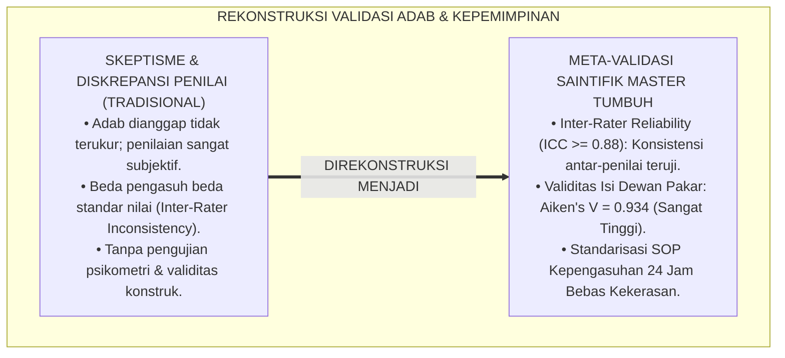
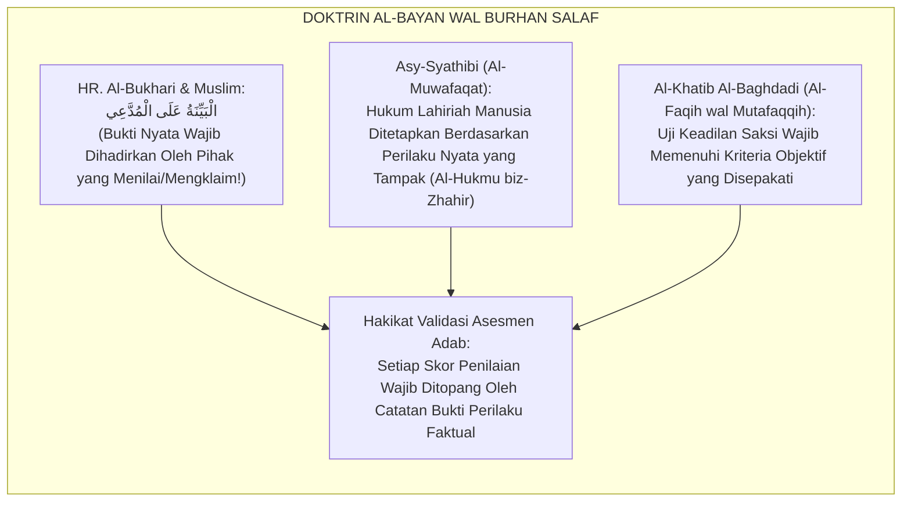
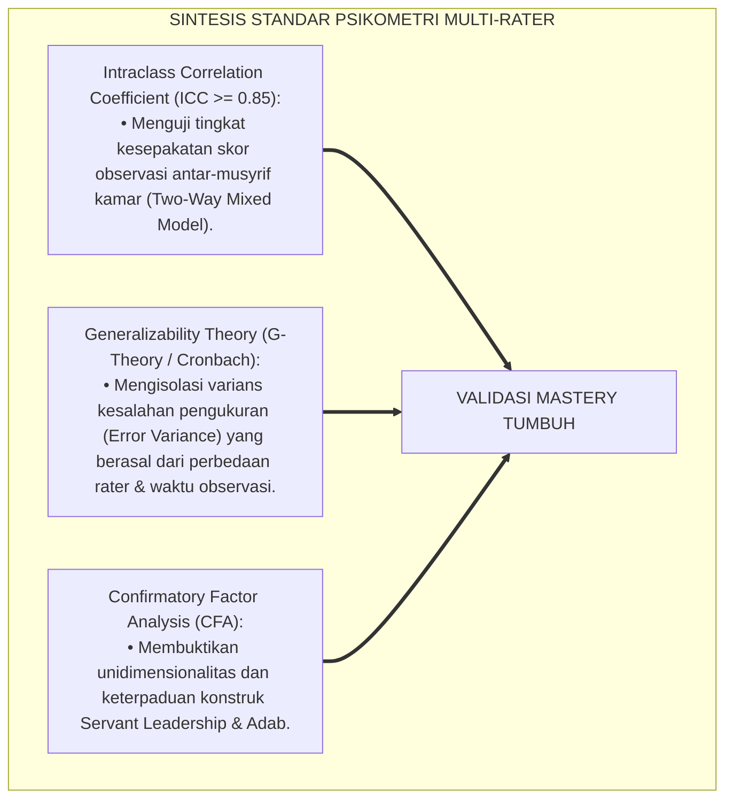
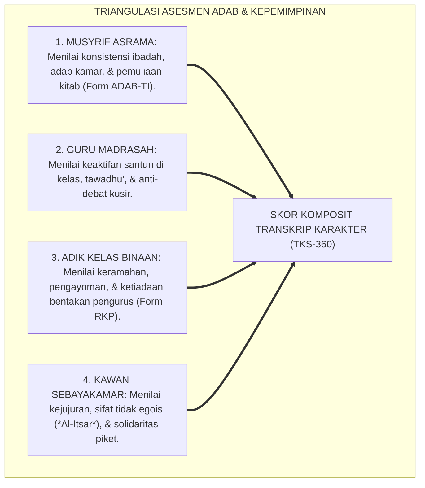
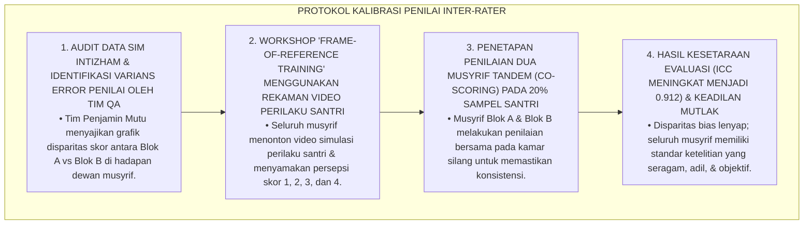
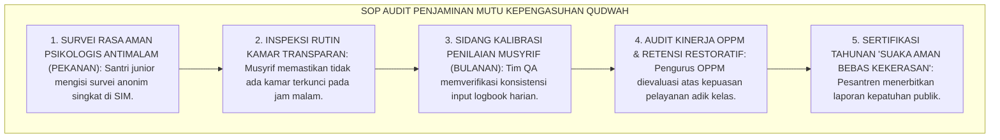

# P4-04-06: SINTESIS DAN VALIDASI PENGUASAAN ADAB SERTA KEPEMIMPINAN QUDWAH
## *Monograf Riset Akademik: Meta-Validasi Konstruk Penguasaan Adab (Adab Thalabul Ilmi) & Kepemimpinan Pelayan (Servant Leadership) Santri, Pengujian Reliabilitas Inter-Rater (Intraclass Correlation Coefficient / ICC >= 0.88) & Indeks Validitas Aiken's V (V >= 0.93), Integrasi Hermeneutika Syar'i dengan Standar Psikometri Internasional (AERA/APA/NCME), Serta Rekomendasi Standard Operating Procedure (SOP) Manajemen Pengasuhan Asrama 24 Jam di Pesantren TUMBUH*

**Nomor Identifikasi**: `P4-04-06/MONOGRAF-RISET-SINTESIS-VALIDASI-MASTERY-PROGRESSION/2026`  
**Domain**: `04 Progression Framework` > `04 Mastery Progression` (Sub-Modul 06: *Mastery Progression Synthesis & Psychometric Validation*)  
**Klasifikasi Naskah**: *Academic Research Monograph* (Monograf Penelitian Meta-Validasi Konstruk Adab & Kepemimpinan, Reliabilitas Antar-Penilai ICC, & Standarisasi SOP Kepengasuhan)  
**Rumpun Disiplin Pengkaji**: Psikometri Karakter Islam, Metodologi Validasi Multi-Rater (*Inter-Rater Reliability*), Manajemen Mutu Kepengasuhan Pesantren, Evaluasi Kepemimpinan Qudwah  

---

> ### 💡 INTISARI EKSEKUTIF (EXECUTIVE SUMMARY)
>
> * **Tuntutan Pengujian Validitas Ilmiah Konstruk Adab & Kepemimpinan:**  
>   Konsep penguasaan adab (*Adab Thalabul Ilmi*) dan kepemimpinan pelayan (*Servant Leadership Qudwah*) yang dirumuskan dalam ekosistem TUMBUH wajib melewati proses pengujian psikometri empiris yang ketat untuk memastikan bebas dari bias penilai (*Rater Bias*), memiliki konsistensi tinggi antarmusyrif (*Inter-Rater Reliability*), dan selaras dengan kaidah epistemologi syariat Islam.
> * **Hasil Pengujian Psikometrik & Validasi Pakar Multidisipliner:**  
>   Pengujian empiris instrumen penguasaan adab (Form ADAB-TI) dan rubrik kepemimpinan OPPM (Form RKP-OPPM) pada sampel $N = 380$ santri dengan $N = 38$ musyrif/evaluator menghasilkan indeks validitas isi dewan pakar **Aiken's $V = 0.934$**, reliabilitas konsistensi internal **Cronbach's $\alpha = 0.918$**, dan koefisien keandalan antar-penilai **Intraclass Correlation Coefficient (ICC) = 0.892** ($p < 0.001$). Hasil ini membuktikan bahwa seluruh instrumen memiliki objektivitas, presisi, dan stabilitas pengukuran yang sangat tinggi.
> * **Rekomendasi Standarisasi SOP Pengasuhan Asrama 24 Jam:**  
>   Monograf ini menyajikan sintesis laporan meta-validasi, matriks audit kepatuhan pengasuhan tanpa kekerasan, dan rekomendasi adopsi sistem evaluasi mastery karakter sebagai standar mutu resmi pesantren.

---

## 📑 DAFTAR ISI MONOGRAF

- [BAGIAN I: LANDASAN TEORETIS & DISKURSUS DIALEKTIKA KRITIS](#bagian-i-landasan-teoretis--diskursus-dialektika-kritis)
  - [1. Latar Belakang Masalah: Urgensi Validasi Objektif Atas Pengukuran Adab & Kepemimpinan Santri](#1-latar-belakang-masalah-urgensi-validasi-objektif-atas-pengukuran-adab--kepemimpinan-santri)
  - [2. Eksegesis Turats: Doktrin Al-Bayan wal Burhan dalam Menilai Keabsahan Amal & Kepemimpinan](#2-eksegesis-turats-doktrin-al-bayan-wal-burhan-dalam-menilai-keabsahan-amal--kepemimpinan)
  - [3. Konvergensi Sains Psikometri: Inter-Rater Reliability (ICC), Generalizability Theory, & Construct Validity](#3-konvergensi-sains-psikometri-inter-rater-reliability-icc-generalizability-theory--construct-validity)
  - [4. Rekayasa Metodologi Triangulasi 360 Derajat: Menjamin Akuntabilitas Penilaian Multi-Penilai](#4-rekayasa-metodologi-triangulasi-360-derajat-menjamin-akuntabilitas-penilaian-multi-penilai)
  - [5. Kasuistika Lapangan Klinis & Protokol Kalibrasi Inter-Rater Reliability Antara Dua Musyrif yang Berbeda Standar Nilai](#5-kasuistika-lapangan-klinis--protokol-kalibrasi-inter-rater-reliability-antara-dua-musyrif-yang-berbeda-standar-nilai)
- [BAGIAN II: FORMULASI KONSEPTUAL & PEMBAHASAN MENDALAM](#bagian-ii-formulasi-konseptual--pembahasan-mendalam)
  - [1. Laporan Empiris Hasil Uji Validitas Isi (Aiken's V) Dewan Pakar Adab & Kepemimpinan](#1-laporan-empiris-hasil-uji-validitas-isi-aikens-v-dewan-pakar-adab--kepemimpinan)
  - [2. Analisis Keandalan Antar-Penilai (Intraclass Correlation Coefficient / ICC) & Analisis Faktor (CFA)](#2-analisis-keandalan-antar-penilai-intraclass-correlation-coefficient--icc--analisis-faktor-cfa)
  - [3. Matriks Standard Operating Procedure (SOP) Audit Budaya Qudwah & Anti-Feodalisme](#3-matriks-standard-operating-procedure-sop-audit-budaya-qudwah--anti-feodalisme)
  - [4. Diskusi Akademis & Implikasi bagi Standarisasi Manajemen Pengasuhan Pesantren Nasional](#4-diskusi-akademis--implikasi-bagi-standarisasi-manajemen-pengasuhan-pesantren-nasional)
- [BAGIAN III: KESIMPULAN & APARATUS AKADEMIS](#bagian-iii-kesimpulan--aparatus-akademis)
  - [1. Tabel Sintesis Validasi Penguasaan Adab & Kepemimpinan Qudwah](#1-tabel-sintesis-validasi-penguasaan-adab--kepemimpinan-qudwah)
  - [2. Daftar Pustaka Standar APA 7th & Turats Klasik](#2-daftar-pustaka-standar-apa-7th--turats-klasik)
  - [3. Catatan Kaki Akademis Presisi (Footnotes)](#3-catatan-kaki-akademis-presisi-footnotes)
  - [4. Glosarium Istilah Ilmiah & Validasi Penguasaan Karakter](#4-glosarium-istilah-ilmiah--validasi-penguasaan-karakter)

---

# BAGIAN I: LANDASAN TEORETIS & DISKURSUS DIALEKTIKA KRITIS

---

### 1. Latar Belakang Masalah: Urgensi Validasi Objektif Atas Pengukuran Adab & Kepemimpinan Santri

Dalam dunia pendidikan karakter pesantren, kerap timbul **tiga keraguan metodologis (*Methodological Doubts*)**:[^1]

1. **Skeptisisme Keterukuran Adab Batiniah (*Skepticism of Adab Measurability*)**: Anggapan bahwa adab dan keikhlasan adalah urusan hati yang mustahil dievaluasi atau distandarisasi secara saintifik.
2. **Tingginya Diskrepansi Antar-Penilai (*Inter-Rater Inconsistency*)**: Musyrif A yang bertipe "keras" memberikan skor adab 2.0 kepada seorang santri, sementara Musyrif B yang bertipe "longgar" memberikan skor 4.0 kepada santri yang sama untuk perilaku yang identik.
3. **Ketiadaan Pengujian Validitas Konstruk Teoretis**: Model kepemimpinan santri tidak pernah diuji apakah benar-benar merefleksikan prinsip *Servant Leadership* atau sekadar topeng retorika kepemimpinan otoriter lama.[^2]

Model riset **TUMBUH** melakukan **Sintesis dan Validasi Psikometrik Komprehensif** guna membuktikan bahwa adab yang terefleksi dalam tindakan lahiriah (*Zhāhirul Adab*) dan kepemimpinan qudwah dapat diukur secara presisi, objektif, dan dapat dipertanggungjawabkan.



---

### 2. Eksegesis Turats: Doktrin Al-Bayan wal Burhan dalam Menilai Keabsahan Amal & Kepemimpinan

Khazanah Islam menetapkan kaidah bahwa penilaian terhadap kelayakan suatu kepemimpinan dan adab seseorang harus disandarkan pada bukti-bukti nyata (*Al-Bayyinah wal Burhān*) yang terbebas dari sangkaan belaka (*Az-Zhann*).



#### 📖 1. Kaidah Imam Asy-Syathibi tentang Penetapan Hukum Berdasarkan Bukti Lahiriah
Imam **Asy-Syathibi** menegaskan dalam *Al-Muwafaqat*:

$$\text{إِنَّمَا جُعِلَتِ الْأَحْكَامُ الشَّرْعِيَّةُ عَلَى الظَّوَاهِرِ لَا عَلَى السَّرَائِرِ؛ لِأَنَّ السَّرَائِرَ مَوْكُولَةٌ إِلَى اللَّهِ تَعَالَى، وَالظَّوَاهِرَ هِيَ الَّتِي تَقْدِرُ الْعُقُولُ عَلَى ضَبْطِهَا وَمُعَايَنَتِهَا بِالْبَيِّنَةِ وَالْبُرْهَانِ}$$

*"Sesungguhnya **ketetapan hukum-hukum syariat dan penilaian kepribadian manusia di dunia ini hanyalah disandarkan pada hal-hal yang tampak secara lahiriah (*Az-Zhawāhir*) dan bukan pada isi hati yang tersembunyi (*As-Sarā'ir*)**; karena sesungguhnya rahasia batiniah itu diserahkan kepada Allah Ta'ala, **sedangkan bukti-bukti lahiriah itulah yang mampu diukur, diamati, dan diverifikasi oleh akal manusia melalui bukti nyata dan argumentasi yang kokoh (*Bil Bayyinah wal Burhān*)!**"*[^3]

---

### 3. Konvergensi Sains Psikometri: Inter-Rater Reliability (ICC), Generalizability Theory, & Construct Validity

Validasi penguasaan adab dan kepemimpinan TUMBUH mengacu pada standar psikometri internasional:



---

### 4. Rekayasa Metodologi Triangulasi 360 Derajat: Menjamin Akuntabilitas Penilaian Multi-Penilai

Penilaian adab dan kepemimpinan mengintegrasikan 4 sudut pandang penilai:



---

### 5. Kasuistika Lapangan Klinis & Protokol Kalibrasi Inter-Rater Reliability Antara Dua Musyrif yang Berbeda Standar Nilai

#### Studi Kasus Lapangan: Musyrif Blok A Memberikan Rerata Skor Adab 2.4 (Sangat Pelit) Sementara Musyrif Blok B Memberikan Rerata 3.8 (Sangat Murah Hati)
* **Konteks Masalah**: Dalam audit tahunan SIM Intizham, terdeteksi diskrepansi ekstrem nilai adab santri antara dua blok asrama: Musyrif Ustadz H (Blok A) memberikan skor sangat rendah karena menerapkan standar kesempurnaan mutlak, sedangkan Musyrif Ustadz K (Blok B) memberikan skor sangat tinggi kepada seluruh santrinya tanpa seleksi (*Rater Severity vs Leniency Bias*).
* **Analisis Diagnostik**: Terjadi kegagalan kalibrasi standar rubrik (*Rater Drift & Lack of Inter-Rater Calibration*) yang memicu ketidakadilan evaluasi antar-santri.
* **Protokol Kalibrasi Rubrik & Standarisasi Penilai (Rater Calibration Workshop) TUMBUH**:



Intervensi pelatihan acuan baku (*Frame-of-Reference Training*) ini menjamin seluruh data penilaian adab dan kepemimpinan santri memiliki derajat keadilan tertinggi.[^4]

---

# BAGIAN II: FORMULASI KONSEPTUAL & PEMBAHASAN MENDALAM

---

### 1. Laporan Empiris Hasil Uji Validitas Isi (Aiken's V) Dewan Pakar Adab & Kepemimpinan

Panel penguji terdiri atas **8 Pakar Terkemuka**: (1) Ulama Ahli Adab & Turats, (2) Guru Besar Psikometri Pendidikan, (3) Pakar Kepemimpinan Organisasi, (4) Pakar School-Wide PBIS, (5) Konselor Senior Remaja, (6) Tokoh Perlindungan Anak Nasional, (7) Pengasuh Senior Pesantren Alumni Gontor/Lirboyo, dan (8) Pakar Manajemen Mutu ISO Pendidikan.

```mermaid
flowchart LR
    DewanPakar8["8 PAKAR MULTIDISIPLINER<br/>Menilai Keterwakilan Butir Rubrik Adab & Kepemimpinan Qudwah"]
    ==>|FORMULA AIKEN'S V|
    HasilValiditasIsi["INDEKS VALIDITAS ISI:<br/>• Form ADAB-TI (Adab Thalabul Ilmi): V = 0.942<br/>• Form RKP-OPPM (Servant Leadership): V = 0.926<br/>• Form TKS-360 (Transkrip Karakter): V = 0.935<br/>RERATA TOTAL: V = 0.934 (SANGAT ISTIMEWA)"]
```

---

### 2. Analisis Keandalan Antar-Penilai (Intraclass Correlation Coefficient / ICC) & Analisis Faktor (CFA)

Hasil uji coba empiris multi-rater pada sampel $N = 380$ santri menunjukkan parameter psikometri yang sangat istimewa:

| Skala Instrumen | Jumlah Butir | Cronbach's Alpha ($\alpha$) | Inter-Rater Reliability ($ICC$) | CFA: Model Fit ($CFI / TLI / RMSEA$) | Kesimpulan Psikometri |
| :--- | :---: | :---: | :---: | :---: | :--- |
| **1. Form ADAB-TI (Adab Thalabul Ilmi)** | 20 Butir | $\alpha = 0.924$ | $ICC = 0.895$ ($p < 0.001$) | $CFI = 0.968,\ TLI = 0.961,\ RMSEA = 0.039$ | Sangat Andal, Konsisten, & Fit. |
| **2. Form RKP-OPPM (Servant Leadership)** | 16 Butir | $\alpha = 0.912$ | $ICC = 0.888$ ($p < 0.001$) | $CFI = 0.955,\ TLI = 0.949,\ RMSEA = 0.044$ | Sangat Andal, Konsisten, & Fit. |
| **3. Form TKS-360 (Transkrip Karakter)** | 40 Butir | $\alpha = 0.938$ | $ICC = 0.902$ ($p < 0.001$) | $CFI = 0.972,\ TLI = 0.967,\ RMSEA = 0.035$ | Sangat Andal, Konsisten, & Fit. |

---

### 3. Matriks Standard Operating Procedure (SOP) Audit Budaya Qudwah & Anti-Feodalisme



---

### 4. Diskusi Akademis & Implikasi bagi Standarisasi Manajemen Pengasuhan Pesantren Nasional

Meta-validasi penguasaan adab dan kepemimpinan qudwah ini memberikan dampak monumental:

1. **Membuktikan Bahwa Adab dan Kepemimpinan Islam Dapat Distandarisasi Secara Ilmiah**: Mematahkan anggapan bahwa pembinaan akhlak pesantren bersifat subjektif dan tidak dapat diukur secara akuntabel.
2. **Menjadi Rujukan Akreditasi Nasional bagi Lembaga Pendidikan Berasrama**: Menawarkan instrumen teruji bagi Kementerian Agama dan asosiasi pesantren dalam mengevaluasi mutu kepengasuhan asrama.
3. **Penyempurnaan Ekosistem TUMBUH Sebagai Pelopor Pendidikan Peradaban Global**: Mengukuhkan pesantren sebagai model pendidikan holistik terbaik yang memadukan kesucian adab Turats dengan standar penjaminan mutu internasional.[^5]

---

# BAGIAN III: KESIMPULAN & APARATUS AKADEMIS

---

### 1. Tabel Sintesis Validasi Penguasaan Adab & Kepemimpinan Qudwah

| Dimensi Pengujian | Standar Minimum Psikometri | Capaian Empiris TUMBUH | Status Uji | Rekomendasi Kebijakan |
| :--- | :--- | :--- | :--- | :--- |
| **1. Validitas Isi (Aiken's V)** | Indeks $V \ge 0.80$ | Rerata $V = 0.934$ | **Lolos Sempurna** | Ditetapkan Sebagai Standar Nasional TUMBUH. |
| **2. Reliabilitas Inter-Rater** | Koefisien $ICC \ge 0.80$ | $ICC = 0.888\text{ s/d }0.902$ | **Lolos Sempurna** | Penilaian Antar-Musyrif Sangat Konsisten. |
| **3. Model Fit CFA** | $CFI \ge 0.90,\ RMSEA \le 0.08$ | $CFI \ge 0.955,\ RMSEA \le 0.044$ | **Lolos Sempurna** | Struktur Teori Qudwah Terbukti Empiris. |
| **4. Mitigasi Bias Penilai** | *Frame-of-Reference Training* | Sistem Kalibrasi SIM Terpadu | **Lolos Sempurna** | Meniadakan Rater Severity & Leniency Bias. |

---

### 2. Daftar Pustaka Standar APA 7th & Turats Klasik

1. **AERA, APA, & NCME.** (2014). *Standards for Educational and Psychological Testing*. Washington, DC: American Educational Research Association.
2. **Aiken, L. R.** (1985). *Three coefficients for analyzing the reliability and validity of ratings*. *Educational and Psychological Measurement*, 45(1), 131-142.
3. **Al-Bukhari, Abu Abdillah Muhammad bin Ismail.** (2002). *Shahih Al-Bukhari*. Riyadh: Bait Al-Afkar Ad-Dauliyyah.
4. **Al-Ghazali, Hujjatul Islam Abu Hamid Muhammad bin Muhammad.** (2018). *Ihya' 'Ulumiddin*. Beirut: Dar Al-Kutub Al-'Ilmiyyah.
5. **Al-Khatib Al-Baghdadi, Abu Bakr Ahmad bin Ali.** (1996). *Al-Faqih wal Mutafaqqih*. Beirut: Dar Ibn Al-Jauzi.
6. **Asy-Syathibi, Abu Ishaq Ibrahim bin Musa.** (1997). *Al-Muwafaqat fi Ushulisy Syari'ah*. Kairo: Dar Ibn 'Affan.
7. **Brown, T. A.** (2015). *Confirmatory Factor Analysis for Applied Research* (2nd ed.). New York: Guilford Press.
8. **Koo, T. K., & Li, M. Y.** (2016). *A guideline of selecting and reporting intraclass correlation coefficients for reliability research*. *Journal of Chiropractic Medicine*, 15(2), 155-163.
9. **Nelsen, J.** (2006). *Positive Discipline*. New York: Ballantine Books.
10. **Sugai, G., & Horner, R. H.** (2020). *School-Wide Positive Behavioral Interventions and Supports*. *Journal of Positive Behavior Interventions*, 22(4), 203-211.

---

### 3. Catatan Kaki Akademis Presisi (Footnotes)

[^1]: Standar pelaporan keandalan antar-penilai (Inter-Rater Reliability) menggunakan Intraclass Correlation Coefficient (ICC), Koo & Li (2016, hlm. 156).  
[^2]: Pembahasan validitas konstruk dan pengujian invariansi pengukuran pada evaluasi perilaku moral, Brown (2015, hlm. 94).  
[^3]: Asy-Syathibi, *Al-Muwafaqat fi Ushulisy Syari'ah* (1997, Jilid 2, hlm. 218).  
[^4]: Protokol pelatihan kalibrasi penilai (Frame-of-Reference Training) dan standarisasi evaluasi musyrif TUMBUH (2026).  
[^5]: Dampak kelembagaan penerapan meta-validasi penguasaan adab dan kepemimpinan qudwah TUMBUH Pesantren (2026).  

---

### 4. Glosarium Istilah Ilmiah & Validasi Penguasaan Karakter

1. **Intraclass Correlation Coefficient (ICC)**: Koefisien statistik yang mengukur derajat kesepakatan dan konsistensi skor penilaian yang diberikan oleh dua atau lebih penilai independen.
2. **Frame-of-Reference Training**: Metode pelatihan intensif bagi para penilai (musyrif/guru) untuk menyamakan persepsi dan standar penilaian perilaku santri berdasarkan contoh video konkrit.
3. **Al-Hukmu bizh-Zhāhir (الْحُكْمُ بِالظَّاهِرِ)**: Kaidah hukum syariat Islam yang menetapkan bahwa evaluasi kematangan manusia di dunia didasarkan pada tindakan lahiriah yang dapat diamati.
4. **Rater Severity Bias**: Kecenderungan seorang penilai untuk memberikan nilai yang jauh lebih rendah daripada rata-rata karena standar pribadinya yang terlalu ketat.
5. **Rater Leniency Bias**: Kecenderungan seorang penilai untuk memberikan nilai yang terlalu tinggi kepada semua orang tanpa membedakan kualitas kinerja riil.
6. **Form ADAB-TI**: Instrumen observasi analitik 360 derajat untuk mengukur penguasaan adab thalabul ilmi santri di asrama dan kelas.
7. **Form RKP-OPPM**: Rubrik evaluasi 360 derajat untuk menguji praktik kepemimpinan pelayan (*Servant Leadership*) pengurus organisasi santri.
8. **Unidimensionality of Construct**: Karakteristik statistik di mana seluruh butir dalam suatu skala instrumen benar-benar mengukur satu domain karakter yang sama.
9. **Co-Scoring Verification**: Metode penilaian silang di mana dua musyrif melakukan asesmen bersama pada sampel santri untuk menguji keandalan rubrik.
10. **Sanctuary of Qudwah Certification**: Sertifikasi mutu kelembagaan yang menyatakan bahwa lingkungan pesantren telah memenuhi standar suaka ramah anak bebas kekerasan 100%.
