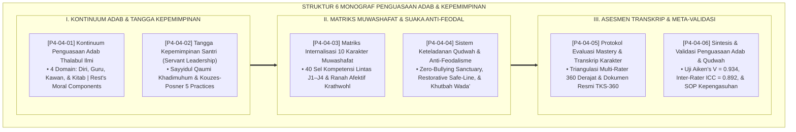

# P4-04: DOKUMEN INDUK PETA PENGUASAAN ADAB DAN KEPEMIMPINAN QUDWAH SANTRI
## *Arsitektur Tangga Kematangan Penguasaan Karakter Santri (Kontinuum Adab Thalabul Ilmi, Tangga Servant Leadership Santri, Matriks Internalisasi 10 Karakter Muwashafat, Sistem Qudwah Anti-Feodalisme, Serta Transkrip Karakter 360 Derajat) di Ekosistem TUMBUH Pesantren*

**Nomor Identifikasi**: `P4-04/DOKUMEN-INDUK-PETA-PENGUASAAN-ADAB-KEPEMIMPINAN/2026`  
**Domain**: `04 Progression Framework` > `04 Mastery Progression` (Gugus Sub-Domain 04: *Adab & Exemplary Leadership Mastery Progression*)  
**Klasifikasi Naskah**: *Master Architecture & Navigation Monograph* (Dokumen Induk Peta Jalan Riset & Navigasi 6 Monograf Ilmiah Penguasaan Adab & Kepemimpinan)  
**Rumpun Disiplin Pengkaji**: Epistemologi Adab Islam & Ta'dibiyyah, Kepemimpinan Pelayan (*Servant Leadership*), Taksonomi Muwashafat Karakter, Penjaminan Mutu Asesmen Otentik  

---

> ### 💡 INTISARI EKSEKUTIF (EXECUTIVE SUMMARY)
>
> * **Kedudukan Strategis Gugus Peta Penguasaan Adab & Kepemimpinan Qudwah:**  
>   Gugus *Mastery Progression (Progresi Penguasaan Adab & Kepemimpinan)* merupakan mahkota dari seluruh proses pendidikan di ekosistem TUMBUH. Pendidikan pesantren pada hakikatnya adalah penanaman adab (*Ta'dīb*) dan kaderisasi kepemimpinan kenabian (*Al-Khilāfah wa Ri'āyatul Ummah*). Gugus ini memetakan bagaimana santri berproses dari pemula yang belajar sopan santun lahiriah, menaiki tangga kematangan afektif 10 karakter muwashafat, hingga mencapai derajat kepemimpinan pelayan sejati (*Khadimul Ummah*) yang memimpin dengan keteladanan fisik paling depan (*Qudwah Hasanah*) dan bebas dari feodalisme.
> * **Integrasi Holistik Turats & Konsensus Sains Kepemimpinan:**  
>   Gugus riset ini memadukan karya-karya adab dan siyasah para ulama salaf (*Tadzkiratus Sami'* Ibnu Jama'ah, *Ta'limul Muta'allim* Az-Zarnuji, dan *Al-Ahkam As-Sulthaniyyah* Al-Mawardi) dengan sains kepemimpinan dan evaluasi moral modern (*Greenleaf's Servant Leadership, Kouzes-Posner's Leadership Challenge, Krathwohl's Affective Taxonomy, Rest's Moral Components, dan Edmondson's Psychological Safety*).
> * **Struktur Lengkap 6 Berkas Monograf Riset Ilmiah:**  
>   Dokumen induk ini memetakan dan menghubungkan 6 berkas monograf penelitian akademik komprehensif (~165 KB total riset) yang menyajikan panduan adab majelis, kurikulum kaderisasi kepemimpinan OPPM, matriks 40 sel 10 karakter muwashafat, suaka bebas perundungan, dan format resmi dokumen *Transkrip Karakter Santri (TKS-360)*.

---

## 📑 PETA NAVIGASI ENAM MONOGRAF RISET PENGUASAAN ADAB & KEPEMIMPINAN

Berikut adalah daftar lengkap 6 monograf riset akademik dalam gugus **`04 Mastery Progression`**:

---

## 📚 DESKRIPSI RINGKAS 6 BERKAS MONOGRAF

1. **[P4-04-01: Kontinuum Penguasaan Adab Thalabul Ilmi](file:///c:/xampp/htdocs/tumbuh/04%20Progression%20Framework/04%20Mastery%20Progression/P4-04-01-Kontinuum-Penguasaan-Adab-Thalabul-Ilmi.md)**  
   *Membahas evolusi adab penuntut ilmu sepanjang Jenjang J1–J4, Four-Component Moral Model James Rest, Ta'dzimul Ilmi Az-Zarnuji, pemuliaan sarana kitab, dan eliminasi kesombongan intelektual.*
2. **[P4-04-02: Tangga Kepemimpinan Santri (Servant Leadership)](file:///c:/xampp/htdocs/tumbuh/04%20Progression%20Framework/04%20Mastery%20Progression/P4-04-02-Tangga-Kepemimpinan-Santri-Servant-Leadership.md)**  
   *Membahas 4 tangga kepemimpinan santri (Self-Leadership $\rightarrow$ Team Stewardship $\rightarrow$ Mentorship $\rightarrow$ Servant Leader OPPM), Sayyidul Qaumi Khadimuhum, The Leadership Challenge Kouzes-Posner, dan rubrik evaluasi 360 (Form RKP-OPPM).*
3. **[P4-04-03: Matriks Internalisasi 10 Karakter Muwashafat](file:///c:/xampp/htdocs/tumbuh/04%20Progression%20Framework/04%20Mastery%20Progression/P4-04-03-Matriks-Internalisasi-10-Karakter-Muwashafat.md)**  
   *Membahas dekomposisi 10 karakter muwashafat ke dalam 40 sel kompetensi operasional J1–J4, Ranah Afektif David Krathwohl (Receiving $\rightarrow$ Characterization), dan desain Transkrip Karakter Santri.*
4. **[P4-04-04: Sistem Keteladanan Qudwah dan Anti-Feodalisme](file:///c:/xampp/htdocs/tumbuh/04%20Progression%20Framework/04%20Mastery%20Progression/P4-04-04-Sistem-Keteladanan-Qudwah-dan-Anti-Feodalisme.md)**  
   *Membahas eradikasi mutlak budaya feodal/senioritas kekerasan di asrama, doktrin kesetaraan Khutbah Wada', Psychological Safety Amy Edmondson, patroli hotspots rawan, dan Restorative Safe-Line QR.*
5. **[P4-04-05: Protokol Evaluasi Mastery dan Transkrip Karakter](file:///c:/xampp/htdocs/tumbuh/04%20Progression%20Framework/04%20Mastery%20Progression/P4-04-05-Protokol-Evaluasi-Mastery-dan-Transkrip-Karakter.md)**  
   *Membahas asesmen otentik mastery karakter, triangulasi 360 derajat (Diri, Sebaya, Musyrif, dan Sidang Capstone), dokumen resmi Form TKS-360 penyerta ijazah, dan prosedur banding nilai (Due Process).*
6. **[P4-04-06: Sintesis dan Validasi Penguasaan Adab serta Kepemimpinan Qudwah](file:///c:/xampp/htdocs/tumbuh/04%20Progression%20Framework/04%20Mastery%20Progression/P4-04-06-Sintesis-dan-Validasi-Mastery-Progression.md)**  
   *Membahas meta-validasi psikometri instrumen adab dan kepemimpinan, indeks validitas isi Aiken's V = 0.934, keandalan antar-penilai Inter-Rater ICC = 0.892, analisis faktor CFA, dan standarisasi SOP pengasuhan.*

---

## 🎯 STANDAR PENJAMINAN MUTU PENGUASAAN ADAB & KEPEMIMPINAN

Penerapan gugus **Peta Penguasaan Adab dan Kepemimpinan Qudwah (Mastery Progression)** menjamin bahwa:
1. **Adab Mengakar Sebagai Identitas Batin (*Internalized Noble Character*)**: Santri memiliki integritas akhlak mulia yang konsisten di mana pun berada, memuliakan ilmu, guru, kawan, dan masyarakat.
2. **Kader Pemimpin Pelayan Peradaban (*Authentic Servant Leaders*)**: Santri memimpin dengan kerendahan hati, membela yang lemah, mengayomi adik kelas, dan menghapus segala bentuk kekerasan feodal.
3. **Akuntabilitas Sertifikasi Karakter Terverifikasi (*Certified Moral Excellence*)**: Setiap lulusan dibekali Transkrip Karakter Santri 360 (TKS-360) resmi yang membuktikan keunggulan kepribadiannya di hadapan dunia pendidikan tinggi dan profesional global.
