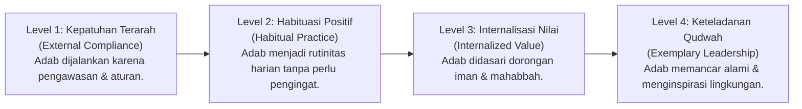
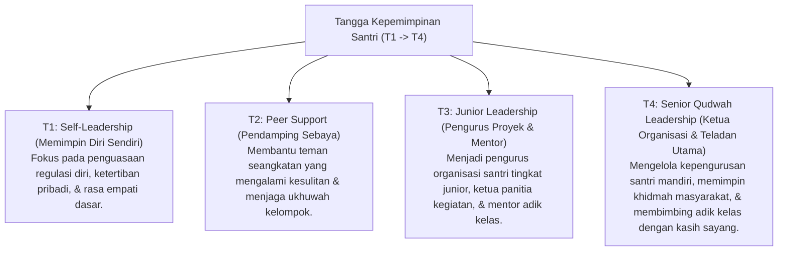

# P4-04: Peta Penguasaan Adab dan Kepemimpinan Qudwah Santri

## Status Dokumen
* **Status**: 🌟 **A+ (Tervalidasi & Siap Diimplementasikan)**
* **Sub-Domain**: `04 Progression Framework / 04 Mastery Progression`
* **Penanggung Jawab Keilmuan**: Dewan Keilmuan TUMBUH (*Pakar Tata Kelola Qudwah & Pakar Psikologi Sosial Santri*)

---

## 1. Matriks Penguasaan Adab (Mastery Continuum)

Penguasaan adab santri berkembang dari kepatuhan eksternal menuju keikhlasan internal yang mendalam:

---

## 2. Tangga Kepemimpinan Santri Bebas Feodalisme (*Servant Leadership*)

Dalam ekosistem **TUMBUH**, kepemimpinan santri didasarkan pada prinsip **Qudwah Hasanah** dan **Servant Leadership** (*Sayyidul Qaumi Khaadimuhum* — Pemimpin suatu kaum adalah pelayan bagi mereka), secara tegas menghapus budaya perpeloncoan, perundungan (*bullying*), atau intimidasi senioritas.

---

## 3. Integrasi 10 Karakter Muwashafat & CASEL SEL dalam Penguasaan

| Karakter TUMBUH | Tingkat T1–T2 (Pondasi) | Tingkat T3–T4 (Penguasaan & Qudwah) |
| :--- | :--- | :--- |
| **Matinul Khuluq** | Menjauhi perkataan kasar; menghormati ustadz & senior. | Resolusi konflik restoratif; menjadi penengah damai saat ada perselisihan. |
| **Mujahadatun Linafsih** | Mampu menahan diri dari pelanggaran disiplin kamar/asrama. | Disiplin diri mandiri tanpa pengawasan; konsisten ibadah malam (Tahajjud). |
| **Haritsun 'Ala Waqtih** | Tepat waktu mengikuti jadwal harian pesantren. | Manajemen waktu produktif; mampu menyeimbangkan hafalan, pelajaran, & organisasi. |
| **Nafi'un Lighairih** | Ikut serta dalam kerja bakti kamar/lingkungan. | Merancang dan mengeksekusi proyek pengabdian masyarakat (*Khidmah Keumatan*). |

---

## 4. Evaluasi Keteladanan Qudwah

1. **Observasi 360-Derajat**: Penilaian keteladanan santri T4 melibatkan masukan dari musyrif, ustadz pengajar, serta umpan balik dari santri adik kelas (*Peer & Junior Feedback*).
2. **Standardisasi Anti-Intimidasi**: Pengurus santri T4 yang terbukti menggunakan tindakan kekerasan fisik, verbal, atau perpeloncoan akan langsung dicabut status kepemimpinannya dan mendapatkan penanganan intervensi pembinaan khusus.
