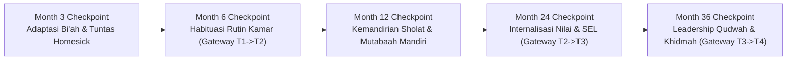

# P4-05-01: Indikator Milestone Perkembangan Berkala Santri (J1–J4)

## Status Dokumen
* **Status**: 🌟 **A+ (Tervalidasi & Siap Diimplementasikan)**
* **Sub-Domain**: `04 Progression Framework / 05 Growth Milestones`
* **Penanggung Jawab Keilmuan**: Dewan Keilmuan TUMBUH (*Pakar Metodologi Riset & Pakar Arsitektur PBIS Restoratif*)

---

## 1. Konseptualisasi Growth Milestones

Growth Milestones adalah titik-titik pemeriksaan berkala (*Checkpoints*) setiap 3, 6, dan 12 bulan untuk memantau apakah progresi perkembangan santri berjalan sesuai trajektori normal atau memerlukan intervensi bimbingan khusus.

---

## 2. Matriks Checkpoint Milestone Perkembangan Santri

| Periode Evaluasi | Milestone Utama (Target Capaian) | Indikator Keberhasilan PBIS | Tindakan Jika Belum Tercapai |
| :--- | :--- | :--- | :--- |
| **Bulan ke-3** | Penyesuaian emosi awal; tuntas kecemasan perpisahan (*homesick*). | Santri tampak ceria, mengikuti rutinitas tanpa menangis/mengurung diri. | Pendampingan konseling empati & *Peer Buddy* T3/T4. |
| **Bulan ke-6 (Gateway T1 $\to$ T2)** | Mandiri dalam kebersihan pribadi & jadwal sholat dasar. | Kerapihan kamar terverifikasi; tidak ada keterlambatan sholat Subuh kronis. | Intervensi Kelompok Kecil *Check-In/Check-Out* (CICO). |
| **Bulan ke-12** | Pembentukan kebiasaan belajar & setoran hafalan konsisten. | Portofolio adab harian stabil; hafalan Qur'an tuntas sesuai target semester. | Remediasi metode belajar & klinik hafalan khusus. |
| **Bulan ke-24 (Gateway T2 $\to$ T3)** | Internalisasi nilai moral & regulasi emosi mandiri (*Mujahadah*). | Mampu menyelesaikan konflik seangkatan secara damai restoratif. | Sesi *Emotional Coaching* oleh Musyrif & Tim BK. |
| **Bulan ke-36 (Gateway T3 $\to$ T4)** | Kematangan kepemimpinan *Qudwah* & kesiapan khidmah keumatan. | Mendapatkan rekomendasi 360-derajat dari musyrif, ustadz, & adik kelas. | Pendampingan kepemimpinan intensif oleh Tim Pengasuhan. |

---

## 3. Dokumentasi Portofolio Milestone Digital

Setiap milestone tercatat dalam **Logbook Digital Santri TUMBUH** yang dapat diakses oleh Musyrif, Ustadz Pengajar, Tim BK, dan dilaporkan secara berkala kepada orang tua santri (*Parent Communication Matrix*).
