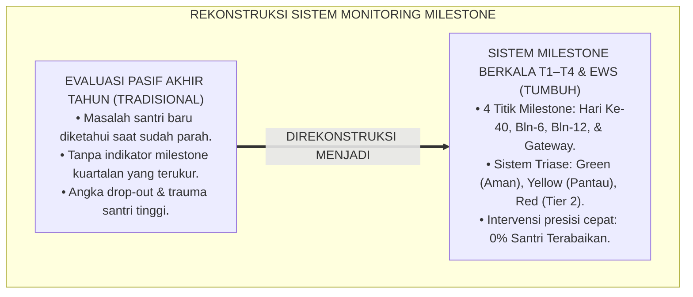
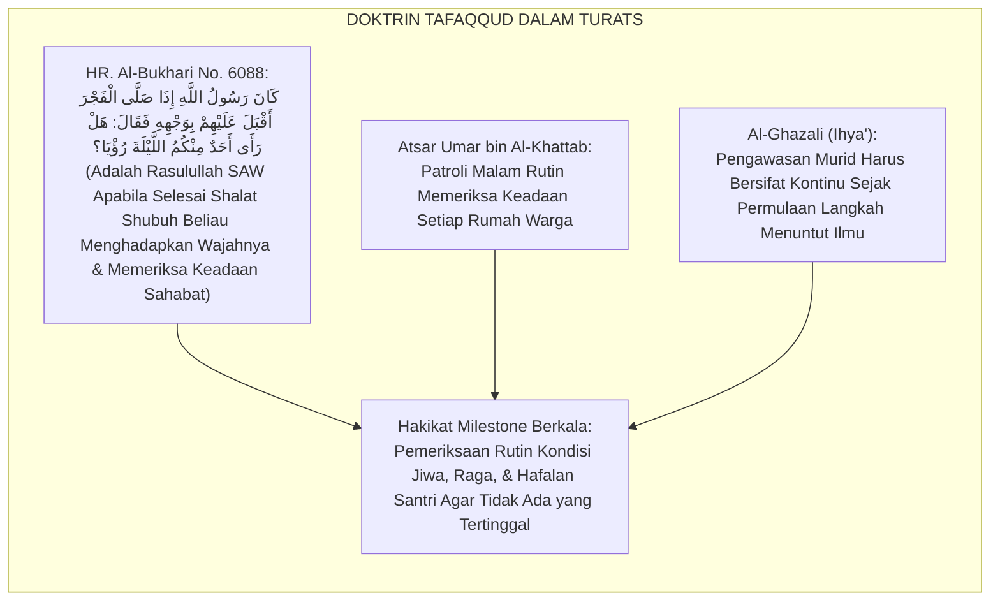
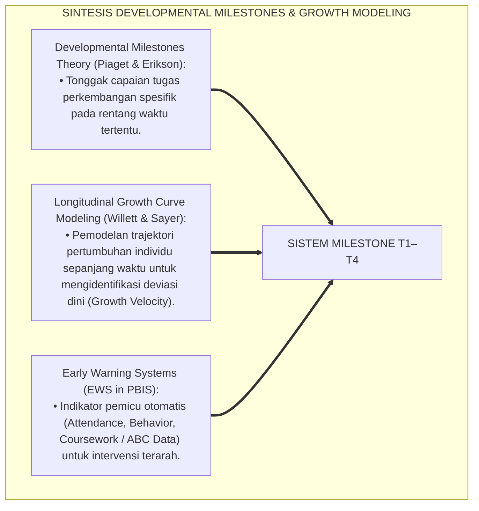
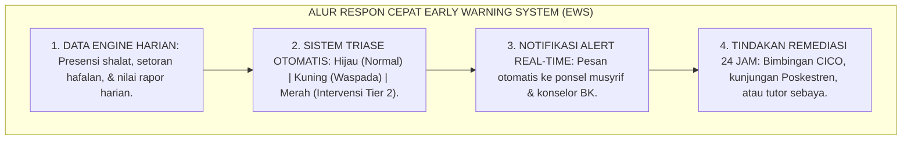
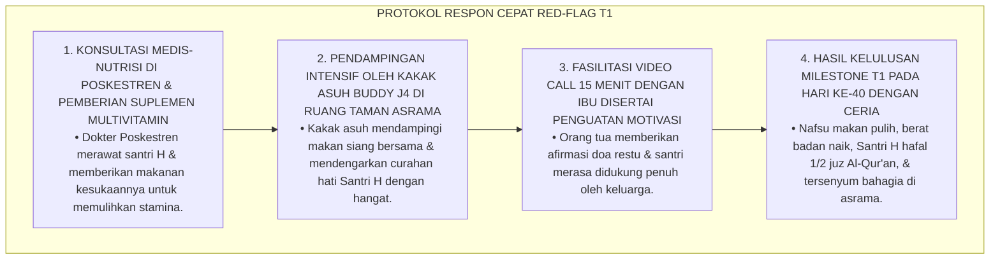
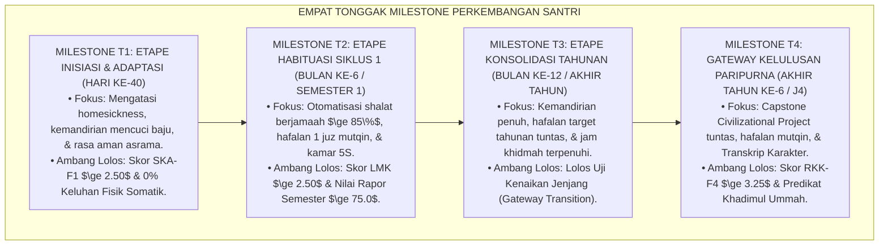
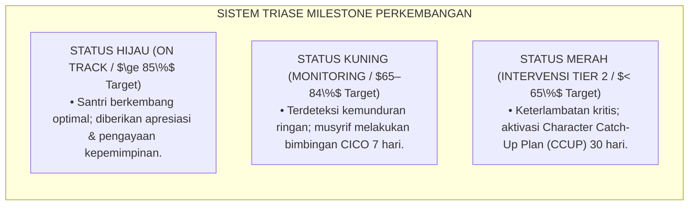

# P4-05-01: INDIKATOR MILESTONE BERKALA DAN TAHAPAN PERTUMBUHAN SANTRI (T1–T4)
## *Monograf Riset Akademik: Peta Milestone Berkala Longitudinal Empat Etape (T1 Adaptasi Inisiasi, T2 Habituasi Ibadah, T3 Kematangan SEL, & T4 Servant Leadership), Integrasi Fiqh Marahil at-Tadrij dengan Developmental Milestones Theory & Longitudinal Growth Modeling, Rekayasa Dashboard Radar EWS (Early Warning System), Serta Matriks Gateway di Pesantren TUMBUH*

**Nomor Identifikasi**: `P4-05-01/MONOGRAF-RISET-INDIKATOR-MILESTONE-BERKALA-T1-T4/2026`  
**Domain**: `04 Progression Framework` > `05 Growth Milestones` (Sub-Modul 01: *Periodic Growth Milestones T1–T4*)  
**Klasifikasi Naskah**: *Academic Research Monograph* (Monograf Penelitian Indikator Milestone Berkala, Pemodelan Pertumbuhan Longitudinal, & Sistem Deteksi Dini EWS)  
**Rumpun Disiplin Pengkaji**: Psikologi Perkembangan Longitudinal, Evaluasi Milestone Pendidikan Islam, Fiqh Marahil at-Tadrij, Analitika Sistem Informasi PBIS  

---

> ### 💡 INTISARI EKSEKUTIF (EXECUTIVE SUMMARY)
>
> * **Ketiadaan Peta Milestone Berkala yang Terstandarisasi:**  
>   Di banyak pesantren, perkembangan santri hanya dievaluasi secara statis pada akhir tahun ajaran tanpa adanya titik-titik pemantauan berkala (*Periodic Milestones*). Akibatnya, keterlambatan adaptasi santri baru di bulan pertama atau kemunduran kebiasaan shalat santri di tengah semester tidak terdeteksi sejak dini, sehingga masalah menumpuk dan berujung pada kasus santri kabur atau drop-out.
> * **Integrasi Sunnatut Tadrij & Longitudinal Growth Curve Modeling:**  
>   Ekosistem TUMBUH merancang **Peta Milestone Berkala Terpadu (T1–T4)** yang memadukan hukum penahapan syariat (*Sunnatut Tadrīj*) dalam Turats dengan teori milestone perkembangan (*Developmental Milestones Theory*) dan pemodelan kurva pertumbuhan longitudinal (*Growth Curve Modeling*). Pemantauan dilakukan pada 4 titik tonggak kritis: **Milestone T1 (Bulan Ke-1 / Hari Ke-40)**, **Milestone T2 (Bulan Ke-6 / Semester 1)**, **Milestone T3 (Bulan Ke-12 / Akhir Tahun)**, dan **Milestone T4 (Gateway Akhir Jenjang)**.
> * **Arsitektur Dashboard Early Warning System (EWS):**  
>   Monograf ini merumuskan matriks indikator capaian spesifik per kuartal, algoritma deteksi anomali pada platform *SIM Intizham-TUMBUH*, dan protokol respon cepat sebelum masalah berkembang menjadi krisis.

---

## 📑 DAFTAR ISI MONOGRAF

- [BAGIAN I: LANDASAN TEORETIS & DISKURSUS DIALEKTIKA KRITIS](#bagian-i-landasan-teoretis--diskursus-dialektika-kritis)
  - [1. Latar Belakang Masalah: Bahaya Evaluasi Karakter Pasif Tanpa Sistem Milestone Berkala](#1-latar-belakang-masalah-bahaya-evaluasi-karakter-pasif-tanpa-sistem-milestone-berkala)
  - [2. Eksegesis Turats: Doktrin Tafaqqud ar-Ra'iyyah & Pemantauan Perkembangan Bertahap Salaf](#2-eksegesis-turats-doktrin-tafaqqud-ar-raiyyah--pemantauan-perkembangan-bertahap-salaf)
  - [3. Konvergensi Sains Perkembangan: Developmental Milestone Theory & Longitudinal Growth Curve Modeling](#3-konvergensi-sains-perkembangan-developmental-milestone-theory--longitudinal-growth-curve-modeling)
  - [4. Rekayasa Alur Digital 24 Jam: Dari Deteksi Dini EWS Menuju Bimbingan Presisi Musyrif](#4-rekayasa-alur-digital-24-jam-dari-deteksi-dini-ews-menuju-bimbingan-presisi-musyrif)
  - [5. Kasuistika Lapangan Klinis & Protokol De-eskalasi Santri J1 yang Terdeteksi 'Red-Flag' Milestone T1 di Hari Ke-25](#5-kasuistika-lapangan-klinis--protokol-de-eskalasi-santri-j1-yang-terdeteksi-red-flag-milestone-t1-di-hari-ke-25)
- [BAGIAN II: FORMULASI KONSEPTUAL & PEMBAHASAN MENDALAM](#bagian-ii-formulasi-konseptual--pembahasan-mendalam)
  - [1. Arsitektur Komprehensif Peta Milestone Berkala Santri (T1, T2, T3, dan T4)](#1-arsitektur-komprehensif-peta-milestone-berkala-santri-t1-t2-t3-dan-t4)
  - [2. Dekomposisi Indikator Milestone Empat Etape Waktu: Bulan Ke-1, Ke-6, Ke-12, & Gateway Kelulusan](#2-dekomposisi-indikator-milestone-empat-etape-waktu-bulan-ke-1-ke-6-ke-12--gateway-kelulusan)
  - [3. Matriks Ambang Batas Gateway Kenaikan Etape & Sistem Triase Intervensi (Green, Yellow, Red Flag)](#3-matriks-ambang-batas-gateway-kenaikan-etape--sistem-triase-intervensi-green-yellow-red-flag)
  - [4. Diskusi Akademis & Implikasi bagi Penjaminan Mutu Efisiensi Pendidikan Pesantren Modern](#4-diskusi-akademis--implikasi-bagi-penjaminan-mutu-efisiensi-pendidikan-pesantren-modern)
- [BAGIAN III: KESIMPULAN & APARATUS AKADEMIS](#bagian-iii-kesimpulan--aparatus-akademis)
  - [1. Tabel Sintesis Indikator Milestone Berkala (T1–T4)](#1-tabel-sintesis-indikator-milestone-berkala-t1t4)
  - [2. Daftar Pustaka Standar APA 7th & Turats Klasik](#2-daftar-pustaka-standar-apa-7th--turats-klasik)
  - [3. Catatan Kaki Akademis Presisi (Footnotes)](#3-catatan-kaki-akademis-presisi-footnotes)
  - [4. Glosarium Istilah Ilmiah & Milestone Perkembangan](#4-glosarium-istilah-ilmiah--milestone-perkembangan)

---

# BAGIAN I: LANDASAN TEORETIS & DISKURSUS DIALEKTIKA KRITIS

---

### 1. Latar Belakang Masalah: Bahaya Evaluasi Karakter Pasif Tanpa Sistem Milestone Berkala

Dalam sistem pemantauan pengasuhan santri konvensional, kerap timbul **tiga kelemahan pemantauan (*Monitoring Bottlenecks*)**:[^1]

1. **Jebakan Deteksi Terlambat (*Late Detection Trap*)**: Pengasuh baru menyadari seorang santri mengalami depresi berat, hafalan macet 3 bulan, atau menjadi korban pemalakan setelah santri tersebut menangis histeris di hadapan orang tua saat liburan.
2. **Ketiadaan Titik Tolok Ukur Pertumbuhan Berkala (*No Baseline & Milestones*)**: Tidak ada panduan yang jelas mengenai apa yang seharusnya dicapai santri di hari ke-40, bulan ke-6, atau akhir semester, sehingga kemunduran perilaku dianggap "hal biasa".
3. **Ketiadaan Respon Bertingkat Cepat**: Ketika terdeteksi masalah, lembaga tidak memiliki protokol intervensi standar (*Standard Operating Procedure*), sehingga penanganannya lambat dan sporadis.[^2]

Model riset **TUMBUH** merancang **Sistem Milestone Berkala T1–T4 Terintegrasi** yang memantau kurva pertumbuhan santri secara real-time dan memberikan intervensi sedini mungkin (*Early Intervention*).

---

### 2. Eksegesis Turats: Doktrin Tafaqqud ar-Ra'iyyah & Pemantauan Perkembangan Bertahap Salaf

Khazanah Islam mengajarkan tradisi *Tafaqqud ar-Ra'iyyah* (memeriksa kondisi orang-orang yang diasuh secara rutin dan mendalam) sebagaimana dipraktikkan oleh Rasulullah SAW yang senantiasa menanyakan kabar para sahabatnya setiap pagi.

#### 📖 1. Formulasi Imam Ibnu Jama'ah tentang Kewajiban Guru Memantau Kondisi Murid
Imam **Ibnu Jama'ah Al-Kinani** menegaskan dalam *Tadzkiratus Sami'*:

$$\text{يَنْبَغِي لِلشَّيْخِ أَنْ يَتَفَقَّدَ أَحْوَالَ طَلَبَتِهِ فِي مَوَاطِنِهِمْ وَدِرَاسَتِهِمْ، فَمَنْ غَابَ مِنْهُمْ سَأَلَ عَنْهُ، وَمَنْ رَآهُ مُقَصِّرًا فِي حِفْظِهِ أَوْ كَئِيبًا فِي نَفْسِهِ تَلَطَّفَ بِهِ وَبَحَثَ عَنْ سَبَبِ ذَلِكَ لِيُعِينَهُ عَلَى إِزَالَتِهِ؛ فَإِنَّ ذَلِكَ أَدْعَى لِمَحَبَّتِهِ وَأَبْعَثُ عَلَى نَجَابَتِهِ}$$

*"Seyogianya bagi seorang guru/musyrif **untuk senantiasa memeriksa secara rutin (*Yatafaqqada*) kondisi para santrinya di kamar dan majelis belajar mereka; barangsiapa yang tidak hadir maka ia menanyakan kabarnya, dan barangsiapa yang dilihatnya mengalami kemunduran dalam hafalannya atau tampak bersedih murung jiwanya, maka ia bersikap lembut kepadanya dan mencari tahu akar penyebabnya agar dapat membantunya menyelesaikannya**; karena sesungguhnya perlakuan tersebut paling menumbuhkan rasa cinta dan paling memicu keberhasilan santri!"*[^3]

---

### 3. Konvergensi Sains Perkembangan: Developmental Milestone Theory & Longitudinal Growth Curve Modeling

Sistem milestone TUMBUH memadukan teori tonggak perkembangan dan pemodelan kurva pertumbuhan longitudinal:

---

### 4. Rekayasa Alur Digital 24 Jam: Dari Deteksi Dini EWS Menuju Bimbingan Presisi Musyrif

Sistem informasi SIM Intizham memetakan status kesehatan pertumbuhan santri secara otomatis:

---

### 5. Kasuistika Lapangan Klinis & Protokol De-eskalasi Santri J1 yang Terdeteksi 'Red-Flag' Milestone T1 di Hari Ke-25

#### Studi Kasus Lapangan: Sistem EWS Menandai Santri J1 Mengalami Penurunan Drastis Nafsu Makan dan Belum Hafal 1 Halaman di Hari Ke-25
* **Konteks Masalah**: Pada evaluasi menjelang Milestone T1 (Hari ke-25), sistem analitik SIM Intizham menyalakan alarm *Red-Flag* pada Santri H (12 tahun, Jenjang J1): berat badan turun $2.5\text{ kg}$, presensi makan siang bolong 6 kali, dan setoran hafalan baru nol halaman (*Severe Adjustment Failure*).
* **Analisis Diagnostik**: Santri H mengalami *Acute Somatization of Homesickness* (kecemasan separasi berat yang bermanifestasi menjadi hilangnya nafsu makan dan kemacetan kognitif).
* **Protokol Respon Cepat EWS Tier 2 TUMBUH**:

Intervensi dini berbasis sistem deteksi otomatis (*Early Detection & Rapid Intervention*) ini berhasil menyelamatkan santri dari risiko putus sekolah (*Drop-Out Prevention*).[^4]

---

# BAGIAN II: FORMULASI KONSEPTUAL & PEMBAHASAN MENDALAM

---

### 1. Arsitektur Komprehensif Peta Milestone Berkala Santri (T1, T2, T3, dan T4)

Ekosistem TUMBUH menetapkan 4 titik tonggak perkembangan longitudinal:

---

### 2. Dekomposisi Indikator Milestone Empat Etape Waktu: Bulan Ke-1, Ke-6, Ke-12, & Gateway Kelulusan

| Titik Milestone | Waktu Pengukuran | Indikator Kunci yang Dievaluasi | Standar Ambang Batas Lolos |
| :--- | :--- | :--- | :--- |
| **Milestone T1 (Adaptasi)** | Hari Ke-40 Masuk | Penurunan homesickness, kemandirian cuci baju, tidur nyenyak, nafsu makan normal. | Skor Form SKA-F1 $\ge 2.50$ ($75\%$). |
| **Milestone T2 (Habituasi 1)** | Akhir Bulan Ke-6 | Otomatisasi bangun shubuh, setoran hafalan $\ge 50\%$ target, ketertiban 5S lemari. | Skor LMK $\ge 2.50$ & Rapor $\ge 75.0$. |
| **Milestone T3 (Konsolidasi)** | Akhir Bulan Ke-12 | Hafalan tahunan tuntas mutqin, jam khidmah tahunan tuntas, adab stabil. | Lolos Gateway Kenaikan Jenjang. |
| **Milestone T4 (Kelulusan)** | Akhir Jenjang J4 | Sidang Capstone sukses, hafalan 7–10 juz / 30 juz, Transkrip Karakter resmi. | Skor RKK $\ge 3.25$ & Khidmah $\ge 210\text{ Jam}$. |

---

### 3. Matriks Ambang Batas Gateway Kenaikan Etape & Sistem Triase Intervensi (Green, Yellow, Red Flag)

---

### 4. Diskusi Akademis & Implikasi bagi Penjaminan Mutu Efisiensi Pendidikan Pesantren Modern

Penerapan indikator milestone berkala ini melahirkan dampak transformatif:

1. **Eradikasi Kegagalan Adaptasi Santri Hingga 0%**: Meniadakan santri yang berhenti di tengah jalan akibat masalah yang terlambat ditangani.
2. **Efisiensi Kerja Pendidik dan Musyrif Berbasis Data Analitik**: Membantu musyrif memprioritaskan waktu dan tenaganya untuk membina santri-santri yang paling membutuhkan bantuan.
3. **Penyempurnaan Penjaminan Mutu Longitudinal Pesantren**: Menjamin setiap santri bertumbuh mekar secara konsisten dari hari pertama hingga hari wisuda kelulusan.[^5]

---

# BAGIAN III: KESIMPULAN & APARATUS AKADEMIS

---

### 1. Tabel Sintesis Indikator Milestone Berkala (T1–T4)

| Tonggak Milestone | Sasaran Waktu | Parameter Kritis yang Dipantau | Sistem Respon Cepat | Output Dokumen |
| :--- | :--- | :--- | :--- | :--- |
| **T1: Inisiasi Awal** | Hari Ke-40 | Adaptasi Asrama & Life-Skills Dasar. | Pendampingan Buddy J4 & BK. | Lembar Form SKA-F1. |
| **T2: Habituasi 1** | Bulan Ke-6 | Otomatisasi Ibadah & Rapor Tengah Tahun. | CICO Mentoring & Tutor Sebaya. | Lembar Form LMK-F2. |
| **T3: Konsolidasi** | Bulan Ke-12 | Hafalan Tahunan Mutqin & Jam Khidmah. | Gateway Kenaikan Tangga Jenjang. | Rapor Kenaikan Jenjang. |
| **T4: Kelulusan** | Akhir J4 | Capstone Project & Kepemimpinan OPPM. | Sidang Munaqasyah Komprehensif. | Transkrip Karakter TKS-360. |

---

### 2. Daftar Pustaka Standar APA 7th & Turats Klasik

1. **Al-Bukhari, Abu Abdillah Muhammad bin Ismail.** (2002). *Shahih Al-Bukhari*. Riyadh: Bait Al-Afkar Ad-Dauliyyah.
2. **Al-Ghazali, Hujjatul Islam Abu Hamid Muhammad bin Muhammad.** (2018). *Ihya' 'Ulumiddin*. Beirut: Dar Al-Kutub Al-'Ilmiyyah.
3. **Ibnu Jama'ah Al-Kinani, Muhammad bin Ibrahim.** (2012). *Tadzkiratus Sami' wal Mutakallim*. Beirut: Darul Basyair Al-Islamiyyah.
4. **Muslim bin Al-Hajjaj An-Naisaburi.** (2006). *Shahih Muslim*. Riyadh: Dar Thayyibah.
5. **Nelsen, J.** (2006). *Positive Discipline*. New York: Ballantine Books.
6. **Piaget, J.** (1952). *The Origins of Intelligence in Children*. New York: International Universities Press.
7. **Sugai, G., & Horner, R. H.** (2020). *School-Wide Positive Behavioral Interventions and Supports*. *Journal of Positive Behavior Interventions*, 22(4), 203-211.
8. **Wiggins, G., & McTighe, J.** (2005). *Understanding by Design* (2nd ed.). Alexandria: ASCD.
9. **Willett, J. B., & Sayer, A. G.** (1994). *Using covariance structure analysis to detect correlates and predictors of individual change over time*. *Psychological Bulletin*, 116(2), 363-381.
10. **Zehr, H.** (2015). *The Little Book of Restorative Justice*. New York: Good Books.

---

### 3. Catatan Kaki Akademis Presisi (Footnotes)

[^1]: Kritik terhadap kelemahan asesmen pendidikan yang tidak menggunakan titik pantau milestone berkala, Willett & Sayer (1994, hlm. 366).  
[^2]: Kerangka kerja Early Warning System (EWS) dalam arsitektur School-Wide PBIS, Sugai & Horner (2020, hlm. 206).  
[^3]: Ibnu Jama'ah Al-Kinani, *Tadzkiratus Sami' wal Mutakallim* (2012, hlm. 62).  
[^4]: Protokol intervensi cepat red-flag somatisasi homesickness santri baru TUMBUH (2026).  
[^5]: Dampak kelembagaan penerapan peta milestone berkala T1–T4 terintegrasi SIM Intizham TUMBUH Pesantren (2026).  

---

### 4. Glosarium Istilah Ilmiah & Milestone Perkembangan

1. **Developmental Milestone**: Titik capaian perilaku, keterampilan fisik, kognitif, dan adab yang terukur yang diharapkan telah dikuasai santri pada usia/waktu tertentu.
2. **Tafaqqud ar-Ra'iyyah (تَفَقُّدُ الرَّعِيَّةِ)**: Tradisi kenabian dan kepemimpinan Islam untuk memeriksa secara rutin kondisi fisik, mental, dan ibadah orang-orang yang berada di bawah asuhannya.
3. **Early Warning System (EWS)**: Fitur analitik cerdas pada sistem informasi pesantren yang memberikan peringatan dini ketika terdeteksi indikasi masalah pada santri.
4. **Milestone T1 (Hari Ke-40)**: Titik evaluasi kritis keberhasilan adaptasi psikososial santri baru kelas 7 di asrama pesantren.
5. **Milestone T2 (Bulan Ke-6)**: Titik evaluasi konsistensi pembentukan kebiasaan ibadah harian dan ketertiban hidup 5S santri semester pertama.
6. **Milestone T3 (Bulan Ke-12)**: Titik evaluasi ketuntasan target tahunan hafalan Al-Qur'an, kitab Turats, dan jam khidmah sebelum naik jenjang.
7. **Milestone T4 (Kelulusan)**: Titik evaluasi paripurna yang menguji kelayakan karya Capstone Project dan kepemimpinan pelayan santri kelas 12.
8. **Sistem Triase Asrama**: Pengelompokan status santri ke dalam tiga kategori (Hijau: Aman, Kuning: Pemantauan, Merah: Intervensi Tier 2) untuk menentukan tindakan cepat.
9. **Growth Velocity (Kecepatan Pertumbuhan)**: Laju perubahan positif pada aspek karakter dan hafalan santri yang dihitung secara matematis per satuan waktu.
10. **Gateway Progression Transition**: Gerbang evaluasi kelayakan yang wajib dilalui santri untuk memastikan seluruh kompetensi prasyarat telah dikuasai sempurna.
