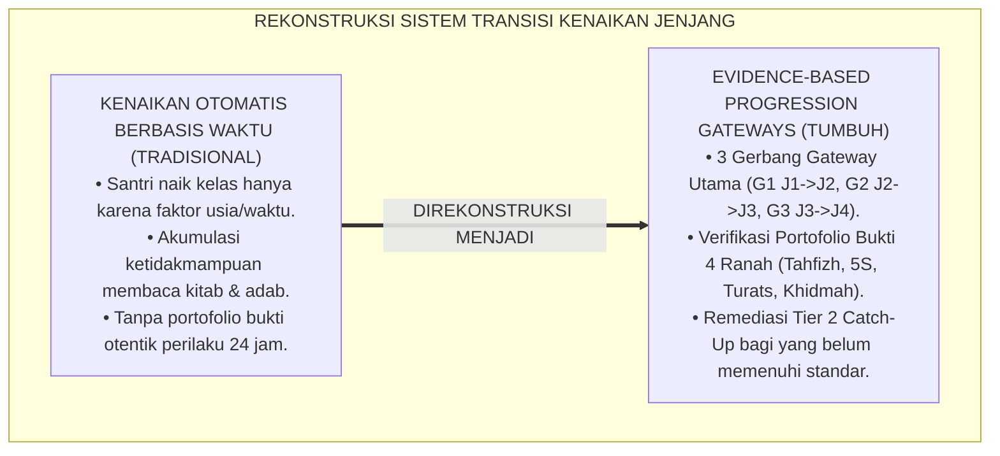
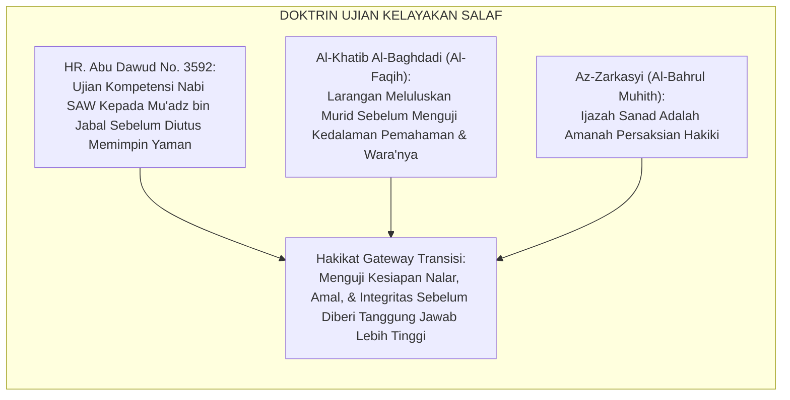
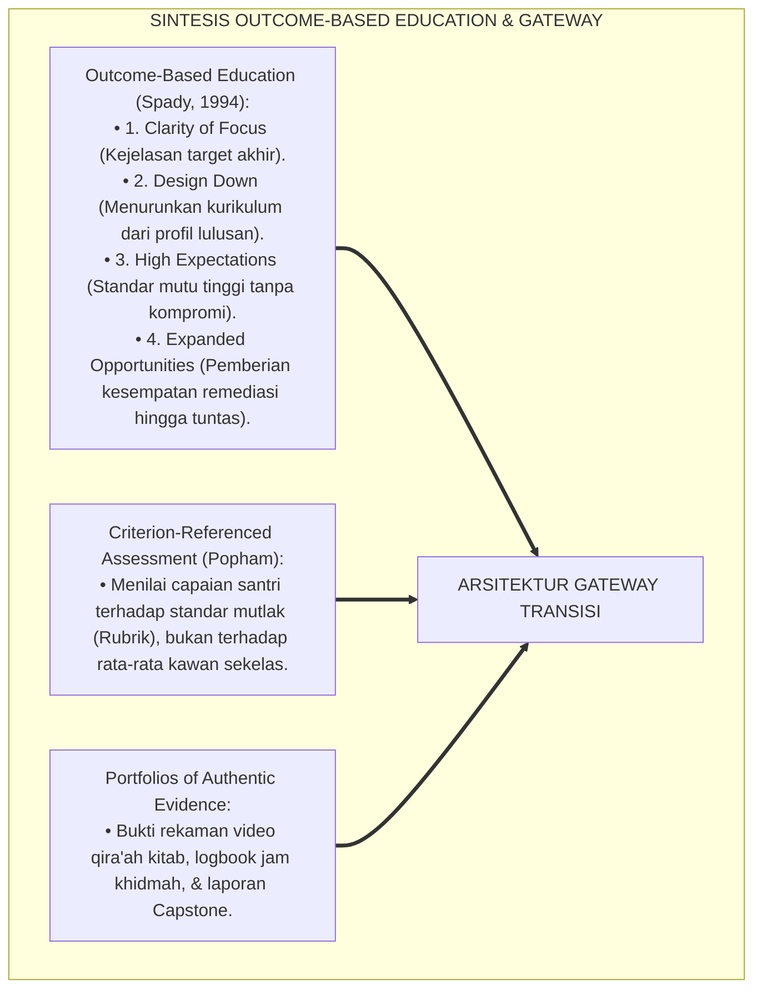
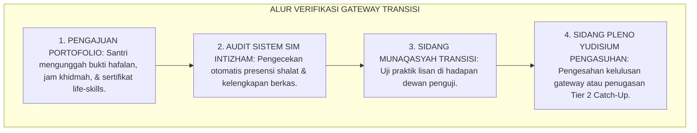
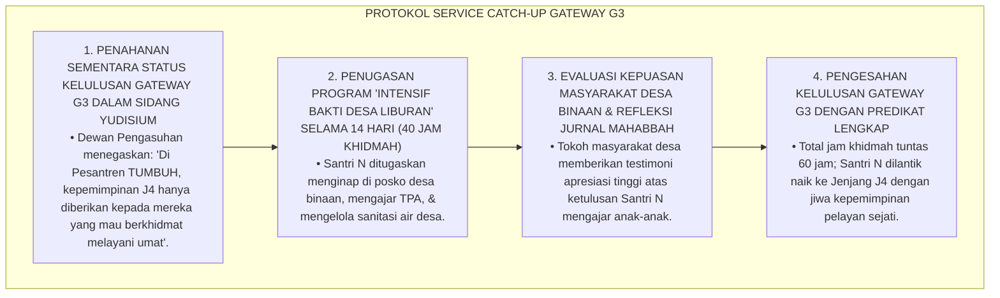
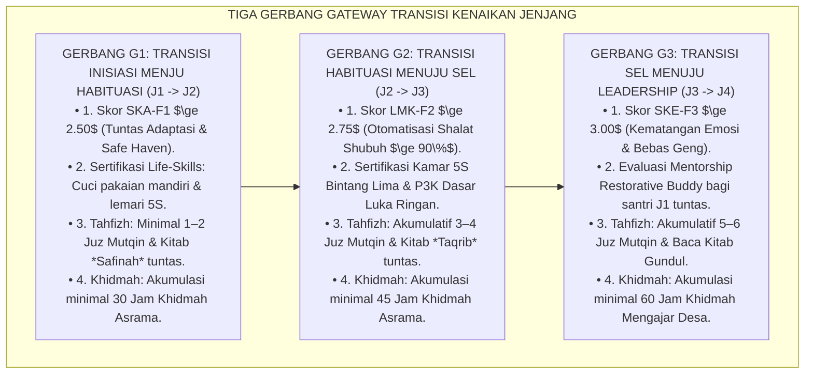
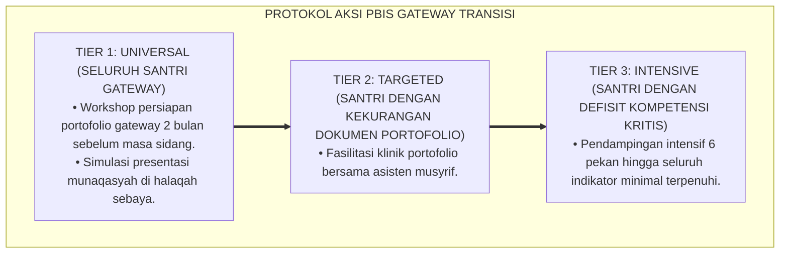

# P4-05-02: ARSITEKTUR EVIDENCE-BASED GATEWAY TRANSISI SANTRI
## *Monograf Riset Akademik: Desain Sistem Ambang Batas Transisi Kenaikan Jenjang Berbasis Bukti Otentik (Evidence-Based Progression Gateways), Integrasi Doktrin Imtihanul Kafa'ah Turats dengan Outcome-Based Education (OBE Framework) & Standardized Performance Portfolios, Eliminasi Kenaikan Otomatis Tanpa Standar, Serta Protokol Yudisium Transisi di Pesantren TUMBUH*

**Nomor Identifikasi**: `P4-05-02/MONOGRAF-RISET-ARSITEKTUR-GATEWAY-TRANSISI/2026`  
**Domain**: `04 Progression Framework` > `05 Growth Milestones` (Sub-Modul 02: *Evidence-Based Transition Gateways Architecture*)  
**Klasifikasi Naskah**: *Academic Research Monograph* (Monograf Penelitian Desain Sistem Gateway Transisi, Evaluasi Outcome-Based Education, & Protokol Penjaminan Mutu Naik Jenjang)  
**Rumpun Disiplin Pengkaji**: Desain Asesmen Outcome-Based Education (OBE), Evaluasi Kenaikan Jenjang Santri, Fiqh Imtihanul Kafa'ah, Standarisasi Mutu Pesantren  

---

> ### 💡 INTISARI EKSEKUTIF (EXECUTIVE SUMMARY)
>
> * **Kelemahan Model Kenaikan Kelas Otomatis (*Social Promotion Trap*):**  
>   Banyak lembaga pendidikan menaikkan santri ke kelas berikutnya secara otomatis semata-mata karena pertimbangan usia atau masa studi (*Time-Based Social Promotion*), tanpa memedulikan apakah santri tersebut sudah menguasai kompetensi dasar (*Mastery*). Akibatnya terjadi akumulasi kebodohan terstruktur: santri kelas 10 belum bisa membaca kitab gundul dan santri kelas 12 belum mandiri shalat shubuh karena tidak pernah ada titik uji kelayakan (*Gateways*) yang tegas.
> * **Integrasi Doktrin Imtihanul Kafa'ah & Outcome-Based Education (OBE):**  
>   Ekosistem TUMBUH merancang **Arsitektur Gateway Transisi Berbasis Bukti (*Evidence-Based Gateways*)** yang memadukan prinsip pengujian kelayakan kompetensi (*Imtihānul Kafā'ah*) dalam Turats para ulama dengan paradigma *Outcome-Based Education (OBE)* William Spady. Kenaikan tangga jenjang (J1 $\rightarrow$ J2 $\rightarrow$ J3 $\rightarrow$ J4 $\rightarrow$ Alumni) mensyaratkan kelulusan portofolio bukti otentik 4 ranah: Ruhiyah/Tahfizh, Fisik/Life-Skills, Kognitif/Turats, dan Sosial/Khidmah.
> * **Protokol Sidang Pleno Yudisium Transisi:**  
>   Monograf ini merumuskan ambang batas skor kuantitatif dan kualitatif setiap gerbang transisi, instrumen rubrik validasi portofolio, dan mekanisme sidang pleno dewan pengasuhan sebelum kenaikan jenjang disahkan secara resmi.

---

## 📑 DAFTAR ISI MONOGRAF

- [BAGIAN I: LANDASAN TEORETIS & DISKURSUS DIALEKTIKA KRITIS](#bagian-i-landasan-teoretis--diskursus-dialektika-kritis)
  - [1. Latar Belakang Masalah: Bahaya Kenaikan Otomatis (Social Promotion) vs Kebutuhan Standar Gateway](#1-latar-belakang-masalah-bahaya-kenaikan-otomatis-social-promotion-vs-kebutuhan-standar-gateway)
  - [2. Eksegesis Turats: Doktrin Imtihanul Kafa'ah & Tradisi Ujian Kelayakan Murid Para Ulama Salaf](#2-eksegesis-turats-doktrin-imtihanul-kafaah--tradisi-ujian-kelayakan-murid-para-ulama-salaf)
  - [3. Konvergensi Sains Evaluasi: Outcome-Based Education (Spady) & Criterion-Referenced Gateway Assessment](#3-konvergensi-sains-evaluasi-outcome-based-education-spady--criterion-referenced-gateway-assessment)
  - [4. Rekayasa Alur Digital 24 Jam: Dari Verifikasi Portofolio Menuju Sidang Pleno Yudisium](#4-rekayasa-alur-digital-24-jam-dari-verifikasi-portofolio-menuju-sidang-pleno-yudisium)
  - [5. Kasuistika Lapangan Klinis & Protokol Sidang Yudisium Santri yang Lolos Akademik Namun Tertahan Syarat Jam Khidmah](#5-kasuistika-lapangan-klinis--protokol-sidang-yudisium-santri-yang-lolos-akademik-namun-tertahan-syarat-jam-khidmah)
- [BAGIAN II: FORMULASI KONSEPTUAL & PEMBAHASAN MENDALAM](#bagian-ii-formulasi-konseptual--pembahasan-mendalam)
  - [1. Arsitektur Komprehensif Tiga Gerbang Gateway Transisi TUMBUH (Gateway G1, G2, dan G3)](#1-arsitektur-komprehensif-tiga-gerbang-gateway-transisi-tumbuh-gateway-g1-g2-dan-g3)
  - [2. Matriks Rincian Persyaratan Bukti Otentik (Artifacts of Evidence) Antar-Gerbang Transisi](#2-matriks-rincian-persyaratan-bukti-otentik-artifacts-of-evidence-antar-gerbang-transisi)
  - [3. Desain Formulir Berita Acara Kelulusan Gateway Transisi (Form BAK-Gateway)](#3-desain-formulir-berita-acara-kelulusan-gateway-transisi-form-bak-gateway)
  - [4. Diskusi Akademis & Implikasi bagi Akuntabilitas Kualitas Lulusan Pesantren Abad 21](#4-diskusi-akademis--implikasi-bagi-akuntabilitas-kualitas-lulusan-pesantren-abad-21)
- [BAGIAN III: KESIMPULAN & APARATUS AKADEMIS](#bagian-iii-kesimpulan--aparatus-akademis)
  - [1. Tabel Sintesis Arsitektur Evidence-Based Gateway Transisi](#1-tabel-sintesis-arsitektur-evidence-based-gateway-transisi)
  - [2. Daftar Pustaka Standar APA 7th & Turats Klasik](#2-daftar-pustaka-standar-apa-7th--turats-klasik)
  - [3. Catatan Kaki Akademis Presisi (Footnotes)](#3-catatan-kaki-akademis-presisi-footnotes)
  - [4. Glosarium Istilah Ilmiah & Gateway Transisi](#4-glosarium-istilah-ilmiah--gateway-transisi)

---

# BAGIAN I: LANDASAN TEORETIS & DISKURSUS DIALEKTIKA KRITIS

---

### 1. Latar Belakang Masalah: Bahaya Kenaikan Otomatis (Social Promotion) vs Kebutuhan Standar Gateway

Dalam sistem persekolahan konvensional, kerap timbul **tiga jebakan kenaikan kelas tanpa kompetensi (*Progression Pitfalls*)**:[^1]

1. **Jebakan Kenaikan Otomatis (*Social Promotion Trap*)**: Santri dinaikkan ke kelas berikutnya hanya agar tidak malu dengan teman sebayanya, mengabaikan fakta bahwa santri tersebut belum bisa membaca Al-Qur'an dengan benar atau belum mandiri mencuci baju.
2. **Ketiadaan Portofolio Bukti Otentik**: Penentuan kenaikan hanya didasarkan pada nilai rata-rata ujian tulis yang mudah dicontek, tanpa memverifikasi bukti perilaku nyata di asrama 24 jam.
3. **Ketiadaan Konsekuensi Perbaikan yang Terarah**: Santri yang belum kompeten dibiarkan menumpuk ketertinggalannya hingga akhirnya gagal total saat menghadapi ujian akhir kelulusan.[^2]

Model riset **TUMBUH** merancang **Arsitektur Evidence-Based Gateway Transisi** yang menetapkan gerbang evaluasi ketat dan transparan, memastikan setiap santri yang melangkah ke jenjang berikutnya benar-benar memiliki kesiapan fitrah yang kokoh.



---

### 2. Eksegesis Turats: Doktrin Imtihanul Kafa'ah & Tradisi Ujian Kelayakan Murid Para Ulama Salaf

Para ulama salafush shalih tidak pernah memberikan sanad atau memajukan seorang murid ke tingkat kajian berikutnya sebelum murid tersebut lulus dalam ujian kelayakan kompetensi (*Imtihānul Kafā'ah*).



#### 📖 1. Dialog Nabi SAW Menguji Kompetensi Mu'adz bin Jabal RA
Diriwayatkan dalam *Sunan Abi Dawud*:

$$\text{أَنَّ رَسُولَ اللَّهِ صَلَّى اللَّهُ عَلَيْهِ وَسَلَّمَ لَمَّا أَرَادَ أَنْ يَبْعَثَ مُعَاذًا إِلَى الْيَمَنِ قَالَ: كَيْفَ تَقْضِي إِذَا عَرَضَ لَكَ قَضَاءٌ؟ قَالَ: أَقْضِي بِكِتَابِ اللَّهِ، قَالَ: فَإِنْ لَمْ تَجِدْ فِي كِتَابِ اللَّهِ؟ قَالَ: فَبِسُنَّةِ رَسُولِ اللَّهِ، قَالَ: فَإِنْ لَمْ تَجِدْ فِي سُنَّةِ رَسُولِ اللَّهِ؟ قَالَ: أَجْتَهِدُ رَأْيِي وَلَا آلُو؛ فَضَرَبَ رَسُولُ اللَّهِ صَدْرَهُ وَقَالَ: الْحَمْدُ لِلَّهِ الَّذِي وَفَّقَ رَسُولَ رَسُولِ اللَّهِ لِمَا يُرْضِي رَسُولَ اللَّهِ}$$

*"Bahwasanya ketika Rasulullah SAW hendak mengutus Mu'adz bin Jabal ke Yaman, beliau menguji kompetensinya dengan bertanya: **'Bagaimana engkau akan memutuskan perkara jika diajukan kepadamu suatu masalah hukum?'** Mu'adz menjawab: 'Aku akan memutuskan dengan Kitabullah (Al-Qur'an).' Rasulullah bertanya: **'Jika engkau tidak mendapatinya di dalam Kitabullah?'** Mu'adz menjawab: 'Maka dengan Sunnah Rasulullah.' Rasulullah bertanya: **'Jika engkau tidak mendapatinya di dalam Sunnah Rasulullah?'** Mu'adz menjawab: 'Aku akan berijtihad dengan nalarku secara sungguh-sungguh tanpa lalai!' Maka Rasulullah SAW menepuk dada Mu'adz dan bersabda: **'Segala puji bagi Allah yang telah memberikan taufiq kepada utusan Rasulullah menuju apa yang diridhai oleh Rasulullah!'**"* (HR. Abu Dawud No. 3592 & At-Tirmidzi No. 1327).[^3]

---

### 3. Konvergensi Sains Evaluasi: Outcome-Based Education (Spady) & Criterion-Referenced Gateway Assessment

Sistem gateway TUMBUH memadukan prinsip *Outcome-Based Education* William Spady dan asesmen berbasis kriteria patokan:



---

### 4. Rekayasa Alur Digital 24 Jam: Dari Verifikasi Portofolio Menuju Sidang Pleno Yudisium

Proses verifikasi gateway berlangsung secara digital dan terstruktur pada platform SIM Intizham:



---

### 5. Kasuistika Lapangan Klinis & Protokol Sidang Yudisium Santri yang Lolos Akademik Namun Tertahan Syarat Jam Khidmah

#### Studi Kasus Lapangan: Santri J3 Nilai Akademik 92.0 Tertahan Naik Jenjang Karena Jam Khidmah Baru 20 Jam dari Syarat 60 Jam
* **Konteks Masalah**: Santri N (16 tahun, Jenjang J3, ranking 1 paralel) memenuhi seluruh syarat nilai madrasah dan tahfizh mutqin untuk naik ke Jenjang J4 (Leadership). Namun dalam audit Gateway G3, logbook jam khidmahnya baru tercatat 20 jam dari batas minimal 60 jam karena ia sering mangkir dari program Ekspedisi Mengajar TPA Desa dengan alasan fokus belajar pribadi (*Intellectual Individualism & Service Avoidance*).
* **Analisis Diagnostik**: Santri N mengalami *Individualistic Achievement Trap* (menganggap prestasi akademik kognitif dapat menggantikan kewajiban kemanfaatan sosial bagi umat).
* **Protokol Remediasi Jam Khidmah Liburan (Service Catch-Up) TUMBUH**:



Intervensi penegakan standar gateway tanpa kompromi (*High Expectations with Expanded Opportunities*) ini berhasil menanamkan karakter pengabdian yang kokoh pada diri santri.[^4]

---

# BAGIAN II: FORMULASI KONSEPTUAL & PEMBAHASAN MENDALAM

---

### 1. Arsitektur Komprehensif Tiga Gerbang Gateway Transisi TUMBUH (Gateway G1, G2, dan G3)

Ekosistem TUMBUH menetapkan tiga gerbang transisi berjenjang:



---

### 2. Matriks Rincian Persyaratan Bukti Otentik (Artifacts of Evidence) Antar-Gerbang Transisi

| Gerbang Transisi | Ranah Ruhiyah & Tahfizh | Ranah Fisik & Life-Skills | Ranah Kognitif & Turats | Ranah Sosial & Khidmah |
| :--- | :--- | :--- | :--- | :--- |
| **Gateway G1<br/>(J1 $\rightarrow$ J2)** | Hafalan 1–2 juz mutqin, presensi shalat berjamaah $\ge 95\%$. | Uji praktik cuci pakaian bersih, menjemur rapi, lemari 5S. | Rapor kelas 7 $\ge 75.0$, baca matan *Jurumiyyah* terharakat. | Logbook khidmah $\ge 30\text{ jam}$, 0% kasus perundungan kawan. |
| **Gateway G2<br/>(J2 $\rightarrow$ J3)** | Hafalan akumulatif 3–4 juz, bangun shubuh mandiri $\ge 90\%$. | Inspeksi 5S kamar konsisten, sertifikat P3K luka Poskestren. | Rapor kelas 8 $\ge 78.0$, membaca hadits *Arbain* gundul dasar. | Logbook khidmah $\ge 45\text{ jam}$, piket dapur umum tuntas. |
| **Gateway G3<br/>(J3 $\rightarrow$ J4)** | Hafalan akumulatif 5–6 juz, qiyamullail rutin, puasa sunnah. | Kebugaran bela diri/panahan, sanitasi 5S tanpa pengawas. | Rapor kelas 10 $\ge 80.0$, qira'ah kitab *Fathul Qarib* gundul. | Logbook khidmah $\ge 60\text{ jam}$, mentor adik asuh J1 tuntas. |

---

### 3. Desain Formulir Berita Acara Kelulusan Gateway Transisi (Form BAK-Gateway)

```text
====================================================================================================
           BERITA ACARA KELULUSAN GATEWAY TRANSISI JENJANG (FORM BAK-GATEWAY)
               EKOSISTEM TUMBUH PESANTREN — SIDANG PLENO DEWAN PENGASUHAN
====================================================================================================
Nama Santri     : ___________________________    Nomor Induk Santri: ____________________
Gerbang Gateway : [ ] G1 (J1 -> J2)   [ ] G2 (J2 -> J3)   [ ] G3 (J3 -> J4)
Tanggal Sidang  : ___________________________    Musyrif Kamar     : ____________________

----------------------------------------------------------------------------------------------------
NO  VERIFIKASI PERSYARATAN BUKTI OTENTIK (EVIDENCE)     STATUS (LOLOS / BELUM)  CATATAN PENGUJI
----------------------------------------------------------------------------------------------------
1   Ranah Ruhiyah: Target Tahfizh Mutqin & Presensi      [ LOLOS / BELUM ]       ___________________
2   Ranah Fisik  : Standar 5S Kamar & Sertifikasi P3K    [ LOLOS / BELUM ]       ___________________
3   Ranah Kognisi: Nilai Rapor & Qira'ah Kitab Turats    [ LOLOS / BELUM ]       ___________________
4   Ranah Sosial : Akumulasi Logbook Jam Khidmah         [ LOLOS / BELUM ]       ___________________
----------------------------------------------------------------------------------------------------
KEPUTUSAN SIDANG PLENO YUDISIUM:
[ ] MEMENUHI SYARAT (RESMI NAIK KE JENJANG BERIKUTNYA)
[ ] DITUNDA — WAJIB MENGIKUTI PROGRAM CHARACTER CATCH-UP TIER 2 (DURASI: _____ HARI)

Ketua Dewan Pengasuhan: _______________________    Kepala Madrasah: ______________________________
====================================================================================================
```

---

### 4. Diskusi Akademis & Implikasi bagi Akuntabilitas Kualitas Lulusan Pesantren Abad 21

Penerapan arsitektur evidence-based gateway transisi menghadirkan keunggulan sistemik:

1. **Menghapus Total Budaya Titipan Nilai dan Kompromi Mutu**: Memastikan setiap sertifikat kenaikan jenjang memiliki integritas data yang teruji secara otentik.
2. **Memberikan Kepastian Standar Kompetensi Bagi Orang Tua dan Pemangku Kepentingan**: Menjamin wali santri bahwa anak mereka benar-benar mengalami pertumbuhan karakter nyata.
3. **Penyempurnaan Pesantren Sebagai Pusat Pendidikan Berbasis Mutu Paripurna**: Mengukuhkan ekosistem TUMBUH sebagai pionir pendidikan Islam yang menggabungkan adab syariat dengan akuntabilitas OBE modern.[^5]

---

---

### 3. Pembedahan Deskriptif Arsitektur Evidence-Based Gateway Transisi

Gateway transisi dirancang sebagai gerbang penjaminan mutu berbasis bukti autentik (*Evidence-Based Gateway*):

#### A. Pilar 1: Portofolio Bukti Multi-Modal (Multi-Modal Evidence)
Gateway tidak didasarkan pada selera subjektif penguji, melainkan pada akumulasi bukti autentik: rekaman video tasmi' Al-Qur'an, logbook jam khidmah terverifikasi, lembar mutaba'ah 66 hari, dan artefak karya tulis.

#### B. Pilar 2: Sidang Asesmen Berkeadilan & Non-Diskriminatif
Proses telaah berkas dilakukan oleh dewan penguji yang independen, menggunakan rubrik standar baku TUMBUH yang transparan dan dapat diakses oleh santri dan wali santri.

#### C. Pilar 3: Umpan Balik Kualitatif Konstruktif (Constructive Feedforward)
Setiap santri menerima lembar rekomendasi pengembangan diri yang merinci area kekuatan (*Strengths*) dan area yang perlu ditingkatkan (*Growth Areas*).

---

### 4. Protokol Aksi Operasional PBIS Multi-Tier Gateway Transisi



---

# BAGIAN III: KESIMPULAN & APARATUS AKADEMIS

---

### 1. Tabel Sintesis Arsitektur Evidence-Based Gateway Transisi

| Gerbang Gateway | Titik Transisi | Syarat Utama yang Diverifikasi | Konsekuensi Jika Belum Lolos | Output Dokumen |
| :--- | :--- | :--- | :--- | :--- |
| **Gateway G1** | J1 $\rightarrow$ J2 | Adaptasi Tuntas, Life-Skills, 1–2 Juz, 30 Jam Khidmah. | *Catch-Up Bootcamp 30 Hari*. | Form BAK-G1 Disahkan. |
| **Gateway G2** | J2 $\rightarrow$ J3 | Otomatisasi Ibadah, 5S & P3K, 3–4 Juz, 45 Jam Khidmah. | *Habituation Reset 30 Hari*. | Form BAK-G2 Disahkan. |
| **Gateway G3** | J3 $\rightarrow$ J4 | Kematangan SEL, Kitab Gundul, 5–6 Juz, 60 Jam Khidmah. | *Service Catch-Up 14 Hari*. | Form BAK-G3 Disahkan. |

---

### 2. Daftar Pustaka Standar APA 7th & Turats Klasik

1. **Abu Dawud As-Sijistani, Sulaiman bin Al-Asy'ats.** (2009). *Sunan Abi Dawud*. Beirut: Dar Ar-Risalah Al-'Alamiyyah.
2. **Al-Bukhari, Abu Abdillah Muhammad bin Ismail.** (2002). *Shahih Al-Bukhari*. Riyadh: Bait Al-Afkar Ad-Dauliyyah.
3. **Al-Khatib Al-Baghdadi, Abu Bakr Ahmad bin Ali.** (1996). *Al-Faqih wal Mutafaqqih*. Beirut: Dar Ibn Al-Jauzi.
4. **Az-Zarkasyi, Badruddin Muhammad bin Abdillah.** (2000). *Al-Bahrul Muhith fi Ushulil Fiqh*. Kairo: Darush Shafwah.
5. **Nelsen, J.** (2006). *Positive Discipline*. New York: Ballantine Books.
6. **Popham, W. J.** (2014). *Criterion-Referenced Measurement*. Englewood Cliffs: Prentice-Hall.
7. **Spady, W. G.** (1994). *Outcome-Based Education: Critical Issues and Answers*. Arlington: American Association of School Administrators.
8. **Sugai, G., & Horner, R. H.** (2020). *School-Wide Positive Behavioral Interventions and Supports*. *Journal of Positive Behavior Interventions*, 22(4), 203-211.
9. **Wiggins, G., & McTighe, J.** (2005). *Understanding by Design*. Alexandria: ASCD.
10. **Zehr, H.** (2015). *The Little Book of Restorative Justice*. New York: Good Books.

---

### 3. Catatan Kaki Akademis Presisi (Footnotes)

[^1]: Kritik terhadap kegagalan model social promotion tanpa asesmen berbasis bukti otentik, Spady (1994, hlm. 28).  
[^2]: Kerangka kerja Criterion-Referenced Gateway Assessment dalam pendidikan profesional, Popham (2014, hlm. 64).  
[^3]: HR. Abu Dawud dalam *Sunan Abi Dawud* (No. 3592), Kitab *Al-Aqdhiyah*.  
[^4]: Protokol penanganan keterlambatan jam khidmah dan bimbingan service catch-up santri TUMBUH (2026).  
[^5]: Dampak kelembagaan penerapan arsitektur evidence-based gateway transisi TUMBUH Pesantren (2026).  

---

### 4. Glosarium Istilah Ilmiah & Gateway Transisi

1. **Evidence-Based Progression Gateway**: Titik evaluasi kelayakan kenaikan jenjang yang mensyaratkan bukti portofolio otentik 4 ranah (ruhiyah, fisik, kognitif, dan sosial).
2. **Social Promotion**: Praktik menaikkan siswa secara otomatis semata-mata berdasarkan usia atau waktu belajar tanpa mempertimbangkan penguasaan kompetensi riil.
3. **Imtihānul Kafā'ah (امْتِحَانُ الْكَفَاءَةِ)**: Tradisi pengujian kelayakan kapasitas ilmu dan integritas adab murid oleh ulama salaf sebelum dinaikkan derajat keilmuannya.
4. **Artifacts of Evidence (Bukti Otentik)**: Dokumen riil berupa rekaman setoran tahfizh, transkrip nilai, sertifikat life-skills, dan logbook jam khidmah.
5. **Gateway G1 (Inisiasi $\rightarrow$ Habituasi)**: Gerbang transisi dari kelas 7 ke kelas 8 yang menguji tuntasnya adaptasi asrama, kemandirian mencuci baju, dan 1–2 juz hafalan.
6. **Gateway G2 (Habituasi $\rightarrow$ SEL)**: Gerbang transisi dari kelas 8 ke kelas 9 yang menguji otomatisasi ibadah mandiri, standar 5S kamar, dan sertifikasi P3K.
7. **Gateway G3 (SEL $\rightarrow$ Leadership)**: Gerbang transisi dari kelas 10 ke kelas 11 yang menguji kematangan emosi, qira'ah kitab gundul, dan kepemimpinan khidmah desa.
8. **Form BAK-Gateway**: Berita acara resmi sidang pleno dewan pengasuhan yang mengesahkan kenaikan jenjang santri atau menetapkan program catch-up.
9. **Expanded Opportunities**: Prinsip OBE di mana santri yang belum memenuhi syarat gateway diberikan waktu dan pendampingan tambahan untuk menyusul ketertinggalannya.
10. **Sidang Pleno Yudisium Pengasuhan**: Forum musyawarah resmi dewan kyai, kepala asrama, konselor BK, dan guru madrasah untuk memverifikasi kelulusan gateway santri.
