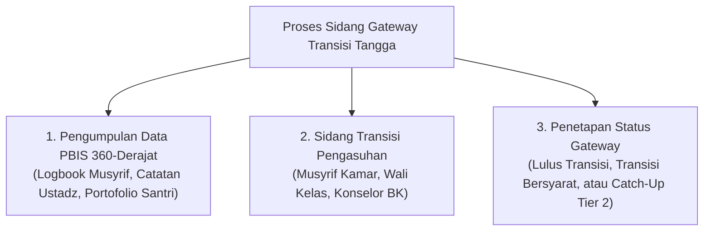

# P4-05-02: Arsitektur Evidence-Based Gateway Transisi Tangga

## Status Dokumen
* **Status**: 🌟 **A+ (Tervalidasi & Siap Diimplementasikan)**
* **Sub-Domain**: `04 Progression Framework / 05 Growth Milestones`
* **Penanggung Jawab Keilmuan**: Dewan Keilmuan TUMBUH (*Pakar Metodologi Riset & Pakar Arsitektur PBIS Restoratif*)

---

## 1. Konseptualisasi Evidence-Based Gateway

Evidence-Based Gateway adalah mekanisme pintu transisi kenaikan tangga santri (misal dari T1 ke T2, atau T2 ke T3) yang wajib didasarkan pada **bukti data objektif komprehensif**, menghapus praktek kenaikan tangga otomatis tanpa evaluasi atau keputusan subjektif pendidik semata.

---

## 2. Kriteria Bukti Transisi per Jenjang Tangga

| Pintu Transisi | Persyaratan Data Objektif (Evidence Threshold) | Instrumen Verifikasi |
| :--- | :--- | :--- |
| **Gateway T1 $\to$ T2** | • Skor Portofolio Adab Kamar $\ge$ 75%. • Bebas dari homesickness kronis. • Tingkat kehadiran sholat Subuh berjamaah $\ge$ 90%. | Logbook Digital Musyrif & Laporan Konseling BK. |
| **Gateway T2 $\to$ T3** | • Skor Portofolio Adab Kamar & Kelas $\ge$ 80%. • Target hafalan semester tuntas teruji mutqin. • Mengisi jurnal mutabaah mandiri secara konsisten. | Triangulasi Musyrif-Ustadz & Ujian Tasmi' 1 Juz. |
| **Gateway T3 $\to$ T4** | • Skor Portofolio Adab & SEL $\ge$ 85%. • Mampu memediasi konflik sebaya secara restoratif. • Rekomendasi keteladanan 360-derajat dari adik kelas & guru. | Survei Keteladanan 360-Derajat & Portofolio Kepemimpinan. |

---

## 3. Alur Keputusan Sidang Transisi Tangga

1. **Status 1: Lulus Transisi Penuh**: Santri secara resmi naik ke tangga berikutnya dan berhak menerima hak otonomi baru.
2. **Status 2: Transisi Bersyarat**: Santri naik tangga dengan pendampingan fokus pada 1 indikator spesifik yang masih butuh penguatan selama 2-4 minggu.
3. **Status 3: Penundaan Transisi & Program Catch-Up**: Santri mendapatkan pendampingan intervensi kelompok kecil PBIS Tier 2 hingga siap direvaluasi.
