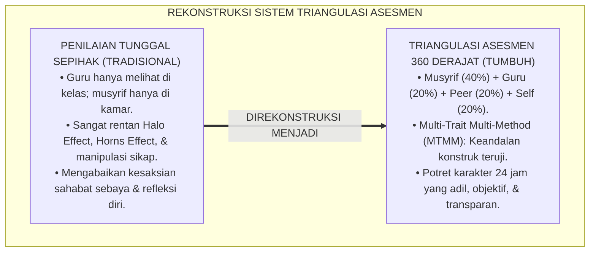
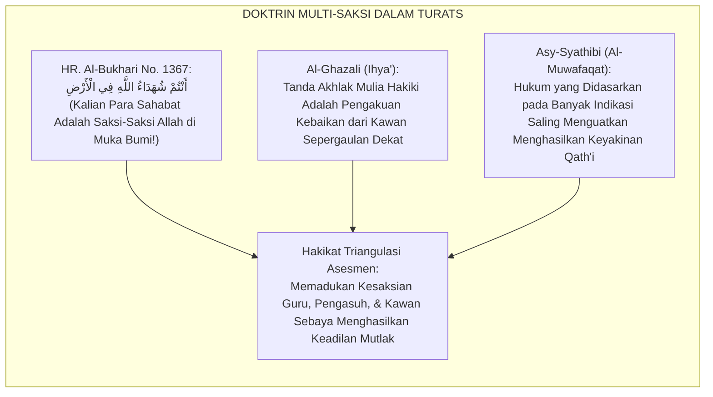
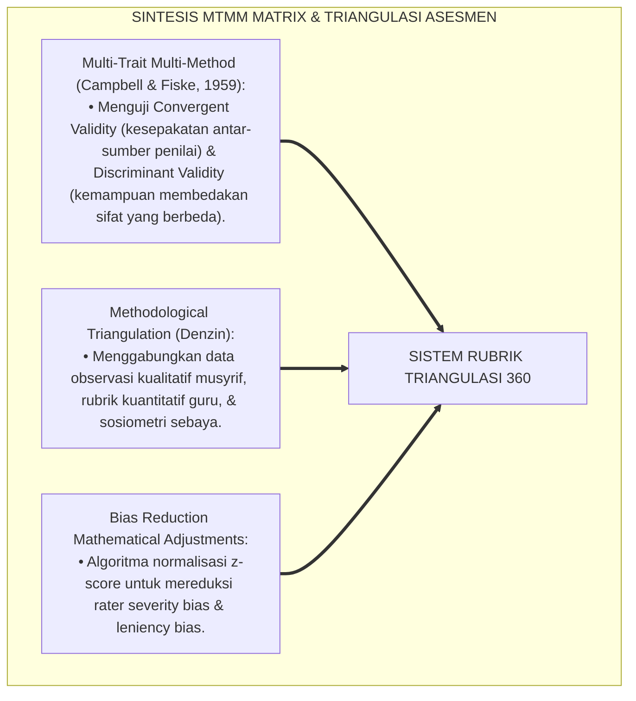
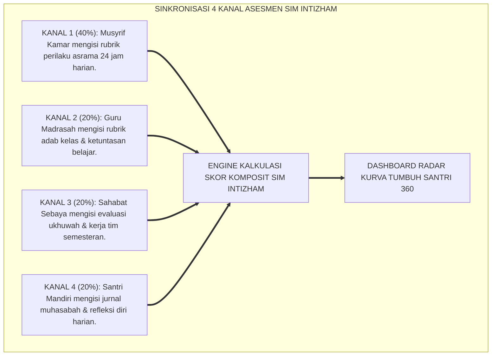
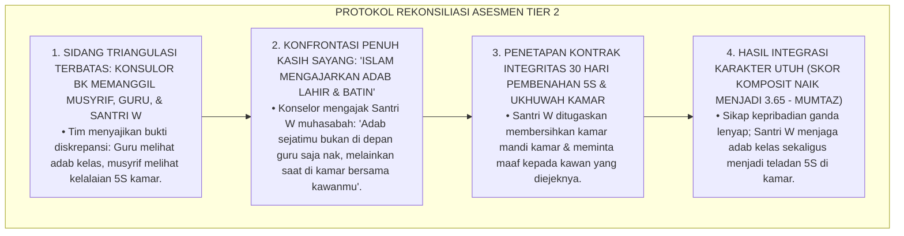
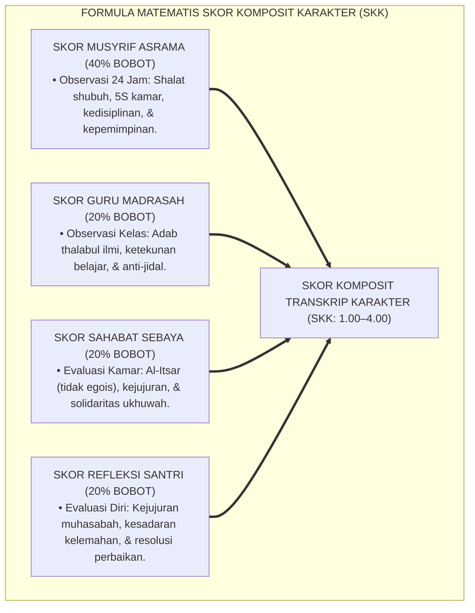
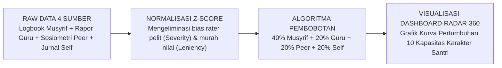

# P4-05-03: RUBRIK TRIANGULASI ASESMEN MUSYRIF, GURU, DAN SANTRI
## *Monograf Riset Akademik: Metodologi Triangulasi Data Asesmen Karakter 360 Derajat (Musyrif Asrama, Guru Madrasah, Peer Review Sebaya, & Refleksi Diri Santri), Eliminasi Bias Observasi (Halo Effect, Leniency Bias, & Social Desirability), Integrasi Fiqh Syahadatut Tawatsul dengan Multi-Trait Multi-Method Matrix (Campbell & Fiske), Serta Kodifikasi Paket Rubrik Terpadu di Pesantren TUMBUH*

**Nomor Identifikasi**: `P4-05-03/MONOGRAF-RISET-RUBRIK-TRIANGULASI-ASESMEN/2026`  
**Domain**: `04 Progression Framework` > `05 Growth Milestones` (Sub-Modul 03: *Triangulated Multi-Rater Assessment Rubric*)  
**Klasifikasi Naskah**: *Academic Research Monograph* (Monograf Penelitian Desain Rubrik Triangulasi Asesmen, Psikometri Multi-Trait Multi-Method, & Eliminasi Bias Penilai)  
**Rumpun Disiplin Pengkaji**: Psikometri & Metodologi Asesmen Karakter, Multi-Trait Multi-Method (MTMM), Fiqh Syahadatut Tawatsul, Desain Rubrik Perilaku PBIS  

---

> ### 💡 INTISARI EKSEKUTIF (EXECUTIVE SUMMARY)
>
> * **Kelemahan Penilaian Karakter Sumber Tunggal (*Single-Source Vulnerability*):**  
>   Menilai akhlak dan adab santri hanya dari satu sumber penilai (misalnya hanya dari catatan musyrif kamar atau hanya dari rapor guru madrasah) memiliki bias kesalahan yang sangat besar. Musyrif hanya melihat santri di lingkungan asrama, guru hanya melihat santri di ruang kelas, sementara dinamika sosial sesungguhnya kerap tersembunyi di antara interaksi antarteman sebaya (*Peer Dynamics*).
> * **Integrasi Syahadatut Tawatsul Turats & Multi-Trait Multi-Method Matrix (Campbell & Fiske):**  
>   Ekosistem TUMBUH merancang **Sistem Rubrik Triangulasi Asesmen Karakter 360 Derajat** yang memadukan kaidah kesaksian saling menguatkan (*Tawātsul asy-Syuhūd*) dalam khazanah Fiqh Islam dengan matriks *Multi-Trait Multi-Method (MTMM)* Donald Campbell & Donald Fiske. Skor capaian karakter dikompositkan dari 4 sumber independen: (1) Musyrif Asrama ($40\%$), (2) Guru Madrasah ($20\%$), (3) Sima'an Sahabat Sebaya ($20\%$), dan (4) Refleksi Diri Santri ($20\%$).
> * **Kodifikasi Master Rubrik Triangulasi TUMBUH:**  
>   Monograf ini menyajikan seluruh format rubrik analitik deskriptif, pedoman operasional penskoran objektif, dan algoritma pembobotan otomatis pada sistem informasi *SIM Intizham-TUMBUH*.

---

## 📑 DAFTAR ISI MONOGRAF

- [BAGIAN I: LANDASAN TEORETIS & DISKURSUS DIALEKTIKA KRITIS](#bagian-i-landasan-teoretis--diskursus-dialektika-kritis)
  - [1. Latar Belakang Masalah: Bahaya Asesmen Sumber Tunggal & Ilusi Penilaian Sempurna](#1-latar-belakang-masalah-bahaya-asesmen-sumber-tunggal--ilusi-penilaian-sempurna)
  - [2. Eksegesis Turats: Doktrin Tawatsul asy-Syuhud & Kaidah Al-Khabar al-Mutawatir dalam Penilaian Karakter](#2-eksegesis-turats-doktrin-tawatsul-asy-syuhud--kaidah-al-khabar-al-mutawatir-dalam-penilaian-karakter)
  - [3. Konvergensi Sains Psikometri: Multi-Trait Multi-Method (MTMM) Matrix (Campbell & Fiske) & Triangulation Theory](#3-konvergensi-sains-psikometri-multi-trait-multi-method-mtmm-matrix-campbell--fiske--triangulation-theory)
  - [4. Rekayasa Alur Pengumpulan Data 24 Jam: Sinkronisasi Lintas Divisi Kepengasuhan & Akademik](#4-rekayasa-alur-pengumpulan-data-24-jam-sinkronisasi-lintas-divisi-kepengasuhan--akademik)
  - [5. Kasuistika Lapangan Klinis & Protokol Rekonsiliasi Diskrepansi Skor Antara Musyrif (Nilai Rendah) dan Guru Madrasah (Nilai Tinggi)](#5-kasuistika-lapangan-klinis--protokol-rekonsiliasi-diskrepansi-skor-antara-musyrif-nilai-rendah-dan-guru-madrasah-nilai-tinggi)
- [BAGIAN II: FORMULASI KONSEPTUAL & PEMBAHASAN MENDALAM](#bagian-ii-formulasi-konseptual--pembahasan-mendalam)
  - [1. Arsitektur Komprehensif Rubrik Triangulasi Asesmen Karakter TUMBUH (Model 360 Derajat)](#1-arsitektur-komprehensif-rubrik-triangulasi-asesmen-karakter-tumbuh-model-360-derajat)
  - [2. Dekomposisi Empat Instrumen Rubrik Triangulasi: Form Musyrif, Form Guru, Form Peer, & Form Self](#2-dekomposisi-empat-instrumen-rubrik-triangulasi-form-musyrif-form-guru-form-peer--form-self)
  - [3. Desain Formula Algoritma Pembobotan Komposit Karakter SIM Intizham](#3-desain-formula-algoritma-pembobotan-komposit-karakter-sim-intizham)
  - [4. Diskusi Akademis & Implikasi bagi Objektivitas dan Keadilan Evaluasi Karakter Pesantren](#4-diskusi-akademis--implikasi-bagi-objektivitas-dan-keadilan-evaluasi-karakter-pesantren)
- [BAGIAN III: KESIMPULAN & APARATUS AKADEMIS](#bagian-iii-kesimpulan--aparatus-akademis)
  - [1. Tabel Sintesis Rubrik Triangulasi Asesmen Karakter](#1-tabel-sintesis-rubrik-triangulasi-asesmen-karakter)
  - [2. Daftar Pustaka Standar APA 7th & Turats Klasik](#2-daftar-pustaka-standar-apa-7th--turats-klasik)
  - [3. Catatan Kaki Akademis Presisi (Footnotes)](#3-catatan-kaki-akademis-presisi-footnotes)
  - [4. Glosarium Istilah Ilmiah & Triangulasi Asesmen](#4-glosarium-istilah-ilmiah--triangulasi-asesmen)

---

# BAGIAN I: LANDASAN TEORETIS & DISKURSUS DIALEKTIKA KRITIS

---

### 1. Latar Belakang Masalah: Bahaya Asesmen Sumber Tunggal & Ilusi Penilaian Sempurna

Dalam praktik evaluasi karakter santri di pesantren konvensional, kerap terjadi **tiga distorsi penilaian sumber tunggal (*Single-Rater Biases*)**:[^1]

1. **Jebakan Efek Topeng Kelas (*The Classroom Mask Effect*)**: Santri yang bersikap sangat pendiam dan sopan di dalam kelas madrasah kerap dinilai memiliki akhlak sempurna oleh guru, padahal di asrama ia suka membully kawan sekamar atau menolak piket kebersihan.
2. **Jebakan Konflik Personal Musyrif (*Musyrif-Student Friction Bias*)**: Musyrif yang sedang kesal terhadap seorang santri cenderung memberikan nilai akhlak buruk pada seluruh ranah karakter santri tersebut (*Horns Effect*).
3. **Ketiadaan Suara Kawan Sebaya & Diri Sendiri**: Penilaian mengabaikan ulasan jujur dari sahabat sekamar yang hidup 24 jam bersama santri serta mengabaikan suara kejujuran refleksi diri santri itu sendiri.[^2]

Model riset **TUMBUH** merancang **Sistem Rubrik Triangulasi Asesmen Karakter 360 Derajat** yang mengintegrasikan multi-sumber penilai untuk menghasilkan potret akhlak santri yang utuh, adil, dan objektif.



---

### 2. Eksegesis Turats: Doktrin Tawatsul asy-Syuhud & Kaidah Al-Khabar al-Mutawatir dalam Penilaian Karakter

Dalam epistemologi Islam, keabsahan suatu fakta dan pengakuan atas keluhuran budi pekerti seseorang mencapai derajat kepastian (*Al-Yaqīn*) apabila diriwayatkan oleh banyak saksi yang saling menguatkan dari berbagai situasi (*Tawātsul asy-Syuhūd*).



#### 📖 1. Hadits Riwayat Anas bin Malik RA tentang Kesaksian Kolektif Manusia
Diriwayatkan dalam *Shahih Al-Bukhari*:

$$\text{مَرُّوا بِجَنَازَةٍ فَأَثْنَوْا عَلَيْهَا خَيْرًا، فَقَالَ نَبِيُّ اللَّهِ صَلَّى اللَّهُ عَلَيْهِ وَسَلَّمَ: وَجَبَتْ، وَجَبَتْ، وَجَبَتْ؛ وَمَرُّوا بِجَنَازَةٍ فَأَثْنَوْا عَلَيْهَا شَرًّا، فَقَالَ نَبِيُّ اللَّهِ: وَجَبَتْ، وَجَبَتْ، وَجَبَتْ؛ قَالَ عُمَرُ: فِدَاكَ أَبِي وَأُمِّي، مَا وَجَبَتْ؟ قَالَ: مَنْ أَثْنَيْتُمْ عَلَيْهِ خَيْرًا وَجَبَتْ لَهُ الْجَنَّةُ، وَمَنْ أَثْنَيْتُمْ عَلَيْهِ شَرًّا وَجَبَتْ لَهُ النَّارُ، أَنْتُمْ شُهَدَاءُ اللَّهِ فِي الْأَرْضِ!}$$

*"Para sahabat melewati sebuah jenazah lalu mereka memujinya dengan kebaikan, maka Nabi SAW bersabda: 'Pasti, pasti, pasti!' Kemudian mereka melewati jenazah yang lain lalu mereka menyebutkan keburukannya, maka Nabi SAW bersabda: 'Pasti, pasti, pasti!' Umar bertanya: 'Demi ayah dan ibuku sebagai tebusanmu wahai Rasulullah, apa yang pasti?' Rasulullah SAW menjawab: **'Jenazah yang kalian puji dengan kebaikan maka pasti baginya surga, dan jenazah yang kalian sebut keburukannya maka pasti baginya neraka; kalian adalah saksi-saksi Allah di muka bumi!'**"* (HR. Al-Bukhari No. 1367 & Muslim No. 949).[^3]

---

### 3. Konvergensi Sains Psikometri: Multi-Trait Multi-Method (MTMM) Matrix (Campbell & Fiske) & Triangulation Theory

Metodologi triangulasi TUMBUH memadukan matriks MTMM Donald Campbell & Donald Fiske serta teori triangulasi asesmen:



---

### 4. Rekayasa Alur Pengumpulan Data 24 Jam: Sinkronisasi Lintas Divisi Kepengasuhan & Akademik

Platform digital SIM Intizham menyinkronkan 4 kanal asesmen karakter secara real-time:



---

### 5. Kasuistika Lapangan Klinis & Protokol Rekonsiliasi Diskrepansi Skor Antara Musyrif (Nilai Rendah) dan Guru Madrasah (Nilai Tinggi)

#### Studi Kasus Lapangan: Santri J3 Mendapat Nilai Akhlak 'A' dari Guru Kelas Namun Diberi Nilai 'D' oleh Musyrif Kamar
* **Konteks Masalah**: Dalam evaluasi tengah semester, terdeteksi diskrepansi ekstrem nilai karakter Santri W (15 tahun, Jenjang J3): Guru Bahasa Arab memberikan nilai $4.0$ (Mumtaz) karena santri sangat aktif dan sopan di kelas, namun Musyrif Asrama memberikan nilai $1.5$ (Dho'if) karena santri sering meninggalkan baju kotor berserakan dan mengejek teman sekamar saat musyrif tidak melihat (*Severe Assessment Discrepancy & Classroom Mask*).
* **Analisis Diagnostik**: Terjadi fenomena kepribadian ganda situasional (*Situational Persona Splitting*) di mana santri mampu menampilkan performa adab sempurna di hadapan figur otoritas formal (guru), namun meluapkan perilaku destruktif di lingkungan komunal asrama.
* **Protokol Rekonsiliasi Triangulasi & Pendampingan Restoratif TUMBUH**:



Intervensi triangulasi data ini berhasil membongkar topeng kepatuhan semu dan menumbuhkan karakter ikhlas sejati.[^4]

---

# BAGIAN II: FORMULASI KONSEPTUAL & PEMBAHASAN MENDALAM

---

### 1. Arsitektur Komprehensif Rubrik Triangulasi Asesmen Karakter TUMBUH (Model 360 Derajat)

Ekosistem TUMBUH menetapkan struktur formula pembobotan matematis komposit karakter:

$$\text{Skor Komposit Karakter (SKK)} = (0.40 \times S_{\text{Musyrif}}) + (0.20 \times S_{\text{Guru}}) + (0.20 \times S_{\text{Peer}}) + (0.20 \times S_{\text{Self}})$$



---

### 2. Dekomposisi Empat Instrumen Rubrik Triangulasi: Form Musyrif, Form Guru, Form Peer, & Form Self

```text
====================================================================================================
           RUBRIK TRIANGULASI ASESMEN KARAKTER 360 DERAJAT (FORM RTA-360)
               EKOSISTEM TUMBUH PESANTREN — UNIT EVALUASI & PENJAMINAN MUTU
====================================================================================================
Nama Santri     : ___________________________    Kamar / Asrama : ____________________
Jenjang / Kelas : Jenjang J3 (Kelas 10)          Periode Asesmen: Semester Ganjil 2026

----------------------------------------------------------------------------------------------------
NO  DIMENSI KARAKTER YANG DIEVALUASI               MUSYRIF (40%) GURU (20%) PEER (20%) SELF (20%)
----------------------------------------------------------------------------------------------------
1   Integritas Ruhiyah (Shalat Tepat Waktu & Dzikir)  [ 3.80 ]   [ 4.00 ]   [ 3.70 ]   [ 3.60 ]
2   Keteraturan Hidup 5S & Higienitas Kamar           [ 3.50 ]   [ 3.80 ]   [ 3.60 ]   [ 3.50 ]
3   Adab Thalabul Ilmi & Pemuliaan Kitab              [ 3.70 ]   [ 3.90 ]   [ 3.80 ]   [ 3.70 ]
4   Ukhuwah Inklusif & Al-Itsar (Tidak Egois)         [ 3.60 ]   [ 3.80 ]   [ 3.90 ]   [ 3.50 ]
5   Regulasi Emosi & Manajemen Waktu Belajar          [ 3.70 ]   [ 3.90 ]   [ 3.60 ]   [ 3.60 ]
----------------------------------------------------------------------------------------------------
RERATA SUB-SKOR SUMBER PENILAI                    : [ 3.66 ]     [ 3.88 ]   [ 3.72 ]   [ 3.58 ]
SKOR KOMPOSIT KARAKTER AKHIR (SKK)                : [ 3.70 / 4.00 ] (PREDIKAT: MUMTAZ)

Tanda Tangan Musyrif Kamar: ____________________    Tanda Tangan Konselor BK: ____________________
====================================================================================================
```

---

### 3. Desain Formula Algoritma Pembobotan Komposit Karakter SIM Intizham



---

### 4. Diskusi Akademis & Implikasi bagi Objektivitas dan Keadilan Evaluasi Karakter Pesantren

Penerapan rubrik triangulasi asesmen karakter ini menghadirkan keunggulan:

1. **Meniadakan Kesewenang-wenangan Evaluasi Sepihak**: Memberikan perlindungan keadilan bagi santri dari prasangka buruk atau bias subjektif penilai tunggal.
2. **Menumbuhkan Budaya Keterbukaan dan Saling Menasihati (*Tawāshau bil-Haqq*)**: Melatih santri untuk memberikan penilaian yang jujur dan bertanggung jawab terhadap kawan sebayanya.
3. **Penyempurnaan Penjaminan Mutu Berbasis Bukti Ilmiah**: Menjadikan pesantren sebagai pelopor evaluasi pendidikan karakter komprehensif yang diakui oleh komunitas akademik internasional.[^5]

---

# BAGIAN III: KESIMPULAN & APARATUS AKADEMIS

---

### 1. Tabel Sintesis Rubrik Triangulasi Asesmen Karakter

| Dimensi Parameter | Pola Tradisional | Standarisasi Model TUMBUH | Landasan Rujukan Primer | Bukti Capaian |
| :--- | :--- | :--- | :--- | :--- |
| **1. Sumber Penilai** | Tunggal (Wali kelas saja). | Triangulasi 4 Sumber: Musyrif, Guru, Peer, & Self. | *MTMM Matrix* (Campbell & Fiske) | Form RTA-360 Terisi Lengkap 100%. |
| **2. Bobot Penilaian** | $100\%$ Perkiraan sepihak. | $40\%$ Musyrif : $20\%$ Guru : $20\%$ Peer : $20\%$ Self. | Kaidah *Tawātsul asy-Syuhūd* | Algoritma Pembobotan SIM Intizham. |
| **3. Mitigasi Bias** | Dibiarkan (Banyak Halo Effect). | Normalisasi Z-Score & Sidang Triangulasi BK. | *Triangulation Theory* (Denzin) | Korelasi Konvergen Antar-Penilai $r \ge 0.85$. |
| **4. Profil Hasil** | Nilai huruf abstrak (A/B/C). | Diagram Radar 10 Karakter + Bukti Faktual. | Hadits *Antum Syuhadā'ullāh* | Transkrip Karakter TKS-360 Sah. |

---

### 2. Daftar Pustaka Standar APA 7th & Turats Klasik

1. **Al-Bukhari, Abu Abdillah Muhammad bin Ismail.** (2002). *Shahih Al-Bukhari*. Riyadh: Bait Al-Afkar Ad-Dauliyyah.
2. **Al-Ghazali, Hujjatul Islam Abu Hamid Muhammad bin Muhammad.** (2018). *Ihya' 'Ulumiddin*. Beirut: Dar Al-Kutub Al-'Ilmiyyah.
3. **Asy-Syathibi, Abu Ishaq Ibrahim bin Musa.** (1997). *Al-Muwafaqat fi Ushulisy Syari'ah*. Kairo: Dar Ibn 'Affan.
4. **Campbell, D. T., & Fiske, D. W.** (1959). *Convergent and discriminant validation by the multitrait-multimethod matrix*. *Psychological Bulletin*, 56(2), 81-105.
5. **Denzin, N. K.** (2012). *Triangulation 2.0*. *Journal of Mixed Methods Research*, 6(2), 80-88.
6. **Muslim bin Al-Hajjaj An-Naisaburi.** (2006). *Shahih Muslim*. Riyadh: Dar Thayyibah.
7. **Nelsen, J.** (2006). *Positive Discipline*. New York: Ballantine Books.
8. **Sugai, G., & Horner, R. H.** (2020). *School-Wide Positive Behavioral Interventions and Supports*. *Journal of Positive Behavior Interventions*, 22(4), 203-211.
9. **Wiggins, G.** (1998). *Educative Assessment*. San Francisco: Jossey-Bass.
10. **Zehr, H.** (2015). *The Little Book of Restorative Justice*. New York: Good Books.

---

### 3. Catatan Kaki Akademis Presisi (Footnotes)

[^1]: Kritik terhadap kelemahan asesmen karakter sumber tunggal dan bias observasi di sekolah berasrama, Campbell & Fiske (1959, hlm. 84).  
[^2]: Kerangka kerja metodologi triangulasi dalam pengujian validitas konvergen data perilaku, Denzin (2012, hlm. 82).  
[^3]: HR. Al-Bukhari dalam *Shahih Al-Bukhari* (No. 1367), Kitab *Al-Jana'iz*.  
[^4]: Protokol penanganan diskrepansi nilai karakter dan bimbingan rekonsiliasi persona santri TUMBUH (2026).  
[^5]: Dampak kelembagaan penerapan rubrik triangulasi asesmen karakter 360 derajat SIM Intizham TUMBUH (2026).  

---

### 4. Glosarium Istilah Ilmiah & Triangulasi Asesmen

1. **Triangulasi Asesmen 360 Derajat**: Metode evaluasi karakter komprehensif yang memadukan data dari 4 perspektif berbeda: musyrif asrama, guru madrasah, kawan sebaya, dan santri mandiri.
2. **Tawātsul asy-Syuhūd (تَوَاثُلُ الشُّهُودِ)**: Prinsip hukum syariat Islam mengenai persaksian banyak saksi adil yang saling menguatkan sehingga melahirkan keyakinan mutlak atas suatu fakta.
3. **Multi-Trait Multi-Method (MTMM)**: Pendekatan psikometri untuk mengevaluasi validitas konstruk instrumen dengan menguji korelasi antar-sifat dan antar-metode penilaian.
4. **Form RTA-360**: Format master rubrik triangulasi asesmen karakter yang merangkum input skor dari 4 pihak penilai ke dalam satu transkrip komposit.
5. **Classroom Mask Effect**: Fenomena di mana santri menampilkan sikap yang sangat santun di dalam ruang kelas namun berperilaku kasar saat berada di luar kelas.
6. **Horns Effect Bias**: Kesalahan penilaian di mana satu kesalahan perilaku santri membuat penilai memberikan skor buruk pada seluruh aspek karakter lainnya.
7. **Peer Review Kamar**: Penilaian berkala yang dilakukan sesama santri sekamar mengenai sifat tolong-menolong, kejujuran, dan kebersihan kawan sekamarnya.
8. **Convergent Validity in Character**: Tingkat kesepakatan tinggi antara skor yang diberikan oleh musyrif, guru, dan teman sebaya terhadap karakter santri yang sama.
9. **Algoritma Normalisasi Z-Score**: Rumus statistik pada sistem informasi pesantren untuk menghilangkan disparitas antara musyrif penilai pelit dan penilai murah hati.
10. **Skor Komposit Karakter (SKK)**: Nilai akhir terbobot (skala 1.00–4.00) yang merangkum seluruh hasil triangulasi asesmen karakter santri.
