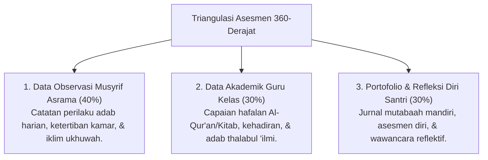

# P4-05-03: Rubrik Triangulasi Asesmen Musyrif-Guru-Santri

## Status Dokumen
* **Status**: 🌟 **A+ (Tervalidasi & Siap Diimplementasikan)**
* **Sub-Domain**: `04 Progression Framework / 05 Growth Milestones`
* **Penanggung Jawab Keilmuan**: Dewan Keilmuan TUMBUH (*Pakar Metodologi Riset & Pakar Bimbingan Konseling*)

---

## 1. Konseptualisasi Triangulasi Asesmen

Triangulasi Asesmen adalah metode evaluasi perkembangan santri yang menggabungkan 3 sudut pandang independen untuk menjamin keobjektifan, keadilan, dan bebas dari bias subjektif individu:

---

## 2. Bobot & Matriks Pembobotan Triangulasi

$$\text{Skor Progresi Santri} = (0.40 \times \text{Skor Musyrif}) + (0.30 \times \text{Skor Guru}) + (0.30 \times \text{Skor Refleksi Santri})$$

---

## 3. Rubrik Penilaian Kualitatif 4-Level (PBIS Continuum)

| Dimensi Penilaian | Level 1: Emerging (Mulai Berkembang) | Level 2: Developing (Berkembang) | Level 3: Proficient (Cakap / Mandiri) | Level 4: Exemplary (Teladan / Qudwah) |
| :--- | :--- | :--- | :--- | :--- |
| **Ibadah Berjamaah** | Menghadiri sholat dengan dorongan & instruksi langsung musyrif. | Menghadiri sholat tepat waktu mandiri tanpa perlu diingatkan. | Membiasakan sholat sunnah & dzikir atas kesadaran pribadi. | Menjadi muadzin/imam & mengajak kawan sholat berjamaah. |
| **Kebersihan & Kerapihan** | Membutuhkan pendampingan merapikan tempat tidur & lemari. | Menjaga kerapihan kamar mandiri sesuai standar PBIS. | Menjaga kebersihan area umum asrama secara inisiatif. | Mengomandoi piket kebersihan kamar & menjadi contoh rapi. |
| **Regulasi Emosi & SEL** | Mudah marah / mengurung diri saat menghadapi masalah. | Mampu menenangkan diri dengan arahan konselor/musyrif. | Mengontrol amarah mandiri & menyelesaikan konflik damai. | Memediasi konflik kawan secara restoratif & penuh empati. |

---

## 4. SOP Rekonsiliasi Diskrepansi Data

Apabila terdapat perbedaan signifikan antara penilaian Musyrif dan Self-Assessment Santri (misal: santri menilai dirinya 90% tetapi musyrif menilai 60%):
1. Musyrif dan santri mengadakan sesi **Dialog Klarifikasi Reflektif** (*One-on-One Alignment*).
2. Membuka catatan logbook objektif untuk mendiskusikan indikator mana yang memerlukan persepsi bersama.
3. Merumuskan target perbaikan konkret bersama (*Shared Action Plan*).
