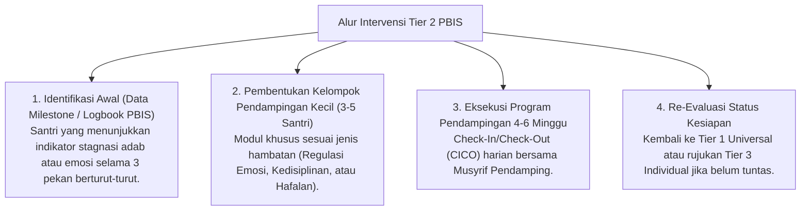

# P4-05-04: Protokol Intervensi Tier 2 PBIS bagi Santri Tertinggal

## Status Dokumen
* **Status**: 🌟 **A+ (Tervalidasi & Siap Diimplementasikan)**
* **Sub-Domain**: `04 Progression Framework / 05 Growth Milestones`
* **Penanggung Jawab Keilmuan**: Dewan Keilmuan TUMBUH (*Pakar Arsitektur PBIS Restoratif & Pakar Bimbingan Konseling*)

---

## 1. Konseptualisasi Intervensi Tier 2 PBIS

Intervensi Tier 2 PBIS adalah sistem pendukung kelompok kecil (*Targeted Small Group Intervention*) yang dirancang khusus untuk santri yang mengalami hambatan pencapaian milestone atau gateway kenaikan tangga (sekitar 10–15% populasi santri).

---

## 2. Program Utama Tier 2 PBIS

### 1. Program Check-In / Check-Out (CICO)
- **Check-In Pagi (06.00)**: Santri menemui Musyrif Pendamping untuk meninjau target adab harian dan menerima penguatan motivasi positif.
- **Check-Out Sore (17.00)**: Santri kembali menemui musyrif untuk mengevaluasi pencapaian kartu CICO harian dan menerima Umpan Balik Positif.

### 2. Klinik Regulasi Emosi & SEL Kelompok Kecil
- Sesi mingguan 45 menit bersama Konselor BK untuk melatih teknik penenangan diri (*Breathing exercises, Cognitive Reframing, & Emotional Expression*).

### 3. Peer Buddy System (Pendampingan Sebaya)
- Memasangkan santri Tier 2 dengan santri teladan T3/T4 sebagai teman belajar dan kawan beraktivitas harian di asrama.

---

## 3. Evaluasi & Aturan Anti-Stigmatisasi

- **Dilarang Pengasingan**: Santri kelompok Tier 2 tetap tinggal di kamar semula bersama teman-temannya. Pendampingan dilakukan secara privat dan bermartabat.
- **Evaluasi 4-Pekanan**: Apabila dalam 4 pekan santri mencapai batas kenaikan skor adab, santri dinyatakan **Graduasi dari Tier 2** dan kembali penuh ke sistem pembinaan Tier 1 Universal.
